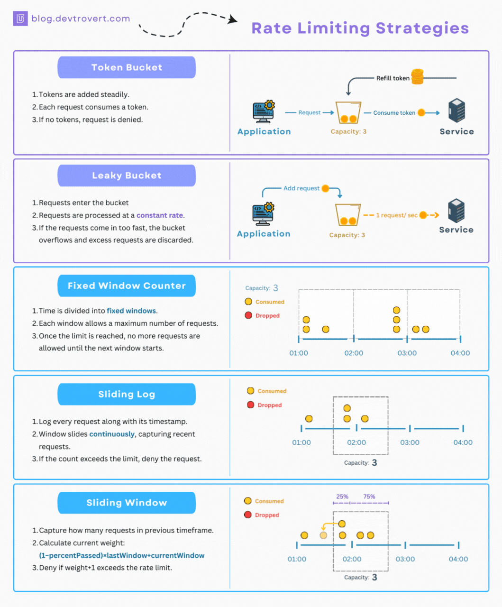

Rate limiting is the art of trying to protect the API by telling "overactive" API
consumers to calm down a bit, telling clients to reduce the frequency of their
requests, or take a break entirely and come back later to avoid overwhelming the
API. 

## Why bother with rate limiting

The main reason for rate limiting is to keep an API running smoothly and fairly.
If all clients could fire off requests as fast as they like, it's only a matter
of time before something breaks. A spike in traffic (whether accidental or
malicious) can overwhelm servers, leading to slowdowns, crashes, or unexpected
high infrastructure costs.

Rate limiting is also about fairness. If there are loads of users accessing an
API, it's important to make sure one consumers mistakes do not affect another. For
public APIs, it's about making sure no one user can hog all the resources. For
businesses, this could be different limits for free and various paid tiers to
make sure profit margins are maintained.

## How does API rate limiting work?

How can an API know when a client is making too many requests? That's where rate
limiting comes in. Rate limiting is a system that tracks the number of requests
made by a particular target (based on IP address, API key, user ID, or other
headers), within a defined time window.

The way this is implemented can vary, but the general process is the same:

- *Request Received* - A client makes a request to the API, asking for some data or
  to perform an action.
- *Identify the client* - The system identifies the client making the request,
  usually by looking at the IP address, API key, or other identifying
  information.
- *Check usage history* - The system checks how many requests the client has
  made in the current time window, and compares it to the limit.
- *Allow or deny the request* - If the client has made too many requests, the
  system denies the request with a `429 Too Many Requests` [status
  code](/api-design/status-codes). If the client is within the limit, the
  request is processed as normal.

## Different rate limiting strategies

There are a few different strategies for rate limiting, each with its own
advantages and disadvantages. 



- **Token bucket:** the system has a bucket of tokens, and each request consumes
  a token. Tokens are added to the bucket at regular intervals, 100 tokens a
  minute, or 1,000 tokens per hour. If there are no tokens left, the request is
  denied. Clients are rewarded for taking time out and accrue more tokens as they
  do. This can lead to a lot of sudden bursts of activity, but should generally
  keep an average amount of traffic going through the system.

- **Fixed window:** the system sets a fixed limit for a specific time window. For
  example, "Make 100 requests per minute." This is the most common approach, but
  it can lead to very "lumpy" API traffic, where many clients are making the
  maximum number of requests at the start of a minute. This means an API can be stressed at the
  start of each minute and bored for the rest of it.

- **Sliding log:** instead of using the same time windows for all clients, the
  system sets a maximum number of requests for any 60 second period. This avoids
  the lumpy traffic concerns of many clients all maxing out at the start of the
  window, then doing nothing for the rest of it, as they would all have their
  own windows starting and stopping at different times depending on their usage.

- **Sliding window:** is a dynamic approach, adjusting limits based on real-time
  traffic patterns to optimize system performance and ensure fair access for
  all. This can be more complex to implement, but it can lead to a more
  efficient use of resources and a better experience for API consumers.

## Different limit targets

There are a lot of choices to be made when it comes to rate limiting, and the
first is: who or what are we trying to limit? Here are a few common targets
for rate limiting:

- **User-specific rate limits:** Identifying a user by their API key or user ID and
  setting a rate limit for that user. This is useful for ensuring that no single
  user can overwhelm the API and slow it down for others.

- **Application-specific rate limits:** Identifying an application by its API
  key and setting a rate limit for that application. This is useful for ensuring
  that a misconfigured application cannot affect stability for other
  applications.

- **Regional rate limits:** Manage traffic from different geographic regions, to
  make sure an API can continue to service critical regions, whilst still
  allowing other regions to access the API.

### Implementing rate limiting in HTTP

Rate limiting can be implemented at various levels, from the network layer to the
application layer. For HTTP APIs, the most common approach is to implement rate
limiting at the application layer with HTTP "middlewares" that keep track of these things, 
or API gateways which handle rate limiting like Zuplo, Kong, Tyk, etc. 

Wherever the rate limiting is implemented, there are a few standards that can be leveraged to 
avoid reinventing the wheel. 

The first is to return a HTTP error with a [status
code](/api-design/status-code) of `429 Too Many Requests` (as defined in [RFC
6585](https://www.rfc-editor.org/rfc/rfc6585.html)). This tells the client that
they've exceeded the rate limit and should back off for a while.

```http
HTTP/2 429 Too Many Requests
```

Instead of leaving the client to guess when they should try again (likely leading to lots of poking and prodding adding more traffic to the API), the `Retry-After` header can be added to a response with a number of seconds, or a specific time and date of when the next request should be made.

```http
HTTP/2 429 Too Many Requests
Retry-After: 3600
```

Why not also add some [proper error response](/api-design/errors) to explain why
the request was rejected, for any API consumer developers not familiar with
these concepts.

```http
HTTP/2 429 Too Many Requests
Content-Type: application/json
Retry-After: 3600

{
  "error": { 
    "message": "Rate limit exceeded",
    "code": "rate_limit_exceeded",
    "details": "You have exceeded the rate limit for this API. Please try again in 1 hour."
  }
}
```

Doing all of this makes it clear to the client that they have entered a rate
limit, and give them the information they need to know when they can try again,
but there is more that can be done to make this more user friendly.

### Rate limit headers

Documenting the rate limit in the response headers can help API consumers to
understand what's going on. There are various conventions for headers to help
consumers understand more about what the rate limiting policy is, how much of
the limit has been used, and what is remaining.

GitHub for example uses the `X-RateLimit-Limit`, `X-RateLimit-Remaining`, and
`X-RateLimit-Reset`.

Twitter uses `X-Rate-Limit-Limit`, `X-Rate-Limit-Remaining`, and
`X-Rate-Limit-Reset`. 

Similar but different, which causes all sorts of confusion. Designing an API to
be the most user friendly means relying on standards instead of conventions, so
it's worth looking at the [RateLimit header draft
RFC](https://datatracker.ietf.org/doc/draft-ietf-httpapi-ratelimit-headers/)
which outlines one new `RateLimit` header to cover all those use cases and a few more.

The following example shows a `RateLimit` header with a policy named "default",
which has another 50 requests allowed in the next 30 seconds.

```
RateLimit: "default";r=50;t=30
```

The `RateLimit` header focuses on the current state of the various quotes, but
it doesn't provide information about the policy itself. The same draft RFC also
outlines a `RateLimit-Policy` header which can be used to provide information
about how the policy works. 

This example shows two policies, "default" and "daily". The "default" policy has
a quota of 100 requests and a window of 30 seconds, while the "daily" policy has
a quota of 1000 requests and a window of 86400 seconds (24 hours).

```http
RateLimit-Policy: "default";q=100;w=30,"daily";q=1000;w=86400
```

Combining these two headers can provide a lot of information to API consumers to
know what the rate limits are, how much they have used, and when they can make
more requests. 

This can be a bit of work to set up, but it allows API consumers to interact
with an API more effectively, with less frustration, and keep everything running
smoothly. 

### Alternatives to Rate Limiting  

Some people argue that rate limiting is a blunt tool. It can be frustrating for
users who hit the limit when they're trying to get work done.

Poorly configured rate limiting can be fairly arbitrary. 

Consider an API that could theoretically handle 1000 requests per second. 

If there are 1000 users, each with a rate limit of 1 request per second, the API
would be maxed out. 

If that same API with 1000 users and only two of them are using up the their
maximum quotas, then the API could absolutely handle the load, and the API is
sitting their underutilized sitting around waiting for potential activity which
wont come. 

Not only is that a waste of server resources (hardware, electricity, CO2
emissions), but it's also frustrating for those users who are constantly being
told to calm down when they could be using the API to handle more activity;
activity which could be profitable.

One alternative approach is known as **backpressure**. This is a more dynamic
system which tells clients to ease up when the system is under strain, with a
`503 Service Unavailable` response with a `Retry-After` header. This could be
applied to the entire API, to specific users, or even specific endpoints that
are more resource intensive.

Quota-based systems are another alternative. Instead of measuring requests per
second or minute, users are assigned a monthly allowance. This works well for
subscription-based APIs, where users pay for a certain amount of access. If they
make a mistake and use up their quota too quickly, they can buy more, and other
API consumers can still access the API. This lends itself better to auto-scaling
up (and back down) based on number of active users and usage.

### Final Thoughts  

Rate limiting begins as a technical safeguard for an API (which makes managing
it easier) but ensures nobody is hogging resources (which keeps users happily
using the product). 

It's worth thinking about where and how to implement it, how to communicate it,
and how to make it as user-friendly as possible. It's not always simple for
junior developers to figure out how to work with rate limiting and they might
not know all the HTTP status codes and headers. The more tooling you can provide
to assist your users with responding to your rate limiting, the better. 

