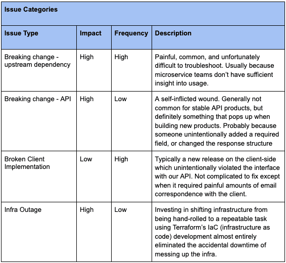
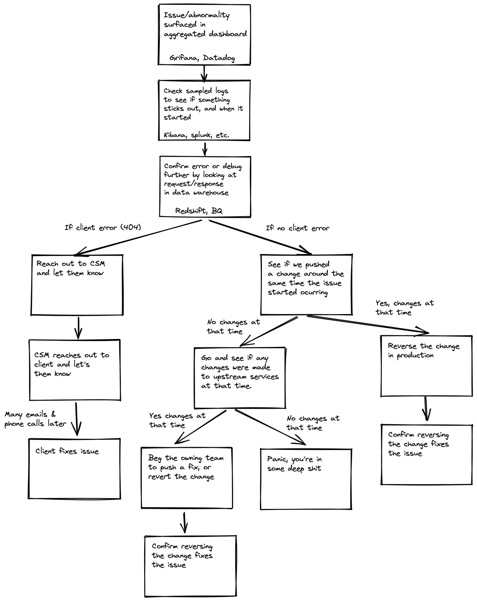

When building & managing APIs, understanding usage and monitoring for changes is critical to success.  The following post summarizes my experience working on LiveRamp’s web APIs (2016-2018). I will go through the tooling & processes we used to diagnose and triage issues with our APIs (~6 billion requests/day), as well as the gaps in tooling I wished were filled. I hope that other people working on API operations find this useful, and share what has worked well for them.

Before diving in, I’m fully aware that in software, citing experiences from 4 years ago is often an exercise in exploring the ancient past; pace of change and improvements typically render anything older than 2 years null and void.  Given the way APIs and microservices have moved from the periphery to foundational components of the modern tech stack over the last 10 years, the expectation would be that the way APIs are built and managed would’ve correspondingly undergone significant change.  And yet, the primary tooling for monitoring, detecting and troubleshooting APIs doesn’t seem to have evolved much during my hiatus from the space.  People are by and large still using the same set of tools as they were back in 2016.

## Overview of Tooling

Our team was a laboratory for experimentation within the business, and consequently we had our hands on some of the best tools available. Consequently we got exposure to some of the most commonly used tools.  When I began working with the team, our logging/monitoring setup was:

- **Cloud Provider**: AWS
- **Logging infrastructure**: Kinesis Firehose
- **Data Warehouse**: Redshift/Athena/S3
- **Analysis & Insights**: Kibana & Datadog

By the time I stopped working with the web APIs team, the setup was:

- **Cloud Provider**: GCP
- **Logging infrastructure**: Gazette ([**the precursor to Estuary’s Flow**](https://docs.estuary.dev/))
- **Data Warehouse**: BigQuery
- **Analysis & insights**: Grafana & Datadog

Regardless of the stack used, the tools did what they were intended to do. More interesting to me is what the tooling couldn’t do and the operational processes we developed to cope with that lack of tooling.

## Plugging the gaps with Process

Logging infrastructure was great for alerting us that something was amiss, but diagnosing and triaging the issue was an APIOps activity that was largely manual.  To help ourselves we developed processes to categorize issues, and then respond accordingly:

Here’s an overview of how we would diagnose issues…

Rather than beat a dead horse by reiterating the exact text in the flow chart, I want to dive into dealing with breaking change issues. I will give some specific advice for proactively mitigating these types of issues, what the challenges are and what the gap in tooling is.

### Breaking change to an upstream dependency

- **Note:** In the microservices world we’re all living in, it’s very likely that an external service relies on a dozen or more internal microservices to function.  The typical software business might have hundreds or thousands of microservices.  For most, it’s not realistic to invest in the same level of tooling as they do for external API endpoints (logging, dashboarding). It’s therefore entirely possible, dare I say likely, that a microservice team is unaware that external APIs are dependent on their service.
- **How to diagnose**: All that in mind, these can be tricky to diagnose. The first sign will be an anomaly in your traffic patterns. Figure out when the anomaly first appeared, get as specific a time if you can (hopefully you’ll be able to find a step change). First check to make sure that the anomaly doesn’t line up with a push by your own team.  Next you need to figure out if an upstream dependency is the cause.
- **How to triage**: You could take time to dive into the code to test dependencies, but for the sake of speed, I recommend making a list of the teams responsible for the microservices your team depends on. Reach out to each team to check if any of them made a change around the time the anomaly appeared. If there’s a match, ask them to rollback their change so you can see whether the rollback fixes the problem.  After client impact has been mitigated, take the time to dive in and figure out where/how the dependency broke.
- **Advice**: For improved speed, I recommend maintaining a list of the dependencies, and the owning teaming for each. This will allow you to move faster when it matters most.  As I mentioned above, a lot of team’s lack the tooling that would be required to mitigate issues like this.  

### Breaking change to the API itself

- **Note:** Breaking changes in themselves are not necessarily a problem if you are properly versioning your API ([**Brandur Leach wrote a great piece on versioning**](https://stripe.com/blog/api-versioning)).  In this case, I’m referring to accidental breaking changes, which are definitely a problem.
- **How to diagnose**:  Fastest way to spot them is if you notice a spike in error codes and it corresponds with a release your team made to production.  Unfortunately, not all breaking changes trigger spikes in errors.  The problem may only manifest when two API calls are used in sequence, see if there’s any kind of unexpected change in the overall traffic patterns (e.g. drop in total calls to an endpoint).
- **How to triage**: If an anomaly in the data corresponds with a push to production, then rollback the change ASAP.  Even if you haven’t diagnosed the exact error, the priority is client stability.  Later once you have made a diagnosis, address the issue, and test very carefully before pushing to prod again. You will owe your customers an explanation, write out what caused the error, and the steps the team is taking to make sure the issue never reoccurs.
- **Advice**: Again this is a hard one.  If you’re not doing versioning, then do versioning before your client’s leave you.  Integration testing is also definitely your friend. Similar to upstream breaking changes, feels like there’s a tooling gap here that could be better addressed (discussed below).

## The Gaps as I see it

As I said earlier, it strikes me that the development of these processes was in order to cope with a lack of tooling.  There are a few things that it would be great to have, which aren’t available today.  My hope is that in time Speakeasy is able to help devs make steps in addressing some of these gaps.

1. **API-centric monitoring:** The entire process for troubleshooting I layed out is dependent on making a not insignificant investment in logging and dashboarding infrastructure.  Without these, understanding usage is difficult and the surfacing of issues is likely to come in the form of an angry email from your client. It’s always struck me that we were extremely fortunate to have been able to make that investment in a robust logging infrastructure, complete with relevant dashboards and automated alerting.  At Speakeasy we believe there should be something more API-native and developer-first. Devs should be able to drop-in a couple lines of code and get something that works out of the box. This would provide smaller teams the same level of insight into usage as large companies. Who’s using which API version, is the integration healthy, are there anomalies?
2. **API Developer Guardrails:** Most unintentional breaking changes follow similar patterns: adding a required field, changing the response structure, changing a method or resource name, etc. Introducing some guardrails that could sense check changes for common mistakes would go a long way towards helping devs avoid costly client errors.  It’s something that a lot of big companies have, that is often too expensive for a smaller org to develop internally.
3. **API Dependency Mapping:** I mentioned how it can be useful to maintain a list of the dependencies an API depends on.  That’s really a stop gap measure. It would be better if this could be automatically tracked, and what would be even better is if there was tooling which made it easy for microservices to understand the usage of their services, so they could track use by external services.

I’m really curious about how much overlap there is between my experience and those of other people. Would love to hear what off-the-shelf tools other people have used to manage their API operations, and what processes people have developed internally to cope with the lack of tooling.
