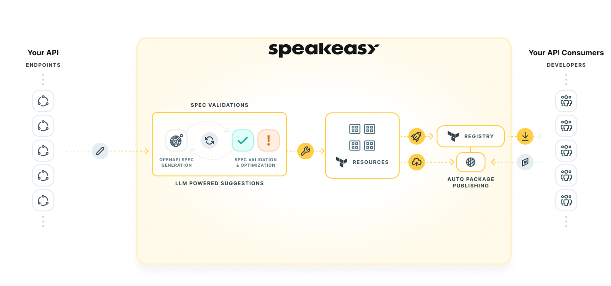

# Building a SaaS API? Don't Forget Your Terraform Provider

Replacing custom integrations with Terraform cuts down on errors, simplifies infrastructure management, makes infrastructure changes easier to version, and saves developers hours of repeatedly clicking around hundreds of different dashboards.

Most users are familiar with Terraform DevOps functions: Launching web servers, managing databases, and updating DNS records on AWS, GCP, and Azure.

But Terraform's adoption is growing far beyond infrastructure and it's time we free this sleeping giant from its reputation as a cost center. Instead, we see Terraform as a strategic ally and driver of revenue for most SaaS platforms through the offering of a provider.

Terraform with its provider plugin ecosystem can serve as a robust interface between your SaaS API and your users, allowing for a more integrated, efficient, and scalable developer experience. It's not just about deploying servers and managing databases anymore; it's about creating a unified and streamlined workflow for your users, reducing complexities, and unlocking new use cases.

Terraform already helps your users solve their infrastructure problems:

| Infrastructure Problem | Terraform Solution |
|---|---|
| Inconsistent environments | Promotes consistency across dev, staging, and production environments. |
| Managing multicloud infrastructure | Provides a unified framework for managing GCP, AWS, Azure, and more. |
| Scalability challenges | Automates provisioning and management of resources, aiding scalability. |
| Wasted cloud resources | Includes modules to estimate infrastructure cost and scale down unused resources. |
| Resource orchestration | Automatically handles dependencies between infrastructure resources. |
| Auditing and versioning of infrastructure | Enables version control and auditing of infrastructure. |

Speakeasy makes it straightforward to create API surface areas that provide exceptional developer experience to your users. That includes SDKs in 7+ popular languages, but it also means [Terraform providers](/docs/create-terraform). We help you meet your users where they already are - the Terraform registry.

But first, let's start with some background.

## What is Terraform?

Terraform is an open-source infrastructure-as-code (IaC) tool developed by HashiCorp. IaC is essential in modern DevOps practices as it allows for consistent and repeatable deployments, minimizing the risks and tedium of manual configurations.

By describing their desired infrastructure in a declarative language called HCL (HashiCorp Configuration Language), teams can version, share, and apply infrastructure definitions using Terraform.

The most basic building blocks of Terraform configurations are Terraform providers.

## What Is a Terraform Provider?

A Terraform provider is a plugin that allows Terraform to manage a given category of resources. Providers usually correspond to specific platforms or services, such as AWS, Azure, GCP, or GitHub. Each provider defines and manages a set of resource types—for example, an AWS provider might handle resources like an AWS EC2 instance or an S3 bucket.

When you're writing your Terraform configuration files, you define what resources you want and which provider should manage those resources. The provider is then responsible for understanding API interactions with the given service and exposing resources for use in your Terraform scripts.

In practical terms, this means that providers translate the HCL code that users write into API calls to create, read, update, delete, and otherwise manage resources on these platforms. By using providers, Terraform users can manage a wide variety of service types.

The most widely used Terraform plugin registry is the [HashiCorp Terraform registry](https://registry.terraform.io/). Launched in 2017, the registry [has now surpassed 3,000 published providers](https://www.hashicorp.com/blog/hashicorp-terraform-ecosystem-passes-3-000-providers-with-over-250-partners).

## Terraform Beyond Infrastructure

While Terraform's primary function remains infrastructure management, its use cases extend beyond the traditional scope. In addition to managing servers, databases, and networks, Terraform can be used to manage higher-level services and applications, including SaaS products.

Let's look at a few examples of Terraform providers for SaaS platforms:

### LaunchDarkly Terraform Provider

[LaunchDarkly](https://launchdarkly.com/) is a continuous delivery platform that enables developers to manage feature flags and control which users have access to new features. For each new feature your team builds, you add a feature flag and gradually release the feature to your users based on certain criteria. Now imagine a situation where you want to test a feature flag in development, staging, QA, and then finally release it in production. Your team would need to log in to the LaunchDarkly dashboard each time to manage these flags across the different environments, which can be a time-consuming process.

The [LaunchDarkly Terraform provider](https://registry.terraform.io/providers/launchdarkly/launchdarkly/latest/docs) allows developers to automate the process of creating, updating, and deleting feature flags across different environments, reducing manual effort, minimizing human error, and increasing efficiency in their workflows. It's a clear win for developer productivity and reliability of the deployment process.

### Checkly Terraform Provider

[Checkly](https://www.checklyhq.com/) enables developers to monitor their websites and APIs, offering active monitoring, E2E testing, and performance metrics. It provides essential insights into uptime, response time, and the correctness of your web services.

Imagine a situation where your organization has multiple services, each with different endpoints. Managing these services and ensuring they all maintain a high level of performance can be a daunting task. You may also require your developers to use Checkly headless browser testing or screenshot features in development, staging, and other environments. You'd need to log in to the Checkly dashboard each time to set up or adjust monitoring configurations, a process that could become tedious and time-consuming, especially in large-scale environments.

The [Checkly Terraform provider](https://registry.terraform.io/providers/checkly/checkly/latest/docs) simplifies this process by allowing developers to automate the configuration and management of checks and alerts. Instead of manually configuring each check via the Checkly dashboard, developers can define them directly in their Terraform configurations. This means checks can be versioned, shared, and managed just like any other piece of infrastructure.

### Other SaaS Terraform Providers

-  [PagerDuty](https://registry.terraform.io/providers/PagerDuty/pagerduty/latest/docs): Developers benefit from the PagerDuty Terraform provider by being able to automate the set up and management of incident response procedures, providing a consistent, repeatable, and efficient way to manage complex operational environments.
-  [Salesforce](https://registry.terraform.io/providers/hashicorp/salesforce/latest/docs): The Salesforce Terraform provider allows administrators to programmatically manage Salesforce users. This provider is released by Hashicorp and may have been released to scratch their own itch while administering Salesforce, but it is a clear indication that Terraform has at least some usage outside of development teams.
-  [Fivetran](https://registry.terraform.io/providers/fivetran/fivetran/latest/docs): With the Fivetran Terraform provider, users can automate the set up and management of data connectors, allowing for easy and efficient integration of various data sources with their data warehouse in a version-controlled manner.
-  [GitHub](https://registry.terraform.io/providers/integrations/github/latest/docs): GitHub users benefit from its Terraform provider by being able to automate repository management, actions, teams, and more, streamlining workflows and improving efficiency across their development teams.

Admittedly, the lines between SaaS and infrastructure are blurred for some of these, but the examples above are only a fraction of what's available on the registry.

## Why Users Choose Terraform Over API Integration

All the SaaS platforms in our examples above have full-featured and well-documented APIs with accompanying SDKs. Chances are, if you're not using Terraform in your organization yet, you may come across some utility code in your repositories performing regular calls to one of these ubiquitous platforms' APIs.

We touched on a couple of examples where Terraform enables teams to configure services for use with different environments in the development lifecycle. This unlocks new use cases, and may even increase many users' spending after automation negates the labor cost of configuring ephemeral environments.

Furthermore, it seems the availability of good Terraform providers is already starting to factor into SaaS purchasing decisions.

Organizations that are audited as part of certification often have strict disaster recovery requirements. Terraform providers with full API coverage could enable these organizations to recover their SaaS configurations without any manual work.

This benefit also applies when organizations are required to keep track of configuration updates. If a SaaS platform does not have strict auditing built in, a client could use Terraform with version control, thereby creating an audit trail.

## Which SaaS Products Are Good Candidates for Terraform?

With the benefits we mentioned in mind, we can try to identify traits that would make a SaaS platform a suitable candidate for Terraform integration.

-  **Configurable resources:** SaaS platforms that offer configurable resources like users, roles, policies, projects, or servers are good candidates. If a resource's configuration can be described in code, it can be managed by Terraform.
-  **Multiple environments:** Platforms that need to maintain consistent configurations across multiple environments (like dev, test, staging, and production) are well-suited for Terraform, as it simplifies the creation and management of these environments.
-  **Frequent changes:** If your SaaS product requires frequent changes to its configuration, it may benefit from a Terraform provider. With its plan/apply cycle, Terraform allows users to preview changes before applying them, reducing the risk of unintentional modifications.
-  **Scaling needs:** SaaS platforms that need to manage resources at scale can also benefit from Terraform. It allows for managing many resources consistently and efficiently, reducing the risk of manual errors and inconsistencies.
-  **Automatable tasks:** If your platform's tasks can be automated via API calls, then a Terraform provider would be a good fit. Terraform excels in automating infrastructure management tasks and reduces the need for manual intervention.
-  **Security and compliance needs:** For SaaS platforms that need to enforce certain security configurations or compliance standards, Terraform can ensure these requirements are consistently met across all resources.
-  **Integrations with other cloud services:** If your SaaS platform frequently integrates with other cloud services, having a Terraform provider can make these integrations easier and more efficient by leveraging Terraform's extensive provider ecosystem.

Even if a SaaS platform doesn't check all these boxes, there might still be significant value in offering a Terraform provider, especially as Terraform's adoption is growing rapidly.

## What About Internal Tools and Interfaces?

Terraform providers are especially useful for building internal tools, where they provide your internal developers an AWS-like experience while managing internal resources.

By offering a Terraform provider to internal users, organizations can provide a consistent, standardized interface for managing internal resources. This standardization reduces the learning curve and complexity for developers, as they can use the same Terraform commands and concepts they're already familiar with from managing public cloud resources.

The benefits we mentioned earlier also apply to internal tools: Better collaboration, version control, reduced errors, and less time configuring services using manual interfaces.

## Why SaaS Companies Don't Publish Terraform Providers

Clearly, publishing a Terraform provider could benefit most SaaS providers, so why don't we see more companies maintaining Terraform providers for their APIs?

We won't mince words here: Publishing a Terraform provider is difficult.

Telling SaaS development teams to _“just publish a Terraform provider”_ would be misguided at best.


Developing and maintaining a Terraform provider requires a significant investment in terms of time, resources, and expertise. You need an in-depth understanding of the SaaS platform's API, the Terraform ecosystem, and the Go programming language.

Add to this the fact that many APIs change significantly over time. If an API changes frequently, it can require a significant effort to keep its Terraform provider up to date.

Even if creating and maintaining a provider is within a SaaS company's abilities, there might be hesitance to take on an additional support commitment. We understand that it could feel like you're adding another layer to an already complex problem and users will expect some manual help. We argue that the simplicity of HCL lends itself to much easier support engineering, as declarative configuration is simpler to lint automatically, read, debug, and rewrite.

Terraform is well suited for self-help users, as the documentation for Terraform providers is standardized and hosted by the registry. Nevertheless, some platforms such as LaunchDarkly choose to support Terraform integration only for users on pro or enterprise pricing tiers—presumably to offset anticipated support cost.

## Speakeasy Generates and Maintains Terraform Providers

With Speakeasy, you can generate a Terraform provider based on your OpenAPI spec. This means you don't need to be a Terraform expert or write any custom Go code. Speakeasy also makes sure your provider stays updated with your API by pushing a new branch to your provider's repository when your API spec changes.

To generate a Terraform provider, you map OpenAPI objects and operations to Terraform entities and actions by annotating your OpenAPI specification.



To get started, you can follow our [documentation on annotating your spec for the Terraform provider](/docs/create-terraform/extensions) generator.

After generating a provider, updating the provider becomes as straightforward as merging a PR from the update branch Speakeasy creates.

## Case Study: Airbyte Terraform Provider

On 22 June, [Airbyte launched their Terraform provider](https://airbyte.com/blog/terraform-provider-launched-for-airbyte-cloud) for Airbyte cloud users. The Airbyte [Terraform provider](https://registry.terraform.io/providers/airbytehq/airbyte/latest/docs) was generated by Speakeasy, based entirely on Airbyte's OpenAPI specification.

This release came after months of collaboration between Airbyte and Speakeasy, and we are delighted to have played a role in Airbyte's continued success.

> We looked for the best options in API tooling, so we didn’t have to build everything ourselves. We focus on what we do best: ensuring data is accessible everywhere it has value. For our API needs; we have Speakeasy.
>
> -- <cite>Riley Brook, Product @ Airbyte</cite>

Under the hood, the Airbyte Terraform provider uses a Go SDK generated by Speakeasy. Since the [generated provider is open source](https://github.com/airbytehq/terraform-provider-airbyte), we can take a look at what's in the repository.

We ran [Sloc Cloc and Code (scc)](https://github.com/boyter/scc/blob/master/README.md) on the repository and this is what we found:

```bash
$ scc terraform-provider-airbyte
```

| Language  | Files | Lines  | Blank | Comment | Code   | Complexity | Bytes    |
|-----------|------:|-------:|------:|--------:|-------:|-----------:|---------:|
| Go        | 3024  | 267623 | 35706 | 10727   | 221190 | 37484      | 9886221  |
| Markdown  | 240   | 17985  | 6760  | 0       | 11225  | 0          | 802305   |
| YAML      | 5     | 65577  | 8     | 24      | 65545  | 0          | 2170810  |
| JSON      | 1     | 6      | 0     | 0       | 6      | 0          | 83       |
| Makefile  | 1     | 9      | 3     | 0       | 6      | 0          | 138      |
| Terraform | 1     | 85     | 10    | 0       | 75     | 2          | 2106     |
| gitignore | 1     | 4      | 0     | 0       | 4      | 0          | 44       |
| Total     | 3273  | 351289 | 42487 | 10751   | 298051 | 37486      | 12861707 |

* Estimated Cost to Develop (organic) $10,705,339
* Estimated Schedule Effort (organic) 33.86 months
* Estimated People Required (organic) 28.09

Airbyte connects with more than 250 data sources and destinations, all with unique configuration parameters, which adds to this enormous Terraform provider.

Even if the scc estimation is off by a few orders of magnitude, it is clear that the Speakeasy Terraform provider generator saved Airbyte valuable development time and will continue to save time on maintenance in the future.

You can read more about [how Airbyte launched their SDKs and Terraform provider](/post/case-study-airbyte) on our blog.

## Summary

We believe that Terraform is poised to simplify SaaS configuration at scale and expect to see the continued growth of the Terraform registry.

However, navigating the Terraform ecosystem without deep expertise is daunting, and successfully publishing and maintaining a Terraform provider is no small undertaking.

Speakeasy is ready to help SaaS platforms expand their reach in this exciting ecosystem.

To get started with your Terraform provider, [follow our documentation](/docs/create-terraform).

[Join our Slack community](https://join.slack.com/t/speakeasy-dev/shared_invite/zt-1cwb3flxz-lS5SyZxAsF_3NOq5xc8Cjw) for expert advice on Terraform providers or get in touch to let us know how we can best help your organization.
