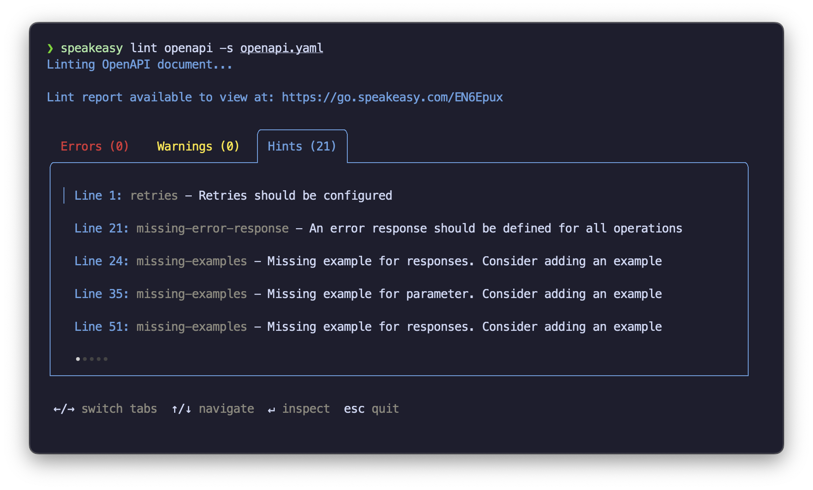

import { Callout } from "~/components";

<Callout title="API Design Guide" variant="success">
  <p>If you're looking for a more comprehensive guide to API design, you can read our <a href="/api-design">REST API Design Guide</a>.</p>
</Callout>

API style guides often make developers' work more difficult, which leads to interface drift, which in turn affects real users. This is easy to resolve within a [two-pizza team](https://martinfowler.com/bliki/TwoPizzaTeam.html) using code review, pair programming, and the collective identity that results from time spent in the trenches together. Small teams have enough rapport and opportunities for interaction to resolve API design issues, update their style guides, and reach consensus without much friction.

Sure, it isn't always as rose-colored as that, but compared to reaching consensus *between* teams, it's a walk in the park. Friction between teams becomes a giant burden to organizations that have multiple teams working on a single API, and even more so when teams are working on multiple adjacent APIs.

The common response is to create an "API governance team" or "architecture review board" - a group of senior engineers tasked with maintaining consistency across teams.

It is painful just typing those phrases out. The idea is well-intentioned, but the execution is often disastrous:

* Teams wait weeks for reviews, slowing down development.
* Reviewers become bottlenecks, causing resentment.
* Standards become rigid and divorced from real-world needs.
* Teams find creative ways to bypass the process entirely.

This compounds until there is enough drift that consistency becomes an unattainable dream.

What's needed instead is a way to enforce consistency that works *with* teams rather than against them. This means moving from manual processes to automated checks; from subjective reviews to objective criteria. It means building tools that help developers stay consistent, and providing a clear path to resolution when they don't.

## What do we mean by consistency?

At its core, consistency means following the [principle of least astonishment](https://en.wikipedia.org/wiki/Principle_of_least_astonishment): APIs should behave in ways that minimize surprises for everyone who interacts with them.

Here's what this looks like in practice:

### Within your interfaces

The most fundamental form of consistency is within individual APIs. When developers interact with different parts of a single API, they should be able to apply what they've learned from one endpoint to other endpoints.

Here are some examples of internal consistency:

1. **Use the same naming patterns across all endpoints:** For example, if you use `snake_case` for field names in one place, you shouldn't switch to `camelCase` in another.
2. **Ensure request and response objects are uniform:** A reasonable assumption is that if an e-commerce API has a `city` field in the `orders` endpoint, it should have the same field in the `returns` endpoint. Replacing `city` with `town` in the `returns` endpoint would be inconsistent and confusing.
3. **Follow the same error-handling patterns throughout:** All endpoints should return errors in a consistent format, with appropriate status codes and messages. If a `GET` request to a resource that doesn't exist returns a `404 Not Found` status code, a `POST` request to the same resource should return the same status code.
4. **Keep authentication flows predictable:** If a user needs to provide a token in the `Authorization` header for one endpoint, they should reasonably expect to use the same header for all other endpoints that require authentication, rather than a query parameter or a cookie.

This internal consistency allows developers to build accurate mental models of how your API works.

### Across your organization

The next level of consistency extends across your organization. This means that every team building APIs should follow the same conventions. This includes:

1. **Shared authentication mechanisms across services:** If one team uses OAuth2 for authentication, all teams should use OAuth2. This ensures that developers don't need to learn new authentication mechanisms when switching between services.
2. **Common error handling across services:** When a service is down, every API should return a `503` status code with the same error structure, not a mix of different formats and codes for different services.
3. **Unified naming conventions:** If your user service uses `/v1/users/{id}` as a pattern, your order service shouldn't use `/api/2.0/orders/{orderId}`. This kind of inconsistency means developers have to remember different patterns for different services.
4. **Standard versioning approaches:** Allowing some teams to use URL versioning (`/v1/resource`) while others use accept headers (`Accept: application/vnd.company.resource.v1+json`) creates unnecessary complexity.
5. **Consistent rate-limiting implementations:** Rate limits should use the same headers and behavior across services. If one service uses `X-RateLimit-Remaining` while another uses `RateLimit-Remaining`, developers need to handle both cases.

This is where the most friction occurs. Teams have different priorities, different constraints, and different preferences. It's easy for standards to drift when there's no shared understanding of why they exist. We'll explore how to address this in more detail later.

### With your domain

Your API should make sense to developers who work in your industry:

1. **Use familiar field names:** A payment API using `amount` and `currency` will feel more natural than `monetary_value` and `money_type`.
2. **Follow standard workflows:** An e-commerce API should follow common patterns for checkout flows that developers will recognize from other platforms.
3. **Support expected features:** If every other API in your space supports bulk operations, your API probably should too.

This requires in-depth domain knowledge and an understanding of what developers expect from APIs in your industry. It's the hardest form of consistency to enforce, but it's also one of the most valuable.

### With HTTP standards

Most developers have expectations about how HTTP works. For example:

1. **GET requests should be safe and idempotent:** They shouldn't change data. A `GET` request to `/users/123` should never delete the user or have any other side effects.
2. **POST is for creation:** Only `POST` should be used to create new resources, not `PUT` or `GET`.
3. **Status codes should follow conventions:** Use `201` for successful creation, not `200` with a `"created"` string in the body.
4. **Cache headers should work:** If you say something can be cached for an hour, it should be safe to cache for an hour.

The goal isn't to perfect adherence to HTTP specifications but to meet developers' reasonable expectations about how HTTP works. We discuss this balance in more detail in our article, [Designing your API: Find the RESTful sweet spot](https://www.speakeasy.com/post/api-design).

## Focusing on what matters most

It is easy to get stuck in a tar pit while trying to deliberate and enforce every possible form of consistency. Bikeshedding and navel-gazing over insignificant details can lead to a loss of focus on what really matters. Here's how to prioritize:

### Non-negotiables

Some forms of consistency are so important that they should be enforced in all but the most exceptional cases. These are the things that will cause the most confusion and frustration if they're inconsistent:

1. **Authentication:** Security patterns need to be predictable and well-understood. Never roll your own authentication scheme, and always use the same mechanism across services.
2. **Error handling:** Consistent error responses are useful for developers to understand what went wrong. If every service returns a different error format, developers will waste time debugging.
3. **HTTP methods:** Stick to the standard HTTP methods and their meanings. This is one of the most fundamental forms of consistency in REST APIs and has been well-established for decades.
4. **HTTP status codes:** Status codes have well-defined meanings. If a resource isn't found, return a `404`. If a user is unauthorized, return a `401`. Don't reinvent the wheel here, and never return a `200` status code for an error.
5. **URL structure:** Predictable URLs make it easier for developers to navigate your API and discover endpoints.

### When to be flexible

Apart from these non-negotiables, most other forms of consistency can be more flexible for the right reasons. Here are some examples:

1. **Performance:** Bulk operations may return stripped-down resources to improve performance, while individual operations return full resources. This is a reasonable trade-off that can be explained in your documentation.
2. **Naming conventions:** If a team has a good reason for using a different naming convention, it's not worth enforcing consistency for its own sake. The goal is to make your API easier to use, not to make it uniform at all costs. For example, if the `users` resource is called a `debtor` in a financial API, that's fine as long as it's well-documented.
3. **Rate limiting:** Different services may have different rate limits based on their usage patterns. It's okay for these to vary as long as they're documented clearly.

In all three examples, documentation saves the day. If developers understand *why* things are inconsistent, they can work around it. If they don't understand your reasons, they may lose confidence in your API, or worse, think they made a mistake elsewhere and go bug-hunting. Explaining the reasons behind inconsistencies is often more important than enforcing consistency for its own sake.

## Consistency isn't the same for everyone

Our definition of consistency is based on the principle of least astonishment, but what's surprising in one context may be expected in another. Start by understanding your developers' expectations and work from there.

Different groups of developers bring different expectations. For example, developers in the financial industry may expect idempotency keys on all write operations, while developers in the gaming industry may not.

This is a balancing act. Some industries have become accustomed to certain patterns that may not be best practice. For example, the financial industry's reliance on SOAP APIs with complex XML payloads is a well-established pattern, but it's not the most developer-friendly approach. In this case, consistency with the industry may not be the best choice. This may be one of the reasons for Stripe's success - they take a developer-first approach to payments, rather than following the industry standard.

Once you understand the expectations of your developers, you can start prioritizing consistency based on what really matters in your context.

## How to enforce consistency

With a clear understanding of what consistency means for your API, you can start enforcing it.

### Use OpenAPI

An OpenAPI document should be the source of truth for your API. If your API framework doesn't generate OpenAPI documents, consider switching to one that does or adding a tool to generate them. Ideally, your OpenAPI document should either be generated automatically from your codebase or act as a contract that your codebase adheres to.

Specifying your API in OpenAPI allows your teams to discuss and agree on standards without implementing them. It also allows you to generate documentation, client libraries, and server stubs automatically.

In the context of consistency, OpenAPI enables you to automate checks for internal consistency.

### Automated enforcement

Start by automating everything that can be objectively verified:

#### Automate OpenAPI validation

Your API definitions should be valid according to the OpenAPI Specification. This is table stakes and should be enforced through CI/CD pipelines.

#### Automate linting

Use tools like [Spectral](https://github.com/stoplightio/spectral) to enforce style conventions. Create a ruleset that codifies your organization's standards. This can include naming conventions, error-handling patterns, and more.

Spectral has built-in rules for common patterns, but you can also write custom rules to enforce your organization's specific standards. For example, you could enforce `kebab-case` for all paths:

```yaml
rules:
  paths-kebab-case:
    description: Paths should be kebab-case.
    message: "{{property}} should be kebab-case (lower-case and separated with hyphens)"
    severity: warn
    given: $.paths[*]~
    then:
      function: pattern
      functionOptions:
        match: "^(\/|[a-z0-9-.]+|{[a-zA-Z0-9_]+})+$"
```

The [Speakeasy CLI](https://www.speakeasy.com/docs/speakeasy-reference/cli/getting-started) tool also provides [linting capabilities](https://www.speakeasy.com/docs/prep-openapi/linting). With the Speakeasy CLI installed, run the following command to lint your OpenAPI document:

```bash
speakeasy lint openapi -s openapi.yaml
```

This will output any issues found in your OpenAPI document:



If you're using Speakeasy to generate SDKs, you can configure it to lint your OpenAPI document as part of the generation process. This ensures that your OpenAPI document is always up-to-date and consistent with your generated code.

Speakeasy supports custom rules in the Spectral format, so you can enforce your organization's standards in the same way as with Spectral.

Individual team members can run these checks locally, before pushing their changes. This reduces the burden on reviewers and ensures that issues are caught early, when they're easiest to fix. In fact, [Spectral](https://marketplace.visualstudio.com/items?itemName=stoplight.spectral) and [Speakeasy](https://marketplace.visualstudio.com/items?itemName=Speakeasy.speakeasy-vscode-extension) both provide VS Code extensions with linting features, so you can stay consistent without leaving your IDE. Shift left!

Linters can also be run as part of your CI/CD pipeline so that no changes are merged without passing these checks and inconsistencies are caught before they reach staging or production.

#### Contract testing

Verify that your API implementations match their specifications. Tools like [Pact](/post/pact-vs-openapi) can help you write tests that verify that your API behaves as expected. OpenAPI itself is not a contract testing tool in itself, but it can be used as a source of truth for contract tests.

Speakeasy supports [contract testing](https://www.speakeasy.com/docs/testing) for OpenAPI documents. You can generate contract tests from your OpenAPI document and run them as part of your CI/CD pipeline.

Speakeasy generates test workflows using [Arazzo](https://www.speakeasy.com/openapi/arazzo) (formerly known as OpenAPI Workflows), a simple, human-readable specification for API workflows. This allows you to extend the generated tests with custom logic, making it easy to test complex workflows across multiple services.

Automated contract tests ensure that your API implementations match their specifications, reducing the risk of inconsistencies.

#### Code generation

Generate server stubs and SDKs from your OpenAPI definitions. This ensures that your implementation matches your specification and provides consistent interfaces across languages.

[Speakeasy generates SDKs](https://www.speakeasy.com/docs/create-client-sdks) in multiple languages from your OpenAPI document.

#### Integration tests

Write automated tests that verify cross-service behavior, especially around authentication, error handling, and common workflows. Better yet, [generate these tests](https://www.speakeasy.com/docs/customize-testing/automated-test-generation) from your OpenAPI definitions.

### Human review where it matters

Some aspects of API design can't be automated and need human judgment:

1. **Domain alignment:** Are your API abstractions aligned with your business domain? This requires deep understanding of both your technical architecture and business context.
2. **Developer experience:** Is your API intuitive and easy to use? This often requires user research and feedback from actual developers.
3. **Breaking changes:** Will a proposed change break existing clients? Humans need to evaluate the impact of each proposed change and plan appropriate migration paths.
4. **Cross-team impacts:** How will changes affect other teams and services? This requires a thorough understanding of system dependencies and team dynamics.

### Establish clear processes

Create lightweight processes that combine automation with human judgment:

1. **API design reviews:** Start with automated checks, then focus human review on what matters. Run automated linting and validation first, then:
    - If the checks pass, reviewers focus on domain alignment and developer experience.
    - If the checks fail, fix the basic issues before involving more people.

2. **Regular API audits:** Periodically review your APIs as a whole:
   - Run consistency reports across all services.
   - Identify patterns of drift.
   - Update standards based on what's working.
   - Deprecate patterns that cause problems.

3. **Documentation and training:** Help teams understand and apply standards:
   - Maintain living documentation of your standards.
   - Provide clear examples of good and bad patterns.
   - Run workshops on API design.
   - Share case studies of successful and problematic APIs.

### When standards need to change

Standards shouldn't be static. As your organization grows and your APIs evolve, your standards will need to change too.

When updating standards:

1. **Start small:** Test changes with one team before rolling out widely.
2. **Provide migration paths:** Don't force immediate updates to existing APIs.
3. **Document clearly:** Explain what changed and why.
4. **Update tooling:** Ensure your automated checks align with new standards.

Tests that consistently fail should be updated as soon as possible. If a test is failing because it's outdated, it's not serving its purpose, and will degrade trust in your automated checks over time.

### Document the why

At Speakeasy, we're big fans of *starting with the why*. In internal discussions and pull requests, we often ask what problem we're trying to solve before presenting solutions. This helps us understand the context, make better decisions, and provide better feedback.

When documenting standards, it's important to explain why they exist. This helps developers understand the reasoning behind the rules and makes it easier to follow them. It also makes it easier to update standards when they're no longer relevant.

One way of keeping tabs on temporary inconsistencies is to document them as exceptions, each with a reference number to a ticket or a discussion. This way, you can track them and decide whether they should be resolved or documented as permanent exceptions.

### Reaching consensus across teams

When teams disagree on standards, try to understand the degree to which the inconsistency matters. If it's a non-negotiable, like authentication or error handling, it's worth spending the time required to reach consensus. If it's a naming convention or a performance optimization, it may not be worth the effort.

Use lightweight signals (like the [Internet Engineering Task Force (IETF) humming](https://en.wikipedia.org/wiki/Consensus_decision-making#IETF_rough_consensus_model)) to gauge general direction while concentrating on resolving voiced concerns.

Rough consensus is often enough to move forward. If a team has a strong reason for doing something differently, it's worth considering whether the standard should be updated.

Consensus is easier to reach if everyone understands the problem clearly. Once again, using a design-first approach with OpenAPI can help rule out any misunderstandings. If everyone is working from the same source of truth, it's easier to understand and compare one another's perspectives.

### Making it sustainable

Perfect consistency isn't the goal. The goal is making your APIs predictable and easy to use, while allowing for necessary variation. Focus on the patterns that matter most to your developers and be pragmatic about enforcing them.

## Building a culture of consistency

When done well, consistency reduces developers' cognitive load, speeds up integration, and makes your APIs more maintainable. When done poorly, it becomes a bureaucratic burden that slows teams down and encourages workarounds.

Before reaching for the "API governance team" hammer, consider the following:

1. Automate everything that can be automated, but don't try to automate judgment calls.
2. Focus human review on what matters most: domain alignment, developer experience, and cross-team impacts.
3. Keep processes lightweight and focused on enabling teams rather than controlling them.
4. Allow standards to evolve based on real-world feedback and changing needs.
5. If you need to be flexible, document why.

The goal is to create a culture where consistency is valued and maintained by everyone, rather than enforced by a select few, or worse, ignored by all.

This article is part of our series on [API design](/post/api-design), where we get technical about building APIs that developers love. If you're interested in learning more about API design, check out our other articles in the series.
