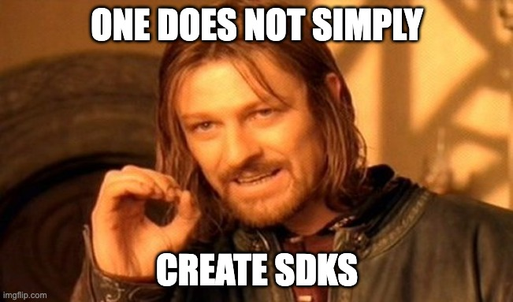

## Why you need an SDK

SDKs (also known as client libraries or client SDKs) are a key component for offering great APIs.

Without an SDK, API consumers need to read API docs and construct every API call by hand: from building the necessary authentication mechanisms, correctly configuring request headers, and extracting the right data from response models, to handling errors, rate limits, retries and pagination.

This approach has been described as “resembling trial and error” — which tells you everything you need to know about how developer-(un)friendly it is.

With an SDK however, consumers can get started in minutes by simply importing the library/SDK. Assuming the SDK has been built in the right way, calling an SDK method — with in-IDE auto-completion, error handling, type safety and much more built-in — is a much smoother, even delightful, integration experience.

But don’t just take our word for it — look at the most popular API-first companies, like Stripe, Plaid, Twilio etc. They all offer client SDKs that give consumers that coveted A+ experience.

To dive deeper into why you need an SDK, check out our guide on this topic: https://www.speakeasyapi.dev/post/apis-vs-sdks-difference.

## Awesome, how can I make these mythical SDKs?

We think every API should have an SDK that allows developers to integrate in minutes. And we’re sure everyone would agree.

However, creating SDKs is easier said than done, as Boromir will attest.

## Three different methods for creating SDKs
Broadly speaking, you have three options for creating SDKs.

1. DIY: hire engineers to create and maintain SDKs for you
2. Open-source (OpenAPI Generator): the [OpenAPI Generator](https://github.com/OpenAPITools/openapi-generator) is the best-known open-source SDK generator
3. Use Speakeasy

Let’s dive into each of these further, and figure out where each is most appropriate.

### The DIY, hand-rolled approach to creating SDKs
The DIY approach gives you maximum, fine-grained control over how your SDKs look and feel.

However, you will obviously need to staff an engineering team. That team must have proficiency in any languages you want to support: having a poorly-constructed, non-idiomatic SDK may be worse than having no SDK at all.

Ensure you consider the ongoing maintenance cost: if a team member leaves, are you prepared for the overhead of hiring a replacement? As new languages are requested or the pace of API changes increases, will you keep growing the team?

Remember that SDKs are a critical product surface — and need to be invested in just like any product. That means testing and fixing bugs, handling versioning and change management, and roadmap prioritization. Don’t forget that the SDKs themselves should be well-documented!

Put in place a robust release management process. Whenever there is an upcoming API change, the SDK team should know so they can update all the SDKs too.

**Summary:** The DIY, hand-rolled approach is best if customers are truly demanding something very custom in your SDKs, and if you can afford to hire the resources to create and maintain them. Be wary of the drag on engineering productivity and focus that SDK initiatives can create though — many a well-meaning eng team has released SDKs in a number of languages, struggled to keep them up to date, and ultimately had to deprecate or just accept that certain SDKs will never be up-to-date.

### Using OpenAPI Generator to create SDKs

The OpenAPI Generator is a popular open-source tool for generating SDKs from an OpenAPI spec. The OpenAPI Generator is licensed under Apache 2.0 — users are therefore able to modify and distribute the code with very few restrictions. Commercial use is allowed, and derivative works can be licensed as the creator wishes.

The OpenAPI Generator has lower upfront costs to get started than building an SDK from scratch. Since it’s open-source, developers can theoretically modify the generation code to output SDKs as the user wants. And developers can also build tooling around the generator, to embed it as part of a CI/CD process that automatically builds SDKs upon OpenAPI spec changes for example.

However, one familiar caveat for open-source software is the support model. As you would expect, there is no commercial support nor visibility / SLAs on fixes. As of the time of writing, there were over 3,600 open issues on the OpenAPI Generator project in GitHub for example.

Note also that the quality of the generated code can vary significantly. Since these generators are maintained by volunteers, one language’s SDKs might be idiomatic — and another might miss the mark entirely.

While the apparent eng cost from using an OpenAPI Generator seems low, many companies we’ve spoken to still end up devoting significant engineering time and attention to supporting the OpenAPI generator — whether building tooling, creating patches and workarounds for bugs, or improving code output. It will therefore become an internal engineering project, and like any such project, it will therefore need engineering resources

**Summary:** The OpenAPI generator does a lot of work for you, at the cost of some flexibility and customization. It will become another service you’ll need to maintain however — fixing bugs and adjusting the SDK output, integrating it into your workflow, dealing with user issues, etc. The engineering burden of supporting OpenAPI generator  should not be under-estimated.

### Using Speakeasy to create SDKs
We’d like to put in a word here for our own generator. We think it’s a compelling option (which is why we built it).

Why?

- Idiomatic code: we built our own internal generator from the ground-up with a focus on generating amazing SDKs — because we strongly believe that that’s what your API consumers expect. A Typescript developer wants to feel that they’re using a Typescript SDK, and a Python developer wants to feel that they’re using a Python SDK
- Type safe and feature-rich: our SDKs come “batteries included” to handle authentication, retries, and pagination. Type safety minimizes integration errors at compile time, providing API consumers with immediate feedback.
- Fully managed workflow: Speakeasy takes care of the entire SDK workflow to save you significant time. We validate your OpenAPI spec, use AI to suggest fixes, create SDKs, and publish to package managers.
- Get started today: SDKs can be created and published in just a few minutes
- Always up to date: We automatically generate SDKs every time your spec changes — no extra work required.
- Fully supported: We handles bugs and feature requests so your engineering team doesn’t have to
- Customizable code output: control SDK code output via Speakeasy extensions in your spec
- Standards-compatible: Speakeasy works with OpenAPI and JSON schema -- and has been battle-tested on over 4,000 APIs
- Generated SDKs are yours to keep: we don’t own the SDKs -- you do.

**Overall:** We think our fully-managed SDKs and Terraform provider generation products are the best choice for most engineering teams. Your APIs get amazing SDKs in a wide variety of popular languages. The SDKs are supported by our engineering team — meaning less work for you. They’re always up-to-date and battle-tested by awesome companies like Kong, Shippo, Airbyte and more.

Bring your OpenAPI spec and try it out for yourself now! Just click the button below to generate your first SDKs -- for free.