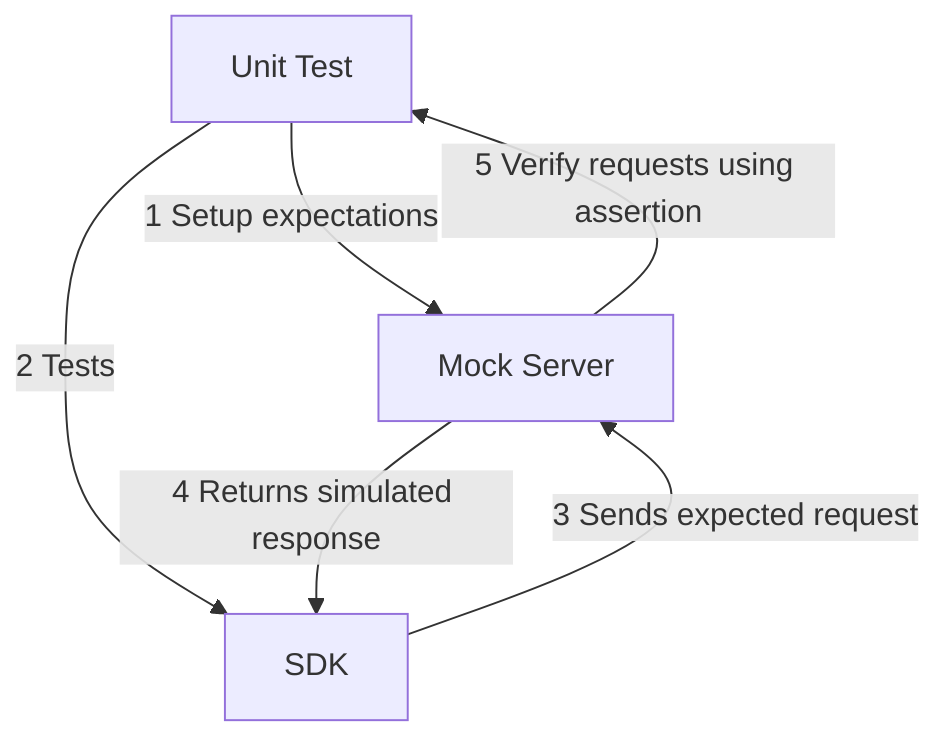
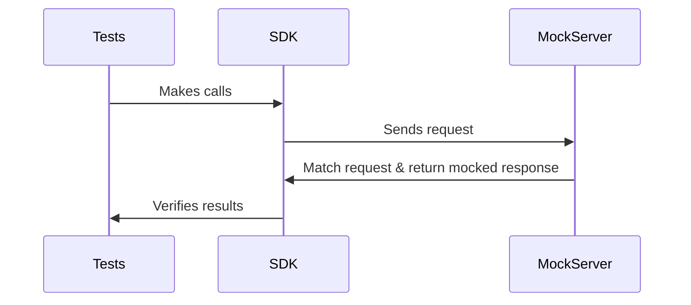

import { CodeWithTabs } from "~/components/codehike/CodeTabs";
import { ScrollyCoding } from "~/components/codehike/Scrollycoding";


Testing your SDK against your API can be challenging. During development, you often need to spin up a local server as well as a database and other dependencies, which can slow down the process. You're also prone to network issues, rate limits, and other external factors that can disrupt development and testing.

Mock servers provide a way to simulate your API's behavior without needing the actual API to be running. They're especially useful when you need to test how your SDK handles specific behaviors – like rate limiting or malformed responses – without relying on unpredictable or hard-to-reproduce real-world conditions.

In this guide, we'll walk through how to generate a mock server using Speakeasy and how to test your SDK against it. We'll also discuss the advantages of using a mock server during SDK development and compare Speakeasy with other mock server solutions.

## What is a mock server?

A mock server is a virtual API endpoint that simulates the behavior of a real API server. It intercepts test HTTP requests and returns predefined responses according to your OpenAPI document. This means you can test your SDK without connecting to a live API.

Think of a mock server as a stand-in actor during a rehearsal. It follows a script (your OpenAPI document) and responds exactly as needed, every time. This consistency is invaluable for ensuring thorough testing across various scenarios, from successful responses to error conditions. It also significantly speeds up the development process by removing the need to wait for real API responses.




## Why use mock servers?

In development, you need to verify how your SDK:

- Manages rate limits
- Handles network timeouts
- Processes malformed responses

While Speakeasy-generated SDKs handle these scenarios gracefully, you still need to test them to ensure your SDK behaves as expected.

A mock server allows you to simulate these scenarios reliably, without waiting for them to occur in a real environment, ensuring your SDK is thoroughly tested before it reaches production.

Additionally, mock servers allow you to **test your SDK in complete isolation**. Instead of depending on external services, you can execute local tests that provide consistent, predictable responses every time. 

This stability has significant advantages if your backend experiences intermittent downtime or if you want to minimize the impact of outside variables like network latency or downtime windows. When using Speakeasy, the mock server aligns closely with your OpenAPI document, which means that simulated responses closely mirror the behavior of your existing API.

While generating your SDK, Speakeasy automatically creates a mock server based on your OpenAPI document, eliminating time-consuming manual coding. It even generates a suite of tests that interact with the server, giving you a strong baseline of coverage for your endpoints right out of the box.

As your API evolves, you can regenerate and update both the mock server and the test suite whenever you regenerate your SDK, meaning your simulated mock environment and tests stay in sync with the latest version of your OpenAPI document.




## Generating a mock server with Speakeasy

To generate a mock server using Speakeasy, we'll use our [example FastAPI server](https://github.com/speakeasy-api/examples/tree/main/frameworks-example-fastapi-travel-server), which includes an OpenAPI document. 

### 1. Clone the examples repository

Begin by cloning the the Speakeasy examples repository. This will serve as our base project.

   ```bash
   clone git@github.com:speakeasy-api/examples.git
   ```

Go to the FastAPI example:

   ```bash
   cd examples/frameworks-example-fastapi-travel-server
   ```

### 2. Set up Speakeasy 

If you haven't installed the Speakeasy CLI yet, follow these steps to get started:

- **macOS (Homebrew):**
     ```bash
     brew tap speakeasy-api/homebrew-tap
     brew install speakeasy
     ```
- **macOS/Linux (Shell Script):**
     ```bash
     curl -fsSL https://raw.githubusercontent.com/speakeasy-api/speakeasy/main/install.sh | bash
     ```
- **Windows (Scoop):**
     ```powershell
     scoop bucket add speakeasy-api https://github.com/speakeasy-api/speakeasy
     scoop install speakeasy
     ```

You can verify the installation by running the following command:

   ```bash
   speakeasy --version
   ```

Next, authenticate your CLI with the Speakeasy platform:

   ```bash
   speakeasy auth login
   ```

For more detailed installation instructions, refer to the [getting started guide](/docs/speakeasy-reference/cli/getting-started).

### 3. Generate the SDK

In the cloned repository, use the Speakeasy CLI to generate an SDK from the OpenAPI document.

   ```bash
   speakeasy quickstart -o ./sdk -s openapi.yaml -t python
   ```

Answer the prompts to configure the SDK generation process. The resulting SDK will be saved in the `/sdk` directory.

### 4. Modify the `gen.yaml` file

Navigate to the generated SDK directory and locate the `.speakeasy` folder. 

   ```bash
   cd sdk/.speakeasy
   ```

The `gen.yaml` file in the `.speakeasy` folder contains the configuration for the SDK generation process. We'll modify this file to enable mock server generation.

Open the `gen.yaml` file in your text editor:

   ```bash
   nvim gen.yaml  # or your preferred editor
   ```


<ScrollyCoding>

### !!steps

Add the `tests` configuration to the `gen.yaml` file and set `generateNewTests` to `true` to enable mock server generation and create test files.

```yaml ! .speakeasy/gen.yaml
# !focus(18:19)
configVersion: 2.0.0
generation:
  devContainers:
    enabled: true
    schemaPath: openapi.yaml
  sdkClassName: HolidayDestinations
  maintainOpenAPIOrder: true
  usageSnippets:
    optionalPropertyRendering: withExample
  useClassNamesForArrayFields: true
  fixes:
    nameResolutionDec2023: true
    parameterOrderingFeb2024: true
    requestResponseComponentNamesFeb2024: true
  auth:
    oAuth2ClientCredentialsEnabled: true
    oAuth2PasswordEnabled: true
  tests:
    generateNewTests: true
```

</ScrollyCoding>

### 5. Generate the mock server

Next, regenerate the SDK with the updated configuration. Run the following command from a terminal in your SDK directory:

   ```bash
   speakeasy run
   ```

A new `/tests` directory will be created in the `./sdk` folder, containing the mock server and test files.

```bash SDK directory structure
sdk
├── .devcontainer
├── .gitattributes
├── .gitignore
├── .speakeasy
├── CONTRIBUTING.md
├── README.md
├── USAGE.md
├── docs
├── poetry.toml
├── py.typed
├── pylintrc
├── pyproject.toml
├── scripts
├── src
└── tests
    ├── __init__.py
    ├── mockserver
    │   ├── Dockerfile
    │   ├── Makefile
    │   ├── README.md
    │   ├── go.mod
    │   ├── go.sum
    │   ├── internal
    │   ├── testdata
    │   └── main.go
    ├── test_client.py
    ├── test_destinations.py
    └── test_general.py
```

### 5. Run the mock server

Navigate to the mock server directory: 

   ```bash
   cd tests/mockserver
   ```

Start the mock server:

   ```bash
   go run .
   ```

You now have a fully operational mock server to simulate API responses and test your SDK without relying on the actual API.

For more information on running the mock server, read the generated `README.md` file in the `tests/mockserver` directory.

## Testing against the mock server

Let's look at how you can unit test your SDK against the mock server. 

The generated SDK includes test files that you can use to validate the behavior of your SDK.

<CodeWithTabs>

```shell !!tabs tests/
sdk
└── tests
    ├── __init__.py
    ├── mockserver
    ├── test_client.py
    ├── test_destinations.py
    └── test_general.py
```

```python !!tabs tests/test_destinations.py
import holiday_destinations
from holiday_destinations import HolidayDestinations
import os
from tests.test_client import create_test_http_client


def test_destinations_get_destinations_destinations_get():
    with HolidayDestinations(
        server_url=os.getenv("TEST_SERVER_URL", "http://localhost:18080"),
        client=create_test_http_client("get_destinations_destinations_get"),
    ) as holiday_destinations:
        assert holiday_destinations is not None

        res = holiday_destinations.destinations.get_destinations_destinations_get()
        assert res is not None
        assert res is not None
        assert res == [
            holiday_destinations.Destination(
                country="Indonesia",
                description="Beautiful beaches and vibrant culture.",
                name="Bali",
                rating=4.8,
            ),
            holiday_destinations.Destination(
                country="Indonesia",
                description="Beautiful beaches and vibrant culture.",
                name="Bali",
                rating=4.8,
            ),
        ]


def test_destinations_create_destination_destinations_post():
    with HolidayDestinations(
        server_url=os.getenv("TEST_SERVER_URL", "http://localhost:18080"),
        client=create_test_http_client("create_destination_destinations_post"),
    ) as holiday_destinations:
        assert holiday_destinations is not None

        res = holiday_destinations.destinations.create_destination_destinations_post(
            country="Indonesia",
            description="Beautiful beaches and vibrant culture.",
            name="Bali",
            rating=4.8,
        )
        assert res is not None
        assert res is not None
        assert res == holiday_destinations.Destination(
            country="Indonesia",
            description="Beautiful beaches and vibrant culture.",
            name="Bali",
            rating=4.8,
        )


def test_destinations_delete_destination_destinations_destination_id_delete():
    with HolidayDestinations(
        server_url=os.getenv("TEST_SERVER_URL", "http://localhost:18080"),
        client=create_test_http_client(
            "delete_destination_destinations__destination_id__delete"
        ),
    ) as holiday_destinations:
        assert holiday_destinations is not None

        holiday_destinations.destinations.delete_destination_destinations_destination_id_delete(
            destination_id=0
        )


def test_destinations_get_destination_by_id_destinations_destination_id_get():
    with HolidayDestinations(
        server_url=os.getenv("TEST_SERVER_URL", "http://localhost:18080"),
        client=create_test_http_client(
            "get_destination_by_id_destinations__destination_id__get"
        ),
    ) as holiday_destinations:
        assert holiday_destinations is not None

        res = holiday_destinations.destinations.get_destination_by_id_destinations_destination_id_get(
            destination_id=0
        )
        assert res is not None
        assert res is not None
        assert res == holiday_destinations.Destination(
            country="Indonesia",
            description="Beautiful beaches and vibrant culture.",
            name="Bali",
            rating=4.8,
        )


def test_destinations_update_destination_destinations_destination_id_put():
    with HolidayDestinations(
        server_url=os.getenv("TEST_SERVER_URL", "http://localhost:18080"),
        client=create_test_http_client(
            "update_destination_destinations__destination_id__put"
        ),
    ) as holiday_destinations:
        assert holiday_destinations is not None

        res = holiday_destinations.destinations.update_destination_destinations_destination_id_put(
            destination_id=1,
            country="Indonesia",
            description="Beautiful beaches and vibrant culture.",
            name="Bali",
            rating=4.8,
        )
        assert res is not None
        assert res is not None
        assert res == holiday_destinations.Destination(
            country="Indonesia",
            description="Beautiful beaches and vibrant culture.",
            name="Bali",
            rating=4.8,
        )
```

---

</CodeWithTabs>

To run the tests, you'll need to install `pytest` and a few other modules listed in the `pyproject.toml` of the generated SDK. 

Open a new terminal window and install the dependencies. It's best to install in a virtual environment.

```bash
pip install pytest httpx pydantic typing-inspect
```

Navigate to the `tests` directory in the SDK and run the tests:

```bash
pytest
```

The generated tests will be run against the mock server, validating that your SDK behaves as expected.

## Comparison with other mock server solutions

Several other mock server solutions are available, each with its own set of features and limitations.

- **[Prism](https://github.com/stoplightio/prism):** An open-source API mocking tool that uses OpenAPI documents to generate mock servers.
- **[MockServer](https://www.mock-server.com/):** A Java-based tool for mocking HTTP/HTTPS requests.
- **[Postman](https://www.postman.com/):** An API development platform that includes mocking capabilities.

The table below compares Speakeasy with these mock server solutions.

| Feature                 | **Speakeasy**                                                      | **Prism**                                             | **MockServer**                                  | **Postman**                                    |
|-------------------------|--------------------------------------------------------------------|-------------------------------------------------------|-------------------------------------------------|------------------------------------------------|
| **Primary use case**    | Automated SDK generation and management                            | API mocking and validation based on OpenAPI documents | HTTP/HTTPS request-response mocking and testing | API development, testing, and collaboration    |
| **SDK generation**      | ✅ Yes (automated SDK generation)                                   | ❌ No                                                  | ❌ No                                            | ❌ No                                           |
| **Test generation**     | ✅ Yes                                                              | ❌ No                                                  | ❌ No                                            | ✅ Yes (pre-saved tests)                        |
| **Supported languages** | 8+ languages, including Python, JavaScript, TypeScript, Java, and Go.                     | Language-agnostic                                     | Java only                                       | Language-agnostic                              |
| **Testing types**       | SDK testing, unit testing, contract testing                        | Contract testing, API prototyping                     | Integration, functional, and system testing     | Functional, integration, and regression testing            |
| **Mocking support**     | ✅ Yes, built-in for SDKs                                           | ✅ Yes (dynamic/static examples)                       | ✅ Yes (complex mocking with templates)          | ✅ Yes (mock servers with predefined responses) |
| **Request validation**  | ✅ Built-in for SDKs (validates requests against OpenAPI documents) | ✅ Yes                                                 | ✅ Yes                                           | ⚠️ Limited (manually set up via tests)          |
| **Response generation** | ✅ Handles SDK responses                                            | ✅ Static and dynamic responses                        | ✅ Templated responses                           | ⚠️ Static responses                            |
| **OpenAPI support**     | ✅ Yes, creates mock expectations based on your OpenAPI document    | ✅ Yes                                                 | ✅ Yes                                           | ⚠️ Partial (import/export specs)               |

## Why choose Speakeasy for test generation and mocking?

Speakeasy simplifies two key parts of your SDK development workflow: **test generation** and **mocking**. Here's how:

1. **Immediate test suite**  
   Speakeasy generates a suite of tests when you generate your SDK. Each test aligns with a specific API endpoint, so you can quickly validate both regular and edge-case scenarios without writing boilerplate code.

2. **Automatic mock server**  
   With one command, Speakeasy can start a mock server based on your OpenAPI document. You won't have to set up separate testing environments or craft mock responses by hand, making local testing easier.

3. **Isolated and repeatable testing**  
   Because tests run against a mock server, you aren't affected by network issues or external service downtime. The environment remains consistent, so test results are reliable and easy to reproduce.

4. **Comprehensive endpoint coverage**  
   When Speakeasy generates tests alongside a mock server, it covers every endpoint in your API document. This helps you catch issues early and maintain higher test coverage.

5. **Easy regeneration**  
   As your API changes, update your OpenAPI document. Speakeasy regenerates the mock server and tests, ensuring everything remains in sync with minimal effort on your part.

By handling **test generation** and **mocking**, Speakeasy frees you from having to constantly devise tests and maintain testing environments through your development cycle.

## Next steps

For a deeper dive into testing, take a look at our [guide to API contract test generation](/post/release-contract-testing), which covers automated testing and validating API contracts.
