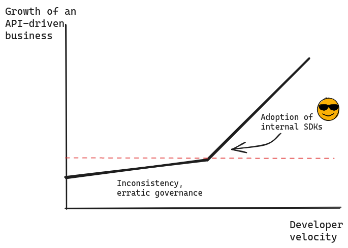

import { Testimonial } from "~/components";

People often think about SDKs in the context of libraries that make it easier for **external** users to integrate with an API. But SDKs are just as as valuable to internal developers working with internal APIs.

In fact, internal APIs are where SDKs can provide the most business value:

- **Most APIs are internal**:
  In its [2023 state of the API](https://www.postman.com/state-of-api/a-day-week-or-year-in-the-life/#a-day-week-or-year-in-the-life) report,
  Postman found that 61% of APIs are for private use only.
- **Internal APIs are heavily used**:
  An external API probably has a single point of integration whereas an internal API is likely reused across a suite of applications in their frontend, backend, and middleware.
  
Because of this, building SDKs for internal APIs can be transformational:

- **Increased velocity** - SDKs can reduce the time to integrate with an API by 50% or more. That means more time for innovation and less time on boilerplate.
- **Improved API Governance** - SDKs can be a powerful tool for API governance, helping teams work autonomously while maintaining a consistent interface across the organization.
- **Better staff retention** - Faster velocity, and less reptition leads to happier and more productive developers, which leads to better staff retention.

## Developer velocity drives business growth

For orgs with an API-first approach, ease of integration with internal APIs is critical for business success. SDKs enable this through:

- **Eliminates integration boilerplate** - Eliminates the tedious, repititve integration work that needs to be done before integrating with a service.
- **Reduces errors** - SDKs mean there's less opprotunity to shoot yourself in the foot. The SDK will handle areas where people will frequently make mistakes, like authentication, error handling, and serialization.
- **Speeds up debugging** - SDK wll shrink the surface area of the integration, so when issues do occur, there's less code to dig through.

With SDKs handling so much of the integration work, developers can focus on innovating where it matters, the business logic of their application. And the more teams using your internal SDKs, the faster the gains in velocity compound.

## Greater independence with consistent interfaces

Organizations fail when they create lengthy review processes to enforce consistency across development teams. They inevitably kill innovation without solving the consistency challenge. The better strategy is to hand developers tools that speed up their work, and have the side effect of ensuring consistency.

Derived from a common API contract, SDKs can be a usual tool to make sure that API consumption practices are consistent acorss the organization. This is a major compenent of a successufl API governance program.  Kin Lane [defines API governance](https://apievangelist.com/2021/11/13/some-thoughts-on-api-governance) as:

  “Ensuring that the complex systems powering the enterprise are as defined, discoverable, and observable as possible so that you can understand the state of the system, and then incrementally evolve the state of the system as a whole, in the right direction.”

oAs a codebase grows, governance becomes increasingly important.
Good SDKs make it easier for teams to make good design choices and harder to make bad ones.

## Happy Developers, Happy Business

[A study by McKinsey](https://www.mckinsey.com/industries/technology-media-and-telecommunications/our-insights/developer-velocity-how-software-excellence-fuels-business-performance) found that high developer velocity correlates strongly with many indicators of business health, including talent retention.

The study concluded that a major driver of velocity comes from the quality of internal tooling:

  “The ability to access relevant tools for each stage of the software life cycle contributes to developer satisfaction and retention rates that are 47 percent higher for top-quartile companies compared with bottom-quartile performers.”

The previous sections have explained how SDKs can bring a level of reusability and consistency to API usage.

To understand the impact of that reusability on developers' quality of life, consider a common pattern that manifests at organizations where it's missing:

1. Every team writes bespoke code. No one shares resources. When someone tries to share, they soon find that no one else uses or even recognizes their attempt.
2. The first time two teams discover they have independently done the same thing, it's amusing. Then, this becomes a running joke. But beneath the humor is mounting frustration.
3. Inevitably, people start to feel that their work is unimportant, meaningless. Data inconsistencies pile on top of fragile designs;
the codebase begins to feel brittle and perilous; workers feel less and less incentive to innovate; dreams of standardization becomes more and more remote as disarray spreads.
4. All productive engineers are looking for a new job.

An SDK cannot save an organization from chaos, but it can heavily contribute to consistency and well-being.

## SDKs are a win-win

- Effective organizations encourage teams to work autonomously and discover their own solutions.
- Effective organizations benefit from standardized codebases and design patterns.

A good SDK program can ease the tension between these apparently contradictory statements.
The standardized interface and pre-built libraries help teams work faster, work autonomously, and develop quickly without "going rogue".
This harmony promotes both bottom-up creativity and top-down governance.

## OK, but making an SDK is hard work

One fact may undermine my whole argument: good SDKs are hard to build and maintain.
This is true even with a stable API and a single development language.
For fast-moving, polyglottal teams, the maintenance complexity explodes.

What if there were a tool to generate quality SDKs automatically, in multiple languages, using taut, idiomatic code, and avoiding heaps of boilerplate?

Grab an OpenAPI spec and [try Speakeasy yourself](https://app.speakeasy.com/).
