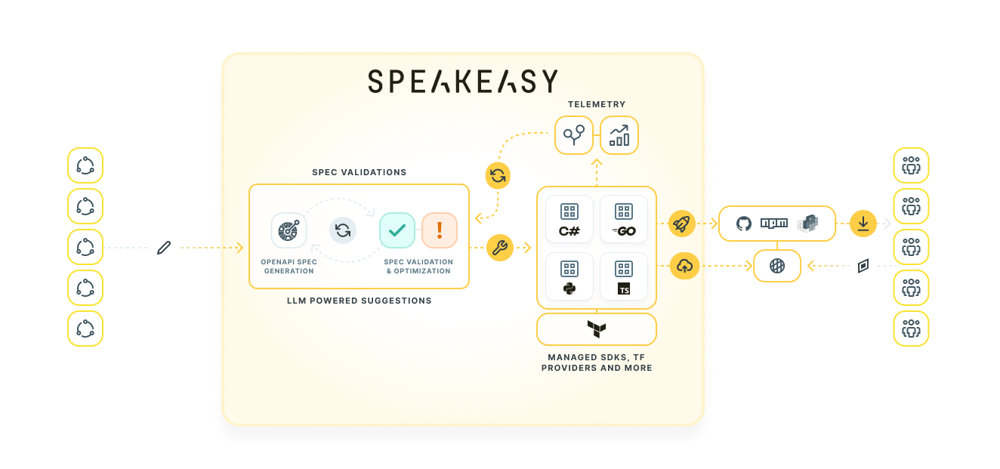

{/*import { Callout } from '~/components'*/}

# Speakeasy's $11M Raise

4000 SDKs, 100's of Github repos, 9 team members, and 8 languages later...

Today, we’re excited to [officially announce Speakeasy to the world](https://techcrunch.com/2023/06/29/speakeasy-is-using-ai-to-automate-api-creation-and-distribution/), with $11 million in combined pre-seed & seed funding from backers including: [Crystal Huang](https://twitter.com/CrystalHuang) at [Google Ventures](https://www.gv.com/), [Astasia Myers](https://twitter.com/AstasiaMyers) at [Quiet Capital](https://quiet.com/), [Flex Capital](https://www.flexcapital.com/), [StoryHouse Ventures](https://www.storyhousevc.com/), [Firestreak Ventures](https://www.firestreak.com/), and angels including Amit Agarwal (President of Datadog), Clint Sharp (co-founder and CEO of Cribl) and Todd Berman (CTO of Attentive).

To show off all the exciting features we’ve built this year, we’ll be hosting a Feature Week, July 10th-14th. Every day, we’ll be posting short deep-dives on what we’re busy building here at Speakeasy. [Sign up for our newsletter](/post#subscribe) and we’ll send you a reminder!

## Why are we building Speakeasy?

There is one thing we can all agree on: APIs are ubiquitous and critical to building modern software. In a single line of code, you are able to harness the collective efforts of a thousand developers. It's not much of an exaggeration to say that APIs give engineering teams superpowers.

Yet shifting access patterns and heightened user expectations mean it has never been harder to build a "great" API. Providing the tools necessary for users to easily integrate requires navigating a world of API marketplaces, plugin ecosystems, chat interfaces, a dozen language communities, and more. We’re a long way from the days of the humble `curl`. Of course, everyone wants their API to have a great developer experience and be natively accessible in any environment & runtime, but very few are able to commit the huge platform engineering investments required to solve this "final mile" problem. Those who do - such as Stripe, Plaid, Twilio, Github — reap fantastic rewards.

Most API teams however are left in the lurch. Between managing new versions, duct taping schemas, and keeping documentation from going stale, their hands are already full. That often places the “final mile” of integration on the shoulders of the user. Their only tools: an API reference page, their own determination, and a high threshold for frustration.

As a result, APIs — whether for internal or external users — end up under-used and under-resourced. Neither builder nor user is happy. And yet what's the alternative? Building all the tooling to offer that ideal API DevEx in-house would leave API teams with tons of tech debt that isn't related to their core product.

That's why Speakeasy has showed up, with a product, a pipeline, and a team of people to solve this problem once and for all.

**📣 Speakeasy’s mission is to make it easy to create and consume any API.**

## What We Do

Speakeasy provides production-quality developer surfaces for your API that delight users and make integration easy. Today, that means managed native-language SDKs and Terraform providers.

Speakeasy SDKs enable your API users, whether external customers or internal teams, to integrate rapidly. We provide a far more intuitive and developer-friendly (even, dare we say, enjoyable?) experience than is possible with the status quo “API reference + sheer determination” approach today.

Speakeasy managed SDKs will equip your API users with compilable usage snippets for every function, context-aware in-IDE code completion, and type safety. Users are spared from writing error-prone boilerplate code, dramatically reducing frustration and the number of support tickets.

Ultimately, API builders save huge amounts of time and cost, while user adoption is maximized thanks to a world-class API developer experience.

Here’s what a couple of our customers have to say:

> “The engineering team is consistently focused on developing Codat’s core infrastructure, and we’re always figuring out the most efficient way to advance our developer experience. Finding Speakeasy has been transformational in terms of our team’s velocity. We’ve been able to progress our roadmap faster than we thought possible. We already have SDKs for 3 languages in production. If we’d been on our own, we’d probably be getting ready to publish the first one now.”
>

[David Coplowe, Codat DevEx Team](/post/case-study-codat)

> “Speakeasy's unique offering of high-quality SDKs including a Terraform provider, all generated from our existing API specs allowed us to take a huge leap in our own product go-to-market. We don't need to invest in hiring teams of specialist engineers — allowing us to focus on our core product.”
>

[Viljami Kuosmanen, Head of Engineering, epilot](/post/case-study-epilot)

## How does it work?

Today, given an API, we:

- Automatically maintain your API specs through AI-powered suggestions and telemetry-based drift detection
- Create idiomatic, type safe, production-quality SDKs in 8 languages and counting: Python, Java, Typescript, Go, Ruby, PHP, Swift, C# — and even new API ecosystems like Terraform Providers. We create and maintain these in polished Github repos.
- Customise and brand your SDKs with a batteries-included experience like retries, pagination and auth. You can steer our code generation engine with extensions and simple config.
- Generate docs for your SDK. Making it incredibly simple for API consumers to pick up and use in minutes. 1 copy paste to a working integration
- Publish SDKs to package managers (npm, PyPI, etc.). No more signign into your sonatype account.
- Watch for updates to your API spec, and re-run the entire workflow automatically so your SDKs are always up-to-date
- Manage the rollout of your SDKs, client authentication with gateways and self service telemetry in just a few clicks

Speakeasy manages the entire workflow of SDK and Terraform provider creation: from spec validation/enrichment, through code creation, and package publishing

## Why We’re Different

Prior to Speakeasy, the most prevalent options for creating SDKs were:

1. Creating SDKs manually
2. Using open-source generators (yes, the one with >3K issues)

Neither of these are great options for most companies. Manually creating SDKs requires costly eng teams to be hired and maintained, and dilutes focus from other core development priorities. Open-source generators are great for hobbyists — but lack the comprehensive commercial support, idiomatic code output, and broad OpenAPI compatibility needed for enterprises. If using the OSS generators, teams ultimately still need to invest a significant amount of eng time in order to support production use cases.

**Speakeasy offers a compelling alternative**

- SDKs that are fully-managed and supported by our responsive team, providing you with all the benefits of an [API platform](/post/why-an-api-platform-is-important/) team at a fraction of the cost.
- A comprehensive pipeline for generating SDKs, Terraform providers, and other developer surfaces: CLIs, Zapier plugins, natural language agents and more.
- Integrates seamlessly with your API development. We integrate directly with GitHub, GitLab, and other CI/CD platforms ensuring SDKs are updated on every release.
- Code generation built from the ground up, with a focus on creating customisable, idiomatic, fault tolerant and type safe SDKs. You can see the results for yourself:

  - [Speakeasy’s Python SDKs vs. OpenAPI Generator](/docs/languages/python/oss-comparison-python)
  - [Speakeasy’s Typescript SDKs vs. OpenAPI Generator](/docs/languages/typescript/oss-comparison-ts)
  - [Speakeasy’s Go SDKs vs. OpenAPI Generator](/docs/languages/golang/oss-comparison-go)`

## Who Do We Work With?

You, we hope!

Our product has been battle-tested across 4000 SDKs, and by great product and engineering teams like Shippo, [Airbyte](/post/case-study-airbyte), [Codat](/post/case-study-codat) and more.

## What’s next?

We’re excited to continue helping builders build, by making APIs incredibly easy to create and consume. What’s coming up next?

- Adding more code generation targets - languages, clients, runtimes, ecosystems, novel targets
- Providing plug and play infrastructure to provide deep insights into API changes and usage
- Going upstream and integrating into your favorite server side frameworks to remove the need for API specs and cumbersome documentation workflows

## Want to try Speakeasy?

Sign up today at [https://www.speakeasy.com/](https://www.speakeasyapi.dev)! Bring your API spec if you have one - we like those :)

## Talk to us!

- Follow us on [Twitter](https://twitter.com/speakeasydev) and [LinkedIn](https://www.linkedin.com/company/speakeasyapi/)
- Come chat with us on [Slack](https://join.slack.com/t/speakeasy-dev/shared_invite/zt-1cwb3flxz-lS5SyZxAsF_3NOq5xc8Cjw)
- [Check out our open roles](https://jobs.ashbyhq.com/Speakeasy), we’re hiring amazing engineers and a developer focused UX designer.

## Last but not least

We'll leave you with a carefully crafted poem. Well not so crafted... thanks ChatGPT! Prompt engineering credit goes to our newest team member, Sterling:

> In search of clear instructions,
We turn to the API's functions.
But to use them without confusion,
We need SDK documentation.

> Yet sometimes it's hard to follow,
The API's lingo can be hollow.
We need a way to make it clear,
To rewrite it in a language we hold dear.

> With OpenGPT-3.5 at our side,
We can translate and simplify with pride.
The developer's task is now made light,
With SDK documentation in their sight.

> So let us embrace this new tool,
And make our SDKs easy to use.
From API to SDK, it's a breeze,
With OpenGPT-3.5, we achieve with ease.
