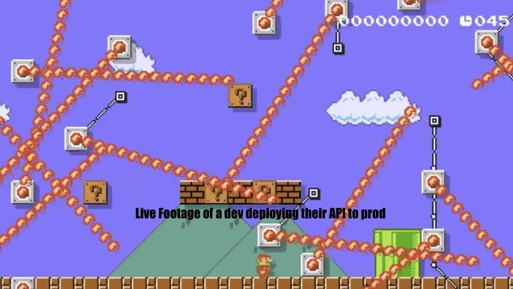

_This post is the first from the Speakeasy blog!  Follow us as we explore why APIs are important to the future of software, the challenges developers at non-FAANG companies face, and what the future of dev infra for APIs holds._

It has always been the case that there are far more ideas in the world which deserve to be built, than there are people to build them. The tricky thing about ideas is that it’s really hard to know whether they’re good or not until you get knee deep in them.  You could of course try and get really good at identifying the ideas that have legs, but the far safer method is to just throw as many ideas at the wall as possible and see what sticks.

The question then becomes, as a community, how do we make sure that we are pursuing as many ideas as possible?  The answer is that we do what humans have always done, we build tools.  The best tools empower each individual to accomplish what previously took 10 people to do. With the right tools the same number of people can collectively tackle 10x the number of projects and thus push the boundaries of what’s possible.

Nowhere has this pattern of tools providing 10X productivity boosts been more powerful than in software.  Free of nearly all physical constraints, the creation and proliferation of software is only ever constrained by the time of the world’s developers. Unfortunately, that’s still a big constraint. There aren’t nearly enough new developers being trained to keep pace with the cambrian explosion of new software products being created. The only way to keep the industry accelerating is to keep building tools which deliver a step change boost in productivity.  We believe the next step change in productivity will be achieved when developers’ are able to easily operationalise a common, but underutilized technology, APIs.

> _If we want to massively accelerate the creation of new products and businesses, we need to make it easier for developers to build, maintain, and ultimately,_ **_use_** _APIs._

APIs are the next solution to the consistent problem of limited developer bandwidth. A well built API is like giving a developer [superpowers](https://www.notboring.co/p/apis-all-the-way-down?s=r). They enable a dev, with a single line of code, to harness functionality that would’ve taken a team of 10 devs years to build. That dev is now able to focus more time on true innovation rather than reinventing the wheel. A perfect example of this is the explosion of D2C e-commerce, none of which would have been possible without the layers of abstraction in payments processing provided by API companies like [Shopify](https://shopify.dev/docs/api) and [Stripe](https://stripe.com/docs/api):

e-commerce = Abstraction all the way down

APIs have the potential to bring an explosion in innovation to every industry they touch.

## Too often, APIs go unbuilt and unused

There’s no doubt that APIs are the answer to the problem of developer bandwidth. And yet, within the answer lies another set of problems. Too often, APIs go unbuilt because productionizing them is too tedious to be valuable.  And even more often, APIs that are built go unused because their value is hidden by a layer of usability issues.  Before the full promise of APIs can be realized, these issues need to be fixed.

Nearly every development team outside of FAANG (now christened _MAMAA?_) finds itself trapped in what could be described as API development purgatory, they know they need APIs to power innovation across their business, but they can’t justify the upfront investment which would be required to build the tooling devs need to easily build said APIs.  So, API development limps forward, too important to give up, too tangential to business objectives to be a priority.  

## The Problem: Building reliable and usable APIs takes a lot of effort.

Without tooling to make development easy, it’s each developer’s personal conviction that determines whether an API is built, and if so, to what standard. Often developers simply can’t justify the time investment which would be required to make the API high quality.  This is because writing code is merely one task on the long laundry list of necessary activities which comprise the full API development lifecycle. Some of the most particularly painful problems associated with the API lifecycle are:

- **Devs deserve a great user experience too!**: It is extremely easy for static artifacts to get out of sync with code. Every developer has experienced the pain & confusion caused by sparse, stale documentation.

- **The dreaded back compat:** It is expensive to maintain multiple versions of an API, but without versioning, making major changes becomes an epic migration with all the associated spreadsheets and client calls.

- **Yet another integration**: the API ecosystem is fragmented for Authentication, Gateways, Billing and much more. It’s challenging for a developer to keep these all in sync without causing customer downtime and rarely get accounted upfront in development planning.

- **K8s Apps, services, ingresses, proxies, gateways…. :(** :  The cloud is powerful, but complicated with many moving parts needed for a simple API.  Making sure that infrastructure is optimally configured for your use case can take as long as building the product in the first place.

The above is really just the tip of the iceberg. For any given API you may also need to consider key management, rate limiting, discovery, dev portals, usage tracking, billing, observability…. When you consider all this, it’s a wonder that any APIs get built at all.

## How do we end API purgatory?

Unfortunately, it’s not going to happen in a day, but there is hope that the ease of API development can be massively improved for developers.  In future posts, we plan to break down each of the individual issues we mentioned and propose what a developer-first solution to the problem might look like.

We know we don’t have all the answers, so we look forward to hearing from everyone! Please don’t hesitate to chime in with your perspective on the challenges facing devs working on APIs, and what you think constitutes a good solution. If you ever want to speak with us, [don’t hesitate to reach out!](https://calendly.com/d/5dm-wvm-2mx/chat-with-speakeasy-team)