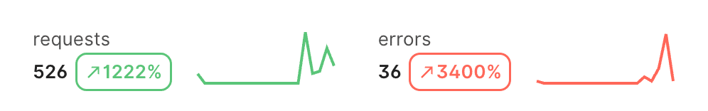

If you work in B2B it’s inevitable that you’ll be asked to build a dashboard. Building dashboards means buildings charts, and creating nice-looking charts for the web is undeniably difficult. Sure you _could_ build your own solution directly using D3, but do you really _need_ (or want) to? Probably not. Building off of D3 might allow you to build some elaborate custom visualizations, but as any frequenter of [/r/dataisbeautiful](http://reddit.com/r/dataisbeautiful) knows, simplicity and usability go hand in hand when visualizing data. Good news!--there are plenty of great React libraries for making simple charts.

At Speakeasy, we were recently building out an API usage dashboard and in doing so explored Nivo and Recharts (an admittedly non-exhaustive dive into the sea of React charting libraries out there). We want to share, and save you from needing to do the same investigation, at least into those two.

## TLDR

If you’re picking between Nivo and Recharts, we strongly recommend choosing Recharts. If you’re deciding between Recharts and something else, maybe use Recharts (we like it well enough) but also know that it’s not without issues.

## Nivo - What We Liked

[Nivo](https://nivo.rocks/) is beautiful. Their charts are beautiful, their website is beautiful, their online sandbox is a fantastic feature. All of these are wonderful selling points and will hopefully make for a top-of-the-line chart library one day. We were drawn in by the siren’s song and pulled the trigger on it without doing any due diligence investigating other options. Unfortunately there are plenty of problems we encountered (fortunately very quickly).

## Nivo - What We Disliked

### Poor responsiveness

Static charts are ugly. Responsiveness is important. Here’s what happens when you try to make your Nivo charts responsive:

import portal_url_1 from './assets/nivo-vs-recharts-image-01.mp4'

  <video controls={false} loop={true} autoPlay={true} muted={true} width="100%" alt="Responsive Nivo charts poor responsiveness">
    <source src={portal_url_1} type="video/mp4" />
  </video>

This is a known issue ([here’s](https://github.com/plouc/nivo/issues/109) one of several Github issues calling it out). Workarounds exist for certain situations, but for others, no such luck. We were not able to get simple width responsiveness working; this was a big strike against Nivo.

### Poor interface

We found Nivo to be very verbose. Those ultra-minimal charts with no axes, gridlines, or tooltips in the gif above? The code for the corresponding Nivo component, with all of its input props, is 30 lines long. 

To the left is (some of) the code for the default example on [their website](https://nivo.rocks/line/) (the rest of it didn’t fit on one screen for a screenshot). You can see that everything is crammed into the component props. Not the end of the world, but as you’ll see in the Recharts section, there’s a much better way.

### Subpar Technical Documentation

The poor interface mostly becomes an issue when paired with subpar documentation. If you want to do something simple (or something that happens to have a corresponding example in their [storybook](https://nivo.rocks/storybook/)), it’s (relatively) smooth sailing. If you want to do something that has no example, you’ll have to fumble in the dark a bit. Many of the property objects are not documented anywhere, leaving you to guess at what properties are available and what they do. I found myself messing around in their sandbox, looking at the corresponding code, and copying over the relevant properties in a tedious trial & error process. If your use case is simple you’ll be okay, but the second you run into an issue, the limited documentation makes troubleshooting very difficult.

### Mindshare is low

While very polished-looking, Nivo is one of the least used of the popular React charting libraries. This naturally means mindshare (read: stack overflow answers) will be limited and troubleshooting will involve praying that (a) there’s a corresponding issue on Github and (b) someone has responded to that issue with a fix or workaround. And again, because usage is low, that’s not super likely.

## Recharts - What We Liked

After struggling with the aforementioned issues with Nivo, we decided to cut our losses and swap in a different chart library. After spiking out an implementation using Recharts, we decided it met our needs and was a substantial improvement, so we trialed it everywhere.

### It’s easy to make pretty charts

The charts are nice-looking (though simple) out of the box. They come with things like a nice animation when the page is loaded

import portal_url_3 from './assets/nivo-vs-recharts-image-03.mp4'

  <video controls={false} loop={true} autoPlay={true} muted={true} width="100%" alt="Out of the box charts">
    <source src={portal_url_3} type="video/mp4" />
  </video>

It’s also trivial to add things like synchronized tooltips. This was a one-line change that yielded pretty cool results.  

import portal_url_4 from './assets/nivo-vs-recharts-image-04.mp4'

  <video controls={false} loop={true} autoPlay={true} muted={true} width="100%" alt="Synchronized tooltips in charts">
    <source src={portal_url_4} type="video/mp4" />
  </video>

### It has a nice interface

The interface for Recharts is very well designed, especially when compared to Nivo. Below is our implementation of the ultra-minimal charts shown above.

Declaring the different elements of a chart (axes, gridlines, the line itself) as individual components is very intuitive and nice to use. For the charts above we wanted _just_ the line, so to achieve that we simply added _just_ the \`Line\` component. Beautiful.

## Recharts - What We Dislike

### It has many open issues

Here’s one annoying one we encountered.

import portal_url_2 from './assets/nivo-vs-recharts-image-07.mp4'

  <video controls={false} loop={true} autoPlay={true} muted={true} width="100%" alt="Recharts annoying issue">
    <source src={portal_url_2} type="video/mp4" />
  </video>

Here you can see in that same synchronized tooltip example the page jumps around because the bottom tooltip starts off the screen. This is actually an issue for every tooltip, but most of the time if you hover over a chart it’s already on your screen. It was just particularly noticeable for these synchronized charts since the bottom one is often _not_ already on your screen. We tried to no avail to fix it, and ended up having to disable the synchronized tooltips altogether.

There are many such issues ([430](https://github.com/recharts/recharts/issues) of them, to be exact) so you’ll likely encounter one or two, which can be frustrating given that the documentation is not stellar.

### The documentation has room for improvement

While somewhat better than Nivo on the technical side of the docs, Recharts’ docs still lack real depth and meat. There are a fair few [examples](https://recharts.org/en-US/examples) which, like Nivo, are helpful if you are trying to do something simple with minimal customization. There’s also a [technical reference](https://recharts.org/en-US/api) which is at least a step up over Nivo in that it exists, but also contains so little detail that it’s not very useful. It can help remind you what properties exist, but it won’t help you figure out anything deeper than that.

## Conclusion

In the grand scheme of things, our charting needs are relatively simple and Nivo was not able to meet those simple needs, while Recharts was. So Recharts is definitely worthy of consideration, but we know that isn’t the full story. It’s definitely worth considering other libraries before you commit. We would love to hear what other libraries people have tried and how they compare to Recharts.
