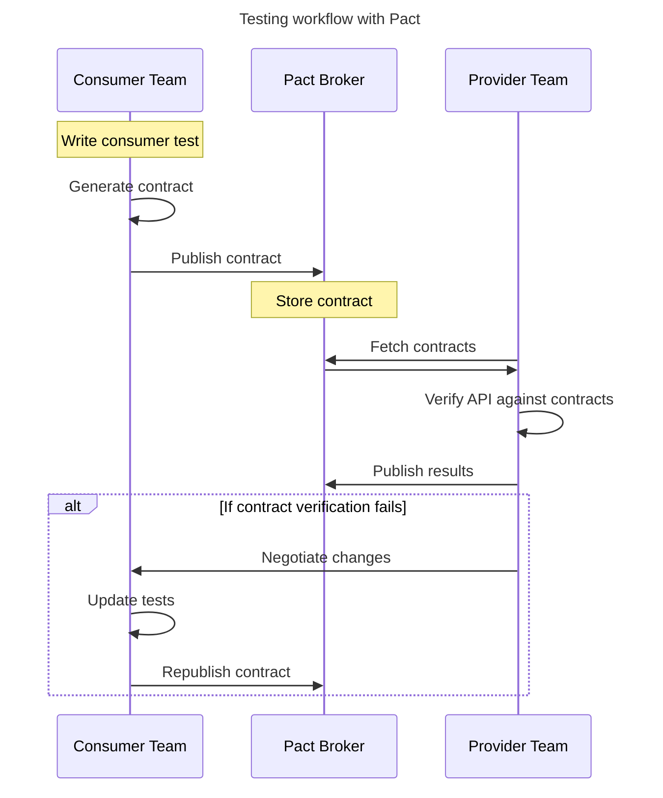
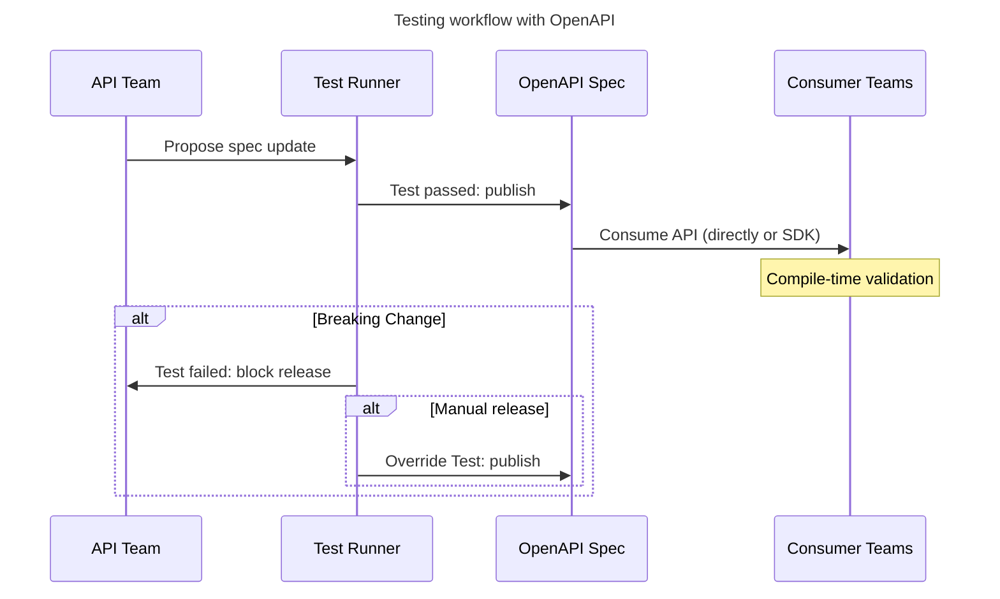

The promise of reliable, well-tested APIs shouldn't at the expense of developer productivity. Yet, that's precisely what many teams face when Pact, a consumer-driven approach to enterprise contract testing.

Pact's approach was born out of a worthy goal. Rigorous and comprehensive API contract testing is necessary, but Pact fell into a classic trap. The creators tried to create a new standard to solve 100% of the testing problem, instead of building on existing standards that already solved 80% of the issue: OpenAPI. The result was an extra 20% of value for at least 2x the cost (but typically much more).

In this article, we'll weigh up the costs and benefits of using Pact vs. OpenAPI for API contract testing.

TL;DR:

1. While Pact offers comprehensive contract testing, its implementation complexity and maintenance overhead often outweigh the benefits for most teams.

2. OpenAPI-based testing provides comparable reliability with significantly less overhead, especially when combined with Arazzo for workflow testing.

3. Teams serving external API consumers can benefit most from OpenAPI-based approaches, while Pact might still make sense for mission-critical dependencies within internal microservices architectures.

## The API testing challenge

Well-tested APIs are essential when building reliable systems. API integrations, sitting at the edges between systems, represent the ideal place to catch and prevent issues before they cascade into production problems. Getting testing right at these boundaries provides outsized returns on investment.

### Why API integration failures are so expensive

Bugs that originate with API requests typically propagate through multiple systems, making them extremely difficult to pinpoint and resolve.

This leads to rolled-back releases, large-scale outages, and years of wasted developer time. The most expensive loss may very well be developers' trust in your system.

To minimize the cost of API failures, teams employ various testing methodologies for their APIs. The most comprehensive test methodologies are usually the most complex. We need to ask whether adding more complexity to an already brittle integration may be pricier than simply supporting the bugs that arise.

### What teams want from tests

To be truly useful, API testing strategies should provide three key benefits:

1. Confidence that API changes will not break existing integrations.
2. Early detection of potential issues.
3. **Minimal maintenance overhead.**

Consumer-driven contract testing, as implemented with Pact, deliver on the first two points, but fails spectacularly at the third.

## Understanding Pact

Pact implements consumer-driven contract testing, where API consumers define their expectations in advance. These expectations form a contract that API providers must fulfill. While this approach sounds logical, its implementation can become surprisingly complex.



Let's break down what's happening:

### 1. Consumer teams write tests describing their API expectations

The consumer's teams must write specialized Pact tests in one of Pact's supported languages. These tests define expected request and response pairs.

Here's an example from [pact-js](https://github.com/pact-foundation/pact-js):

```javascript
import { PactV3, MatchersV3 } from '@pact-foundation/pact';

// Create a 'pact' between the two applications in the integration we are testing
const provider = new PactV3({
  dir: path.resolve(process.cwd(), 'pacts'),
  consumer: 'MyConsumer',
  provider: 'MyProvider',
});

// API Client that will fetch dogs from the Dog API 
// This is the target of our Pact test
public getMeDogs = (from: string): AxiosPromise => {
  return axios.request({
    baseURL: this.url,
    params: { from },
    headers: { Accept: 'application/json' },
    method: 'GET',
    url: '/dogs',
  });
};

const dogExample = { dog: 1 };
const EXPECTED_BODY = MatchersV3.eachLike(dogExample);

describe('GET /dogs', () => {
  it('returns an HTTP 200 and a list of dogs', () => {
    // Arrange: Setup our expected interactions
    //
    // We use Pact to mock out the backend API
    provider
      .given('I have a list of dogs')
      .uponReceiving('a request for all dogs with the builder pattern')
      .withRequest({
        method: 'GET',
        path: '/dogs',
        query: { from: 'today' },
        headers: { Accept: 'application/json' },
      })
      .willRespondWith({
        status: 200,
        headers: { 'Content-Type': 'application/json' },
        body: EXPECTED_BODY,
      });

    return provider.executeTest((mockserver) => {
      // Act: test our API client behaves correctly
      //
      // Note we configure the DogService API client dynamically to 
      // point to the mock service Pact created for us, instead of 
      // the real one
      dogService = new DogService(mockserver.url);
      const response = await dogService.getMeDogs('today')

      // Assert: check the result
      expect(response.data[0]).to.deep.eq(dogExample);
    });
  });
});
```

### 2. These tests generate a contract file

When the developer runs their tests locally or in a staging environment, Pact generates a contract file.

Contract files are JSON documents that describe the consumer's expected requests and responses. Each consumer generates their own contract. If your API has 100 consumers, you can expect 100 contract files to be generated by their teams.

### 3. The contract is published to a Pact Broker

As the provider, you need to maintain a service called a Pact Broker. This service versions, tags, and stores contracts. It sits between the consumer and the provider.

### 4. Provider teams verify their API against all consumer contracts

As part of the provider's CI/CD workflow, their API needs to verify against all consumer contracts in the Pact Broker.

Here's an example from [pact-js](https://github.com/pact-foundation/pact-js):

```javascript
const { Verifier } = require('@pact-foundation/pact');

// (1) Start provider locally. Be sure to stub out any external dependencies
server.listen(8081, () => {
  importData();
  console.log('Animal Profile Service listening on http://localhost:8081');
});

// (2) Verify that the provider meets all consumer expectations
describe('Pact Verification', () => {
  it('validates the expectations of Matching Service', () => {
    let token = 'INVALID TOKEN';

    return new Verifier({
      providerBaseUrl: 'http://localhost:8081', // <- location of your running provider
      pactUrls: [ path.resolve(process.cwd(), "./pacts/SomeConsumer-SomeProvider.json") ],
    })
      .verifyProvider()
      .then(() => {
        console.log('Pact Verification Complete!');
      });
  });
});
```

Each time the API is verified, the results are published back to the Pact Broker.

### 5. Failed verifications block provider deployments

This is where this process changes from complex to a developer time vortex. The provider and consumer teams now have to negotiate contract changes. Either the provider must fix their API, or consumers need to update their tests and publish new contracts. This process takes place for all failed verifications across all consumer contracts. Finally, the provider re-verifies the API and the cycle starts anew.

### Pact's direct costs

The Pact workflow above demonstrates why implementing Pact is often so complex:

- **Setup complexity**: The initial implementation of Pact is a significant undertaking for any team size. It requires standing up new tools, and the orchestration of CI/CD pipelines.
- **Coordination overhead**: The burden of testing lies with API consumers, but the maintenance and synchronization of contracts depends on the provider. This coordination requires meetings, training, and ongoing maintenance.
- **Learning curve**: Pact requires specialized knowledge on both the consumer and provider's side.
- **Misaligned incentives**: Pact separates the responsibility for the contract, from the responsibility of maintaining the service. It's hard to motivate the consumer teams to keep on top of maintaining Pact definitions when the services they are consuming are at the periphery of their day-to-day work. Out of sight, out of mind.
- **Duplication**: Each consumer team has to maintain their own Pact tests with overlap between teams likely.

In almost every case, OpenAPI offers comparable benefits without these costs.

But before we dive into OpenAPI, let's take a look at where Pact **does** shine.

### Where Pact shines

Large organizations with a multitude of internal microservices and strong inter-team communication channels may be able to make Pact work, regardless of the complexity and cost. Pact's high degree of assurance can also provide the confidence required to release updates to truly mission-critical services, where failures would be catastrophic. In that case, the cost of failure far outweighs the maintenance cost of Pact tests and workflows.

The decision to use Pact should be based on potential costs of API failures versus the ever-increasing complexity of maintaining Pact tests.

Now, let's take a look at OpenAPI as an alternative.

## The OpenAPI ecosystem approach

While Pact focuses on consumer-driven contracts, OpenAPI is effectively the reverse: a provider-driven API spec that guarantees a contract to the consumer. This approach aligns the responsibility for the contract with the responsibility of maintaining the service.



### Benefits of using OpenAPI for contract testing

The OpenAPI approach offers several benefits over Pact:

1. **Reduced setup complexity**: OpenAPI specifications are easier to write and maintain than Pact tests. They can also be generated automatically from some API frameworks. Most orgs already have an OpenAPI specification for their API, so their is no setup cost.
2. **Little to no coordination needed between teams**: Since the API team owns the OpenAPI specification, consumers use the API as documented. There's no need for separate contracts or negotiation between teams.
3. **No duplication**: There is a single OpenAPI specification for every consumer. There's no need for per-team contracts.
4. **Early detection**: You can test changes to your API before writing code. You simply propose a change to the OpenAPI specification, and run your tests.


### Limitations of using OpenAPI for contract testing

OpenAPI is not specifically designed for contract testing. It's a specification for describing your API, and as such, it's not as comprehensive as Pact.

1. **Coverage scope**: OpenAPI-based testing is best suited for testing the API's contract and functionality. Natively, it may not catch all integration issues, especially those that involve multiple APIs or complex business logic. (More on this in the next section.)

2. **Specification maintenance**: OpenAPI specifications must be kept up-to-date with the API's actual behavior. If the specification falls out of sync with the API, consumers may encounter unexpected behavior. However, this is a common problem with any API testing strategy.

3. **Theoretical vs. actual**: In some ways, an OpenAPI spec is a theoretical contract. It describes all the ways the API can be used, but doesn't describe how the API is actually used in practice. This can lead to false positives in your tests. There may be a breaking change in the API, but in actual practice, no consumer is not using the API in that way.

## Future considerations

[Arazzo](/openapi/arazzo) is a recently published workflow specification that enables developers to describe complex workflows that involve multiple APIs. By combining OpenAPI-based testing with Arazzo, teams can [test end-to-end scenarios that span multiple APIs](/post/e2e-testing-arazzo), ensuring that their integrations work as expected.

### How Arazzo workflows enhance API testing

1. **End-to-end testing**: Arazzo workflows describe complex interactions between multiple APIs, enabling teams to test entire user journeys from start to finish.

2. **Scenario-based testing**: Workflows can describe different scenarios that users might encounter, such as error conditions, edge cases, or performance bottlenecks.

3. **Automated testing**: Workflows can be executed automatically as part of your CI/CD pipeline, ensuring that your integrations work as expected before they reach production.

4. **Improved developer experience**: By describing workflows in a human-readable format, Arazzo makes it easy for developers to understand and contribute to your testing efforts.

We foresee a future where teams combine OpenAPI-based testing with Arazzo workflows to create comprehensive, reliable, and maintainable API tests that catch integration issues early and often.

## Making the decision

When deciding between Pact and OpenAPI-based testing, consider the following factors:

1. **Team structure**
   - Teams with mission-critical internal dependencies might prefer Pact.
   - Smaller or more distributed teams could benefit more from OpenAPI's reduced complexity.

2. **Consumer profile**
   - If your APIs have many external consumers, OpenAPI is the better choice as it provides a single contract for every consumer.
   - APIs with few but tightly coupled internal consumers might justify Pact's effort for higher assurance.

3. **Resource availability**
   - Teams with limited resources may find OpenAPI more manageable due to lower overhead and maintenance.
   - Pact may require dedicated resources for broker management and contract maintenance.

4. **API complexity**
   - Straightforward APIs with straightforward interactions may not need the advanced features of Pact; OpenAPI suffices.
   - Complex APIs with functionality that lives outside the spec may still benefit from Pact's guarantees.

The choice between Pact and OpenAPI should align with your team's structure, goals, and resources. By understanding the trade-offs, you can make an informed decision that best suits your API strategies.

## Key differences between Pact and OpenAPI

- **Pact**: Offers thorough contract testing with a heavy emphasis on consumer-driven contracts but involves significant setup and maintenance complexity.
- **OpenAPI**: Provides a single contract for every consumer, and a single source of truth for your API. It is lightweight to implement, and requires no additional setup at the cost of some comprehensiveness.

## How to try OpenAPI-based testing

Speakeasy offers a simple way to get started with OpenAPI-based testing:

1. Start by creating an OpenAPI specification for your API, or add examples to your existing specification.
2. Sign up for [Speakeasy's testing beta](/product/api-testing) to generate test suites from your OpenAPI specification.

That's all there is to it. With Speakeasy, you can start testing your API with generated SDKs and tests in minutes.

If you made it this far, you're clearly interested in improving your API testing strategy. We're on a mission to solve this problem, and we'd love to hear from you. [Join our Slack community](https://join.slack.com/t/speakeasy-dev/shared_invite/zt-1cwb3flxz-lS5SyZxAsF_3NOq5xc8Cjw) to share your thoughts, or to learn more about Speakeasy.
