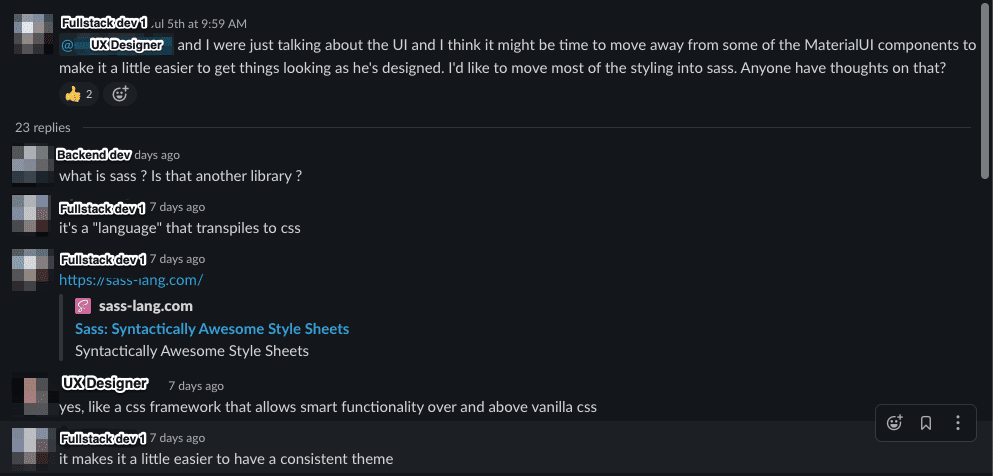
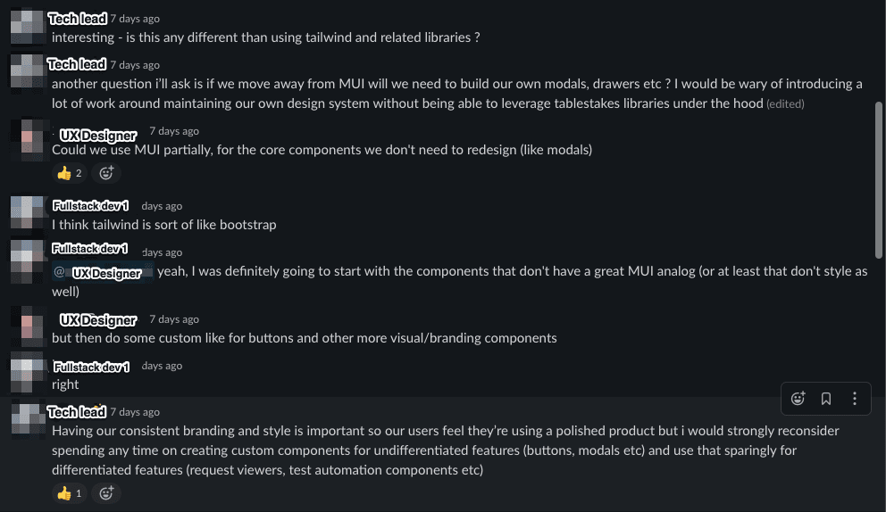

We are in the midst of building the first version of our API Ops platform. One of the components which we are actively building is a developer console where devs can get an overview of their APIs and each endpoint’s performance. While building our UI, we are debating many of the fundamental front end architecture decisions that will shape our UI development. One of the biggest debates thus far was whether we would use SASS or CSS-In-JS for our styling.

We know developers are facing these same questions every day, so we want to publish our thoughts in case they are useful to anyone else. Ultimately, we chose to move forward with CSS-In-JS as our primary styling mechanism for reasons specific to our business; we considered it important for the UIs we build to be easily embeddable within external UIs. We felt that CSS-In-JS was the best option for embeds, because integrators wouldn’t need to worry about dealing with style injection, and could theme our components into their style.

We’d love to know your thoughts and how you reached decisions about styling your UI? Have you had any bad experiences with CSS-In-JS?

Below is our full internal conversation only minimillaly edited for brevity:

If you’re interested in learning more about [what we're building](https://www.speakeasy.com/), please reach out!

—

Transcript of Convo for accessibility purposes :)

**Fullstack dev 1** \>

@UX Designer and I were just talking about the UI and I think it might be time to move away from some of the MaterialUI components to make it a little easier to get things looking as he's designed. I'd like to move most of the styling into sass. Anyone have thoughts on that?

**dev** \>

what is sass ? Is that another library ?

**Fullstack dev 1** \>

it's a "language" that transpiles to css:

[https://sass-lang.com/](https://sass-lang.com/)

**UX Designer** \>

yes, like a css framework that allows smart functionality over and above vanilla css

**Fullstack dev 1** \>

it makes it a little easier to have a consistent theme

**Tech Lead** \>

interesting - is this any different than using tailwind and related libraries ?

**Tech Lead** \>

another question i’ll ask is if we move away from MUI will we need to build our own modals, drawers etc ? I would be wary of introducing a lot of work around maintaining our own design system without being able to leverage tablestakes libraries under the hood (edited)

**UX Designer** \>

Could we use MUI partially, for the core components we don't need to redesign (like modals)

**Fullstack dev 1** \>

I think tailwind is sort of like bootstrap

**Fullstack dev 1** \>

[@](https://speakeasyapi.slack.com/team/U03MPFYRQ6M)UX Designer yeah, I was definitely going to start with the components that don't have a great MUI analog (or at least that don't style as well)

**UX Designer** \>

but then do some custom like for buttons and other more visual/branding components

**Fullstack dev 1** \>

right

**Tech Lead** \>

Having our consistent branding and style is important so our users feel they’re using a polished product but i would strongly reconsider spending any time on creating custom components for undifferentiated features (buttons, modals etc) and use that sparingly for differentiated features (request viewers, test automation components etc)

**Fullstack dev 2** \>

IMO Material UI / SASS are totally interoperable. Material UI is good in that it's a sensible set of defaults, but for anything designed it can be just ignored, or themed to match. Similarly if the styling is via SASS via \[styled-components, MUI/Emotion, tailwind classes\] it doesn't matter too much: it's just CSS at the end of the day.

I have biases against globally-running CSS rules, because it's slightly harder to maintain (as they start to overwrite each other): but that just depends on how SASS is compiled/injected into the components.

On a more general level, I personally have biases towards adjusting design to fit a standard component library rather than be more custom in each view. E.g. I'd rather we style MaterialUI, rather than do our own custom CSS, just because it's faster and easier to mutate in future.

**Fullstack dev 1** \>

ok

**Tech Lead** \>

i think the idea of using SASS is a good one but i think we should probably revisit the option every few weeks. Still feels premature to maintain our own components until we find a novel ux interaction that standard components don’t support

**UX Designer** \>

ok so the implications of this is that some of the styling in the UI may not reflect identically what we see in the live UI, but it will be minimal and inconsequential

**UX Designer** \>

As long as branding colors and fonts are custom (which they are in MUI), we should be largely ok

**Tech Lead** \>

Sounds good, thanks raising this Fullstack dev 1 and UX designer. Lets pushing MUI as long as possible here to reduce our maintenance burden.

**Tech Lead** \>

@**Fullstack dev 1,** @**Fullstack dev 2** I was thinking about this from another angle - it seems like if we have a Master CSS style sheet there is some value in using SASS right now (mostly from a developer productivity point of view). If we use styled components i see that value going down.

The other thing to think about is we do have downstream in the product roadmap the need to inject parts of our developer dashboard (as iframe or embeds) into company’s own dashboards. It seems like going the way of styled components would keep the door open for that. Curious to hear you thoughts

**Fullstack dev 2** \>

IMO:

1. If we leave CSS-In-JS and go down the route of a Global CSS style sheet (e.g. via SASS), I’m not convinced we gain any short-term developer productivity benefit. The only time I’d personally recommend this nowadays is when we have CSS-only developers, who do not want to touch JS. My experience is that this gain still would often lose to other complexities better-handled in a CSS-In-JS approach in the medium-term \[0\] \[1\].

2. If we go down any of the CSS-In-JS routes (e.g. styled-components, mui/emotion), we will be easier to embed, as the developer embedding us will not need to think about style injection. Currently we use emotion (as MUI wraps it): [https://emotion.sh/docs/introduction](https://emotion.sh/docs/introduction) . Emotion is essentially a more modern version of styled-components: it provides a superset of features, and is a bit faster \[2\].

3. If we continue down a MUI-theme route, we become easier to re-style in one place. E.g. we could more easily be styled in customer colours. Similarly implementing dark mode is trivial, if we want that.

\[0\] I personally have a little Trauma from giant ball-of-mud global CSS stylesheets implementations. In a couple 2-year length projects we went down this route, but gradually spent more-and-more time hunting down bugs caused by CSS overriding each other all over the app. In each project, there were several “CSS refactor” mega-epics to try to trim the mud into something sensible. They always failed, and were very time-expensive. I don’t think this is the suggestion, but wanted to state my opinion and validate consensus that we should rule this out.

\[1\] An alternative that is closer to CSS is CSS Modules (which can be powered via SASS). I’ve also used this on one major project. I had no negative experience, but features which required dynamically adjusting theme (e.g. implementing dark mode) were expensive to implement, and so we never bothered. For a devtools project I think theme adjustment (either by adding dark mode, or by allowing a customer to theme us on an embed) is probably important. Hence would rather go with a pure CSS-In-JS solution.

\[2\] Of the CSS-In-JS libraries, I just picked emotion as it’s IMO the most modern of them, and it’s also the MUI default. The API to all of them is effectively the same. No strong opinions here. (edited)
