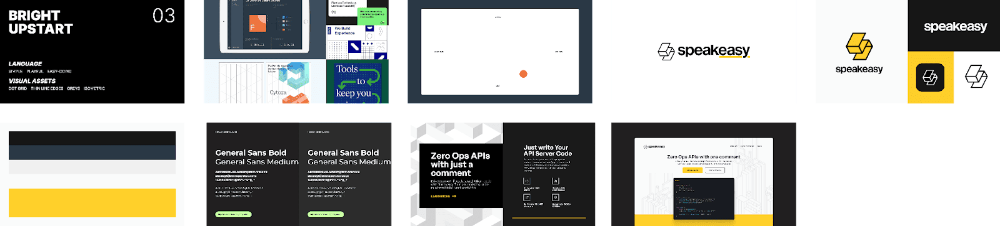
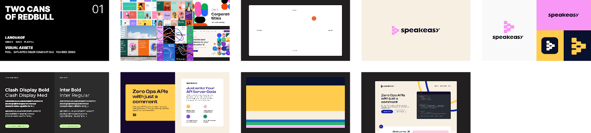
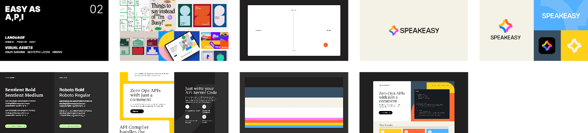
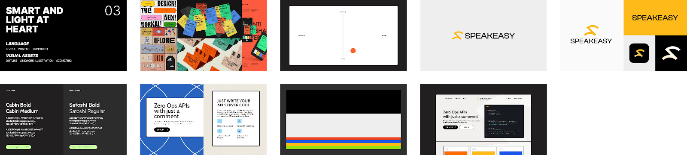
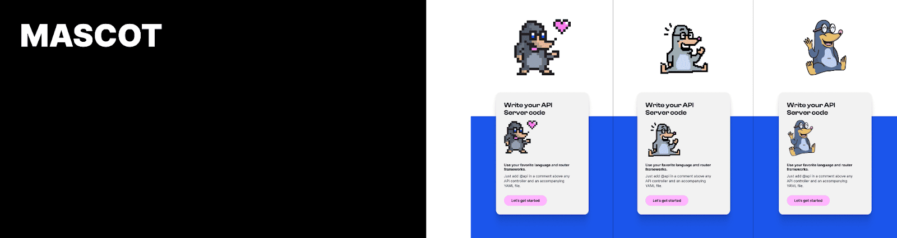
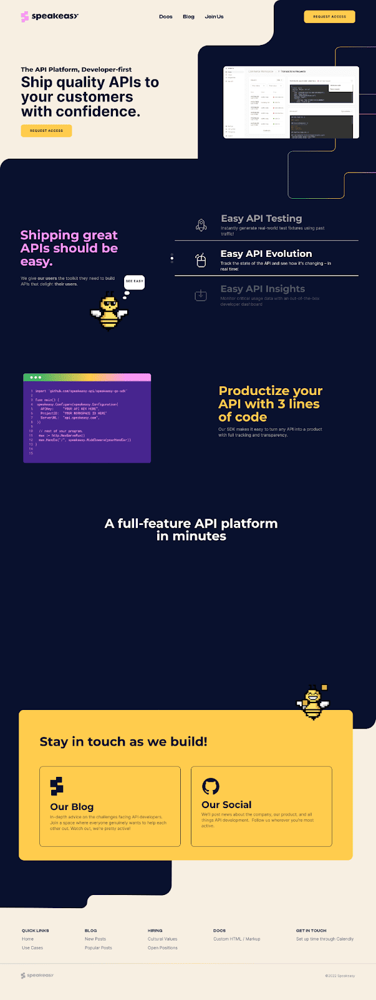

_All the branding work for Speakeasy was done in partnership with our design partners,_ [_Catalog_](https://www.trycatalog.com/).

Last week we rolled out some new branding for the company, replacing the hand-rolled branding which had previously been cobbled together by a team in which two of the three members were colorblind; it represents a massive improvement.

How companies arrive at their branding is typically opaque to those outside the company (and often to some people within it!).  Prior to this exercise, nobody on our team had participated in a proper 0-1 branding exercise. Before we started, we weren’t able to identify many useful resources to help shape our expectations of what would be involved. That’s why we wanted to share our own process; hopefully it gives people a window-in and provides the reference point we wished we’d had.

## What we were looking for

Our design needs had three different aspects to it: Look & feel (color scheme, font, design elements, etc), logo, and mascot.  The need for look & feel, and a logo are pretty self explanatory, but the desire for a mascot does require a brief explanation.

We want Speakeasy to make API development a joyful activity. We believed that adding a mascot to serve as a companion for the journey through the product was something that could help bring delight to an otherwise utilitarian task. This is perhaps controversial, those old enough will still remember Clippy’s incessant and obtrusive bouncing.  But we think that, used sparingly and appropriately, a mascot can help bring personality to a user’s interactions with a new tool.

## Step 1: Defining our values for the design team

Before the designers started, we needed to articulate what values were most important to our company, so they could be central to the design process.  During a couple of 1-hr sessions we focused on what is most important to our users, and therefore most important to us.

We’re building the developer-first [API platform](/post/why-an-api-platform-is-important/); we make it easy for developers to ship quality APIs to their customers with confidence.  For developers, confidence in tooling comes from **transparency,** and **reliability**. No snake oil, black boxes, or downtime. Our platform is **honest** with our users, and **consistent** in its execution.

As previously mentioned, we also believe that dev-first means building tools that are joyful for developers to use.  Too often, developer tooling means a product with a densely-technical website, a cryptic set of instructions, and no UX to speak of. Whatever we build, we want it to be **approachable** for users, and give them a **direct** path to unlocking value.

These words: transparency, reliability, honest, consistent, approachable, direct were the ones we handed to our designers after our internal discussions. We then turned them loose to see what they could come up with.

## Iteration 1: Casting a wide net

Our designers came back to us with four very different design styles for us to look through and give feedback on. The whole team individually recorded thoughts, before we collectively discussed to provide condensed feedback.  

The main takeaway that emerged from the first iteration was that it was tricky to balance approachability with reliability. How do you project openness and friendliness without appearing too flippant? Designs #1 and #4, we thought both did a good job of projecting approachability, but struggled to project reliability.  Meanwhile, Design #3 did the best job at projecting reliability, but wasn’t as friendly or approachable.  However, we felt sure that our future look & feel lay somewhere in the intersection of the three.

In terms of logos, there was a strong preference for the logo designs in #1 and #3.  We did not want to have our mascot also serve as our logo. We felt that doing so would make them a static favicon, thus robbing them of the opportunity to have a personality.

For iteration #2, we asked our designers to further refine the look & feel of the three options we had identified as having promise, with an eye towards cohesively integrating approachability and reliability. We also wanted to get more logo options, and begin to think about how our mascot could sit comfortably within the larger branding.

## Iteration 2: Committing to a Look & Feel

From the options we received, we were determined to select a single option to move forward with. We were therefore at a critical point in the branding cycle.  We decided to get opinions from the developer community.  We created a feedback survey which we sent out to all the developers who were signed up to trial our product to see what they thought.

This feedback exercise was a great example of why it’s important to get quantitative and qualitative feedback.  We asked people to score each of the designs, then rank the three, and finally provide written commentary about each design: how would they describe each design? What words came to mind?

Designs #1 (two cans of red bull) and #2 (Easy as A,P,I) scored significantly higher than design #3 (Smart and light at heart) with an edge going to design #2.  However, when we read through the responses, there was a much clearer alignment between design #1 and our team values.  Users responded with words like, “clean”, “reliable”, “to the point”, “approachable”.  

As for #2, people said it was professional, but they also said it, “popped”, was “bold” and “saturated”, reminded them of “Warby Parker”, or “modern 70s design”.  None of these are negative descriptions! Sentiment was overwhelmingly positive. They rated it very highly, but we felt that in some ways the design obscured the messaging we wanted to deliver.

We therefore decided to go with design #1 as the basis for our look and feel. With that decided, we turned our attention to the logo and mascot.

## Iteration 2: Logo & Mascot

‍
Our user survey had also gathered feedback on the mascot and logo choices.  The 16-bit pixelated mascot style had an overwhelmingly positive response, especially among the developers we interviewed (Stardew Valley has clearly left an impression on the community).  

However this was slightly at odds with the most popular logo; #8 was a clear favorite.   We felt strongly about consistency in design style. If we had a pixelated mascot, then we wanted a pixelated logo (i.e. logos 1,2,3).  However we didn’t feel strongly about any of the logos presented, so we pushed our designers for some more options, specifically one with a more distinct ‘S’ shape as opposed to the stacked blocks motif.  

We also internally had a discussion about what animal best represented the company (Mr. Diggsworth the Mole was sadly destined to be a placeholder). We discussed which animals we felt were hard workers (something we all aspire to), and very quickly focused on the natural world’s best engineers: beavers, ants, and bees.  

After some back and forth, we landed on Beezy the Speakeasy bee. One of nature’s most common and cutest builders.  That they live in (api)aries was an added plus!  

With our look and feel & mascot both decided, we headed into another iteration to put it all together…

## Iteration 3: Bringing it all together

We were overjoyed with the iteration, and felt like the branding was now in a place where we were ready to begin to see things come to life on a live webpage. And in fact the branding that we have live on our website today isn’t very different from this design iteration.

While building the site, a few minor alterations to the design were made after seeing what it looked like on a live screen. We swapped pink and yellow in the color hierarchy (yellow to primary accent, pink to secondary accent), and added some dark blue to the otherwise plain background.  With that, we had the final design:

And that was that! That is the full story of how we arrived at the branding we are using today. If you’ve made it this far down the article, I hope it was interesting, and that you find it useful if you ever find yourself in the midst of a design exercise. I’m sure that with time our product will expand and we will want to make updates to our design. When we do, I’ll be sure to follow up with more notes on our process.
