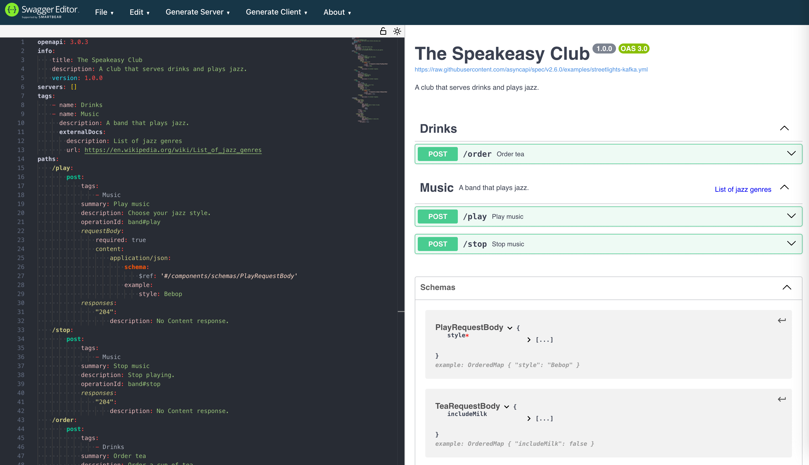

 
 

<div className="Callout" data-title="Announcing: OpenAPI Reference" data-variant="success">
Hi! These blog posts have been popular, so we've built an entire [OpenAPI Reference Guide](/openapi/) to answer any question you have.

It includes detailed information on [**tags**](/openapi/tags).

Happy Spec Writing!

</div>

## Introduction

This article explains how to use [tags in OpenAPI](https://spec.openapis.org/oas/latest.html#tag-object).

Tags are the way to organize your API endpoints into groups to make them easier for users to understand.

## Definitions

Every separate feature in your API that a customer can call is named an **endpoint**.

An endpoint is an **operation** (an HTTP method like GET or POST) applied to a **path** (for example, `/users`).

Below is an example endpoint in an OpenAPI schema. The path is `play`, and the operation is a POST.

```yaml
paths:
  /play:
    post:
      description: Choose your jazz style.
      operationId: band#play
```

In informal conversation, people often refer to API endpoints and operations as if the terms are interchangeable.

Paths are the natural way to categorize your endpoints. You might have separate paths in your API for products, purchases, or accounts. However, paths are hierarchical. Each endpoint can be in only one path. This may make it difficult for users of your API to browse to the feature they are looking for if they assume it's under a different path.

By contrast, each endpoint may have multiple tags, so may be shown in multiple groups in your schema documentation.

## Example Schema

To demonstrate using tags, let's make a simple schema for a jazz club API with just three paths:

- `/play` — plays music.
- `/stop` — stops music.
- `/order` — orders a drink.

<div className="ScrollyCoding" data-classname="ch-scrollycoding-full-height" data-fullheight>

### !!steps API Information

Start with some basic information about your API.

```yaml !
# !focus(1:6)
openapi: 3.0.3
info:
  title: The Speakeasy Club
  description: A club that serves drinks and plays jazz.
  version: 1.0.0
servers: []
```

---

### !!steps Simple Tag

Add the `tags` root-level object with a tag for drink operations.

Only the tag `name` is mandatory.

```yaml !
# !focus(7:13)
openapi: 3.0.3
info:
  title: The Speakeasy Club
  description: A club that serves drinks and plays jazz.
  version: 1.0.0
servers: []
tags:
  - name: Drinks
```

---

### !!steps Detailed Tag

Add another tag with more detail. The **Music** tag has a `description` string and an `externalDocs` object with two required fields: `description` and `url`.

The URL points to information anywhere on the web that you want to use to describe the endpoint. Use `externalDocs` if you don't want to overcrowd your schema with unnecessary detail or if another department in your company maintains the documentation separately.

```yaml !
# !focus(9:13)
openapi: 3.0.3
info:
  title: The Speakeasy Club
  description: A club that serves drinks and plays jazz.
  version: 1.0.0
servers: []
tags:
  - name: Drinks
  - name: Music
    description: A band that plays jazz.
    externalDocs:
      description: List of jazz genres
      url: https://en.wikipedia.org/wiki/List_of_jazz_genres
```

---

### !!steps Paths

Now that we have tag definitions, we can tag our endpoints.

Here the `/play` and `/stop` endpoints are tagged with `Music`, and the `/order` endpoint is tagged with `Drinks`.

We could also make another tag called `Front of house` and apply it to both endpoints to organize them separately to `Backstage` endpoints.

```yaml !
# !focus(17,18,35,36,45,46)
openapi: 3.0.3
info:
  title: The Speakeasy Club
  description: A club that serves drinks and plays jazz.
  version: 1.0.0
servers: []
tags:
  - name: Drinks
  - name: Music
    description: A band that plays jazz.
    externalDocs:
      description: List of jazz genres
      url: https://en.wikipedia.org/wiki/List_of_jazz_genres
paths:
  /play:
    post:
      tags:
        - Music
      summary: Play music
      description: Choose your jazz style.
      operationId: band#play
      requestBody:
        required: true
        content:
          application/json:
            schema:
              $ref: "#/components/schemas/PlayRequestBody"
            example:
              style: Bebop
      responses:
        "204":
          description: No Content response.
  /stop:
    post:
      tags:
        - Music
      summary: Stop music
      description: Stop playing.
      operationId: band#stop
      responses:
        "204":
          description: No Content response.
  /order:
    post:
      tags:
        - Drinks
      summary: Order tea
      description: Order a cup of tea.
      operationId: order#tea
      requestBody:
        required: true
        content:
          application/json:
            schema:
              $ref: "#/components/schemas/TeaRequestBody"
            example:
              includeMilk: false
      responses:
        "204":
          description: No Content response.
```

</div>

## The Full Schema Example

Below is the full example schema with `components` added to specify how to call the endpoints.

Paste the code into the [Swagger editor](https://editor.swagger.io/) to see it displayed as a formatted document. Note that operations in the Swagger output are grouped by `tag`.

```yaml
openapi: 3.0.3
info:
  title: The Speakeasy Club
  description: A club that serves drinks and plays jazz.
  version: 1.0.0
servers: []
tags:
  - name: Drinks
  - name: Music
    description: A band that plays jazz.
    externalDocs:
      description: List of jazz genres
      url: https://en.wikipedia.org/wiki/List_of_jazz_genres
paths:
  /play:
    post:
      tags:
        - Music
      summary: Play music
      description: Choose your jazz style.
      operationId: band#play
      requestBody:
        required: true
        content:
          application/json:
            schema:
              $ref: "#/components/schemas/PlayRequestBody"
            example:
              style: Bebop
      responses:
        "204":
          description: No Content response.
  /stop:
    post:
      tags:
        - Music
      summary: Stop music
      description: Stop playing.
      operationId: band#stop
      responses:
        "204":
          description: No Content response.
  /order:
    post:
      tags:
        - Drinks
      summary: Order tea
      description: Order a cup of tea.
      operationId: order#tea
      requestBody:
        required: true
        content:
          application/json:
            schema:
              $ref: "#/components/schemas/TeaRequestBody"
            example:
              includeMilk: false
      responses:
        "204":
          description: No Content response.
components:
  schemas:
    PlayRequestBody:
      type: object
      properties:
        style:
          type: string
          description: Style of music to play
          example: Bebop
          enum:
            - Bebop
            - Swing
      example:
        style: Bebop
      required:
        - style
    TeaRequestBody:
      type: object
      properties:
        includeMilk:
          type: boolean
          description: Whether to have milk.
          example: true
      example:
        includeMilk: false
```

Below is what it looks like in the editor.



## Tags in Speakeasy

Speakeasy will split the SDKs and documentation it generates based on your tags.

You can add the [x-speakeasy-group](/docs/customize-sdks/namespaces#define-namespaces-without-tags) field to an endpoint to tell Speakeasy to ignore the endpoint's tag and group it under the custom group instead.

## Conclusion

That's everything you need to know about tags in OpenAPI.

There are just three more tag rules you might want to know:

- Tags are optional, both at the root level and on endpoints.
- Tags must have unique names in your schema.
- The tag `description` may use [CommonMark syntax](https://spec.commonmark.org/).
