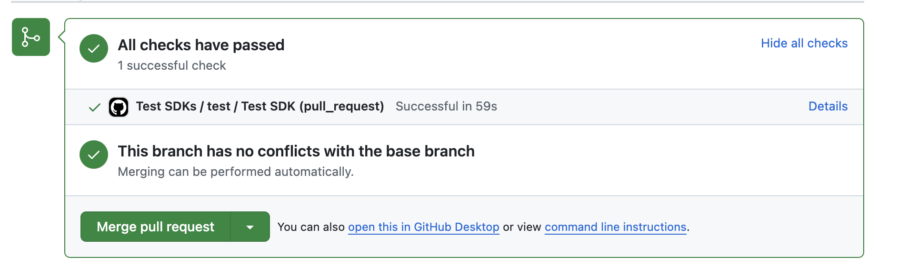
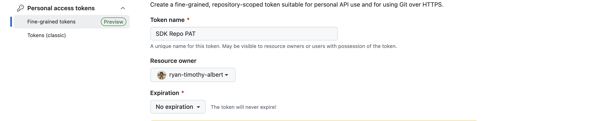
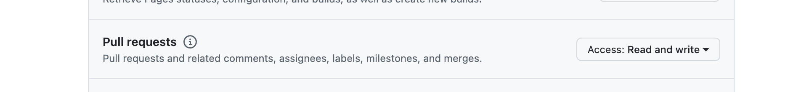
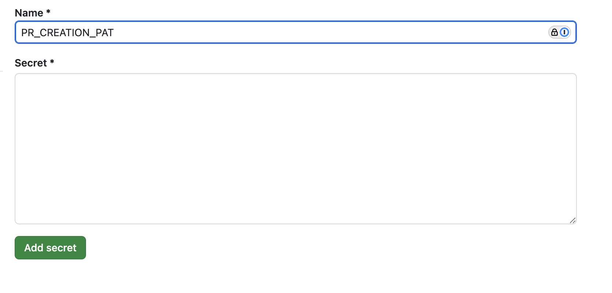

import { Callout } from '~/components';

# Testing in GitHub Actions

Automatically run Speakeasy tests on SDK pull requests or other events in a GitHub repository via GitHub Actions.

<Screenshot
  darkened
  url="github.com"
>
  
</Screenshot>


## Setting up a Github Actions Check

This requires you to have previously completed the [Github Setup](/docs/manage/github-setup).
Assuming that has been completed navigate to your SDK repository and run the following command:

```bash
# It's okay to run this command multiple times if you have already configured tests locally
speakeasy configure tests
```


This will produce a Github Actions workflow like the following that allows you to run SDK tests as a Github check on your Pull Requests.

```yaml
name: Test SDKs
permissions:
  checks: write
  contents: write
  pull-requests: write
  statuses: write

on:
  workflow_dispatch:
    inputs:
      target:
        description: Specific target to test
        type: string
  pull_request:
    paths:
      - '**'
    branches:
      - main
jobs:
  test:
    uses: speakeasy-api/sdk-generation-action/.github/workflows/sdk-test.yaml@v15
    with:
      target: ${{ github.event.inputs.target }}
    secrets:
      github_access_token: ${{ secrets.GITHUB_TOKEN }}
      speakeasy_api_key: ${{ secrets.SPEAKEASY_API_KEY }}
```


## Ensuring Tests Run on Automated PR Creation

<Callout title="Warning" variant="warning">

  Pull requests created by the action using the default GITHUB_TOKEN cannot trigger other workflows. 
  When you have on: pull_request or on: push workflows acting as checks on pull requests, they will not run by default.

</Callout>

To ensure that your testing checks run by default when an SDK PR is created you must implement one of the following options.

### Installing the Speakeasy Github App

If you install the Speakeasy Github App and give the App access to your SDK repository, the app will be able to trigger testing runs after a PR is created.
To install the app visit this [link](https://github.com/apps/speakeasy-github) or following instructions in the CLI or dashboard.

### Setting up your own Github PAT

If you choose not to install the Github App, another option is to create your own Github Personal Access Token (PAT) that will be used to create PRs in your SDK repository.
This is a workaround [recommended](https://docs.github.com/en/actions/writing-workflows/choosing-when-your-workflow-runs/triggering-a-workflow#triggering-a-workflow-from-a-workflow) by Github.

1. Create your [fine-grained](https://docs.github.com/en/authentication/keeping-your-account-and-data-secure/managing-your-personal-access-tokens#creating-a-fine-grained-personal-access-token) PAT with `Pull requests Read/Write` permissions. Make sure it at least has access to your SDK repository. We also recommend setting this to no expiration.

<Screenshot
  darkened
  url="github.com"
>
  
</Screenshot>

<Screenshot
  darkened
  url="github.com"
>
  
</Screenshot>

<Screenshot
  darkened
  url="github.com"
>
  
</Screenshot>

2. In all of your SDK repositories navigate to `Settings > Secrets and variables > Actions` and save your PAT as a Repository secret under the name `PR_CREATION_PAT`.

<Screenshot
  darkened
  url="github.com"
>
  
</Screenshot>

3. In all of your for sdk_generation.yaml workflows add the `pr-creation-token` as a provided secret at the bottom.

```yaml
# !focus(4)
secrets:
  github_access_token: ${{ secrets.GITHUB_TOKEN }}
  speakeasy_api_key: ${{ secrets.SPEAKEASY_API_KEY }}
  pr_creation_pat: ${{ secrets.PR_CREATION_PAT }}
```

## Running in Direct mode

If your generation action is running in `direct` mode where SDK updates get immediately pushed to main, testing will run as part of the generation action.
If tests fail, the generation action will fail and not push your SDK changes to main.