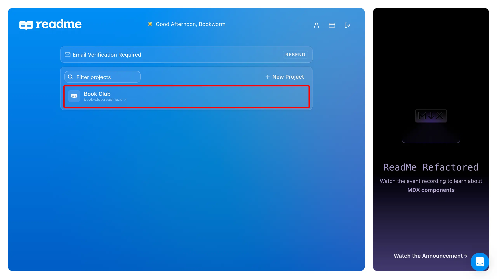

# Integrate Speakeasy With ReadMe

---

## Overview

Auto-generated code snippets from Speakeasy SDKs can be integrated directly into
a ReadMe documentation site.

<div className="Screenshot" url="docs.myapi.com" data-docs>
  
</div>

## Setting up the Integration

### Prerequisites

<div className="Callout" data-title="IMPORTANT" data-variant="warning">
  Before continuing with this guide, ensure that the following prerequisites
  have been met:
  <br />
  <ul className="list-disc pl-5">
    <li className="marker:content-['✓__']">
      {"An "}
      <a href="/docs/code-samples/automated-code-sample-urls">
        {"Automated Code Sample URL"}
      </a>
      {" has been configured for the desired Speakeasy SDK, and"}
    </li>
    <li className="marker:content-['✓__']">
      {"A "}
      <a href="https://docs.readme.com/main/docs/quickstart-guide#step-1-creating-your-project">
        {"ReadMe project"}
      </a>
      {" has been created."}
    </li>
  </ul>
  Once those requirements have been met, proceed with the following steps.
</div>

### Configure `workflow.yaml` for ReadMe

To display code samples generated by Speakeasy SDKs in ReadMe, you must update
the `workflow.yaml` configuration file to support their proprietary OpenAPI
extension.

Simply change the `codeSamples.style` field for your desired target in the
`workflow.yaml` file to `readme`:

```yaml /.speakeasy/workflow.yaml
targets:
  my-target:
    target: typescript
    codeSamples:
      # !mark(1:2)
      style: readme
      langOverride: javascript # see note below
      registry:
        location: registry.speakeasyapi.dev/...
      blocking: false
    ...
```

<div className="Callout" data-title="Note for Typescript">
  If the `target` value is set to `typescript`, the `langOverride` field must be
  set to `javascript`, or else generated code samples will _not_ be displayed in
  ReadMe.
  {` `}
  If `target` is _not_ set to `typescript`, then `langOverride` should be set to
  `auto-detect`.
</div>

### Locate & Copy the Combined Spec URL


### Upload the Combined Spec URL to ReadMe

Next, from the [ReadMe dashboard](https://dash.readme.com), open a project.

<div className="Screenshot" url="dash.readme.com" data-docs>
  
</div>

Click on the **API Reference** tab, then click **&plus; New API Definition**.

<div className="Screenshot" url="myapi.readme.io" data-docs>
  
</div>

In the form that appears, paste the copied URL into the text input below
**Import from URL**, then click **Import**.

<div className="Screenshot" url="myapi.readme.io" data-docs>
  
</div>

## What Next?

After completing these steps, Speakeasy-generated code snippets are viewable in
the ReadMe project's API Reference section. For guidance on customizing ReadMe
API References generated from OpenAPI specifications, refer to the [ReadMe
OpenAPI Support Documentation](https://docs.readme.com/main/docs/openapi).
