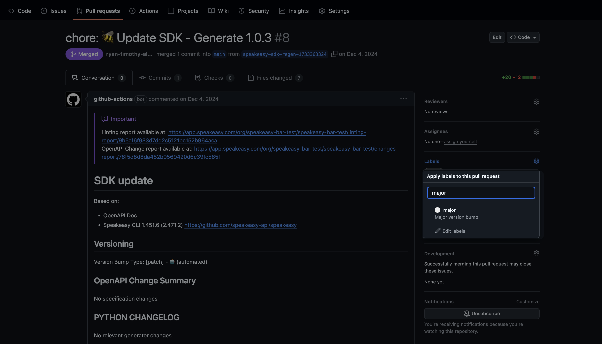
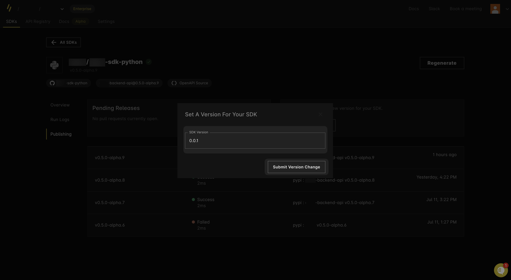

import { Callout } from "~/components";

# SDK versioning

Speakeasy-generated SDKs are automatically versioned using Semantic Versioning ([SemVer](https://semver.org/)). With each new generation, the SDK version is bumped up.

## Versioning logic

The SDK version will be automatically incremented in the following cases. 

### Generator version changes

When Speakeasy releases a new generator version, it compares the features changed in the new generator to those used in the SDK:

- If multiple used features in the SDK change, the largest version bump (major, minor, patch) across all used features determines the version increment.
- Features unaffected by the new generator version maintain the current version.

### Configuration changes

- Changes to the `gen.yaml` file will bump the patch version.
- Changes to the checksum will also bump the patch version.

### OpenAPI document changes

- If the `info.version` section of your OpenAPI document is SemVer compliant, major or minor changes to the OpenAPI document will bump the major or minor version of SDKs correspondingly.
- *Coming Soon*: Speakeasy will detect changes to the OpenAPI document (for example, adding a breaking change to the parameters of an operation) and bump versions accordingly.

## Pre-release version bumps

Speakeasy supports any SemVer-compatible string as a valid version, including pre-release versions such as `X.X.X-alpha` or `X.X.X-alpha.X`.

- Pre-release versioning continues until manual removal.
- Automated bumps increment pre-release versions. For example, `1.0.0-alpha`, `1.0.0-alpha.1`, `1.0.0-alpha.2`.
- To exit pre-release versioning, set a new version or run `speakeasy bump graduate`.

## Major version bumps

New SDKs start at version `0.0.1`. Automatic major version bumps begin after reaching version `1.0.0`. Breaking changes trigger major version increments after `1.0.0`.

Major version changes affect the Golang SDK migration path.

### Golang major version bumps

Golang module versions above `1.0.0` require import path changes to include the major version. For example:

- Version `1.2.3`: `github.com/speakeasy/speakeasy-go`
- Version `2.0.0`: `github.com/speakeasy/speakeasy-go/v2`

Consider Golang SDK major version changes carefully due to migration path impacts. The SDK maintainer determines when to increment major versions.

## Manual version bumps

Speakeasy supports manual control of SDK versioning via the CLI and the dashboard.

### Via the CLI

To override the automatic versioning logic for the next generation, set the `version` field in the `gen.yaml` file.

- The Speakeasy generator detects manual version settings when the `releaseVersion` field in the `gen.lock` file differs from the `version` field in the `gen.yaml` file.
- Automatic versioning will resume when the version values in both files match.
- Use the Speakeasy CLI `bump` command to set the SDK version without manually editing the `gen.yaml` file.

### Via GitHub UI

Speakeasy supports label-based versioning via GitHub pull request (PR) UI:

1. Automated version detection: The system analyzes changes and suggests the appropriate semantic version bump. The generated PR displays a suggested version label: `major`, `minor`, or `patch`. A `pre-release` label is added for pre-release versions.

2. Manual override option: Override the suggestion by removing the current label and adding a `major`, `minor`, or `patch` label to the PR. Use the bump type `graduate` to move out of pre-release stage. The SDK version updates automatically on the next generation and persists across regenerations until changed.

<Screenshot darkened url="https://github.com/speakeasy-sdks/bar-python/pull/8">

</Screenshot>

3. Immediate generation: Label-based versioning is active in all SDK generation workflows. To automate generation immediately after label addition, add the following action trigger to the GitHub workflow file (typically at `.github/workflows/sdk_generation.yaml`):

```yaml
# !focus(7,21:22)
name: Generate
permissions:
    checks: write
    contents: write
    pull-requests: write
    statuses: write
"on":
    workflow_dispatch:
        inputs:
            force:
                description: Force generation of SDKs
                type: boolean
                default: false
            push_code_samples_only:
                description: Force push only code samples from SDK generation
                type: boolean
                default: false
            set_version:
                description: optionally set a specific SDK version
                type: string
    pull_request:
        types: [labeled]
    schedule:
        - cron: 0 0 * * *
```

### Via the dashboard

To set a version manually in the Speakeasy dashboard:

1. Navigate to the **Publishing** tab and select **Set a New Version**.

<Screenshot darkened url="https://app.speakeasy.com/org/">

</Screenshot>

2. Enter the version following SemVer conventions. The dashboard validates and ensures no version override.

<Screenshot darkened url="https://app.speakeasy.com/org/">

</Screenshot>

3. Click **Submit Version Change** to apply.

