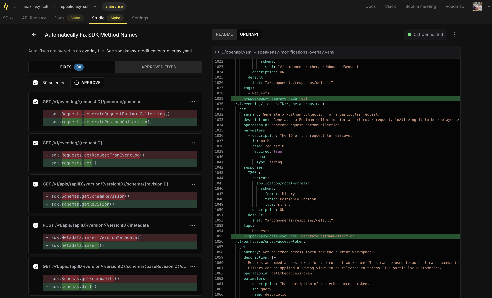
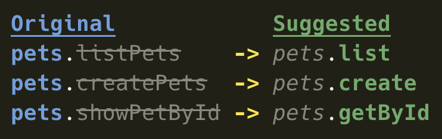
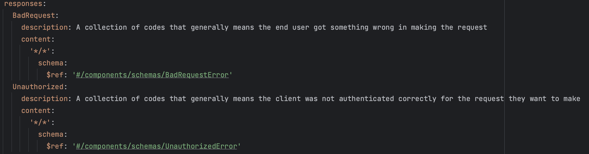
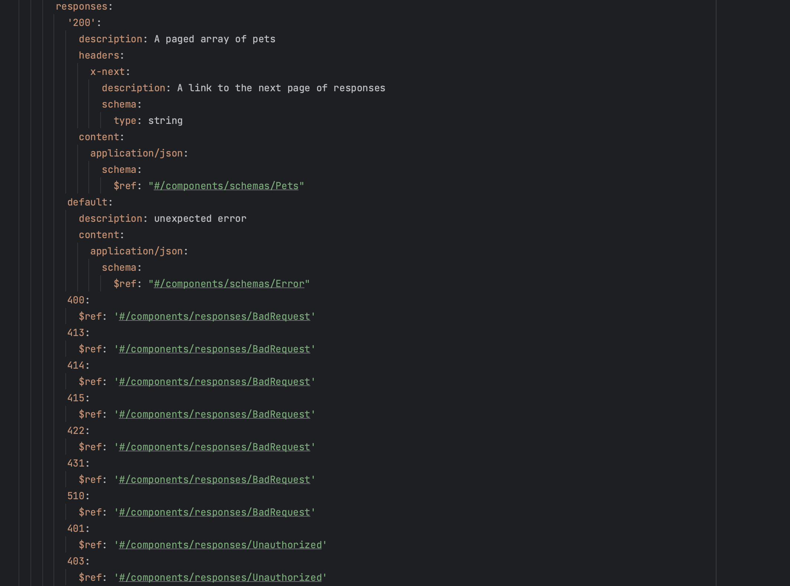

# Speakeasy Suggest

Maintaining an OpenAPI schema can be time-consuming, is influenced by the idiosyncrasies of the server-side frameworks
used to generate it, and directly affects downstream artifacts like documentation and SDKs. Speakeasy Suggest is an
AI-powered tool that helps you manage the nitty-gritty of creating a great OpenAPI document.

Speakeasy Suggest reduces the burden of perfecting your OpenAPI document by automatically suggesting improvements using
AI. It is the first of many AI-powered features we're developing to make spec maintenance easier.

# Auto-fix with the Speakeasy Studio UI

The easiest way to get automatic suggestions is through the Speakeasy Studio UI. The studio interacts with your local
OpenAPI document and helps you fix issues, manage overlays, regenerate SDKs, and more.

Navigate to the [Speakeasy UI](https://app.speakeasy.dev/) and log in. Go to the **Studio** tab and follow the
instructions there. Alternatively, run `speakeasy run --watch` from the root of your SDK repo to start the Studio UI.


## Refine SDK method names

By default, your SDK will use your OpenAPI operation IDs as method names, for example, `pets.getPet()`. However,
operation IDs must be globally unique, preventing your SDK from having a truly "RESTful" interface (`pets.get()`
and `users.get()` would require both operation IDs to be `get`). Speakeasy Suggest automatically adds Speakeasy-flavored extensions to your OpenAPI document to make your SDK's method names consistent, accurate, and idiomatic.

### Use the Studio UI

Follow the instructions above to open the Speakeasy Studio UI. Once there, click the **Improve Method Names** card to
see the suggested fixes. After a few seconds of generating the fixes, you'll see something like the following:



Review the suggested fixes, uncheck any you aren't ready to apply, and click **Apply** to apply the changes to your SDK. Under the hood, this will create
an [overlay file](https://www.speakeasy.com/docs/prep-openapi/overlays/create-overlays) and update your Speakeasy workflow to apply it. Future SDK generations will use the overlay to include the applied changes.

### Use the Speakeasy CLI

Use the [CLI](https://github.com/speakeasy-api/speakeasy) to instruct Speakeasy Suggest to improve operation IDs.

We'll run the following command to generate an example output:

```bash
speakeasy suggest operation-ids -s ~/Downloads/petstore.yaml -o ./updated-petstore.yaml --overlay=false
``` 

The command does the following:

- Provides the `~/Downloads/petstore.yaml` file path of the OpenAPI document to analyze and improve.
- Outputs the suggested fixes to the local file path `./updated-petstore.yaml`.
- Disables the `overlay` output to apply the suggestions to the entire spec in the output file.

Below is the output of the command:


## Refine SDK error handling

Your SDK's error handling interface is dictated by the granularity and accuracy of the response codes defined for each
operation in your OpenAPI document.
Updating every operation's responses can be tedious and error-prone. Speakeasy Suggest automatically adds common error
codes to your OpenAPI document and groups them into common categories, allowing your users to catch the type of error they care about. For example, `401`, `403`, `407`, and `511` will be
mapped to an `Unauthorized` error type in your SDK.

### Use the Speakeasy CLI

Use the [CLI](https://github.com/speakeasy-api/speakeasy) to instruct Speakeasy Suggest to improve error types.

We'll run the following command to generate an example output:

```bash
speakeasy suggest error-types -s ~/Downloads/petstore.yaml -o ./updated-petstore.yaml --overlay=false
``` 

The command does the following:

- Provides the `~/Downloads/petstore.yaml` file path of the OpenAPI document to analyze and improve.
- Outputs the suggested fixes to the local file path `./updated-petstore.yaml`.
- Disables the `overlay` output to apply the suggestions to the entire spec in the output file.

The document has been updated to include a few new error schemas, two of which are shown below:


Meanwhile, each operation has been updated to list the appropriate response codes and their corresponding error types:


Note that any codes already defined elsewhere in the document will be re-used. For example, if the `403` response code
is already defined with a `CustomUnauthorizedResponse` for one operation, it will be re-used for all operations, giving your users a consistent
experience regardless of the operation they are calling.

### Use the Studio UI

Error type suggestions are not yet available in the Studio UI.

## Disclaimer

AI-powered schema suggestions are still in beta. We strongly recommend you review suggested fixes before applying them
to your OpenAPI document.

We cannot guarantee the accuracy of fixes suggested by Speakeasy Suggest as we're still improving the AI model and
architecture. If you have any feedback, please
join [Speakeasy on Slack](https://join.slack.com/t/speakeasy-dev/shared_invite/zt-1df0lalk5-HCAlpcQiqPw8vGukQWhexw) and
let us know.
