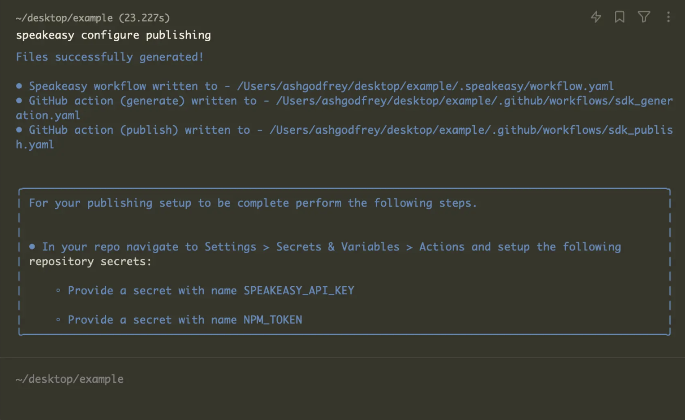

import { Callout, Screenshot } from '~/components'

# Publish SDKs

## Prerequisites

- The Speakeasy CLI
- Speakeasy generated SDKs
- Access tokens or credentials for target package managers

## Supported package managers

| Language   | Package Manager | Prerequisites                                                                                                                                                   | Notes                                                                                                          |
|------------|-----------------|-----------------------------------------------------------------------------------------------------------------------------------------------------------------|----------------------------------------------------------------------------------------------------------------|
| TypeScript | npm             | [Access tokens](https://docs.npmjs.com/creating-and-viewing-access-tokens)                                                                                        | Create an access token of type `Automation`.                                                                   |
| Python     | PyPI            | [API tokens](https://pypi.org/help/#apitoken)                                                                                                                     |                                                                                                                |
| Go         | GitHub          | [Repo visibility](https://docs.github.com/en/repositories/managing-your-repositorys-settings-and-features/managing-repository-settings/setting-repository-visibility) | For private repos, add the [Speakeasy app](https://github.com/marketplace/speakeasy-api).                      |
| Java       | Maven           | [Get started with Maven Central](https://central.sonatype.org/publish-ea/publish-ea-guide/) and [verify domain ownership](https://central.sonatype.org/faq/verify-ownership/) |                                                                                                                |
| PHP        | Packagist       | [See publishing packages](https://packagist.org/)                                                                                                                 | Monorepo setups not permitted.                                                                                 |
| C#         | NuGet           | [API key](https://learn.microsoft.com/en-us/nuget/nuget-org/publish-a-package#create-an-api-key)                                                                  |                                                                                                                |
| Terraform  | Terraform       | [GPG Key](https://developer.hashicorp.com/terraform/registry/providers/publishing#preparing-and-adding-a-signing-key)                                             |                                                                                                                |


## Naming packages

| Language   | Package Manager | Example Package          | Naming Conventions               |
|------------|-----------------|--------------------------|----------------------------------|
| TypeScript | npm             | @npm-org/package-name    | Lower case, hyphen separated     |
| Python     | PyPI            | package_name             | Lower case, underscore separated |
| Go         | GitHub          | github.com/org/repo-name | Lower case, hyphen separated     |
| Java       | Maven           | packageName              | Camel case                       |
| PHP        | Packagist       | org/package-name         | Lower case, hyphen separated     |
| C#         | NuGet           | PackageName              | Pascal case, period separated    |
| Terraform  | Terraform       | terraform-provider-name  | Lower case, hyphen separated     |

<div className="Callout" data-title="TIP" data-variant="success">
For global package managers like PyPI and Maven, ensure the package name is unique.
</div>

## Publishing packages

### 1. Start publishing configuration 

```bash
speakeasy configure publishing
```

Select the existing SDK targets to configure publishing. If no SDK targets are available, run `speakeasy configure targets` first.

<div className="Screenshot" data-variant="cli" data-docs={true}>
  
</div>

### 2. Provide publishing credentials

Default input environment variables for publishing are provided.

<div className="Screenshot" data-variant="cli" data-docs={true}>
  
</div>

### 3. Verify configuration files

Once configuration is complete, the following files will be generated or updated:

- `.speakeasy/workflow.yaml` – Speakeasy workflow configuration.
- `.github/workflows/sdk_generation.yaml`  – GitHub Action to generate SDKs.
- `.github/workflows/sdk_publish.yaml` – GitHub Action to publish SDKs.

<div className="Screenshot" data-variant="cli" data-docs={true}>
  
</div>

### 4. Set up repository secrets

1. Navigate to GitHub repository **Settings > Secrets & Variables > Actions**.
2. Click **New repository secret**.
3. Add `SPEAKEASY_API_KEY` (if needed) and any other required tokens (e.g., `NPM_TOKEN`).

### 5. Push changes and verify

Commit and push the updated workflow files. Once your generated SDK has been pushed to GitHub, you can manually kick off publishing for your first version.

<div className="Screenshot" data-variant="cli" data-docs={true}>
  
</div>

### 6. Complete language-specific configuration

Java and C# require additional setup after running `speakeasy configure publishing`.

#### Java Maven: Sonatype Central Portal (recommended)

For legacy OSSRH publishing support, see the next section.

1. Create a [Sonatype Central Portal account](https://central.sonatype.org/register/central-portal/) (if needed).
2. Generate a [Sonatype username and password for authentication](https://central.sonatype.org/publish/generate-portal-token/). Save these for step 5.
3. Create a [Sonatype namespace](https://central.sonatype.org/register/central-portal/#choosing-a-namespace).
4. Create a GPG key to [sign the artifacts](https://central.sonatype.org/publish/requirements/gpg/). Save these for step 5.
    - Install GnuPG: `brew install gnupg`
    - Generate a key: `gpg --gen-key`. Note the key ID (e.g., `CA925CD6C9E8D064FF05B4728190C4130ABA0F98`) and short ID (e.g., `0ABA0F98`).
    - Send the key: `gpg --keyserver keys.openpgp.org --send-keys <your_keyId>`
    - Export the secret key: `gpg --export-secret-keys --armor <your_shortId> > secret_key.asc`
    - The file `secret_key.asc` will contain the GPG secret key.
5. Store the following secrets Github actions secrets: 
    - `OSSRH_USERNAME` (the Sonatype username generated in Step 2)
    - `OSSRH_PASSWORD` (the corresponding password/token generated in Step 2)
    - `GPG_SECRET_KEY` (the exported GPG key)
    - `GPG_PASSPHRASE` (the passphrase for your GPG key)
6. In the java section of `gen.yaml`,  provide the additional configuration required for publishing to Maven:
```yaml
    java:
        #ensure the `groupID` matches the OSSRH org
        groupID: com.example
        #ensure the `artificatID` matches the artifact name:
        artifactID: example-sdk
        githubURL: github.com/org/repo
        companyName: My Company
        companyURL: https://www.mycompany.com
        companyEmail: info@mycompany.com
```

#### Java Maven: Sonatype legacy OSSRH

1. Create an [OSSRH staging repository](https://central.sonatype.org/publish/publish-guide/).
2. Create a GPG key to [sign the artifacts](https://central.sonatype.org/publish/requirements/gpg/). Save these for step 3.
    - Install GnuPG: `brew install gnupg`
    - Generate a key: `gpg --gen-key`. Note the key ID (e.g., `CA925CD6C9E8D064FF05B4728190C4130ABA0F98`) and short ID (e.g., `0ABA0F98`).
    - Send the key: `gpg --keyserver keys.openpgp.org --send-keys <your_keyId>`
    - Export the secret key: `gpg --export-secret-keys --armor <your_shortId> > secret_key.asc`
    - The file `secret_key.asc` will contain the GPG secret key.
3. Store the following secrets Github actions secrets: 
    - `OSSRH_USERNAME` 
    - `OSSRH_PASSWORD`
    - `GPG_SECRET_KEY`
    - `GPG_PASSPHRASE`
4. In the [Speakeasy workflow file](/docs/workflow-file-reference), add `useSonatypeLegacy: true`:
```yaml
workflowVersion: 1.0.0
speakeasyVersion: latest
sources:
    my_source.yaml:
        inputs:
            - location: my_source.yaml
targets:
    java:
        target: java
        source: my_source.yaml
        publish:
            java:
                #add useSonatypeLegacy: true
                useSonatypeLegacy: true
                ossrhUsername: test
                ossrhPassword: $ossrh_password
                gpgSecretKey: $java_gpg_secret_key
                gpgPassPhrase: $java_gpg_passphrase
```
5. In the java section of `gen.yaml`,  provide the additional configuration required for publishing to Sonatype legacy:
```yaml
    java:
        #ensure the `groupID` matches the OSSRH org
        groupID: com.example
        #ensure the `artificatID` matches the artifact name:
        artifactID: example-sdk
        ossrhURL: https://s01.oss.sonatype.org/service/local/staging/deploy/maven2/
        githubURL: github.com/org/repo
        companyName: My Company
        companyURL: https://www.mycompany.com
        companyEmail: info@mycompany.com
```

#### C# NuGet

1. Create a [NuGet](https://www.nuget.org) account.
2. Create a NuGet API key:
   - Set the **Package Owner** field to the user or organization that will "own" the SDK artifact.
   - Ensure the API key has the relevant **Push** scope. If the package already exists, the API key may not need "Push new packages and package versions" permissions.
   - Populate the **Glob Pattern** and **Available Packages** fields in a way that allows publishing the SDK. Use the `packageName` specified in the `gen.yaml` file.
3. Store the `NUGET_API_KEY` in the GitHub Actions secrets.
4. In the C# section of `gen.yaml` add:
    ```yaml
        csharp:
            packageName: MyPackageName # Ensure this matches the desired NuGet package ID
            packageTags: sdk api client # Provide space-separated tags for searching on NuGet
            enableSourceLink: true # Enables publishing with Source Link for better debugging
            includeDebugSymbols: true # Includes .pdb files for publishing a symbol package (.snupkg)
    ```
5. In the `info` section of the OpenAPI document, describe what the package is for in the `description` property. It will be set as the [Package description](https://learn.microsoft.com/en-us/nuget/create-packages/package-authoring-best-practices#description), visible when searching for the package on NuGet.
    ```yaml
    openapi: 3.1.0
    info:
      description: This description will be visible when searching for the package on NuGet.
    ```
6. In the `externalDocs` section of the OpenAPI document, provide the website's homepage in the `url` property. It will be set as the [Project URL](https://learn.microsoft.com/en-us/nuget/create-packages/package-authoring-best-practices#project-url), visible in the package's "About" section.
    ```yaml
    openapi: 3.1.0
    externalDocs:
        url: https://homepage.com/docs
        description: Public Docs
    ```
7. In the root of the repository:
   - Add a `LICENSE[.md|.txt]` file (see [Licensing](https://learn.microsoft.com/en-us/nuget/create-packages/package-authoring-best-practices#licensing) for more details).
   - Add a 128x128 dimension image file called `icon[.jpg|.png]`to display on the NuGet package page.
   - Review the `NUGET.md` file, which is similar to the main `README.md` but excludes the `SDK Installation` and `Available Operations` sections. For more details, see [Editing Your SDK Docs](./docs/sdk-docs).

#### PHP
1. Create a [Packagist](https://packagist.org) account (if needed).
2. Generate a Safe API Token:
   - Navigate to [Packagist Profile](https://packagist.org/profile/) and log in.
   - Record the "Safe API Token" under account settings.
3. Update GitHub Action Secrets with Packagist credentials:
   - Navigate to the repository's Github Secret Settings.
   - Update the following secrets:
     - `PACKAGIST_TOKEN`: Set this to the Safe API Token from step 2.
     - `PACKAGIST_USERNAME`: Set this to Packagist username.
4. Store the following secrets in the GitHub Actions secrets:
    - `PACKAGIST_TOKEN`
    - `PACKAGIST_USERNAME`
5. Confirm that the publishing job is properly set up with the updated credentials.

## Publishing in the Speakeasy dashboard

The SDK publishing tab in the Speakeasy dashboard provides an overview of the publishing history and offers various utilities for setting up and maintaining SDK publishing.

<div className="Screenshot" data-url="https://app.speakeasy.com/" data-isLinkEnabled="true" data-docs="true"></div>

If package manager secrets were not set during the initial SDK repo setup, the publishing dashboard provides an interface to attach these secrets to the repository.

<div className="Screenshot" data-darkened data-url="https://app.speakeasy.com/" data-data-docs="true"></div>

For GitHub actions set up with `mode:pr`, the publishing dashboard highlights open PRs in the SDK repo that are pending release. This view displays the exact SDK version that will be published upon merging the PR.

<div className="Screenshot" data-url="https://app.speakeasy.com/org" data-docs={true}>
  
</div>

