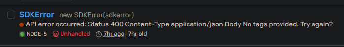

# Capture errors with SDK hooks and Sentry

## Prerequisites
You will need:
- A Sentry account [(If you don't have one, you can sign up [here](https://sentry.io/signup))]
- A Sentry project

## Overview

This guide will show you how to use SDK hooks to integrate error collection into a TypeScript SDK with the Sentry Node SDK, allowing you to insert custom actions at various stages of the SDK's execution:

- `On SDK Initialization`
- `Before a request is executed`
- `After a successful response`
- `After an error response`

## Adding the Sentry SDK to your project

To add the Sentry SDK to your project, you will need to add the dependancy to your Speakeasy SDK's `gen.yaml` file under the dependancies section:

```yaml
configVersion: 2.0.0
generation:
  sdkClassName: Petstore
  ...
typescript:
  version: 0.8.4
  additionalDependencies:
    dependencies:
        '@sentry/node': ^8.9.2 # <- This is the line you need to add, ensure the version you add adheres to NPM package standards.
```

After adding the dependency, the Sentry SDK will be included in your projects package.json file everytime you generate your SDK.

## Adding your first SDK hook

With the Sentry SDK included in your project, you can start adding SDK hooks.

1. Create a new file: In the `src/hooks` directory, create a file named `error_hooks.ts`.
2. Import hook types and Sentry SDK: In this file, import the necessary hook types and initialize the Sentry SDK with your project's DSN.

```typescript
import {
    AfterErrorContext,
    AfterErrorHook,
} from "./types";

import * as Sentry from "@sentry/node";

Sentry.init({
    dsn: process.env.SENTRY_DSN, // <- This is your Sentry DSN, you can find this in your Sentry project settings.
});
```

Next create an `ErrorHooks` class to hold your hooks.

```typescript
export class ErrorHooks
    implements AfterErrorHook {
    afterError(
        hookCtx: AfterErrorContext,
        response: Response | null,
        error: unknown
    ): { response: Response | null; error: unknown } {
        return { response, error };
    }
}
```

This hook allows us to inject custom code that runs on error responses and capture an `SDK Error` event to Sentry at the time the error occurs.

Here are the key points to the class outlined below:

- Use the `AfterErrorHook` interface to define the type of the hook.
- Capture the `hookCtx`, `response`, and `error` in the `afterError` method.
- Return the `response` and `error` so that the SDK can continue to process the error.

Specific notes for using Sentry here:

- Add a breadcrumb to Sentry to capture additional details regarding the error.
- capturing the error in Sentry using `Sentry.captureException(error)`.


```typescript
export class ErrorHooks
    implements AfterErrorHook {
    afterError(
        hookCtx: AfterErrorContext,
        response: Response | null,
        error: unknown
    ): { response: Response | null; error: unknown } {
        Sentry.addBreadcrumb({
            category: "sdk error",
            message: "An error occurred in the SDK",
            level: "error",
            data:{
                hookCtx,
                response,
                error
            }
          });
        Sentry.captureException(error);
        return { response, error };
    }
}
```

Once this hook is implemented, you can now use the `ErrorHooks` class in your SDK.

In the `src/hooks/registration.ts` file import and register the class from the file you created the hooks in:

```typescript
import { Hooks } from "./types";

import { ErrorHooks } from "./error_hooks";

/*
 * This file is only ever generated once on the first generation and then is free to be modified.
 * Any hooks you wish to add should be registered in the initHooks function. Feel free to define them
 * in this file or in separate files in the hooks folder.
 */

export function initHooks(hooks: Hooks) {
    // Add hooks by calling hooks.register{ClientInit/BeforeCreateRequest/BeforeRequest/AfterSuccess/AfterError}Hook
    // with an instance of a hook that implements that specific Hook interface
    // Hooks are registered per SDK instance, and are valid for the lifetime of the SDK instance
    hooks.registerAfterErrorHook(new ErrorHooks());
}

```

You can now regenerate your SDK and use the new hooks. 

Running API calls with this SDK will send error events to your Sentry project, where you can review all the details for each error.



Review all the code outlined in this guide by visiting the [SDK Hooks](https://github.com/speakeasy-api/sdk-hooks/blob/main/Sentry/TypeScript.ts) repository.
