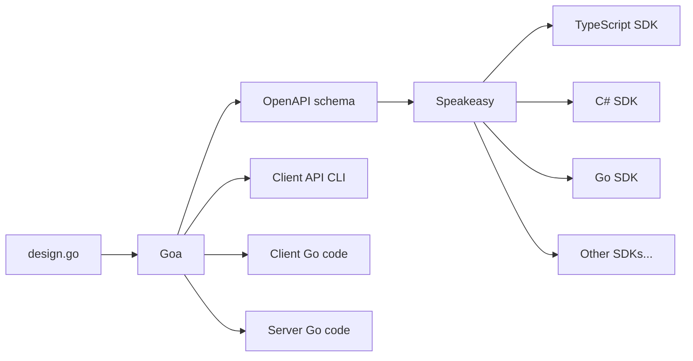

# How to generate an OpenAPI/Swagger spec with Goa

This tutorial explains how to define an application programming interface (API) service written in Go with Goa, convert it to an OpenAPI schema with Goa, and convert that to software development kits (SDKs) in multiple languages with Speakeasy. (OpenAPI used to be known as Swagger, which is now a set of tools that can be used with OpenAPI schemas.)

Below is a graphical summary of the creation process.



We will talk you through creating a complete code example. By the end of the tutorial, you will have a working API service running in Go that you call through TypeScript code in an SDK.

## Is This Tutorial Right for You?

If you're new to OpenAPI, Go, Goa, or Speakeasy, this is the perfect tutorial to see if they are the appropriate technologies for your service. If you're familiar with Goa, but not with Speakeasy, this is also the right place to start.

But if you want to use your OpenAPI schema as a starting point, and not Go code that is transpiled into a schema, Goa is not the right choice for you. Rather, choose one of the other [Go frameworks](#other-go-openapi-frameworks) below.

You also might want to design your schema without choosing any programming language. In this case, you could start with the [Swagger schema editor](https://swagger.io/tools/swagger-editor/). However, using the elegant Goa design language is a lot simpler than trying to design your schema manually. It also creates all the HTTP and gRPC transport code for you.

## Prerequisites

For this tutorial, you only need Docker version 20 or newer. You can complete this tutorial on Linux, macOS, or Windows since Docker commands are not dependent on your operating system or any installed frameworks.

If you are running on Windows, please replace backslashes with forward slashes in the few places where you specify a folder path on your host machine.

## Introduction to Goa

The [OpenAPI specification](https://spec.openapis.org/oas/latest.html) is a standard that explains how to create a human- and machine-readable schema (`.json` or `.yaml` document) for any API service. (This tutorial refers to the standard as "the OpenAPI Specification", and the definition you create for your service as "your OpenAPI schema", or just "your schema".)

[Goa](https://goa.design/learn/getting-started/) is a package written in the Go language that allows you to define an API in Go syntax using functions from the Goa design language. Goa uses your definition in its `design.go` file to create:

- An OpenAPI schema that can be used by programmers or tools like Speakeasy to understand your API.
- Go code for a client application to call your API.
- A command line interface (CLI) to call your API.
- The transport-agnostic code to provide the API on a server over protocols like HTTP and gRPC.
- Go code stubs for the service itself, which you can complete with business logic.

### Other Go OpenAPI Frameworks

Most other Go frameworks generate code from an existing OpenAPI schema and don't allow you to write Go as a starting point. These include:

- [Deepmap OpenAPI code generator](https://github.com/deepmap/oapi-codegen)
- [Ogen](https://github.com/ogen-go/ogen)
- [Swaggest OpenAPI structures for Go](https://github.com/swaggest/openapi-go)

[Swaggest Rest](https://github.com/swaggest/rest) can generate OpenAPI definitions from Go code, but it's not as comprehensive as Goa and does not support gRPC.

### Is This Related to Tsoa?

[Tsoa](https://github.com/lukeautry/tsoa) is a popular TypeScript framework similar to Goa that you may encounter in the OpenAPI ecosystem. Speakeasy has a [tutorial](/docs/api-frameworks/tsoa) for tsoa, too.

Goa was created in 2015 and tsoa in 2016. While tsoa uses decorators and can work with normal Express code, Goa starts with an abstract design document in its domain-specific language (DSL) and uses that to generate code and schemas.

## Create the API Schema in Goa

Now that you understand how Goa and Speakeasy are used, let's write some code.

### Download the Example Repository

First, clone the [example repository](https://github.com/speakeasy-api/speakeasy-goa-example.git) using the code below. If you don't have Git, you can download the code and unzip it.

```bash
git clone https://github.com/speakeasy-api/speakeasy-goa-example.git;
cd speakeasy-goa-example;
```

While you will create a demonstration application in the `app` folder in this tutorial, there is a folder called `completed_app` in the example repository that has all the final generated code and executable files.

### Google Protocol Buffers

Goa generates [gRPC](https://grpc.io/) code for you. gRPC is an efficient alternative to plain HTTP, over which you can provide your API. It requires the use of protocol buffers, made by Google. Our repository already provides the `protoc` app for you, in `completed_app/lib`.

To use more recent versions of `protoc` in future applications, you can download them from [the Protobuf repository](https://github.com/protocolbuffers/protobuf/releases).

### Set Up Go

First, set up your environment. You'll run a Go Docker container and later you'll install Node.js in it. In a terminal in the `speakeasy-goa-example` folder, run the commands below. Comments in the commands explain what they do.

```bash
mkdir app;
cd app;
cp -r ../completed_app/lib .; # copy protoc into your new app
cp -r ../completed_app/design .; # copy in a simple Goa design file

docker run --name gobox --volume .:/go/src/app -it golang:1.21.2 bash; # start Go in a container and share your app folder with it
```

You now have an `app` folder ready to code in, and you're in a terminal in a Go container called `gobox` in Docker.

<div className="Callout" data-title="Restarting Docker" data-variant="info">
If you leave this tutorial and return later, you can start the container and attach to the terminal instead of rebuilding everything:

```bash
docker start gobox;
docker exec -it gobox bash;
export PATH=$PATH:/go/src/app/lib;
cd /go/src/app;
```

If you need to delete the container and start over, run:

```bash
docker stop gobox;
docker rm gobox;
```
</div>

Run the following commands in the `gobox` terminal.

```bash
cd /go/src/app;
go mod init app; # create a new Go package in this folder called app
go install goa.design/goa/v3/cmd/goa@v3; # install Goa
go install google.golang.org/protobuf/cmd/protoc-gen-go@latest; # install gRPC
go install google.golang.org/grpc/cmd/protoc-gen-go-grpc@latest;
export PATH=$PATH:/go/src/app/lib; # add protoc to your path
```

### Review the Goa Design File

You now have Goa installed and ready to run against a Goa design file. Let's pause to review the API schema in `app/design/design.go`. Open the file now.

After importing Goa, the design starts by defining the top-level API:

```go design.go
    var _ = API("club", func() {
        Title("The Speakeasy Club")
        Version("1.0.0")
        Description("A club that serves drinks and plays jazz. A Goa and Speakeasy example.")
        Contact(func() {
            Name("Speakeasy Support")
            URL("https://speakeasy-dev.slack.com/join/shared_invite/zt-1cwb3flxz-lS5SyZxAsF_3NOq5xc8Cjw")
        })
        Docs(func() {
            Description("The Speakeasy Club documentation")
            URL("https://www.speakeasyapi.dev/docs")
        })
        License(func() {
            Name("Apache 2.0")
            URL("https://www.apache.org/licenses/LICENSE-2.0.html")
        })
        TermsOfService("https://www.speakeasyapi.dev/docs/terms-of-service")
        Server("club", func() {
            Description("club server hosts the band and order services.")
            Services("band", "order")
            Host("dev", func() {
                Description("The development host. Safe to use for testing.")
                URI("http://{machine}:51000") // use the machine variable below
                URI("grpc://{machine}:52000")
                Variable("machine", String, "Machine IP Address", func() {
                    Default("localhost")
                })
            })
        })
        Meta("openapi:extension:x-speakeasy-retries", `{
            "strategy":"backoff",
            "statusCodes": "408,504"
        }`)
    })
```

Note that everything in the Goa DSL is a function. The `API` function takes a function that runs other functions to specify parts of the overall definition of the API, such as `Description`, `Version`, and server endpoints (URLs). To learn all the possible functions Goa provides, read the [DSL documentation](https://pkg.go.dev/goa.design/goa/dsl). To create a simpler, minimal definition, use the [Goa getting started guide](https://goa.design/learn/getting-started/).

The example you create here provides a virtual jazz club, allowing you to order a digital drink and change the genre of music played. These features are defined in two separate services, `order` and `band`. While the `club` API title corresponds to the server URL and is not visible, the service names are visible in the URLs `http://localhost:51000/order` and `http://localhost:51000/band`.

The definitions of the two services are below the API. Let's look at the drinks service.

```go design.go
var _ = Service("order", func() {
	Description("A waiter that brings drinks.")
	Method("tea", func() {
		Description("Order a cup of tea.")
		Payload(func() {
			Field(1, "isGreen", Boolean, "Whether to have green tea instead of normal.")
			Field(2, "numberSugars", Int, "Number of spoons of sugar.")
			Field(3, "includeMilk", Boolean, "Whether to have milk.")
		})
		Result(String)
		HTTP(func() {
			Meta("openapi:tag:Drink operations")
			POST("/tea")
		})
		GRPC(func() {
		})
	})
	Files("/openapi.json", "./gen/http/openapi.json")
})
```

Here you can see we've defined a single POST method called `tea` in the `order` service. The `tea` method takes a few parameters about how you like your milk and sugar and returns a string representing a cup of tea.

Note that an HTTP GET method won't accept a complex method body, so you have to use POST for any calls other than simple URL IDs.

#### Encapsulate With References

Goa automatically moves complex types out of the service definition section and into their own section in the schema. For example, in the generated OpenAPI specification file, the line `$ref: '#/components/schemas/TeaRequestBody'` refers the order specification for tea to the `components` section later in the document using the JSON [references](https://swagger.io/docs/specification/using-ref) feature.

#### Rename With Custom operationIds

If you can't find a function in the Goa documentation that corresponds to an OpenAPI field you are expecting, you can probably add it with the [`Meta`](https://pkg.go.dev/goa.design/goa/dsl#Meta) function. The `Meta` function will add a field and value to any object.

For example, here's how you can change the default `operationId` value for a method, which is normally `serviceName#methodPath`:

```go
Method("play", func() {
  Meta("openapi:operationId", "band#play2")
```

An `operationId` is a unique name to clearly identify an operation (method). They are useful to name and discuss operations in documentation and SDKs.

#### Group Operations With Tags

Speakeasy recommends adding [tags](https://swagger.io/docs/specification/grouping-operations-with-tags/) to all operations so that you can group operations by tag in generated SDK code and documentation. A tag is just a label, like a comment, that you can add to a method.

The [`Tag`](https://pkg.go.dev/goa.design/goa/dsl#Tag) function in Goa has a different meaning than it does in OpenAPI, so you need to use the `Meta` function again in the `HTTP` section of a method.

```go
var _ = Service("band", func() {
	Method("play", func() {
		HTTP(func() {
			Meta("openapi:tag:Music operations")
```

### Generate the API Code With Goa

Generate the client and server code and your OpenAPI schema from your design file by running the commands below in the `gobox` container.

```bash
goa gen app/design;
goa example app/design;
```

The files created in the container will belong to the root user, and you will not be able to edit them on your host. In a terminal on your host machine, go to the `app` folder and give yourself permissions to edit the created files:

```bash
sudo chown -R $(id -u):$(id -g) .
```

Rerun this whenever you create a file in the container.

#### Explore the Generated Files

Goa has written a lot of code for us. Below is everything created under `app` and what it does. To avoid duplication, there is only an explanation for the band files and not for the order files, because they are services with identical structures.

The following files and folders are created by `goa gen`, and you may regenerate them when your `design.go` file changes. You may not edit them manually.

- `/gen` — Contains all definition and communication code for HTTP, gRPC, and schemas. Think of the `gen` folder as your `definitions` folder.
- `/gen/band` — Contains transport independent service code.
- `/gen/band/client.go` — Can be imported by client code to make calls to the server.
- `/gen/band/endpoints.go` — Exposes the service code to the transport layers.
- `/gen/grpc` — Contains the server and client code that connects the `protoc`-generated gRPC server and client code, along with the logic to encode and decode requests and responses.
- `/gen/grpc/band/pb` — Contains the protocol buffer files that describe the band gRPC service.
- `/gen/grpc/band/pb/goagen_app_band_grpc.pb.go` — The output of the `protoc` tool.
- `/gen/grpc/cli` — Contains the CLI code to build gRPC requests from a terminal.
- `/gen/http` — All HTTP-related transport code, for server and client.
- `/gen/http/openapi3.yaml` — The OpenAPI version 3 schema (next to `.json` and version 1 schemas).

The following files and folders are created by `goa example` and you can use them as a starting point to write business logic implementation and tests for your server. You **should not** regenerate these files when your `design.go` file changes, rather update them manually. If you haven't started work on your implementation yet and do wish to regenerate the files, delete the existing files first to be certain that Goa recreates them.

- `/cmd` — Contains working placeholder server and CLI code. Think of the `cmd` folder as your `implementation` folder.
- `/cmd/club` — A Go package containing your API that you can compile and run to have a working server.
- `/cmd/club/main.go` — The server implementation that you can change to your liking. Add your favorite logger and database manager here.
- `/cmd/club-cli` — A Go package containing a CLI tool that you can compile and call from the terminal to make requests to the server above.
- `band.go` — A placeholder implementation of your service. You can write your business logic here. You might think this file belongs in the `/cmd/club` folder with the API implementation instead of in the root of the project, but Goa puts the API implementation in the `cmd` folder and all service implementations in the root.

Take a little time to review `/gen/http/openapi3.yaml` and see how your `design.go` functions map to the generated YAML.

### Run the Server and CLI

Goa has given us a simple working client and server implementation. Let's compile and test them before starting with Speakeasy.

Run the code below in the container.

```bash
go get app/cmd/club; # download dependencies
go build ./cmd/club && go build ./cmd/club-cli; # build the server
./club; # start the server
```

You now have two executable files called `club` and `club-cli` in the `app` folder. The Club server is running inside Docker. The output should look like this:

```bash
[club] 16:20:55 HTTP "Play" mounted on POST /play
[club] 16:20:55 HTTP "./gen/http/openapi.json" mounted on GET /openapi.json
[club] 16:20:55 HTTP "Tea" mounted on POST /tea
[club] 16:20:55 HTTP "./gen/http/openapi.json" mounted on GET /openapi.json
[club] 16:20:55 serving gRPC method band.Band/Play
[club] 16:20:55 serving gRPC method order.Order/Tea
[club] 16:20:55 HTTP server listening on "localhost:51000"
[club] 16:20:55 gRPC server listening on "localhost:52000"
```

Open another terminal on your host machine and log in to a new Docker terminal:

```bash
docker exec -it gobox bash;
cd /go/src/app;
./club-cli --help; # see if you can call the server from a CLI client
./club-cli order tea --body '{"includeMilk": false, "isGreen": false, "numberSugars": 1 }';
./club-cli band play --body '{"style": "Bebop" }';
```

While the CLI won't receive a response from the server because the implementation is just a placeholder, you can see in the server terminal that it has been successfully called.

## Customize With Speakeasy Extensions

OpenAPI supports fields that are not in the specification. These [extensions](https://swagger.io/docs/specification/openapi-extensions/) allow you to add custom data to your schema that might have special meaning to applications like Speakeasy. They start with `x-`.

Speakeasy provides a set of [OpenAPI extensions](/docs/customize-sdks). For example, you may want to give an SDK method a name different from the `operationId`:

```go
Method("tea", func() {
  Meta("openapi:extension:x-speakeasy-name-override", "chai")
```

### Retry Calling the Server

Speakeasy provides a schema extension called [retries](https://www.speakeasyapi.dev/docs/customize-sdks/retries) that will create an SDK that automatically retries calling the server if a call fails.

In `design.go`, retries for timeout errors are enabled for the entire API rather than for an individual service or method. For example, this code:

```go
Meta("openapi:extension:x-speakeasy-retries", `{
	"strategy":"backoff",
	"statusCodes": "504,408"
}`)
```

Will produce this OpenAPI YAML:

```yaml
x-speakeasy-retries:
	statusCodes: 408,504
	strategy: backoff
```

Note that the `Meta` function had to use JSON syntax in the value to output an extension object with sub-properties.

## Create SDKs With Speakeasy

Before continuing with this tutorial, please register at https://app.speakeasy.com. Once you've registered, create a workspace named `club`. Browse to API keys. Click "New Api Key". Name it `club`. Copy and save the key content to use later.

### Set Up the Speakeasy CLI

The CLI is the simplest way to use Speakeasy. This tutorial uses Docker, but if you want to install Speakeasy directly on your computer in the future, follow the instructions in the [readme](https://github.com/speakeasy-api/speakeasy#installation).

Run the commands below in the second terminal to `gobox` that you used to log in to a new Docker terminal. Use the API key you saved earlier in the last line.

```bash
apt update;
apt install -y curl unzip sudo nodejs npm; # install dependencies
curl -fsSL https://go.speakeasy.com/cli-install.sh | sh; # install Speakeasy
export SPEAKEASY_API_KEY=your_api_key_here; # <-- overwrite this with your key
```

Now Speakeasy is installed in the container. Test it by running:

```bash
speakeasy help;
```

### Build an SDK

You now have `app/gen/http/openapi3.yaml` and Speakeasy, so you can build the SDK. In the container terminal, run:

```bash
speakeasy generate sdk --schema /go/src/app/gen/http/openapi3.yaml --lang typescript --out /go/src/app/sdk
```

The output should be:

```bash
Authenticated with workspace successfully - https://app.speakeasy.com/workspaces/
Generating SDK for typescript...
INFO	operation valid	{"operation":"band#/openapi.json","type":"paths"}
INFO	operation valid	{"operation":"band#play","type":"paths"}
INFO	operation valid	{"operation":"order#tea","type":"paths"}
Generating SDK for typescript... done ✓.
For more docs on customizing the SDK check out: https://www.speakeasyapi.dev/docs/customize-sdks
```

Remember to give yourself permissions to the files on your host machine in another terminal:

```bash
sudo chown -R $(id -u):$(id -g) .
```

<div className="Callout" data-title="SDK Languages" data-variant="info">
While you're using only TypeScript in this tutorial, Speakeasy supports [C#, Go, Java, PHP, Python, Ruby, Swift, and TypeScript](/docs/create-client-sdks#language-support).
</div>

#### Explore the Generated Files

The root of the Speakeasy-generated `sdk` folder contains various npm files. Importantly, the `package.json` file lists the dependencies you need to install before you can run the SDK. The `docs` folder contains your SDK documentation in Markdown files. The `src` folder contains the SDK code.

### Call Your Service With the SDK

We'll implement the documentation example in `sdk/docs/sdks/drinkoperations/README.md`.

Make a file called `test.js` in the `app/sdk` folder. Insert the code below.

```js
const SDK = require("./dist/index");

(async() => {
  const sdk = new SDK.SDK();

  const res = await sdk.drinkOperations.orderNumberTea({
    includeMilk: true,
    isGreen: false,
    numberSugars: 1584355970564842800,
  });

  if (res.statusCode == 200) {
    console.log('A nice cup of tea');
  }
})();
```

In the container terminal, install the npm dependencies and run the test file.

```bash
cd /go/src/app/sdk;
npm install;
npx tsc --build;
node test.js;
```

In the first terminal where your `club` server is still running, you should see that the server has received a request. In the second terminal, you should see it receive `A nice cup of tea`.

## Next Steps

You now know how to make an OpenAPI-compliant web service from a Goa design specification, and how to generate SDKs for it using Speakeasy. 

### Get Help With Advanced Goa

If you want to build a more complex API and need help understanding Goa, read the full [design language specification](https://pkg.go.dev/goa.design/goa/dsl).

You can also use the Go Slack group to ask for help:

- Register for the group at https://invite.slack.golangbridge.org.
- Log in at https://gophers.slack.com.
- Join the Goa channel to ask questions about the framework.

Perhaps the easiest way to find out how to do something (especially when using `Meta`) is to search the test cases when you have cloned the [source code](https://github.com/goadesign/goa).

### Use Speakeasy Customizations

Review the [Speakeasy customizations](https://www.speakeasyapi.dev/docs/customize-sdks) to see if adding any would make your service more understandable or usable.
