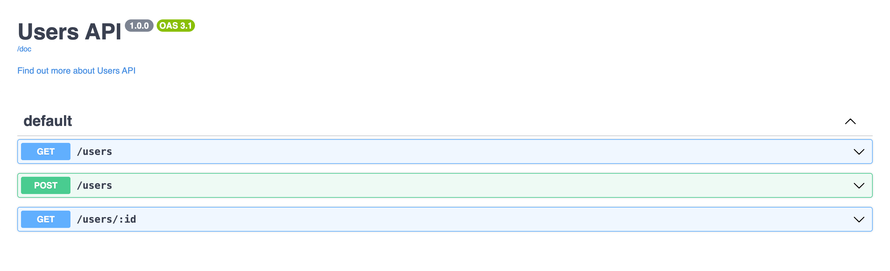
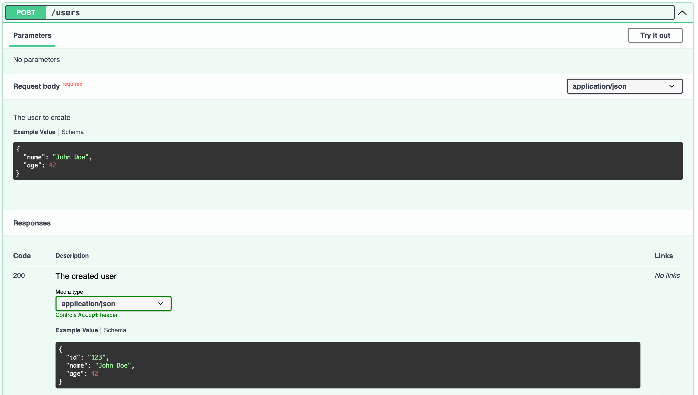
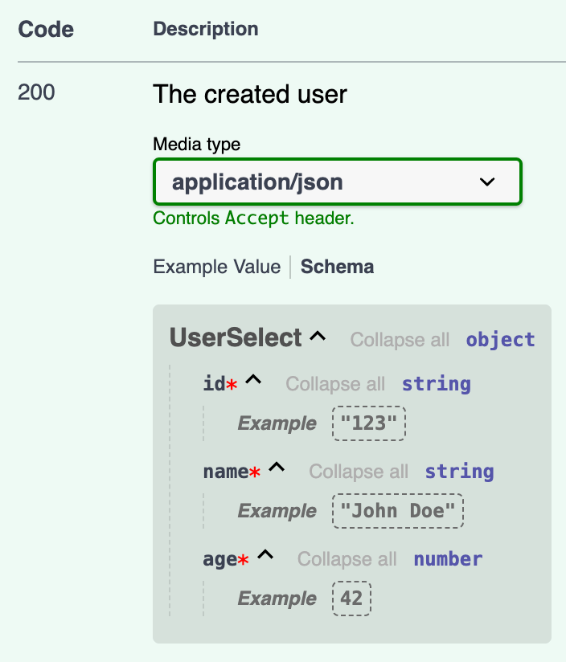
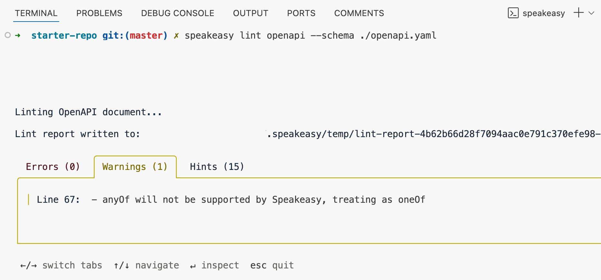

import { Callout } from "~/components";

# How to generate an OpenAPI/Swagger spec with Hono

This guide walks you through generating an OpenAPI specification for a [Hono](https://hono.dev/) API and using Speakeasy to create an SDK based on the generated specification.

Here's what we'll do:

1. Add Zod OpenAPI and Swagger UI to a Node.js Hono project.
2. Generate an OpenAPI spec using the Zod OpenAPI Hono middleware.
3. Improve the generated OpenAPI spec to prepare it for code gen.
4. Use the Speakeasy CLI to create an SDK based on the OpenAPI spec.
5. Add Speakeasy OpenAPI extensions to improve the created SDK.

We'll also take a look at how you can use the created SDK.

Your Hono project might not be as simple as our example app, but the steps below should translate well to any Hono project.

## The OpenAPI creation pipeline

[Zod OpenAPI](https://hono.dev/examples/zod-openapi#zod-openapi) is a Hono middleware that allows you to validate values and types using [Zod](https://zod.dev/) and generate an OpenAPI spec. We'll begin by defining data schemas with Zod, and then set up the Hono app to generate an OpenAPI spec.

The quality of your OpenAPI spec determines the quality of generated SDKs and documentation, so we'll look into ways you can improve the generated spec as described in our [OpenAPI Overview and Best Practices](/docs/best-practices) documentation.

We'll then use the improved OpenAPI spec to create an SDK using Speakeasy.

Finally, we'll use a simplified example to demonstrate how to use the generated SDK and how to add SDK creation to a CI/CD pipeline so that Speakeasy automatically creates fresh SDKs whenever your Hono API changes in the future.

## Requirements

This guide assumes that you have an existing Hono app and basic familiarity with Hono.

<Callout title="Example repository" variant="info">
If you don't have a Hono app, or you want to follow along step-by-step, you can clone the [Speakeasy Hono example repo](https://github.com/speakeasy-api/hono-openapi-example.git) to follow along with the example code in this tutorial. The `initial-app` branch has the initial state of the app that we'll use to start this tutorial.
</Callout>

The following should be installed on your machine:

- [Node.js version 18 or above](https://nodejs.org/en/download) (we used Node v20.18.0), which the Hono Node.js Adaptor requires.
- The [JS-YAML](https://www.npmjs.com/package/js-yaml) package, which we'll use to convert the OpenAPI (Swagger) module document to a YAML file.
- The [Speakeasy CLI](/docs/speakeasy-cli/getting-started), which we'll use to generate an SDK from the OpenAPI spec.

If you're using the [example application](https://github.com/speakeasy-api/hono-openapi-example.git), add a `.env` file containing the following environmental variables to the root of your project:

```env
NODE_ENV=development
PORT=3000
```

## Adding the Zod OpenAPI middleware to a Hono project

We'll use the [Zod OpenAPI Hono](https://hono.dev/examples/zod-openapi) middleware to generate an OpenAPI spec. We'll create Zod schemas to validate values and types, and to generate part of the OpenAPI spec.

### Creating Zod schemas

First, install the middleware and Zod:

```bash Terminal
npm i zod @hono/zod-openapi
```

Next, create a `schemas.ts` file in the `src` folder and create Zod schemas for your data:

```typescript schema.ts
import { z } from '@hono/zod-openapi';

export const UserInsertSchema = z
  .object({
    name: z.string(),
    age: z.number(),
  });

export const UserSelectSchema = z
  .object({
    id: z.string(),
    name: z.string(),
    age: z.number()
    ,
  });

export const patchUserSchema = UserInsertSchema.partial();
```

The `z` object should be imported from `@hono/zod-openapi`.

Create schema for your request-query params, messages, and error responses:

```typescript schema.ts
export const idParamsSchema = z.object({
  id: z
    .string()
    .min(3),
});

export function createMessageObjectSchema(exampleMessage: string = 'Hello World') {
  return z.object({
    message: z.string(),
  });
}

export function createErrorSchema<
  T extends ZodSchema,
>(schema: T) {
  const { error } = schema.safeParse(
    schema._def.typeName
    === z.ZodFirstPartyTypeKind.ZodArray
      ? []
      : {},
  );
  return z.object({
    success: z.boolean(),
    error: z
      .object({
        issues: z.array(
          z.object({
            code: z.string(),
            path: z.array(
              z.union([z.string(), z.number()]),
            ),
            message: z.string().optional(),
          }),
        ),
        name: z.string(),
      }),
  });
}
```

Create a `types.ts` file in the `src/lib` folder and add the `ZodSchema` type to it:

```typescript types.ts
import type { z } from '@hono/zod-openapi';

// eslint-disable-next-line ts/ban-ts-comment
// @ts-expect-error
export type ZodSchema = z.ZodUnion | z.AnyZodObject | z.ZodArray<z.AnyZodObject>;
```

Import this type in the `src/schemas.ts` file.

```typescript schemas.ts
import type { ZodSchema } from './lib/types';
```

### Replacing the `Hono` instances with `OpenAPIHono`

Set up your app to use the `OpenAPIHono` instance of the Zod OpenAPI middleware instead of the `Hono` instance. Import the `OpenAPIHono` class in the `src/lib/createApp.ts` file:

```typescript createApp.ts
import { OpenAPIHono } from '@hono/zod-openapi';
```

Remove the `Hono` import and replace the `Hono` instances with `OpenAPIHono`:

```diff createApp.ts
- return new Hono({ strict: false });
+ return new OpenAPIHono({ strict: false });
```

```diff createApp.ts
- const app = new Hono({ strict: false });
+ const app = new OpenAPIHono({ strict: false });
```

The `OpenAPIHono` class is an extension of the `Hono` class that gives `OpenAPIHono` its OpenAPI spec generation functionality.

### Defining routes

Let's split the routes and handlers into separate files for better code organization.

Create a `users.routes.ts` file in the `src/routes/users` folder and use the Zod OpenAPI `createRoute` method to define your routes:

```typescript users.routes.ts
import { createRoute, z } from '@hono/zod-openapi';

import { createErrorSchema, createMessageObjectSchema, idParamsSchema, patchUserSchema, UserInsertSchema, UserSelectSchema } from '@/schemas';

export const list = createRoute({
  path: '/users',
  method: 'get',
  responses: {
    200: {
      content: {
        'application/json': {
          schema: z.array(UserSelectSchema),
        },
      },
      description: 'The list of users',
    },
  },
});

export const create = createRoute({
  path: '/users',
  method: 'post',
  request: {
    body: {
      content: {
        'application/json': {
          schema: UserInsertSchema,
        },
      },
      description: 'The user to create',
      required: true,
    },
  },
  responses: {
    200: {
      content: {
        'application/json': {
          schema: UserSelectSchema,
        },
      },
      description: 'The created user',
    },
    404: {
      content: {
        'application/json': {
          schema: createMessageObjectSchema('Not Found'),
        },
      },
      description: 'User not found',
    },
    422: {
      content: {
        'application/json': {
          schema: createErrorSchema(patchUserSchema),
        },
      },
      description: 'The validation error(s)',
    },
  },
});

export const getOne = createRoute({
  path: '/users/{id}',
  method: 'get',
  request: {
    params: idParamsSchema,
  },
  responses: {
    200: {
      content: {
        'application/json': {
          schema: UserSelectSchema,
        },
      },
      description: 'The requested user',
    },
    404: {
      content: {
        'application/json': {
          schema: createMessageObjectSchema('Not Found'),
        },
      },
      description: 'User not found',
    },
    422: {
      content: {
        'application/json': {
          schema: createErrorSchema(patchUserSchema),
        },
      },
      description: 'Invalid id error',
    },
  },
});

export type ListRoute = typeof list;
export type CreateRoute = typeof create;
export type GetOneRoute = typeof getOne;
```

The `createRoute` function takes in an object that describes the route's request and possible responses. The Zod schema defines the request and response content. The route types are then exported for use in the route handlers.

### Defining route handlers

Create a `users.handlers.ts` file in the `src/routes/users` folder and add the following route handlers to it:

```typescript users.handlers.ts
import type { AppRouteHandler } from '@/lib/types';
import type { CreateRoute, GetOneRoute, ListRoute } from '@/routes/users/users.routes';

export const list: AppRouteHandler<ListRoute> = async (c) => {
  // Add db query to get all users
  return c.json([{
    age: 42,
    id: '123',
    name: 'John Doe',
  }, {
    age: 32,
    id: '124',
    name: 'Sarah Jones',
  }], 200);
};

export const create: AppRouteHandler<CreateRoute> = async (c) => {
  const user = c.req.valid('json');
  console.log({ user });
  // Add db query create a user
  return c.json({
    age: 42,
    id: '2342',
    name: 'John Doe',
  }, 200);
};

export const getOne: AppRouteHandler<GetOneRoute> = async (c) => {
  const { id } = c.req.valid('param');
  // Add db query to get a user by id
  const foundUser = {
    age: 50,
    id,
    name: 'Lisa Smith',
  };

  if (!foundUser) {
    return c.json(
      {
        message: 'Not found',
      },
      404,
    );
  }
  return c.json(foundUser, 200);
};
```

Add the following `AppRouteHandler` type to the `src/lib/types.ts` file:

```typescript types.ts
import type { RouteConfig, RouteHandler } from '@hono/zod-openapi';

export type AppRouteHandler<R extends RouteConfig> = RouteHandler<R>;
```

The handlers are made type safe by the route types. The request and response data in the Hono [context object](https://hono.dev/docs/api/context) is type checked using the schema defined in the routes. If you use an incorrect type, for example setting `age:` to `42`, you'll get a type error.

### Configuring the middleware for each endpoint

Replace the code in the `src/routes/users/users.index.ts` file with the following lines of code:

```typescript users.index.ts
import { createRouter } from '@/lib/createApp';

import * as handlers from './users.handlers';
import * as routes from './users.routes';

const router = createRouter()
  .openapi(routes.list, handlers.list)
  .openapi(routes.create, handlers.create)
  .openapi(routes.getOne, handlers.getOne);

export default router;
```

The `openapi` method takes the route and the handler as its arguments and configures the Zod OpenAPI middleware for each endpoint on the `OpenAPIHono` instance

## Configuring and generating the OpenAPI spec

Create a file called `configureOpenAPI.ts` in the `src/lib` folder and add the following lines of code to it:

```typescript configureOpenAPI.ts
import type { OpenAPIHono } from '@hono/zod-openapi';
import packageJson from '../../package.json';

export const openAPIObjectConfig = {
  openapi: '3.1.0',
  externalDocs: {
    description: 'Find out more about Users API',
    url: 'www.example.com',
  },
  info: {
    version: packageJson.version,
    title: 'Users API',
  },
};

export default function configureOpenAPI(app: OpenAPIHono) {
  app.doc31('/doc', openAPIObjectConfig);
}
```

The `configureOpenAPI` function takes in an `OpenAPIHono` instance and generates an OpenAPI version 3.1 spec using the `doc31` method. The OpenAPI spec can be viewed at the `'/doc'` endpoint. The OpenAPI configuration object is then passed in to the function to add fields to the root object of the OpenAPI spec.

Now, pass in the `OpenAPIHono` app instance to the `configureOpenAPI` function in the `src/app.ts` file:

```typescript app.ts
import configureOpenAPI from './lib/configureOpenAPI';

configureOpenAPI(app);
```

## Supported OpenAPI Specification versions in Hono and Speakeasy

Speakeasy currently supports the OpenAPI Specification versions 3.0.x and 3.1.x. We recommend using OpenAPI Specification version 3.1 if possible, as it's fully compatible with [JSON Schema](https://json-schema.org/), which gives you access to a large ecosystem of tools and libraries.

Zod OpenAPI Hono can generate an OpenAPI spec using version 3.0 or version 3.1 of OpenAPI Specification. This guide uses version 3.1.

Run the development server and open [`http://localhost:3000/doc`](http://localhost:3000/doc) to see the OpenAPI spec in JSON format:

```json
{
  "openapi": "3.1.0",
  "externalDocs": {
    "description": "Find out more about Users API",
    "url": "www.example.com"
  },
  "info": {
    "version": "1.0.0",
    "title": "Users API"
  },
  "components": {
    "schemas": {

    },
    "parameters": {

    }
  },
  "paths": {
    "/users": {
      "get": {
        "responses": {
          "200": {
            "description": "The list of users",
            "content": {
              "application/json": {
                "schema": {
                  "type": "array",
                  "items": {
                    "type": "object",
                    ...

```

## Adding Swagger UI middleware

Let's use the [Swagger UI middleware](https://hono.dev/examples/swagger-ui) to add an interactive documentation UI for the API.

Install the middleware:

```bash Terminal
npm install @hono/swagger-ui
```

Import the `swaggerUI` middleware in the `src/lib/configureOpenAPI.ts` file:

```typescript configureOpenAPI.ts
import { swaggerUI } from '@hono/swagger-ui';
```

Add the middleware as a handler for GET requests to the `/ui` route:

```typescript configureOpenAPI.ts mark=3
export default function configureOpenAPI(app: OpenAPIHono) {
  app.doc31('/doc', openAPIObjectConfig);
  app.get('/ui', swaggerUI({ url: '/doc' }));
}
```

Open your browser and navigate to [`http://localhost:3000/ui`](http://localhost:3000/ui). You should see the Swagger UI with three API endpoints:



You can see the parameters required for API endpoints and try out the different API endpoints. In the `http://localhost:3000/doc` route, you can also view the OpenAPI spec in JSON format.

## Register the Zod schemas as reusable OpenAPI component schemas

The request and response content schemas of the OpenAPI spec are inline:

```json focus= 13:20
"components": {
    "schemas": {},
    "parameters": {}
  },
"paths": {
  "/users": {
    "get": {
      "responses": {
        "200": {
          "description": "The list of users",
          "content": {
            "application/json": {
              "schema": {
                "type": "array",
                "items": {
                  "type": "object",
                  "properties": {
                    "id": {
                      "type": "string"
                    },
```

Let's make these schemas reusable by adding them to the OpenAPI [components object](https://swagger.io/specification/#components-object).

Use the [`.openapi()` method on the Zod object](https://github.com/asteasolutions/zod-to-openapi#the-openapi-method) to register your Zod schemas as referenced components in the `src/schemas.ts` file:

```typescript schemas.ts mark=7
export const UserSelectSchema = z
  .object({
    id: z.string(),
    name: z.string(),
    age: z.number(),
  })
  .openapi('UserSelect');
```

This adds your schemas to the OpenAPI components object:

```json
  "components": {
    "schemas": {
      "UserSelect": {
        "type": "object",
        "properties": {
          "id": {
            "type": "string"
          },
          "name": {
            "type": "string"
          },
          "age": {
            "type": "number"
          }
        },
        "required": [
          "id",
          "name",
          "age"
        ]
      },
```

The schemas are referenced using [`$ref`](https://swagger.io/specification/#reference-object), which is the reference identifier that specifies the location (as a URI) of the value being referenced.

```json focus=7
  "responses": {
    "200": {
      "description": "The created user",
      "content": {
        "application/json": {
          "schema": {
            "$ref": "#/components/schemas/UserSelect"
          }
        }
      }
    },
```

## Adding OpenAPI metadata to the Zod schemas

Let's add additional OpenAPI metadata to our schemas.

In the `src/schemas.ts` file, add example values by passing in an object with an `example` property to the `openapi` method:

```typescript schemas.ts mark=4:6,8:10
export const UserInsertSchema = z
  .object({
    name: z.string()
      .openapi({
        example: 'John Doe',
      }),
    age: z.number()
      .openapi({
        example: 42,
      }),
  })
  .openapi('UserInsert');

export const UserSelectSchema = z
  .object({
    id: z.string()
      .openapi({
        example: '123',
      }),
    name: z.string()
      .openapi({
        example: 'John Doe',
      }),
    age: z.number()
      .openapi({
        example: 42,
      }),
  })
  .openapi('UserSelect');
```

Define the route parameters for parameter schema:

```typescript schemas.ts mark=6:9
export const idParamsSchema = z.object({
  id: z
    .string()
    .min(3)
    .openapi({
      param: {
        name: 'id',
        in: 'path',
      },
      example: '423',
    })
    .openapi('idParams'),
});
```

After adding the OpenAPI metadata to your schemas, you'll see that your OpenAPI spec and Swagger UI will show example values for the schemas used in requests and responses:



You can also see details about the example data schemas:



## Add the OpenAPI `operationId` using Hono Zod OpenAPI

In the OpenAPI spec, each HTTP request has an `operationId` that identifies the operation. The `operationId` is also used to generate method names and documentation in SDKs.

To add an `operationId`, use the `operationId` property of the `createRoute` method in the `src/routes/users/users.routes.ts` file:

```typescript users.routes.ts
export const list = createRoute({
  operationId: 'getUsers',
```

## Adding OpenAPI tags to Zod OpenAPI Hono routes

Whether you're building a big application or only have a handful of operations, we recommend adding tags to all your Hono routes so you can group them by tag in generated SDK code and documentation.

### Adding OpenAPI tags to routes in Hono

To add an OpenAPI tag to a Zod OpenAPI Hono route, use the `tags` property to pass in an array of tags as the argument object of the `createRoute` method call:

```typescript users.routes.ts
  tags: ['Users'],
```

### Adding metadata to tags

We can add metadata to the tag by passing in a [tag object](https://swagger.io/specification/#tag-object), instead of a string, to a tag array item.

Add a tag to the root OpenAPI object `openAPIObjectConfig` in the `src/lib/configureOpenAPI.ts` file:

```typescript configureOpenAPI.ts mark=7:14
export const openAPIObjectConfig = {
  openapi: '3.1.0',
  externalDocs: {
    description: 'Find out more about Users API',
    url: 'https://www.example.com',
  },
  tags: [{
    name: 'Users',
    description: 'Users operations',
    externalDocs: {
      description: 'Find more info here',
      url: 'https://example.com',
    },
  }],
```

## Adding a list of servers to the Hono OpenAPI spec

When validating an OpenAPI spec, Speakeasy expects a list of servers at the root of the spec.

Add a server by adding a `servers` property to the `openAPIObjectConfig` object:

```typescript configureOpenAPI.ts mark=7:12
export const openAPIObjectConfig = {
  openapi: '3.1.0',
  externalDocs: {
    description: 'Find out more about Users API',
    url: 'https://www.example.com',
  },
  servers: [
    {
      url: 'http://localhost:3000/',
      description: 'Development server',
    },
  ],
```

## Adding retries to your SDK with `x-speakeasy-retries`

[OpenAPI spec extensions](/openapi/extensions) allow us to add vendor-specific functionality to the spec.

- Extension fields must be prefixed with `x-`.
- Speakeasy uses extensions that start with `x-speakeasy-`.

Let's add a Speakeasy extension that adds retries to requests from Speakeasy SDKs by adding a top-level `x-speakeasy-retries` schema to the OpenAPI spec. We can also override the retry strategy per operation.

### Adding global retries

Apply the Speakeasy retries extension globally by adding the following `'x-speakeasy-retries'` property to the `openAPIObjectConfig` object:

```typescript configureOpenAPI.ts mark=13:23
export const openAPIObjectConfig = {
  openapi: '3.1.0',
  externalDocs: {
    description: 'Find out more about Users API',
    url: 'https://www.example.com',
  },
  servers: [
    {
      url: 'http://localhost:3000/',
      description: 'Development server',
    },
  ],
  'x-speakeasy-retries': {
    strategy: 'backoff',
    backoff: {
      initialInterval: 500,
      maxInterval: 60000,
      maxElapsedTime: 3600000,
      exponent: 1.5,
    },
    statusCodes: ['5XX'],
    retryConnectionErrors: true,
  },
```

### Adding retries per method

To create a unique retry strategy for a single route, add an `'x-speakeasy-retries'` property to the `createRoute` method call's argument object:

```typescript users.routes.ts mark=6:16
export const list = createRoute({
  'operationId': 'getUsers',
  'path': '/users',
  'method': 'get',
  'tags': ['Users'],
  'x-speakeasy-retries': {
    strategy: 'backoff',
    backoff: {
      initialInterval: 300,
      maxInterval: 40000,
      maxElapsedTime: 3000000,
      exponent: 1.2,
    },
    statusCodes: ['5XX'],
    retryConnectionErrors: true,
  },
```

## Creating an SDK based on your OpenAPI spec

Before creating an SDK, we need to save the Hono Zod OpenAPI-generated OpenAPI spec to a file. OpenAPI files are written as JSON or YAML; we'll save it as a YAML file, as it's easier to read.

### Saving the OpenAPI spec to a YAML file using a Node.js script

Let's create a script to convert the OpenAPI object to a YAML file. We'll use the JS-YAML library to convert the OpenAPI object to a YAML string

Create a script called `generateOpenAPIYamlFile.ts` in the `src` folder and add the following lines of code to it:

```typescript generateOpenAPIYamlFile.ts
import * as yaml from 'js-yaml';
import { writeFileSync } from 'node:fs';

import users from '@/routes/users/users.index';

import configureOpenAPI, { openAPIObjectConfig } from './lib/configureOpenAPI';
import createApp from './lib/createApp';

const app = createApp();

const routes = [
  users,
] as const;

configureOpenAPI(app);
routes.forEach((route) => {
  app.route('/', route);
});

// Convert the OpenAPIObject to a YAML string
const yamlString = yaml.dump(app.getOpenAPI31Document(openAPIObjectConfig));

// Save the YAML string to a file
writeFileSync('openapi.yaml', yamlString);
```

This initializes the app and routes, uses the `getOpenAPI31Document` method to generate an OpenAPI Specification v3.1 schema object, converts the schema object to a YAML string, and saves it as a file.

Add the following script to your `package.json` file:

```json package.json
"create:openapi": "npx tsx ./src/generateOpenAPIYamlFile.ts"
```

Run the script using the following command:

```bash Terminal
npm run create:openapi
```

An `openapi.yaml` file will be created in your root folder.

### Linting the OpenAPI spec with Speakeasy

The Speakeasy CLI has an OpenAPI [linting](/docs/linting) command that checks the OpenAPI document for errors and style issues.

Run the linting command:

```bash Terminal
speakeasy lint openapi --schema ./openapi.yaml
```

A lint report will be displayed in the terminal, showing errors, warnings, and hints:



The Speakeasy Linter uses a [recommended set of rules](/docs/linting/linting#speakeasy-recommended) that you can [configure](/docs/linting#configuration).

Speakeasy also has a [VS Code extension](https://marketplace.visualstudio.com/items?itemName=Speakeasy.speakeasy-vscode-extension) to help you validate your OpenAPI documents for the creation of production-grade SDKs.

### Creating an SDK from the Speakeasy CLI

We'll use the [`quickstart`](/docs/speakeasy-cli/quickstart) command for a guided SDK setup.

Run the command using the Speakeasy CLI:

```bash Terminal
speakeasy quickstart
```

Following the prompts, provide the OpenAPI document location, name the SDK `SDK`, and select `TypeScript` as the SDK language.

In the terminal, you'll see the steps taken by Speakeasy to create the SDK.

```
│ Workflow - success
│ └─Target: sdk - success
│   └─Source: SDK -OAS - success
│     └─Validating Document - success
│     └─Diagnosing OpenAPI - success
│     └─Tracking OpenAPI Changes - success
│       └─Snapshotting OpenAPI Revision - success
│       └─Storing OpenAPI Revision - success
│   └─Validating gen.yaml - success
│   └─Generating Typescript SDK - success
│     └─Setup Environment - success
│     └─Load and Validate Document - success
│     └─Generate SDK - success
│     └─Compile SDK - success
```

Speakeasy [validates](/docs/concepts#validation) the OpenAPI document to check that it's ready for code generation. Validation issues will be printed in the terminal. The generated SDK will be saved as a folder in your project.

If you get ESLint styling errors, run the `speakeasy quickstart` command from outside your project.

## Adding SDK generation to your GitHub Actions

The Speakeasy [`sdk-generation-action`](https://github.com/speakeasy-api/sdk-generation-action) repository provides workflows for integrating the Speakeasy CLI into CI/CD pipelines to automatically regenerate SDKs when the OpenAPI spec changes.

You can set up Speakeasy to automatically push a new branch to your SDK repositories so that your engineers can review and merge the SDK changes.

For an overview of how to set up automation for your SDKs, see the Speakeasy [SDK Workflow Matrix](/docs/workflow-reference/generation-reference).

## Using your SDK

Once you've created your SDK, you can [publish](/docs/publish-sdk) it for use. For TypeScript, you can publish it as an npm package.

A quick, non-production-ready way to see your SDK in action is to copy your SDK folder to a frontend TypeScript project and use it there.

For example, you can create a Vite project that uses TypeScript:

```bash Terminal
npm create vite@latest
```

Copy the SDK folder from your Hono app to the `src` directory of your TypeScript Vite project and delete the SDK folder in your Hono project.

In the SDK `README.md` file, you'll find documentation about your Speakeasy SDK.

Note that the SDK is not ready for production use. To get it production-ready, follow the steps outlined in your Speakeasy workspace.

The SDK has Zod as a peer dependency, as can be seen in the `sdk-typescript/package.json` file.

Install the required Zod version:

```bash Terminal
npm i zod
```

Replace the code in the `src/main.ts` file with the following example code taken from the `sdk-typescript/docs/sdk/users/README.md` file:

```typescript main.ts
import { SDK } from './sdk-typescript/src/'; // Adjust the path as necessary eg if your generated SDK has a different name

const sdk = new SDK();

async function run() {
  const result = await sdk.users.getUsers();

  // Handle the result
  console.log({ result });
}

run();
```

Run the Vite dev server:

```bash Terminal
npm run dev
```

Enable CORS in your Hono dev server by importing the built-in CORS middleware:

```typescript app.ts
import { cors } from 'hono/cors';
```

Add the middleware and set the `origin` to the Vite dev server URL:

```typescript app.ts
app.use(
  '/users',
  cors({
    origin: 'http://localhost:5173',
  }),
);
```

Run the Hono dev server as well:

```bash Terminal
npm run dev
```

You'll see the following logged in your browser dev tools console:

```
{
    "result": [
        {
            "id": "123",
            "name": "John Doe",
            "age": 42
        },
        {
            "id": "124",
            "name": "Sarah Jones",
            "age": 32
        }
    ]
}
```

The SDK functions are type-safe and include TypeScript autocompletion for arguments and outputs.

If you try to access a property that doesn't exist:

```typescript main.ts
const userOne = result[0].surname;
```

You'll get a TypeScript error:

```
Property 'surname' does not exist on type 'UserSelect'
```

## Further reading

This guide covered the basics of generating an OpenAPI spec using Hono. Here are some resources to help you learn more about OpenAPI, the Hono Zod OpenAPI middleware, and Speakeasy:

- [Hono Zod OpenAPI middleware documentation](https://github.com/honojs/middleware/tree/main/packages/zod-openapi): Learn more about generating an OpenAPI spec and validating values and types using Zod. The topics covered include setup, handling validation errors, configuration, RPC mode, and authorization setup.
- [Speakeasy documentation](/docs): Speakeasy has extensive documentation on how to generate SDKs from OpenAPI documents, customize SDKs, and more.
- [Speakeasy OpenAPI reference](/openapi): Review a detailed reference on the OpenAPI Specification.
