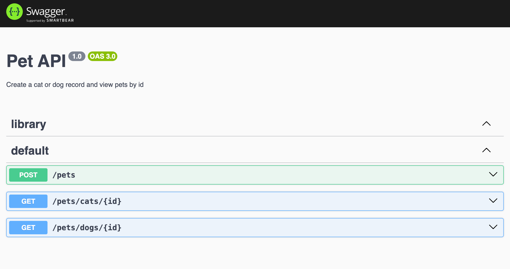
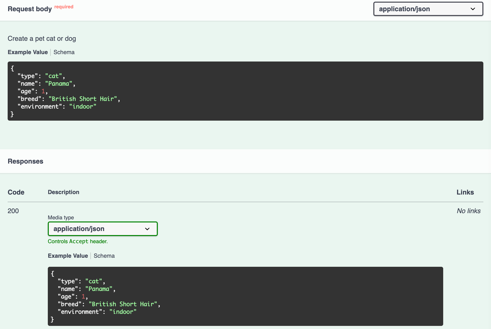
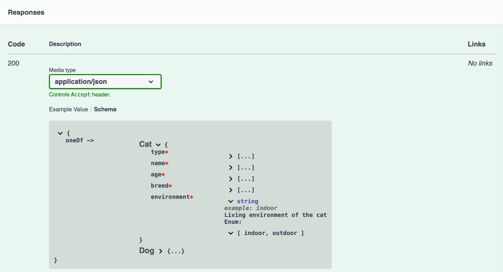
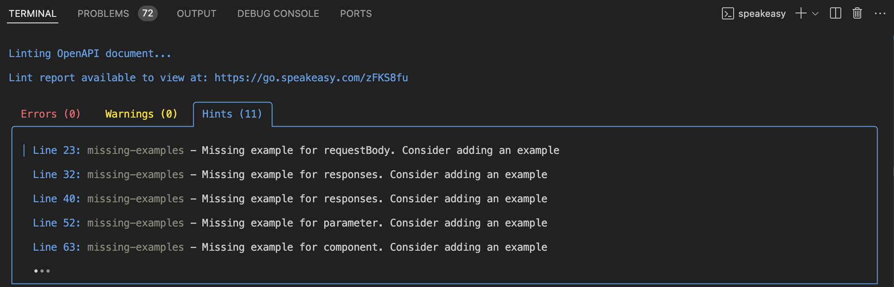

 

# Generate OpenAPI from NestJS

This guide walks you through generating an OpenAPI specification for a [NestJS](https://nestjs.com/) API and using Speakeasy to create an SDK based on the generated specification.

<div className="Callout" data-title="Example code" data-variant="info">
Clone the [Speakeasy NestJS example repo](https://github.com/speakeasy-api/nestjs-openapi-example.git) to follow along with the example code in this tutorial. The `initial-app` branch has the initial state of the app that we'll use to start this tutorial.
</div>

Here's what we'll do:

1. Add the NestJS OpenAPI module to a NestJS project.
2. Generate an OpenAPI spec using the NestJS OpenAPI module.
3. Improve the generated OpenAPI spec for better downstream SDK creation.
4. Use the Speakeasy CLI to create an SDK based on the OpenAPI spec.
5. Use a Speakeasy OpenAPI extension to improve the created SDK.

We'll also take a look at how you can use the created SDK.

Your NestJS project might not be as simple as our example app, but the steps below should translate well to any NestJS project.

## The SDK creation pipeline

NestJS has an [OpenAPI (Swagger) module](https://github.com/nestjs/swagger) for generating OpenAPI specifications. We'll begin by installing, configuring, and initializing the NestJS [OpenAPI (Swagger) module](https://github.com/nestjs/swagger).

The quality of your OpenAPI spec determines the quality of generated SDKs and documentation, so we'll look into ways you can improve the generated spec as described in our [OpenAPI Overview and Best Practices](/docs/best-practices) documentation.

We'll then use the improved OpenAPI spec to create an SDK using Speakeasy.

Finally, we'll use a simplified example to demonstrate how to use the SDK we created and how to add SDK generation to a CI/CD pipeline so that Speakeasy automatically creates fresh SDKs whenever your NestJS API changes in the future.

## Requirements

This guide assumes that you have an existing NestJS app (or a clone of our [example application](https://github.com/speakeasy-api/nestjs-openapi-example.git)) and a basic familiarity with NestJS.

The following should be installed on your machine:

- [Node.js version 16 or above](https://nodejs.org/en/download) (we used Node v20.17.0).
- The [NestJS CLI](https://docs.nestjs.com/cli/overview), which can be installed with the following command once you have Node.js:

  ```bash Terminal
  npm install -g @nestjs/cli
  ```

- The [JS-YAML](https://www.npmjs.com/package/js-yaml) package, which we'll use to convert the OpenAPI (Swagger) module document to a YAML file.
- The [Speakeasy CLI](/docs/speakeasy-cli/getting-started), which we'll use to generate an SDK from the OpenAPI spec.

## Adding `@nestjs/swagger` to a NestJS project

Install the NestJS OpenAPI (Swagger) module:

```bash Terminal
 npm install --save @nestjs/swagger
```

In the `bootstrap` function of your application entry file, initialize Swagger using the `SwaggerModule` class:

```typescript main.ts
const config = new DocumentBuilder()
  .setTitle('Pet API')
  .setDescription('Create a cat or dog record and view pets by id')
  .setVersion('1.0')
  .addTag('library')
  .build();

const document = SwaggerModule.createDocument(app, config); // serializable object - conform to OpenAPI
SwaggerModule.setup('api', app, document);
```

Add the required imports:

```typescript main.ts
import { SwaggerModule, DocumentBuilder } from '@nestjs/swagger';
```

- The `SwaggerModule.createDocument` method returns a serializable [OpenAPI document](https://swagger.io/specification/#openapi-document) object that we'll convert to an OpenAPI spec YAML file using JS-YAML.
- The `DocumentBuilder` is used to create the base structure of the OpenAPI spec. The [`DocumentBuilder` methods](https://github.com/nestjs/swagger/blob/master/lib/document-builder.ts) set properties, such as the title and description, that identify the purpose and owner of the document.
- The `createDocument()` method is used to define the API routes. We pass in two arguments: application instance and document configuration. We can also provide a third argument - [`SwaggerDocumentOptions`](https://docs.nestjs.com/openapi/introduction#document-options).
- The `SwaggerModule` `setup` method accepts the `URL` path to mount the Swagger UI, the application instance, and the OpenAPI document object as arguments.

Run the NestJS HTTP development server:

```bash Terminal
npm run start:dev
```

Open your browser and navigate to [`http://localhost:3000/api`](http://localhost:3000/api). You should see the Swagger UI with three API endpoints.



For each API endpoint, you can see which parameters are required and try out the different API endpoints.

Open `http://localhost:3000/api-yaml` to see the following basic OpenAPI spec in YAML format:

```yaml
openapi: 3.0.0
paths:
  /pets:
    post:
      operationId: PetsController_create
      parameters: []
      responses:
        "201":
          description: ""
  /pets/cats/{id}:
    get:
      operationId: PetsController_findOneCat
      parameters:
        - name: id
          required: true
          in: path
          schema:
            type: string
      responses:
        "200":
          description: ""
  /pets/dogs/{id}:
    get:
      operationId: PetsController_findOneDog
      parameters:
        - name: id
          required: true
          in: path
          schema:
            type: string
      responses:
        "200":
          description: ""
info:
  title: Pet API
  description: Create a cat or dog record and view pets by id
  version: "1.0"
  contact: {}
  termsOfService: http://example.com/terms/
tags:
  - name: library
    description: ""
servers: []
components:
  schemas: {}
```

Note that the OpenAPI Specification version is 3.0.0.

## Supported OpenAPI Specification versions in NestJS and Speakeasy

Speakeasy currently supports the OpenAPI Specification versions 3.0.x and 3.1.x. We recommend using OpenAPI Specification version 3.1 if possible, as it's fully compatible with [JSON Schema](https://json-schema.org/), which gives you access to a large ecosystem of tools and libraries. NestJS supports the creation of OpenAPI specs in OpenAPI Specification version 3.0.x.

## Adding OpenAPI `info` in NestJS

Let's improve the OpenAPI spec by better describing it. We'll add more fields to the [`info` object](https://swagger.io/specification/#info-object), which contains metadata about the API.

Add the following `DocumentBuilder` methods to the `config` section of the document (`main.ts`) to supply more data about the API:

```typescript main.ts
.setContact(
  'Speakeasy support',
  'http://www.example.com/support',
  'support@example.com',
)
.setTermsOfService('http://example.com/terms/')
.setLicense(
  'Apache 2.0',
  'https://www.apache.org/licenses/LICENSE-2.0.html',
)
```

## Updating NestJS to generate OpenAPI component schemas

In the example app, [NestJS core decorators](https://docs.nestjs.com/custom-decorators) define the structure and functionality of the Pets Controller and its API routes.

We can add [OpenAPI decorators](https://docs.nestjs.com/openapi/decorators) to better describe our API. The OpenAPI spec lacks details about the POST request body, data schema, and API response.

Add the following OpenAPI decorators, with the `Api` prefix to distinguish them from the core decorators, to the `@Get('cats/:id')` route handler:

```typescript pets.controller.ts
@ApiOperation({ summary: 'Get cat' })
@ApiResponse({
  status: 200,
  description: 'The found record',
  type: Cat,
})
@ApiBadRequestResponse({ status: 400, description: 'Bad Request' })
```

Import these decorators from `'@nestjs/swagger'`:

```typescript pets.controller.ts
import {
  ApiBadRequestResponse,
  ApiBody,
  ApiExtension,
  ApiForbiddenResponse,
  ApiOkResponse,
  ApiOperation,
  ApiResponse,
  ApiTags,
  getSchemaPath,
} from '@nestjs/swagger';
```

Add the following OpenAPI decorators to the `@Get('dogs/:id')` route handler:

```typescript pets.controller.ts
@ApiOperation({ summary: 'Get dog' })
@ApiResponse({
  status: 200,
  description: 'The found record',
  type: Dog,
})
@ApiBadRequestResponse({ status: 400, description: 'Bad Request' })
```

Add the following OpenAPI decorators to the `@Post()` route handler:

```typescript pets.controller.ts
@ApiBody({
  schema: {
    oneOf: [{ $ref: getSchemaPath(Cat) }, { $ref: getSchemaPath(Dog) }],
    discriminator: {
      propertyName: 'type',
      mapping: {
        cat: getSchemaPath(Cat),
        dog: getSchemaPath(Dog),
      },
    },
  },
  description: 'Create a pet cat or dog',
})
@ApiOkResponse({
  status: 201,
  schema: {
    oneOf: [{ $ref: getSchemaPath(Cat) }, { $ref: getSchemaPath(Dog) }],
    discriminator: {
      propertyName: 'type',
      mapping: {
        cat: getSchemaPath(Cat),
        dog: getSchemaPath(Dog),
      },
    },
  },
})
@ApiForbiddenResponse({ status: 403, description: 'Forbidden' })
@ApiBadRequestResponse({ status: 400, description: 'Bad Request' })
```

The `@ApiBody()` and `@ApiOkResponse` decorators use the [`schema` object](https://swagger.io/specification/#schemaObject), which defines the input and output data types. The allowed data types are defined by the `Cat` and `Dog` data transfer objects (DTO) schema. A DTO schema defines how data will be sent over the network.

Now run the NestJS HTTP server and open `http://localhost:3000/api-yaml/`. You'll see the OpenAPI endpoints description is more fleshed out.

The POST request originally looked like the following:

```yaml
/pets:
  post:
    operationId: PetsController_create
    parameters: []
    responses:
      "201":
        description: ""
```

It should now look as follows:

```yaml focus=6:38
/pets:
  post:
    operationId: PetsController_create
    summary: Create pet
    parameters: []
    requestBody:
      required: true
      description: Create a pet cat or dog
      content:
        application/json:
          schema:
            oneOf:
              - $ref: "#/components/schemas/Cat"
              - $ref: "#/components/schemas/Dog"
            discriminator:
              propertyName: type
              mapping:
                cat: "#/components/schemas/Cat"
                dog: "#/components/schemas/Dog"
    responses:
      "200":
        description: ""
        content:
          application/json:
            schema:
              oneOf:
                - $ref: "#/components/schemas/Cat"
                - $ref: "#/components/schemas/Dog"
              discriminator:
                propertyName: type
                mapping:
                  cat: "#/components/schemas/Cat"
                  dog: "#/components/schemas/Dog"
      "400":
        description: Bad Request
      "403":
        description: Forbidden
```

The [`$ref`](https://swagger.io/specification/#reference-object) is the reference identifier that specifies the location, as a URI, of the value being referenced. It references the `schemas` field of the [`components` object](https://swagger.io/specification/#components-object), which holds reusable `schema` objects.

If you look at the component schemas, you'll see their `properties` object is empty.

```yaml mark=5,8
components:
  schemas:
    Cat:
      type: object
      properties: {}
    Dog:
      type: object
      properties: {}
```

To make the model properties visible to the `SwaggerModule`, we can annotate each property using the `@ApiProperty()` decorator. For example:

```typescript cat.entity.ts mark=1
@ApiProperty({ example: 'Panama', description: 'The name of the cat' })
@IsString()
readonly name: string;
```

This can be tedious, especially with medium- to large-sized projects. You can use the [Swagger CLI plugin](https://docs.nestjs.com/openapi/cli-plugin#cli-plugin) to automate this annotation.

To enable the plugin, open your `nest-cli.json` file, add the following `plugins` configuration, and restart the server:

```json nest-cli.json mark=7
{
  "$schema": "https://json.schemastore.org/nest-cli",
  "collection": "@nestjs/schematics",
  "sourceRoot": "src",
  "compilerOptions": {
    "deleteOutDir": true,
    "plugins": ["@nestjs/swagger"]
  }
}
```

You'll now see that the `properties` fields are populated as follows:

```yaml focus=5:24,27:47
components:
  schemas:
    Cat:
      type: object
      properties:
        type:
          type: string
        name:
          type: string
        age:
          type: number
        breed:
          type: string
        environment:
          type: string
          enum:
            - indoor
            - outdoor
      required:
        - type
        - name
        - age
        - breed
        - environment
    Dog:
      type: object
      properties:
        type:
          type: string
        name:
          type: string
        age:
          type: number
        breed:
          type: string
        size:
          type: string
          enum:
            - small
            - medium
            - large
      required:
        - type
        - name
        - age
        - breed
        - size
```

The plugin annotates all DTO properties with the `@ApiProperty` decorator, sets the `type` or `enum` property depending on the type, sets validation rules based on `class-validator` decorators, and carries out various other [automated actions](https://docs.nestjs.com/openapi/cli-plugin#overview).

You can generate descriptions for properties and endpoints, and create example values for properties based on comments:

```typescript cat.entity.ts mark=1:4
  /**
   * The type of pet
   * @example 'cat'
   */
  @IsEnum(['cat'])
  readonly type: 'cat';
```

For this to work, `introspectComments` must be set to `true` in the `options` property of the plugin:

```json nest-cli.json
"plugins": [
  {
    "name": "@nestjs/swagger",
    "options": {
      "introspectComments": true
    }
  }
]
```

The example and description will then be added to the OpenAPI spec component schema:

```yaml focus=8:9
components:
  schemas:
    Cat:
      type: object
      properties:
        type:
          type: string
          description: The type of pet
          example: cat
```

Add comments that provide a description and example value for each property of the `Cat` and `Dog` entities.

The Swagger UI request body and successful response will now show the example value:



By toggling from **Example Value** to **Schema**, you can also see details about the example data schemas:



## Customizing the OpenAPI `operationId` with NestJS

In the OpenAPI spec, each HTTP request has an `operationId` that identifies the operation. In SDKs, the `operationId` is also used to generate method names and documentation.

By default, the OpenAPI Swagger module uses the NestJS `controllerKey` and `methodKey` to name the `operationID` something like `PetsController_findOneDog`.

A long operation name is not ideal. We can use the `operationIdFactory` method in the [Swagger document options](https://docs.nestjs.com/openapi/introduction#document-options) to instruct the module to generate more concise names using only the `methodKey`.

Define the following `options` in the `bootstrap` function:

```typescript main.ts
const options: SwaggerDocumentOptions = {
  operationIdFactory: (controllerKey: string, methodKey: string) => methodKey,
};
```

Pass the `options` to the `SwaggerModule` as follows:

```typescript main.ts
const document = SwaggerModule.createDocument(app, config, options);
```

Import `SwaggerDocumentOptions` from `@nestjs/swagger`:

```typescript main.ts focus=4
import {
  SwaggerModule,
  DocumentBuilder,
  SwaggerDocumentOptions,
} from '@nestjs/swagger';
```

## Adding OpenAPI tags to NestJS routes

Whether you're building a big application or only have a handful of operations, we recommend adding tags to all your NestJS routes so you can group them by tag in the generated SDK code and documentation.

### Adding tags

To add an OpenAPI tag to a route in NestJS, add the `@ApiTags` decorator:

```typescript pets.controller.ts
@Get('cats/:id')
@ApiTags('cats')
```

### Adding metadata to tags

We've already added metadata to the `@ApiTags('cats')` decorator using other decorators provided by `@nestjs/swagger`, such as `@ApiOperation` and `@ApiResponse`.

We can add metadata to the root tag field in the OpenAPI spec.

Add the following to the `config` section of the OpenAPI document:

```typescript main.ts
.addTag('pets', 'Pets operations', {
  url: 'https://example.com/api',
  description: 'Operations API endpoint',
})
```

You can add more than one tag by using additional `.addTag()` method calls:

```typescript main.ts
.addTag('cats')
.addTag('dogs')
```

## Adding a list of servers to the NestJS OpenAPI spec

When validating an OpenAPI spec, Speakeasy expects a list of servers at the root of the spec. We'll add a server using the `DocumentBuilder` method, `addServer()`.

Insert the `addServer()` method in the `config` of the OpenAPI document:

```typescript main.ts
.addServer('http://localhost:3000/', 'Development server')
```

## Adding retries to your SDK with `x-speakeasy-retries`

[OpenAPI spec extensions](/openapi/extensions) allow us to add vendor-specific functionality to the spec.

- Extension fields must be prefixed with `x-`.
- Speakeasy uses extensions that start with `x-speakeasy-`.

Let's use a Speakeasy extension that adds retries to requests from Speakeasy SDKs by adding a top-level `x-speakeasy-retries` schema to our OpenAPI spec. We can also override the retry strategy per operation.

### Adding global retries

Apply the Speakeasy retries extension globally by adding the `addExtension()` method from `DocumentBuilder` to the `config` section of the OpenAPI document:

```typescript main.ts
.addExtension('x-speakeasy-retries', {
  strategy: 'backoff',
  backoff: {
    initialInterval: 500,
    maxInterval: 60000,
    maxElapsedTime: 3600000,
    exponent: 1.5,
  },
  statusCodes: ['5XX'],
  retryConnectionErrors: true,
})
```

### Adding retries per method

To create a unique retry strategy for a single route, use the `ApiExtension` decorator to add `x-speakeasy-retries` to a NestJS controller route handler as follows:

```typescript pets.controller.ts
@ApiExtension('x-speakeasy-retries', {
  strategy: 'backoff',
  backoff: {
    initialInterval: 1000,
    maxInterval: 80000,
    maxElapsedTime: 3600000,
    exponent: 1.5,
  },
  statusCodes: ['5XX'],
  retryConnectionErrors: true,
})
```

## Creating an SDK based on your OpenAPI spec

Before creating an SDK, we need to save the NestJS-generated OpenAPI spec to a file. We'll use JS-YAML to do this.

### Saving the OpenAPI spec to a YAML file

Add the following imports to your application entry file:

```typescript main.ts
import * as yaml from 'js-yaml';
import { writeFileSync } from 'fs';
```

In the `bootstrap` function, convert the `document` to a YAML string and save it as a file:

```typescript main.ts
const yamlString = yaml.dump(document);
writeFileSync('openapi.yaml', yamlString);
```

When you run the NestJS dev server, an `openapi.yaml` file will be created in your root directory.

### Linting the OpenAPI spec with Speakeasy

The Speakeasy CLI has an OpenAPI [linting](/docs/linting) command that checks the OpenAPI document for errors and style issues.

Run the linting command:

```bash Terminal
speakeasy lint openapi --schema ./openapi.yaml
```

A lint report will be displayed in the terminal, showing errors, warnings, and hints:



The Speakeasy Linter uses a [recommended set of rules](/docs/linting/linting#speakeasy-recommended) that you can [configure](/docs/linting#configuration).

### Creating an SDK from the Speakeasy CLI

We'll use the [`quickstart`](/docs/speakeasy-cli/quickstart) command for a guided SDK setup.

Run the command using the Speakeasy CLI:

```bash Terminal
speakeasy quickstart
```

Following the prompts, provide the OpenAPI document location, name the SDK `SDK`, and select `TypeScript` as the SDK language.

In the terminal, you'll see the steps taken by Speakeasy to create the SDK.

```txt
│ Workflow - success                             
│ └─Target: sdk - success                        
│   └─Source: SDK-OAS - success                  
│     └─Validating Document - success            
│     └─Diagnosing OpenAPI - success             
│     └─Tracking OpenAPI Changes - success       
│       └─Snapshotting OpenAPI Revision - success
│       └─Storing OpenAPI Revision - success     
│     └─Computing Document Changes - success     
│       └─Downloading prior revision - success   
│       └─Computing changes - success            
│       └─Uploading changes report - success     
│   └─Validating gen.yaml - success              
│   └─Generating Typescript SDK - success        
│     └─Setup Environment - success              
│     └─Load and Validate Document - success     
│     └─Generate SDK - success                   
│     └─Compile SDK - success                    
│     └─Setup Environment - success              
│     └─Load and Validate Document - success     
│     └─Generate SDK - success                   
│   └─Generating Code Samples - success          
│     └─Snapshotting Code Samples - success      
│       └─Snapshotting Code Samples - success    
│       └─Uploading Code Samples - success       
```

Speakeasy [validates](/docs/concepts#validation) the OpenAPI document to check that it's ready for code generation. Validation issues will be printed in the terminal. The generated SDK will be saved as a folder in your project.

## Adding SDK generation to your GitHub Actions

The Speakeasy [`sdk-generation-action`](https://github.com/speakeasy-api/sdk-generation-action) repository provides workflows for integrating the Speakeasy CLI into CI/CD pipelines to automatically regenerate SDKs when the OpenAPI spec changes.

You can set up Speakeasy to automatically push a new branch to your SDK repositories so that your engineers can review and merge the SDK changes.

For an overview of how to set up automation for your SDKs, see the Speakeasy [SDK Workflow Matrix](/docs/workflow-reference/generation-reference).

## Using your SDK

Once you've created your SDK, you can [publish](/docs/publish-sdk) it for use. For TypeScript, you can publish it as an npm package.

A quick, non-production-ready way to see your SDK in action is to copy your SDK folder to a frontend TypeScript project and use it there.

For example, you can create a Vite project that uses TypeScript:

```bash Terminal
npm create vite@latest
```

Copy the SDK folder from your NestJS app to the `src` directory of your TypeScript Vite project.

Delete the SDK folder in your NestJS project.

In the SDK `README.md` file, you'll find documentation about your Speakeasy SDK.

Note that the SDK is not ready for production use. To get it production-ready, follow the steps outlined in your Speakeasy workspace.

The SDK has Zod as a peer dependency, as can be seen in the `sdk-typescript/package.json` file.

Install the required Zod version:

```bash Terminal
npm i zod
```

Replace the code in the `src/main.ts` file with the following lines of code:

```typescript main.ts
import { SDK } from './sdk-typescript/src/'; // Adjust the path as necessary eg if your generated SDK has a different name
import { catsFindOneCat } from './sdk-typescript/src/funcs/catsFindOneCat';

const sdk = new SDK();
async function run() {
  const res = await catsFindOneCat(sdk, {
    id: "0",
  });

  if (!res.ok) {
    throw res.error;
  }

  const { value: result } = res;

  // Handle the result
  console.log(result);
}

run();
```

Run the Vite dev server:

```bash Terminal
npm run dev
```

Enable CORS in your NestJS dev server by adding the following configuration to the `bootstrap` function above the `await app.listen(3000);` line:

```typescript main.ts
app.enableCors({
  origin: 'http://localhost:5173', // Vite's default port
  methods: 'GET,POST,PUT,DELETE,OPTIONS',
  allowedHeaders: 'Content-Type, Authorization',
  credentials: true,
});
```

Run the NestJS dev server as well:

```bash Terminal
npm run start:dev
```

You'll see the following logged in your browser dev tools console:

```javascript
{type: 'cat', name: 'Shadow', age: 8, breed: 'Bombay', environment: 'indoor'}
```

The SDK functions are type-safe and include TypeScript autocompletion for arguments and outputs.

If you try to use an incorrect type for an argument:

```typescript main.ts
const res = await catsFindOneCat(sdk, {
  id: 1,
});
```

You'll get a TypeScript error:

```
Type 'number' is not assignable to type 'string'
```

## Further reading

This guide covered the basics of generating an OpenAPI spec using NestJS. Here are some resources to help you learn more about OpenAPI, the NestJS OpenAPI module, and Speakeasy:

- [NestJS OpenAPI (Swagger) module documentation](https://typespec.io/docs): Learn more about generating an OpenAPI spec using NestJS. The topics covered include types and parameters, operations, security, mapped types, and decorators.
- [Speakeasy documentation](/docs): Speakeasy has extensive documentation on how to generate SDKs from OpenAPI documents, customize SDKs, and more.
- [Speakeasy OpenAPI reference](/openapi): Review a detailed reference on the OpenAPI Specification.
