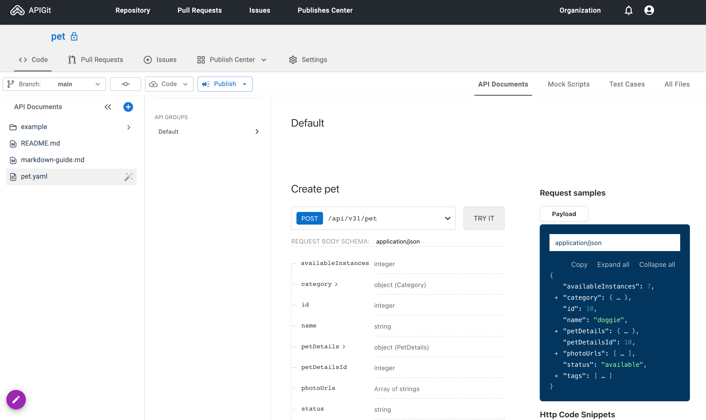
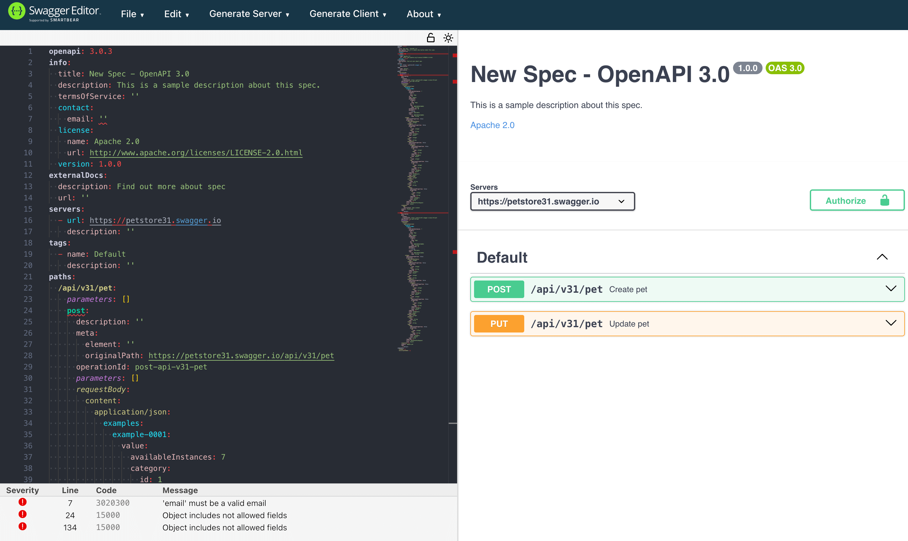

import { IconGrid } from "~/features/shared/recipes/IconGrid/IconGrid";
import { TypescriptFrameworkGuidesData } from "~/data/shared/frameworkGuides";
import { PythonFrameworkGuidesData } from "~/data/shared/frameworkGuides";
import { GoFrameworkGuidesData } from "~/data/shared/frameworkGuides";
import { JavaFrameworkGuidesData } from "~/data/shared/frameworkGuides";
import { PHPFrameworkGuidesData } from "~/data/shared/frameworkGuides";
import { getFilteredFrameworkData } from "~/data/shared/frameworkGuides";

# Server Framework Guides

Here, you'll find a comprehensive collection of step-by-step guides for generating OpenAPI specs for popular server frameworks in various languages. Or read our guide below for advice on how to generate an OpenAPI schema from your existing code base.

<IconGrid {...TypescriptFrameworkGuidesData} />

<IconGrid {...PythonFrameworkGuidesData} />

<IconGrid {...GoFrameworkGuidesData} />

<IconGrid {...JavaFrameworkGuidesData} />

<IconGrid {...PHPFrameworkGuidesData} />

# How to generate an OpenAPI schema from your code

An [OpenAPI schema](https://www.openapis.org/) (also called an OpenAPI specification) is a text description of your web service in detail. Your customers and automated tools can use this document to interact with your service with the confidence that they know exactly what each operation does and how to use it.

Some companies start designing their software service in an OpenAPI schema and use that schema to generate their server code. This is called the schema-first approach.

But it's more likely you started building software to service a market, then realized the benefits of providing OpenAPI tools to your clients, and now want to know how to create and maintain an OpenAPI schema from your existing server code. This is the code-first approach. This guide will explain how to generate a schema from code, and link to all the necessary tools in the programming language you use.

But first, let's summarize the benefits of using OpenAPI and the variations of the code-first approach that you can choose from.

## The benefits of OpenAPI

If you don't have an OpenAPI schema, you still need to write documentation, with examples, explaining to your clients how they can call your API. You also need to update this documentation whenever the code changes on your server.

Writing this documentation in the standard OpenAPI format provides the following benefits:

- Enables your clients to browse the schema in their tool of choice, such as [Swagger UI](https://swagger.io/tools/swagger-ui), with good usability.
- Allows the schema to be used for automatic SDK generation, enabling your clients to call your server directly from code without needing to handle REST web calls or use curl. Even if you don't generate an SDK, using an OpenAPI schema to validate the code that clients use to call your service can reduce confusion and errors.
- Supports the generation of server code stubs with statically typed request parameters and responses that you can use to validate that your server code matches the schema.

## Different workflows to support OpenAPI

If you take a code-first approach, you can either annotate your existing code with special comments that an automated tool uses to generate an OpenAPI schema, or start coding in a meta-framework that generates both the server code and the OpenAPI schema. (We call it a meta-framework because it sits above both your code and your schema, controlling both.)

There are two types of annotation:

- Text comments, which are not part of the programming language in which your server is written.
- Attributes, which are valid code in the programming language.

Attributes are superior, as the compiler and your IDE can check that your annotations are syntactically valid code as you work. Attributes can also be refactored, unlike comments.

The danger of using annotations is human error. Programmers need to update annotations correctly whenever they change an operation, but they may forget to or make mistakes. Even when attribute annotations are syntactically correct, they may still describe the operation incorrectly. This will cause your code and schema to drift apart, potentially causing errors when clients try to call your API.

Using a meta-framework, on the other hand, automatically synchronizes your code and schema but requires writing code in the new framework, adding a compilation step, and learning a new tool.

A third option that falls between annotations and meta-frameworks is to use an OpenAPI-aware web framework. These frameworks are designed with native support for OpenAPI features and can automatically generate an OpenAPI schema from the code you write, usually with more detail than that provided in annotations. OpenAPI-aware frameworks, however, tend to be very new, and the most popular (and older) frameworks, like Django and Laravel, are not OpenAPI-aware.

Note that the workflow options we discuss here depend on the availability of tools to support them in your programming language. Popular web languages will have tools for a range of options, but obscure languages may not. You will also find it easier to use a statically typed language, like Go, than a dynamic one, like PHP.

The following process will probably work best for most companies wanting to support OpenAPI:

- Generate an OpenAPI schema for your code, as we describe in the rest of this article.
- Use the new schema as your principal source from now on and generate server code from the schema rather than the other way around. (There is a section explaining schema-first workflows at the end of this guide.)
- Generate SDKs from the schema to make it simple for your clients to call your API.

If you want to keep your code as the principal source, you may want to include an automated reminder in your version-control process to tell programmers to update annotations whenever they commit code.

## Four techniques to extract an OpenAPI schema

The next four sections will show you different ways to generate an OpenAPI schema document from your existing code by:

- Recording network traffic
- Adding comment annotations
- Adding attribute annotations and changing your code to use an OpenAPI-aware framework
- Rewriting your code using a meta-framework

Each technique varies depending on the programming language. This guide provides examples in Go, as it's a popular, statically typed language specifically designed for web services.

The first thing to check is whether your web server framework already natively supports OpenAPI. If it does, you can stop reading this article and follow the framework documentation on how to access the schema the framework automatically creates. If not, read on to discover your options.

If you don't have an API yet but want to learn about OpenAPI for future projects, choose a server framework and language with native OpenAPI support. Alternatively, start by documenting your proposed API as a schema using a Swagger tool, then use a framework that supports code generation from the schema.

## Use HAR and APIGit to generate a schema

The first way to create a schema is to use a tool that listens to your network calls and extracts the schema automatically from the HTTP calls it sees. Generating a schema from network traffic does not depend on programming language. The process is the same for all languages.

The benefit of this approach is that you don't have to manually read your code and document (potentially with mistakes) what the calling contract should be. Instead, the network tool will tell you what actual data is sent, allowing you to spot any unintended parameters when reading through the schema after creation.

The disadvantage is that you have to manually call every operation in your API with all possible parameters to ensure the generator records all variations and creates an accurate schema.

For smaller APIs, you might prefer manually adding annotations or writing code to generate a schema. But for any other project, we recommend using this network listener approach, even in conjunction with other approaches, as it provides an automated review of your existing API.

### HAR example

Let's use the standard Pet Store OpenAPI example to demonstrate how to use a network listener.

- Browse to https://petstore31.swagger.io/#/pet/addPet in a Chromium-based browser.
- Open the developer tools (F12) and select the **Network** tab.
- Select only **Fetch/XHR**.
- Click **Execute** in the web page to start a network call to the API to add a pet.
- In the developer tools, click the `pet` line that appears to see the details of the request and response.
  
- Also execute a pet update (PUT). (In reality, you want to call every endpoint in your API, but we don't need to do that now.)
- In the network tab, click the download arrow icon in the top row.
- Save an HAR file (HTTP archive) to your desktop.

[Several tools](https://openapi.tools) will convert HAR to an OpenAPI schema. We'll use APIGit.

- Browse to https://app.apigit.com.
- Create an account.
- Create a repository named `pet` (any name will do).
- In the sidebar, browse to **API Documents**, then click the plus sign to add a document.
- Upload the HAR file you saved previously.
- Set the path name to `pet.yaml`.
- Click **Create**.
- Download the YAML file. This is your OpenAPI schema.



You can view the schema in a text editor or in a more visually descriptive way in an OpenAPI editor.

- Browse to https://editor-next.swagger.io.
- Import your YAML file.



The editor will show errors and duplicated objects that could be moved into the components section and shared.

[Other network capture tools](https://tools.openapis.org/categories/all.html) are available. The all-in-one OpenAPI DevTools plugin from Chrome Web Store offers network recording and OpenAPI schema generation.

## Comment annotation

Once you know what all the operations and parameters for your API should be in OpenAPI terms – either by using the generator as discussed in the previous section or by reading the list of OpenAPI data types – you can annotate your existing code with comments. A generator will then use the comments to output an OpenAPI schema.

As mentioned in the introduction, we recommend using attribute annotations instead of comment annotations whenever possible. If your server framework doesn't support attribute annotations, this approach is an alternative option.

You should consider whether to continue using your existing framework or switch to one with native support for OpenAPI. In the long term, adding and maintaining annotations might be more or less work than rewriting and maintaining OpenAPI-aware code.

Comment annotation, like attribute annotation and using an OpenAPI meta-framework, depends on the programming language you use.

### Example comment annotation in Go

The tool used here is [go-swagger3](https://github.com/parvez3019/go-swagger3).

- In any folder on your computer, create a folder called `src`.
- Create a file in `src` called `main.go` and add the content below to it.
  ```go
  package main

  import (
	  "encoding/json"
	  "fmt"
	  "log"
	  "net/http"
  )

  type RequestBody struct {
	  Name string `json:"name"`
  }

  func main() {
	  mux := http.NewServeMux()
	  mux.HandleFunc("/hello", helloHandler)

	  log.Println("Server started on port 8080")
	  log.Fatal(http.ListenAndServe(":8080", mux))
  }

  func helloHandler(w http.ResponseWriter, r *http.Request) {
	  if r.Method != http.MethodPost {
		  http.Error(w, "Method not allowed", http.StatusMethodNotAllowed)
		  return
	  }

	  var requestBody RequestBody
	  err := json.NewDecoder(r.Body).Decode(&requestBody)
	  if err != nil {
		  http.Error(w, "Bad request", http.StatusBadRequest)
		  return
	  }

	  response := fmt.Sprintf("Hello %s", requestBody.Name)
	  w.Header().Set("Content-Type", "text/plain")
	  w.Write([]byte(response))
  }
  ```
	This minimal web service has a single POST endpoint, `/hello` that says hello to the name sent as a string parameter called `name`.
- Build and run the service with the commands below to see that it works. You don't need to install Go on your machine, but you do need Docker. Docker will run Go in a container in a security sandbox so it has no access to the rest of your files. You then call the service in the terminal with curl.
  ```sh
  docker run --rm  -v $(pwd)/src:/app -w /app golang:1.23-alpine3.19 /bin/sh -c   "go mod init helloworld && go mod vendor && go build"

  docker run --rm -p 65000:8080 -v $(pwd)/src:/app -w /app golang:1.23-alpine3.19     ./helloworld

  # In a new terminal
  curl -X POST -H "Content-Type: application/json" -d '{"name":"John"}' http://localhost:65000/hello

  # Output
  # Hello John
  ```

Now let's update the web service with some OpenAPI comments.

- Update `main.go`, adding the following at the top of the file:
  ```go
  // @Version 1.0.0
  // @Title Hello API
  // @Description Testing Go OpenAPI frameworks
  package main
  ...
  ```
- Add comments above the operation:
  ```go
  // @Title Hello
  // @Description Say hi to the name given
  // @Param  name  body  RequestBody   true  "Any name"
  // @Success  200 {string} string "Responds with 'Hello {name}'"
  // @Route /helloHandler [post]
  func helloHandler(w http.ResponseWriter, r *http.Request) {
  ...
  ```

To generate a schema from this file, you can either install go-swagger3 in the standard Go container you just used or use the dedicated go-swagger3 Docker image. The first option requires redownloading the Go modules each time, as they are not stored in your project `vendor` folder.

Run one of the two commands below.

  ```sh
  docker run --rm -v $(pwd)/src:/app -w /app golang:1.23-alpine3.19 /bin/sh -c "go install github.com/parvez3019/go-swagger3@latest && /go/bin/go-swagger3 --main-file-path /app/main.go --module-path . --output oas.json --schema-without-pkg --generate-yaml true"

  # OR use dedicated docker image
  docker run -t --rm -v $(pwd)/src:/app -w /app parvez3019/go-swagger3:latest --main-file-path /app/main.go --module-path . --output oas.json --schema-without-pkg --generate-yaml true
  ```

In your `src` folder, you'll now have a schema called `oas.yml`:

```yml
components:
  schemas:
	RequestBody:
	  properties:
		name:
		  type: string
	  type: object
info:
  description: Say hi to the name given
  title: Hello
  version: 1.0.0
openapi: 3.0.0
paths:
  /helloHandler:
	post:
	  description: ' Say hi to the name given'
	  requestBody:
		content:
		  application/json:
			schema:
			  $ref: '#/components/schemas/RequestBody'
		required: true
	  responses:
		"200":
		  content:
			application/json:
			  schema:
				type: string
		  description: Responds with 'Hello {name}'
	  summary: Hello
servers:
- description: Default Server URL
  url: /
```

## Attribute annotation

All the considerations raised about comment annotations in the previous section also apply to attribute annotations, except that attribute annotations are safer than comment annotations as they can be parsed by a compiler.

### Example attribute annotation with an OpenAPI-aware framework in Go

To demonstrate attribute annotation, we'll use a framework called [Huma](https://huma.rocks/), which [supports many Go routers](https://huma.rocks/features/bring-your-own-router). Unlike a simple annotation plugin that sits above your existing code, Huma requires you to alter your operations to use the Huma context object. While Huma doesn't support the standard Go `net/http` router, it does support the more complex `mux` handler.

If you'd like to follow along, use the existing `main.go` file from the previous section.

First, install Huma:

  ```sh
  docker run --rm -v $(pwd)/src:/app -w /app golang:1.23-alpine3.19    go get github.com/danielgtaylor/huma/v2 github.com/danielgtaylor/huma/v2/adapters/humago
  ```

Update `main.go` to use Huma with the changes below.

  ```go
  package main

  import (
	  // "encoding/json"
	  "fmt"
	  "log"
	  "net/http"

	  "context"
	  "github.com/danielgtaylor/huma/v2" // NEW
	  "github.com/danielgtaylor/huma/v2/adapters/humago"
  )

  type RequestBody struct {
	  // Name string `json:"name"`
	  Body struct {
		Name string `json:"name" maxLength:"30" example:"world" doc:"Name to greet"`
	}
  }

  //NEW
  type ResponseBody struct {
	Body struct {
		Message string `json:"message"`
	}
  }

  func main() {
	  mux := http.NewServeMux()
	  api := humago.New(mux, huma.DefaultConfig("Hello API", "1.0.0")) // NEW
	huma.Post(api, "/hello", helloHandler) // NEW

	  log.Println("Server started on port 8080")
	  log.Fatal(http.ListenAndServe(":8080", mux))
  }

   // NEW
  func helloHandler(ctx context.Context, input *RequestBody) (*ResponseBody, error) {
	response := &ResponseBody {
		Body: struct { Message string `json:"message"`}{
			Message: fmt.Sprintf("Hello %s", input.Body.Name),
		},
	}
	  return response, nil
  }
  ```

Note that the code above has changed the request and response types to have a `Body` section. Huma returns a schema object in the response at the same level as `Body`. The `main` function no longer uses the router in the same way, but now uses Huma to declare routes.

Now run the server.

  ```sh
  docker run --rm  -p 65000:8080 -v $(pwd)/src:/app -w /app golang:1.23-alpine3.19 /bin/sh -c   "go build && ./helloworld"

  # In a new terminal:
  curl -X POST -H "Content-Type: application/json" -d '{"name":"John"}' http://localhost:65000/hello

  # Output
  # {"$schema":"http://localhost:65000/schemas/ResponseBodyBody.json","message":"Hello John"}
  ```

Browse to http://localhost:65000/docs#/operations/post-hello to see the generated schema in a Swagger-like viewer.

  

## Using an OpenAPI meta-framework

The final option is to manually rewrite your server router in a meta-framework, and use that framework to generate a schema and new server code. For Go, this framework is called Goa. Speakeasy has an article demonstrating the process [here](/openapi/frameworks/goa).

In brief, the code you'll write is Go, but it is neither normal server code nor OpenAPI in YAML. It looks like the Go description of a schema below.

```go
var _ = Service("order", func() {
	Description("A waiter that brings drinks.")
	Method("tea", func() {
		Description("Order a cup of tea.")
		Payload(func() {
			Field(1, "isGreen", Boolean, "Whether to have green tea instead of normal.")
			Field(2, "numberSugars", Int, "Number of spoons of sugar.")
			Field(3, "includeMilk", Boolean, "Whether to have milk.")
		})
		Result(String)
		HTTP(func() {
			Meta("openapi:tag:Drink operations")
			POST("/tea")
		})
		GRPC(func() {
		})
	})
	Files("/openapi.json", "./gen/http/openapi.json")
})
```

Using an OpenAPI meta-framework to generate a schema is highly dependent on the programming language you use, as most languages don't have tools like Goa available (see the list of tools in the next section). A meta-framework is a great tool for maintaining server code separately from your schema (unlike using annotations), with the added advantage that it allows business analysts to understand and edit API contracts without needing to know a programming language in detail. It also makes the code to be maintained isolated and small, compared to annotating your entire server codebase.

The disadvantage of this approach is that you will be heavily dependent on the framework you choose, and that it's regularly maintained to fix bugs in generation and stay current with changes to OpenAPI. You will also be choosing a tool that's built on top of another tool. It might be easier for your team to stick with a popular web framework and simple OpenAPI annotations. Evaluate the framework you are considering and the quality of its outputs in a short test to decide if you like this approach.

## Tools available in each language

Now that you have seen the options you can choose from to generate an OpenAPI schema, you need to see if the tools you need are available for your language. In this final section, we list all the best tools we have found, ignoring repositories that haven't been updated in a year.

### C#, F#, and .NET

The .NET framework has two libraries you can use to generate OpenAPI schemas: [OpenAPI.NET](https://github.com/microsoft/openapi.net) and [NSwag](https://github.com/ricosuter/nswag).

Microsoft has official tutorials on both:

- [Generate OpenAPI documents with the `Microsoft.AspNetCore.OpenApi` package](https://learn.microsoft.com/en-us/aspnet/core/fundamentals/openapi/aspnetcore-openapi?view=aspnetcore-8.0&tabs=visual-studio%2Cminimal-apis)
- [Get started with NSwag and ASP.NET Core](https://learn.microsoft.com/en-us/aspnet/core/tutorials/getting-started-with-nswag?view=aspnetcore-8.0&tabs=visual-studio)

The `AspNetCore.OpenApi` package allows you to add attributes to your code. NSwag can generate client and server code, too.

### Go

[go-swagger3](https://github.com/parvez3019/go-swagger3) creates OpenAPI schemas for Go code based on text comments.

[Huma](https://huma.rocks) is a combination of annotations and an OpenAPI-aware framework that allows you to add attributes to your API to generate a schema and serve documentation for it.

[Fuego](https://go-fuego.github.io/fuego/docs/guides/openapi) is an OpenAPI-aware web framework. The [`swaggest/rest`](https://github.com/swaggest/rest) package, based on the Chi web framework, and [GoAPI](https://github.com/hvuhsg/goapi) offer similar functionality.

[Goa](https://goa.design/learn/getting-started) is a meta-framework that allows you to write an API design in Go code, which it then compiles into web server code and an OpenAPI schema.

[ogen](https://ogen.dev/docs/intro) generates data types and server and client code from an OpenAPI schema, but not an OpenAPI schema.

### JavaScript

JavaScript does not have static typing, but you can add type hints in text comments using [JSDoc](https://jsdoc.app/about-getting-started).

[swagger-jsdoc](https://github.com/Surnet/swagger-jsdoc) will convert your JSDoc annotations to an OpenAPI schema.

[hapi-swagger](https://github.com/hapi-swagger/hapi-swagger) adds OpenAPI features to the hapi web framework by using JSON descriptions of routes.

### TypeScript

[Tsoa](https://tsoa-community.github.io/docs/getting-started.html#configuring-tsoa-and-typescript) is similar to Goa — a meta-framework in TypeScript that will output server code and an OpenAPI schema.

[swagger-docs](https://github.com/AmishFaldu/swagger-docs/wiki/Getting-Started) creates an OpenAPI schema for you from TypeScript attributes.

### PHP

[OpenAPI PHP Attributes Generator](https://github.com/uderline/openapi-php-attributes) is a code-first tool that generates an OpenAPI schema from annotations.

[Swagger-PHP](https://zircote.github.io/swagger-php/) generates an OpenAPI schema from code attributes or comment annotations.

If you're using Laravel, you can use [Scramble](https://scramble.dedoc.co) to generate an OpenAPI schema without needing to add annotations. [Scribe](https://scribe.knuckles.wtf) is similar.

[API Platform](https://api-platform.com/), which works with Laravel and Symfony, provides OpenAPI features using your existing code, extended by attributes.

[PSX](https://phpsx.org/docs/intro) is an OpenAPI-aware web framework.

### Python

[drf-spectacular](https://drf-spectacular.readthedocs.io/en/latest/readme.html) automatically generates an OpenAPI schema from your Django code. You can add more information to your code with the `@extend_schema` attribute.

[FastAPI](https://fastapi.tiangolo.com) is an OpenAPI-aware web framework.

### Rust

[Poem](https://docs.rs/poem-openapi/latest/poem_openapi/) is the only Rust web framework that is OpenAPI-aware. Poem automatically generates an OpenAPI schema for you and serves it through the Swagger UI at your site `/docs`.

The three most popular web frameworks, axum, Actix Web, and Rocket, don't support OpenAPI yet, though they are working on it. For these, you should add OpenAPI attribute annotations with [utoipa](https://github.com/juhaku/utoipa). The Axum team has been working to elegantly integrate with utoipa. Take a look at an example [here](https://github.com/juhaku/utoipa/blob/master/examples/axum-utoipa-bindings/src/main.rs).

### Java

For frameworks that support the Jakarta RESTful Web Services specification (JAX-RS), formerly Java API for RESTful Web Services, you can use [Swagger Core](https://github.com/swagger-api/swagger-core/wiki/Swagger-2.X---Getting-started) to automatically generate an OpenAPI schema from code annotations.

[Swagger Parser](https://github.com/swagger-api/swagger-parser) will generate Java objects when given an OpenAPI schema. [guardrail](https://github.com/guardrail-dev/guardrail) will generate server code for you from your OpenAPI schema and supports Spring and Dropwizard. [openapi-processor](https://openapiprocessor.io/oap/home.html) will generate Java objects and server code interfaces in Spring or Micronaut, given an OpenAPI schema.

### Scala

If you're working in Scala, you can use the tools described in the Java section or the Scala-specific tools described below.

[endpoints4s](https://endpoints4s.github.io/quick-start.html) is a meta-framework that describes your API in code. You reference this code as a shared project in your client and server code, then implement the functions the API description specifies. endpoints4s will also generate an OpenAPI schema for you. Note that endpoints4s will not generate any code for you.

[SBT OpenApi Schema Codegen](https://github.com/eikek/sbt-openapi-schema) will generate the `/components/schema` types from your OpenAPI schema in Scala.

[Guardrail](https://github.com/guardrail-dev/guardrail) is a schema-first tool that will generate server code for you from your OpenAPI schema. It supports Akka, Dropwizard, and http4s.

### Kotlin

[Fabrikt](https://github.com/cjbooms/fabrikt) is a schema-first tool that generates data classes and interfaces for server and client code.


## The schema-first workflow

The alternative to a code-first approach is schema-first. If you treat your OpenAPI schema as your principal source after writing it or generating it from your code, and generate server code from it thereafter, then your code and schema will always be synchronized. While this approach is similar to the meta-framework approach, it provides a schema that's easier to read for non-programmers, though it may not be able to generate the framework's more specific features. A schema-first approach also allows you to add detailed text descriptions to help clients understand what your service endpoint does, which you may not be able to do in code.

Generating server code doesn't mean that you have to overwrite your existing code. You can use the generated code merely as an interface, or contract, to call your underlying code and check that all its requests and responses are of the expected types.

## Further reading

While there are a few tools listed above that do more than generate a schema from code, there are hundreds of OpenAPI tools and services available. Tools that validate code against schemas, create contracts, generate server code from a schema, and create and run tests. To see what's available, visit:

- https://tools.openapis.org/categories/all.html
- https://openapi.tools

