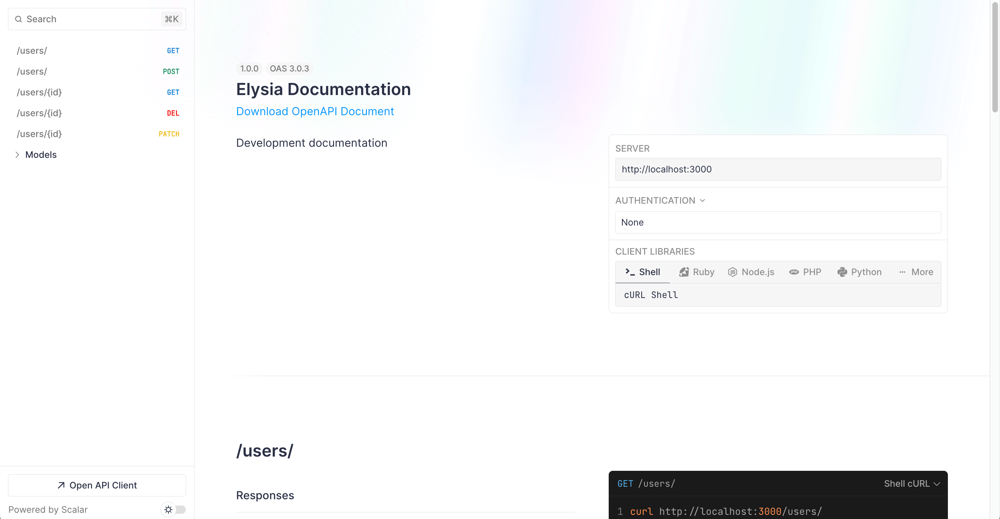
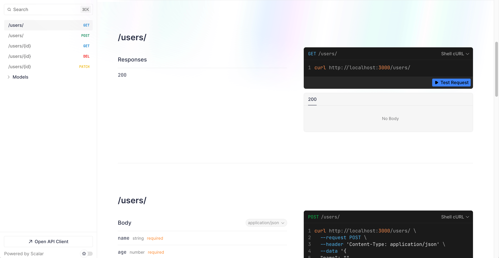
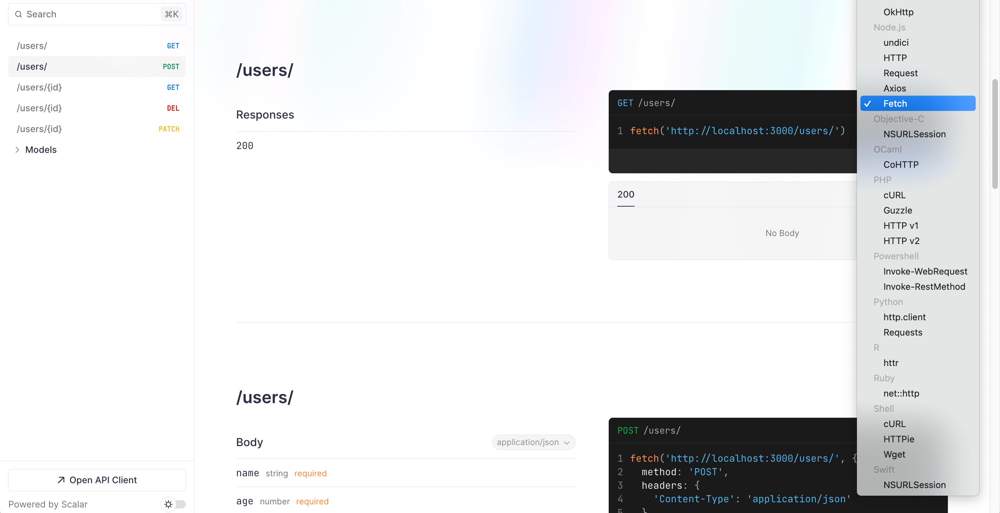
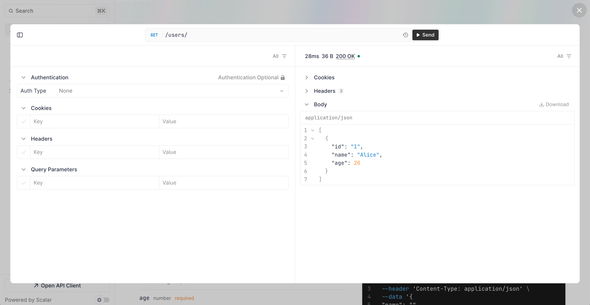
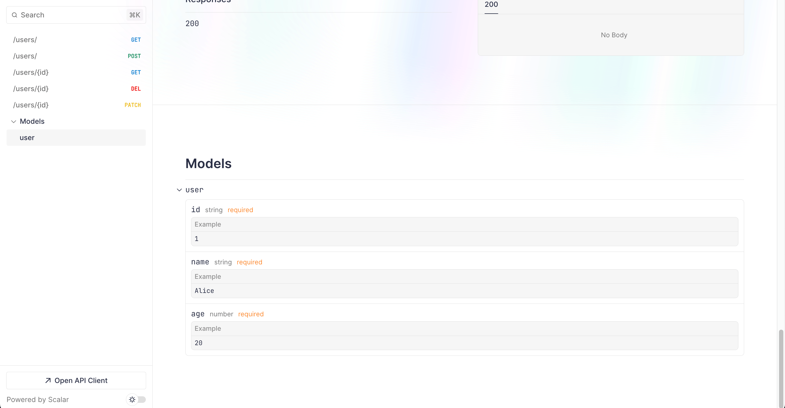
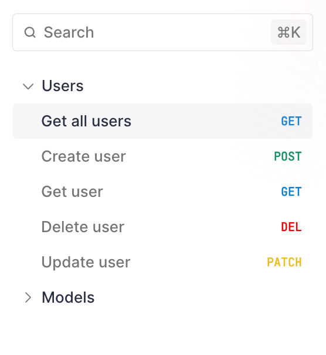
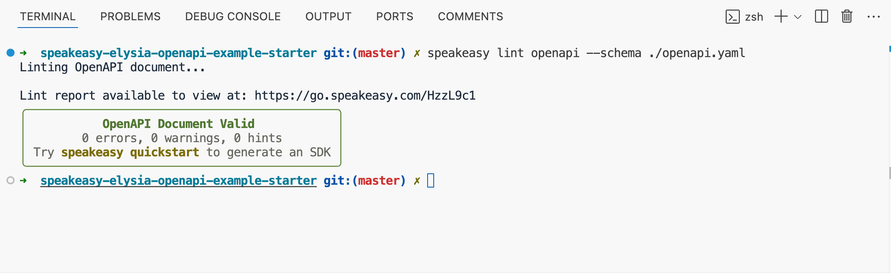

import { Callout } from "~/components";

# How to generate an OpenAPI document with ElysiaJS

This guide walks you through generating an OpenAPI document for an [ElysiaJS](https://elysiajs.com/) API and using Speakeasy to create an SDK based on the generated document.

Here's what we'll do:

1. Add a Swagger endpoint, which uses Scalar UI, to an Elysia Bun app using the Elysia Swagger plugin.
3. Improve the OpenAPI document to prepare it for code generation.
4. Convert the JSON OpenAPI document to YAML.
5. Use the Speakeasy CLI to generate an SDK based on the OpenAPI document.
6. Add a Speakeasy OpenAPI extension to improve the generated SDK.

We'll also take a look at how you can use the generated SDK.

Your Elysia project might not be as simple as our example app, but the steps below should translate well to any Elysia project.

## The OpenAPI generation pipeline

The Elysia [Swagger plugin](https://github.com/elysiajs/elysia-swagger) generates a Swagger API documentation endpoint. By default, Elysia uses the OpenAPI Specification and [Scalar UI](https://scalar.com/), an open-source interactive document UI for OpenAPI.

We'll first add the Swagger plugin to an existing Elysia app.

Then, we'll improve the plugin-generated OpenAPI document according to Speakeasy [best practices](https://www.speakeasy.com/docs/best-practices). The quality of an OpenAPI document determines the quality of the SDKs and documentation it's used to create.

Next, we'll use Speakeasy to generate an SDK based on the OpenAPI document. 

Finally, we'll use a simplified example to demonstrate how to use the generated SDK and how to add SDK creation to a CI/CD pipeline so that Speakeasy automatically generates fresh SDKs whenever your Elysia API changes in the future.

## Requirements

This guide assumes that you have an existing Elysia app and basic familiarity with Elysia.

<Callout title="Example repository" variant="info">
If you don't have an Elysia app or if you want to follow the guide step by step, you can clone the [Speakeasy ElysiaJS example repo](https://github.com/speakeasy-api/elysia-openapi-example) to access the example code used in this tutorial. The `initial-app` branch contains the initial state of the app that we'll use to start this tutorial.
</Callout>

The following should be installed on your machine:

- [Bun](https://bun.sh/): The Node.js alternative that Elysia is built on.
- [Speakeasy CLI](https://www.speakeasy.com/docs/speakeasy-cli/getting-started): The tool you'll use to generate an SDK from the OpenAPI document.

## Adding the Swagger plugin to an Elysia project

The Elysia Swagger plugin automatically generates an API documentation page for your server.

First, install the Swagger plugin:

```bash Terminal
bun add @elysiajs/swagger
```

Import the plugin, then register it by passing in an instance of `swagger` to the `use()` method and chaining the `use()` method to the `Elysia` instance:

```typescript index.ts
import { Elysia } from 'elysia'
import { users } from './controllers/users';
// !mark
import { swagger } from '@elysiajs/swagger'

const app = new Elysia()
  .onError(({ error, code }) => {
    console.log({code})
    if (code === 'NOT_FOUND') return 'Not Found :('
    if (code === 'VALIDATION') return 'Invalid user'
    console.error(error);
  })
  .use(users)
  // !mark
  .use(swagger())
  .listen(3000)
```

In Elysia, a [plugin](https://elysiajs.com/essential/plugin) is a reusable component. In fact, everything in Elysia is a component, including Elysia instances, plugins, routers, stores, and more. Components split apps into small pieces, making it easier to add, remove, or modify app features. It's important that we use [method chaining](https://elysiajs.com/key-concept.html#method-chaining) for type inference in our Elysia code. In the above code block, we use the `onError` lifecycle method to catch any error that's thrown on the server. 

Run the Bun development server with `bun run dev` and open `http://localhost:3000/swagger` to see the Scalar UI with five API endpoints:



The API routes are listed in the navigation pane on the left. Click  **`/users/` GET** to navigate to the section for the `/users/` GET request API endpoint:



Each section shows information about an API endpoint, such as its path parameters, body, and responses.

The code block on the right shows an example curl request. Click the **Shell cURL** dropdown menu to change the language or library used in the example request:



Click the **Test Request** button to open an API client that lets you test your API endpoints. Then, click **Send** to test the request:



In the response, you should get an array containing one user. 

The user data in the Elysia server is stored temporarily in a singleton `Users` class :

```typescript users.ts
class Users {
  constructor(
    public data: UserInfo[] = [
      {
        id: "1",
        name: "Alice",
        age: 20
      }
    ]
) {}
```

This class is added to the `Elysia` instance using the 
[`decorate`](https://elysiajs.com/essential/handler.html#decorate) method:

```typescript users.ts mark=2
export const users = new Elysia({ prefix: '/users' })
  .decorate('users', new Users())
```

This adds the `Users` class to the [context](https://elysiajs.com/essential/handler.html#context) that contains information for each request. You can access the context in route handlers.

## Viewing the OpenAPI document and modifying its root object

Open `http://localhost:3000/swagger/json` to view the OpenAPI document in JSON format:

```json
{
  "openapi": "3.0.3",
  "info": {
    "title": "Elysia Documentation",
    "description": "Development documentation",
    "version": "0.0.0"
  },
  "paths": {
    "/users/": {
      "get": {
        "operationId": "getUsers",
        "responses": {
          "200": {
            
          }
        }
      },
      "post": {
     // ...
```

Add the following TypeScript configuration option to your `tsconfig.json` file to enable JSON file imports:

```json tsconfig.json
 "resolveJsonModule": true,
```

Add the following configuration object to the `swagger` plugin:

```typescript index.ts
import { Elysia } from 'elysia';
import { users } from './controllers/users';
import { swagger } from '@elysiajs/swagger';
// !mark
import packageJson from '../package.json';

const app = new Elysia()
  .onError(({ error, code }) => {
    if (code === 'NOT_FOUND') return 'Not Found :(';
    if (code === 'VALIDATION') return 'Invalid user';
    console.error(error);
  })
  .use(users)
  .use(
    // !mark(2:12)
    swagger({
      documentation: {
        info: {
          title: 'Users app documentation',
          version: packageJson.version,
        },
        externalDocs: {
          description: 'Find out more about the Users API',
          url: 'www.example.com',
        },
      }
    })
  )
  .listen(3000)
```

This configures the [root document object](https://swagger.io/specification/v3/#openapi-object) of the OpenAPI document.

The `info` object is a required property used to add metadata about the API. The `externalDocs` object lets you extend your documentation by referencing an external resource.

Note that the API operation for each path has an `operationId` value that's named by combining the HTTP request type and the name of the path. The value can be modified using the [`detail`](https://elysiajs.com/recipe/openapi.html#operationid) field in a route; however, we won't modify it in this guide, as Elysia produces consistently named, human-readable `operationId` values.

The `operationId` is the identifier for an operation. It is case sensitive and must be unique within the document. The Speakeasy SDK, which we'll use later in this guide, uses it during code generation to name the method it generates for the operation.

## OpenAPI Specification versions supported by Elysia and Speakeasy

Speakeasy currently supports the OpenAPI Specification versions 3.0.x and 3.1.x and recommends you use version 3.1, as it's fully compatible with [JSON Schema](https://json-schema.org/), which gives you access to a large ecosystem of tools and libraries.

However, we use OpenAPI Specification version 3.0.3 in this guide, as it is the version Elysia supports.

To check which version you are using, open `http://localhost:3000/swagger/json` and see the OpenAPI Specification version in the root document object.

## Adding example data to a data model and the POST request body

The API routes in the Scalar UI don't have example values for the path parameters, requests, or responses. The `user` model doesn't have example values either. It's important to add examples to make your API more user-friendly.

Let's start by adding example values to the `userInfo` model:

```typescript users.ts
const userInfo = t.Object({
  id: t.String({
    example: '1'
  }),
  name: t.String({
    example: 'Alice'
  }),
  age: t.Number({
    example: 20
  })
}, {
  title: 'User',
  description: 'User object',
  example: 
    {
      id: "1",
      name: "Alice",
      age: 20
    }
});
```

The Elysia schema builder, `t`, gives compile-time and runtime type safety. It also registers the model as a reusable OpenAPI [Components Object](https://swagger.io/specification/v3/#components-object) schema, which you can see at the bottom of your OpenAPI document:

```json
"components": {
  "schemas": {
    "user": {
      "example": {
        "id": "1",
        "name": "Alice",
        "age": 20
      },
      "type": "object",
      "properties": {
        "id": {
          "example": "1",
          "type": "string"
        },
        "name": {
          "example": "Alice",
          "type": "string"
        },
        "age": {
          "example": 20,
          "type": "number"
        }
      },
      "required": [
        "id",
        "name",
        "age"
      ]
    }
  }
}
```

You'll also see the example values in the **`user`** model in the Scalar UI:



The `userInfo` schema is used in the `post()` and `patch()` routes. Elysia HTTP request methods accept three arguments: the path, the function used to respond to the client, and the hook used to define extra metadata. Add an example to the `body` in the hook object of the `post()` route:

```typescript users.ts mark=4:9
body: 
  t.Omit(
    userInfo, ['id'], 
    {
      example: {
        name: "Alice",
        age: 20
      }
    }
  ),
```

If you look at your OpenAPI document now, you'll see that the `content` of the POST request body has three possible types: `application/json`, `multipart/form-data`, or `text/plain`. To limit it to `application/json`, set the `type` in the hook object of the `post()` route:

```typescript users.ts mark=14
.post('/',({ users, body: user }) =>
  users.add(user),
  {
    body: 
      t.Omit(
        userInfo, ['id'], 
        {
          example: {
            name: "Alice",
            age: 20
          }
        }
      ),
    type: 'json',
```

## Adding extra information to a route using the detail field

The [`detail`](https://elysiajs.com/recipe/openapi.html#detail) field is used to define a route for the OpenAPI document. It extends the [OpenAPI Operation Object](https://swagger.io/specification#operation-object), which describes an API operation within a path.

Add the following `detail` field to the hook object of the `post()` route:

```typescript users.ts  mark=2:5
type: 'json',
detail: { 
  summary: 'Create user', 
  description: 'Add user to the database',
},
```

Add the following `responses` property to the `detail` object:

```typescript users.ts
responses: {
  200: {
    description: 'The created users assigned id',
    content: {
      'application/json': {
        schema: {
          $ref: '#/components/schemas/id',
        },     
        examples: {
          "Created user": {
            value: {
              id: "1",
              name:  "Alice",
              age: 20
            }
          }
        }
      }
    },
  },
},
```

The [Responses Object](https://swagger.io/specification/#responses-object) is used to list the possible responses returned from the POST request. There is one possible response listed - a successful response. This response has a [`schema`](https://swagger.io/specification/#schema-object) that defines the content of the response. The `id` schema is referenced using [`$ref`](https://swagger.io/specification/#reference-object), the reference identifier that specifies the URI location of the value being referenced. Let's define this `id` model.

Add the following `idObject` model to the `users.ts` file, below the `userInfo` model:

```typescript users.ts
const idObject = t.Object({
  id: t.String({
    example: '1'
  })
}, {
  title: 'ID object',
  description: 'ID object',
  example: 
    {
      id: "1"
    }
});
```

Create a [reference model](https://elysiajs.com/tutorial.html#reference-model) for the model:

```typescript users.ts mark=5
export const users = new Elysia({ prefix: '/users' })
  .decorate('users', new Users())
  .model({
    user: userInfo,
    id: idObject,
  })
```

A reference model lets us reuse a model by referencing its name.

It's also good practice to add possible error responses. Add the following `500` response to the `responses` property:

```typescript users.ts
500: {
  description: 'Server error',
  content: {
    'application/json': {
      schema: {
        $ref: '#/components/schemas/errorResponse'
      },
      examples: {
        "Server error": {
          value: {
            message: 'There was an error',
            status: 500
          }
        }
      }
    }
  }
}
```

Add the definition for the `errorResponse` model below the `idObject` model:

```typescript users.ts
const errorResponse = t.Object({
  status: t.Number({
    example: 404
  }),
  message: t.String({
    example: 'User not found :('
  })
}, {
  title: 'Error response',
  description: 'Error response object',
  example: 
    {
      status: 404,
      message: 'User not found :('
    }
});
```

Create a reference model for the `errorResponse` model:

```typescript users.ts mark=6
export const users = new Elysia({ prefix: '/users' })
  .decorate('users', new Users())
  .model({
    user: userInfo,
    id: idObject,
    errorResponse: errorResponse,
  })
```

You'll now see example responses for the **Create user** POST route in Scalar:


## Adding OpenAPI tags to routes

We recommend adding tags to all your Elysia routes. This allows you to group the routes according to tag in the generated SDK code and documentation.

### Adding OpenAPI tags to routes in Elysia

To add OpenAPI tags to a route, use the `tags` property to pass in an array of tags in the hook object of the `post()` route:

```typescript users.ts
tags: ['Users']
```
 
### Adding tags to the root OpenAPI document object and adding metadata to tags

Add the following `tags` array to the configuration object of the `swagger` plugin:

```typescript index.ts mark=13:20
  .use(
    swagger(
      {
      documentation: {
        info: {
          title: 'Users app documentation',
          version: packageJson.version,
        },
        externalDocs: {
          description: 'Find out more about the Users API',
          url: 'www.example.com',
        },
        tags: [{
          name: 'Users',
          description: 'Users operations',
          externalDocs: {
            description: 'Find more info here',
            url: 'https://example.com',
          },
        }],
      }
    })
  )
```

This adds a `tags` array to the root OpenAPI document object. In the above code, we add metadata to the tag by passing in a [Tag Object](https://swagger.io/specification/#tag-object) (instead of a string) to the tag array item.

After adding tags to your routes, you'll see that they are organized by tags in Scalar:



## Adding example data, extra information, and tags to the other API routes

Let's improve the other API route operations like we improved the **Create user** route.

Replace the **Get all users** route with the following lines of code:

```typescript users.ts mark=2:58
.get('/', ({ users }) => users.data, 
  {
    detail: { 
      summary: 'Get all users', 
      description: 'Get all users from the database',
      responses: {
        200: {
          description: 'The array of users',
          content: {
            'application/json': {
              schema: {
                type: 'array',
                items: {
                  $ref: '#/components/schemas/user'
                },
              },    
              examples: {
                basic: {
                  value: [
                    {
                      id: "1",
                      name: "Alice",
                      age: 20
                    },
                    {
                      id: "2",
                      name: "Bob",
                      age: 25
                    }
                  ]
                }
              }    
            }
          },
        },
        500: {
          description: 'Server error',
          content: {
            'application/json': {
              schema: {
                $ref: '#/components/schemas/errorResponse'
              },
              examples: {
                "Server error": {
                  value: {
                    message: 'There was an error',
                    status: 500
                  }
                }
              }
            }
          }
        }
      },
      tags: ['Users'] 
    },
  }
)
```

Replace the **Get user** route with the following lines of code:

```typescript users.ts mark=5:53
.get('/:id',({ users, params: { id }, error }) => {
    return users.data.find(user => user.id === id) ?? error(404, 'User not found :(')
  },
  {
    params: 'id',
    detail: { 
      summary: 'Get user', 
      description: 'Get user by id from the database',
      responses: {
        200: {
          description: 'The user object',
          content: {
            'application/json': {
              schema: {
                $ref: '#/components/schemas/user',
              },     
              examples: {
                basic: {
                  value: 
                    {
                      id: "1",
                      name: "Alice",
                      age: 20
                    }
                }
              }   
            }
          },
        },
        404: {
          description: 'User not found',
          content: {
            'application/json': {
              schema: {
                $ref: '#/components/schemas/errorResponse'
              },
              examples: {
                "User not found": {
                  value: {
                    message: 'User not found :(',
                    status: 404
                  }
                }
              }
            }
          }
        }
      },
      tags: ['Users'] 
    },
  },
)
```

Replace the **Delete user** route with the following lines of code:

```typescript users.ts mark=5:49
.delete('/:id', ({ users, params: { id }, error }) => {
    return users.remove(id) ?? error(422, 'Invalid user')
  },
  {
    params: 'id',
    detail: { 
      summary: 'Delete user', 
      description: 'Delete user by id from the database',
      responses: {
        200: {
          description: 'Deleting user was successful',
          content: {
            'application/json': {
              schema: {
                $ref: '#/components/schemas/successResponse'
              },       
              examples: {
                success: {
                  value: {
                    success: true
                  }
                }
              }    
            }
          },
        },
        422: {
          description: 'Invalid user',
          content: {
            'application/json': {
              schema: {
                $ref: '#/components/schemas/errorResponse'
              },
              examples: {
                "Invalid user": {
                  value: {
                    message: 'Invalid user',
                    status: 422
                  }
                }
              }
            }
          }
        }
      },
      tags: ['Users'] 
    },
  }   
) 
```

Add the definition for the `successResponse` model below the `errorResponse` model:

```typescript users.ts
const successResponse = t.Object({
  success: t.Boolean({
    example: true
  })
}, {
  title: 'Success response',
  description: 'Success response object',
  example: 
    {
      success: true
    }
});
```

Create a reference model for the `successResponse` model:

```typescript users.ts mark=7
export const users = new Elysia({ prefix: '/users' })
  .decorate('users', new Users())
  .model({
    user: userInfo,
    id: idObject,
    errorResponse: errorResponse,
    successResponse: successResponse
  })
```

Replace the **Update user** route with the following lines of code:

```typescript users.ts mark=7:63
.patch(
  '/:id',({ users, params: { id }, body: user, error }) => {
    return users.update(id, user) ?? error(422, 'Invalid user')
  },
  {
    params: 'id',
    body: 
      t.Partial(
        t.Omit(
          userInfo, ['id'], 
          {
            example: {
              age: 21
            }
          }
        ),
      ),
    type: 'json',
    detail: { 
      summary: 'Update user', 
      description: 'Update user by id from the database',
      responses: {
        200: {
          description: 'Update was successful',
          content: {
            'application/json': {
              schema: {
                $ref: '#/components/schemas/successResponse'
              },       
              examples: {
                Success: {
                  value: {
                    success: true
                  }
                }
              }  
            }
          },
        },
        422: {
          description: 'Invalid user',
          content: {
            'application/json': {
              schema: {
                $ref: '#/components/schemas/errorResponse'
              },
              examples: {
                "Invalid user": {
                  value: {
                    message: 'Invalid user',
                    status: 422
                  }
                }
              }
            }
          }
        }
      },
      tags: ['Users'] 
    },
  }
)
```

## Adding a list of servers to the Elysia OpenAPI document

When validating an OpenAPI document, [Speakeasy expects a list of servers](https://www.speakeasy.com/docs/best-practices#openapi-best-practices) at the root of the document.

Add a server by adding a `servers` property to the configuration object of the `swagger` plugin:

```typescript index.ts mark=13:18
.use(
  swagger(
    {
    documentation: {
      info: {
        title: 'Users app documentation',
        version: packageJson.version,
      },
      externalDocs: {
        description: 'Find out more about the Users API',
        url: 'www.example.com',
      },
      servers: [
        {
          url: 'http://localhost:3000/',
          description: 'Development server',
        },
      ],
```

You can add multiple `servers` to define different environments or versions. This is useful for separating production and testing environments.

## Adding retries to your SDK with `x-speakeasy-retries`

[OpenAPI document extensions](https://www.speakeasy.com/openapi/extensions) allow us to add vendor-specific functionality to an OpenAPI document.

- Extension fields must be prefixed with `x-`.
- Speakeasy uses extensions that start with `x-speakeasy-`.

Speakeasy gives you fine-tuned control over the Speakeasy SDK via its [range of Speakeasy extensions](https://www.speakeasy.com/docs/speakeasy-extensions), which you can use to modify retries, pagination, error handling, and other advanced SDK features.

Let's add a Speakeasy extension that adds retries to requests from Speakeasy SDKs by adding a top-level `x-speakeasy-retries` schema to the OpenAPI document. We can also override the retry strategy per operation.

### Adding global retries

Apply the Speakeasy retries extension globally by adding the following `'x-speakeasy-retries'` property to the configuration object of the `swagger` plugin:

```typescript users.ts mark=7:17
servers: [
  {
    url: 'http://localhost:3000/',
    description: 'Development server',
  },
],
'x-speakeasy-retries': {
  strategy: 'backoff',
  backoff: {
    initialInterval: 500,
    maxInterval: 60000,
    maxElapsedTime: 3600000,
    exponent: 1.5,
  },
  statusCodes: ['5XX'],
  retryConnectionErrors: true,
},
```

### Adding retries per method

You can create a unique retry strategy for a single route by adding a `'x-speakeasy-retries'` property to the route's hook object:

```typescript users.ts mark=1:11
      'x-speakeasy-retries': {
        strategy: 'backoff',
        backoff: {
          initialInterval: 300,
          maxInterval: 40000,
          maxElapsedTime: 3000000,
          exponent: 1.2,
        },
        statusCodes: ['5XX'],
        retryConnectionErrors: true,
      },
      tags: ['Users']
    },
  }
)
.delete('/:id', ({ users, params: { id }, error }) => {
```

## Creating an SDK based on your OpenAPI document

Before creating an SDK, we need to save the Elysia Swagger plugin-generated OpenAPI document to a file. OpenAPI files are written as JSON or YAML; we'll save it as a YAML file, as it's easier to read.

### Saving the OpenAPI document to a YAML file using a Bun script

Let's create a script that uses the [JS-YAML](https://github.com/nodeca/js-yaml) library to convert the JSON OpenAPI document to a YAML string.

Install the library and its types:

```bash Terminal
bun add js-yaml @types/js-yaml
```

Create a script called `generateOpenAPIYamlFile.ts` in the `src` folder and add the following lines of code to it:

```typescript generateOpenAPIYamlFile.ts
import * as yaml from 'js-yaml';

async function generateOpenAPIYaml() {
  try {
    const response = await fetch('http://localhost:3000/swagger/json');
    const openAPIObject = await response.json();

    // Convert to YAML
    const yamlString = yaml.dump(openAPIObject);

    // Save the YAML string to a file
    await Bun.write('openapi.yaml', yamlString);
    
    console.log('OpenAPI document saved to openapi.yaml');
  } catch (error) {
    console.error('Error generating OpenAPI document:', error);
  }
}

generateOpenAPIYaml();
```

This script fetches the JSON OpenAPI document from the Scalar OpenAPI document endpoint, converts it to a YAML string, and then saves it as a file.

Add the following script to your `package.json` file:

```bash Terminal
"generate:openapi": "bun run src/generateOpenAPIYamlFile.ts"
```

Run the development server and then run the `generate:openapi` script using the following command:

```bash Terminal
bun run generate:openapi
```

This generates an `openapi.yaml` file in your root folder.

### Linting the OpenAPI document with Speakeasy

The Speakeasy CLI has an OpenAPI [linting](https://www.speakeasy.com/docs/linting) command that checks the OpenAPI document for errors and style issues.

Run the linting command:

```bash Terminal
speakeasy lint openapi --schema ./openapi.yaml
```

A lint report will be displayed in the terminal, showing errors, warnings, and hints:



The Speakeasy linter uses the [`speakeasy-recommended`](https://www.speakeasy.com/docs/linting/linting#speakeasy-recommended) ruleset by default, but you can [configure](https://www.speakeasy.com/docs/linting#configuration) a custom ruleset.

Speakeasy also has a [VS Code extension](https://marketplace.visualstudio.com/items?itemName=Speakeasy.speakeasy-vscode-extension), which you can use to help you validate your OpenAPI documents for the creation of production-grade SDKs.

### Creating an SDK from the Speakeasy CLI

We'll use the [`quickstart`](https://www.speakeasy.com/docs/speakeasy-cli/quickstart) command for a guided SDK setup.

Run the command using the Speakeasy CLI:

```bash Terminal
speakeasy quickstart
```

Following the prompts, provide the OpenAPI document location, name the SDK `SDK`, and select `TypeScript` as the SDK language.

In the terminal, you'll see the steps taken by Speakeasy to generate the SDK.

```bash Terminal
│ Workflow - success
│ └─Target: sdk - success
│   └─Source: SDK -OAS - success
│     └─Validating Document - success
│     └─Diagnosing OpenAPI - success
│     └─Tracking OpenAPI Changes - success
│       └─Snapshotting OpenAPI Revision - success
│       └─Storing OpenAPI Revision - success
│   └─Validating gen.yaml - success
│   └─Generating Typescript SDK - success
│     └─Setup Environment - success
│     └─Load and Validate Document - success
│     └─Generate SDK - success
│     └─Compile SDK - success
```

Speakeasy [validates](https://www.speakeasy.com/docs/concepts#validation) the OpenAPI document to check that it's ready for code generation. Validation issues will be printed in the terminal. The generated SDK is saved as a folder in your project.

If you get ESLint styling errors, run the `speakeasy quickstart` command from outside your project.

## Adding SDK generation to your GitHub Actions

The Speakeasy [`sdk-generation-action`](https://github.com/speakeasy-api/sdk-generation-action) repository provides workflows that integrate the Speakeasy CLI into CI/CD pipelines and automatically regenerate client SDKs when the reference OpenAPI document changes.

You can configure Speakeasy to push a new branch to your SDK repositories automatically when the OpenAPI document changes, allowing your engineers to review and merge the SDK changes.

The Speakeasy [workflow matrix](https://www.speakeasy.com/docs/workflow-reference/generation-reference) provides an overview of how to set up automatic SDK generation.

## Using your SDK

Once you've generated your SDK, you can [publish](https://www.speakeasy.com/docs/publish-sdks) it for use. TypeScript SDKs are published as npm packages.

A quick, non-production-ready way to see your SDK in action is to copy your SDK folder to a frontend TypeScript project and use it there.

For example, you can create a Vite project that uses TypeScript:

```bash Terminal
npm create vite@latest
```

Then, copy the SDK folder from your Elysia app to the `src` directory of your TypeScript Vite project and delete the SDK folder in your Elysia project.

In the SDK `README.md` file, you'll find the documentation for your Speakeasy SDK.

Note that the SDK is not ready for production use. To get it production-ready, follow the steps outlined in your Speakeasy workspace.

The SDK has Zod as a peer dependency, as can be seen in the `sdk-typescript/package.json` file.

Install the required Zod version:

```bash Terminal
npm i zod
```

Replace the code in the `src/main.ts` file with the following example code taken from the `sdk-typescript/docs/sdk/users/README.md` file:

```typescript main.ts
import { SDK } from './sdk-typescript/src/'; // Adjust the path as necessary e.g. if your generated SDK has a different name

const sdk = new SDK();

async function run() {
  const result = await sdk.users.getUsers();

  // Handle the result
  console.log({ result });
}

run();
```

Make sure the Elysia server is running, then run the Vite dev server:

```bash Terminal
npm run dev
```

Now, you need to enable CORS in your Elysia dev server.

First, install the CORS plugin:

```bash Terminal
bun add @elysiajs/cors
```

Import the CORS plugin, then register it by passing the plugin into the `use()` method and chaining the `use()` method to the `Elysia` instance:

```typescript index.ts
// !mark(1,8:12)
import { cors } from '@elysiajs/cors';

const app = new Elysia()
  .onError(({ error, code }) => {
    if (code === 'NOT_FOUND') return 'Not Found :('
      console.error(error);
    })
    .use(
      cors({
        origin: 'http://localhost:5173'
      })
    )
```

Open `http://localhost:5173` in your browser, then open your browser dev tools. You should see the following logged in the dev tools console:

```
{
  "result": [
    {
      "id": "1",
      "name": "Alice",
      "age": 20
    }
  ]
}
```

The SDK functions are type safe and include TypeScript autocompletion for arguments and outputs.

Consider the following example scenario:

```typescript main.ts
const userOne = result[0].email;
```

When you try to access a property that doesn't exist, as in the code block above, you get a TypeScript error:

```
Property 'email' does not exist on type 'User'.
```

## Further reading

This guide covered the basics of generating an OpenAPI document using Elysia. Here are some resources to help you learn more about OpenAPI, the Elysia Swagger plugin, and Speakeasy:

- [Elysia Swagger plugin](https://elysiajs.com/recipe/openapi.html): Learn more about using Elysia to generate OpenAPI documents. Elysia has first-class support for OpenAPI and follows the OpenAPI Specification by default.
- [Speakeasy documentation](https://www.speakeasy.com/docs): Speakeasy has extensive documentation covering how to generate SDKs from OpenAPI documents, customize SDKs, and more.
- [Speakeasy OpenAPI reference](https://www.speakeasy.com/openapi): Review a detailed reference on the OpenAPI Specification.
