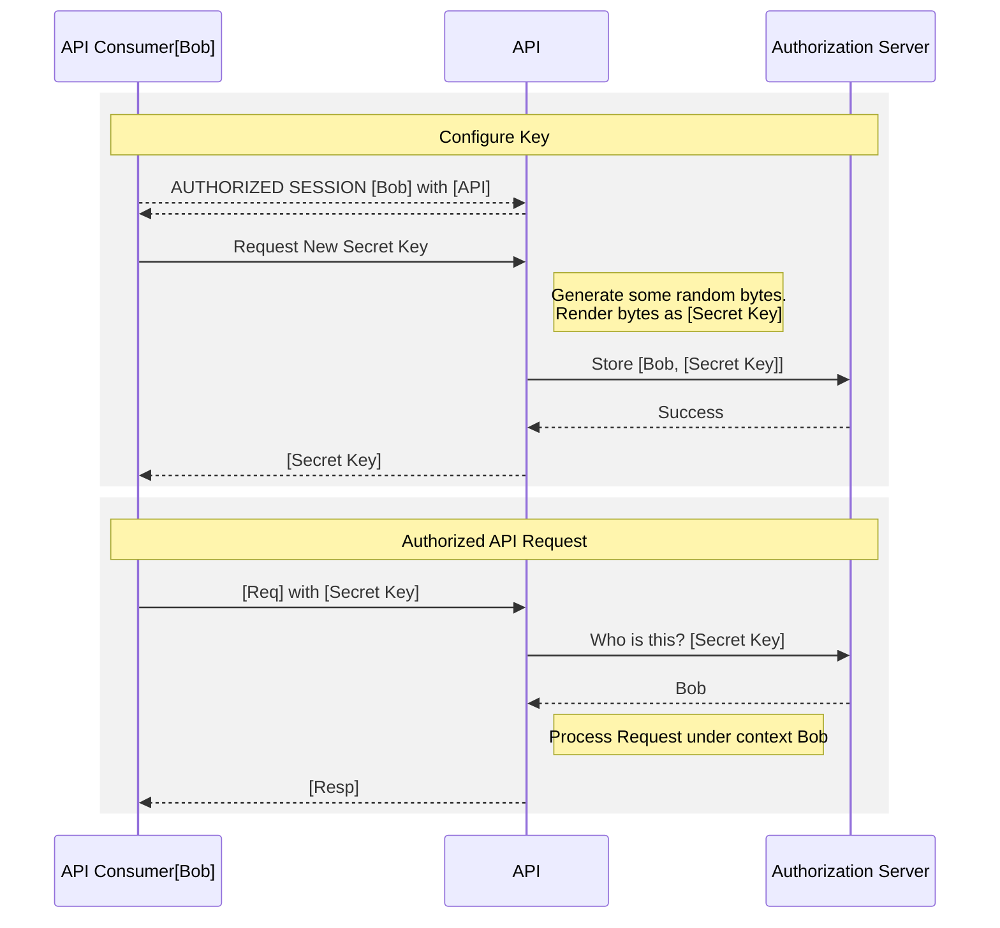
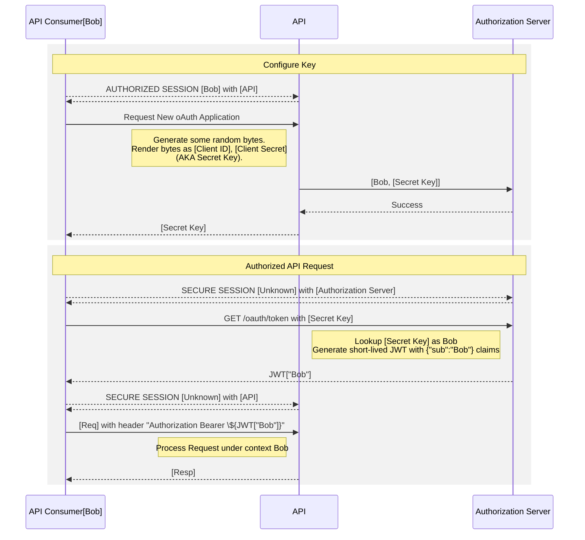
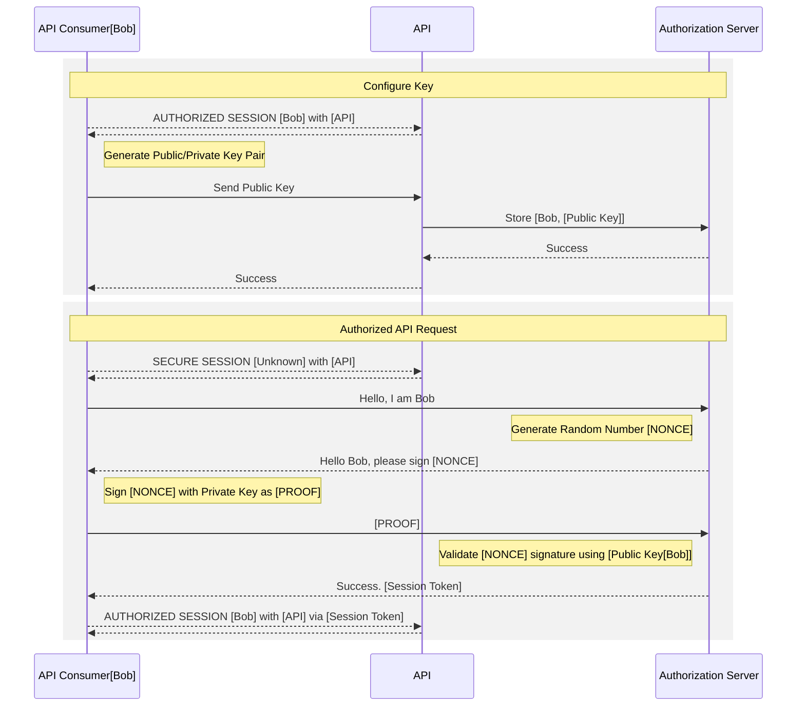
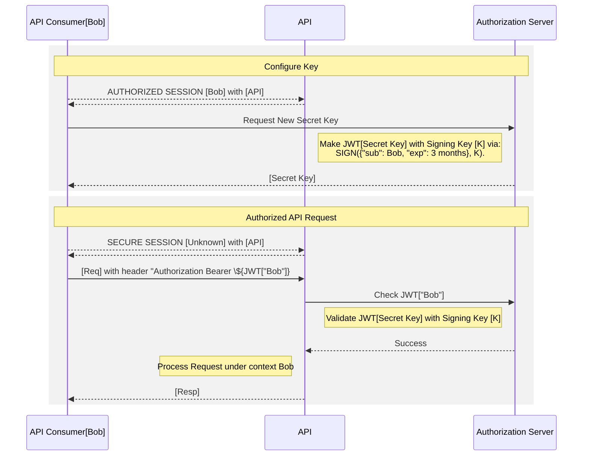
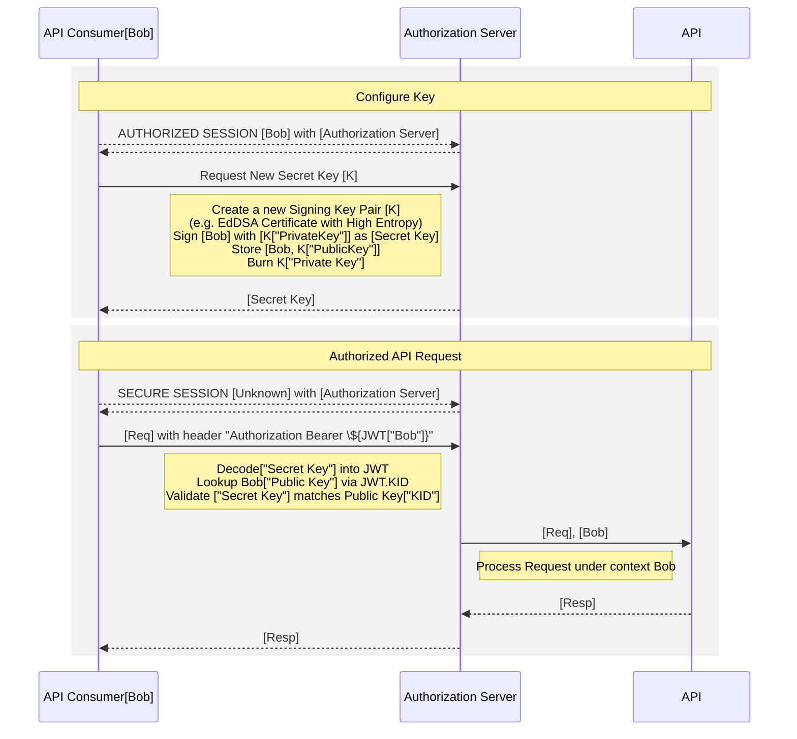

## API Authentication Overview

If you're selling an API Product, one of the first decisions you're going to have to make is how to authenticate your users. This decision, once made, is hard to go back upon; any significant change will require user action to keep their integration working.

This blog post is intended to be a guide to the different API Authentication methods in common use, and the tradeoffs to consider between them, generally categorized into the following 3 metrics.

* **Time to API Call**
* **Ease of API Producer Implementation**
* **Ease of API Consumer Integration**

This post is inspired by work we recently undertook at Speakeasy (API DevEx tooling company) to build an API Key authorization flow that integrates into any API Gateway, and allows users to self-service and rotate their keys. For this project we evaluated all the standard approaches to authentication before deciding on a novel approach: signed tokens as API Keys, but with 1 signing key per API key. What follows are a deep dive on the typical methods, as well as our approach.

## Types of Authentication

Authenticated APIs require some way of identifying the client making the request, so that the API provider can authorize the requests to be processed, and identify the subset of data that can be accessed.

From an API Consumer perspective, the flow is usually:

1. You get a **Secret Key** from the service (e.g. in an authenticated Web UI).
2. You store that **Secret Key** somewhere securely, such that your application can access it.
3. You use that **Secret Key** within your application logic to authenticate with the API.

This is incredibly simple, and hence has great Developer Experience (DX).

However, from an API Producer Perspective, it's not so simple. There are choices you need to make about how the **Secret Key** is implemented which greatly impacts the Security Model of your application. Once you have users in production, Machine to Machine (M2M) authentication is hard to change, assuming you don’t want to break existing integrated users. Therefore, choose wisely:

1. **Opaque Token / Shared Secrets**
2. **Public / Private Key Pairs**
3. **OAuth 2.0 Secrets**
4. **Signed Tokens (one Signing Key)**
5. **Signed Tokens (many Signing Keys)**

Let’s look at the advantages and disadvantages of each approach…

### Opaque Tokens / Shared Secrets

An _Opaque Token_ is a _Shared Secret_ that is used to authenticate a client. It is _Opaque_ in that there is no message to read: all you can do with it is look up its existence in a centralised store (e.g. a database), and then, if it exists, you know who the user is.

This is functionally the same as a password, except that it is ideally generated by a process which ensures the entropy of the token is high enough that it is entirely unguessable.

Assuming this token is passed into the API in the `Authorization` header, from an API Consumer perspective, accessing the API is as simple as:

```sh
curl https://api.example.com/v1/endpoint
  --header "Authorization ${API_KEY}"
```

From an API Producer perspective, there's a few more moving parts, but it's usually pretty trivial to implement:



* **Time to API Call**: As Fast as it gets.
* **Ease of API Consumer Integration**: Very Easy
* **Ease of API Producer Implementation**: Very Easy
* **Other Considerations**:
  * Often Difficult to integrate into an API Gateway
  * Any validation requires a lookup where-ever these are stored. If you solely store them in the DB, this means that all lookups require a DB Read, which can cause additional latency to every request.

### OAuth 2.0 Secrets



OAuth is commonly associated with user authentication through a social login. This doesn't make sense for API applications, as the system authenticates and authorizes an application rather than a user.

However, through the Client Credentials Flow ([OAuth 2.0 RFC 6749, section 4.4](https://tools.ietf.org/html/rfc6749#section-4.4])), a user application can exchange a **Client ID**, and **Client Secret** for a short lived Access Token.

In this scenario, the **Client ID** and **Client Secret** pair are the **Shared Secret** which would be passed to the integrating developer to configure in their application. In the OpenID Connect (OIDC) protocol, this happens by making a request to the **/oauth/token** endpoint.

```sh
TOKEN=$(curl --header "Content-Type: application/x-www-form-urlencoded" \
  --request POST \
  --data "grant_type=client_credentials" \
  --data "client_id=CLIENT_ID" \
  --data "client_secret=CLIENT_SECRET" \
  https://auth.example.com/oauth/token | jq -r '.access_token')

curl --header "Authorization Bearer $TOKEN" \
  https://api.example.com/v1/endpoint
```

* **Time to API Call**: Slow.
* **Ease of API Consumer Integration**: Difficult
* **Ease of API Producer Implementation**: Difficult
* **Other Considerations**:
  * Can enable additional use-cases, such as granting third party systems the capability to make API calls on behalf of your users.

### Public/Private Key Pairs

A Public Private Key Pair allows for a user to hold a secret and the server to validate that the user holds a secret, without the server ever holding the secret. For the purpose of authenticating users, this mechanism has the lowest attack surface : i.e. it is the most secure.



The cost and complexity of building and maintaining a Public/Private Key Authentication mechanism, without exposing the Private Key, opening up replay attacks, or making a mistake in implementation somewhere can be high.

If you're selling an API to multiple consumers, it's unlikely that it will be as trivial as the following `curl` to invoke the API that you want; as the integrating system will need to understand the protocol you choose. There are also complexities regarding the certificate lifecycle, and the need to either manage certificate rotation, or pin (hardcode) each certificate into the system.

```sh
# mTLS via curl: Should you be looking to grant unscoped access to a specific API Route to trusted consumers,
#   this can usually be configured by some API Gateway products in infrastructure configuration. 
curl --cacert ca.crt \
     --key client.key \
     --cert client.crt \
     https://api.example.com/v1/endpoint
```

* **Time to API Call**: Slow.
* **Ease of API Consumer Integration**: Difficult
* **Ease of API Producer Implementation**: Difficult
* **Other Considerations**:
  * Severity of the public key being leaked is functionally zero -- no intermediary system holds enough data to make/replay requests except the original sender.

### Signed Tokens as API Keys

A Signed Token is secret; in the same way that a Shared Secret is secret. 

However, due to standardization of technologies, it is starting to become commonplace to use long-lived Signed Tokens, in the form of JWTs (JSON Web Tokens), as API Keys. This enables the following pattern: 

```sh
curl --header "Authorization Bearer ${API_KEY}"\
     http://api.example.com/v1/endpoint 
```



* **Time to API Call**: Fast.
* **Ease of API Consumer Integration**: Simple
* **Ease of API Producer Implementation**: Simple
* **Other Considerations**:
  * Difficult to revoke tokens: either a whitelist/blacklist is used (in which case, little advantage exists over shared secrets), or the signing key must be rotated.
  * Easy to add complexity through custom claims into the token, which can lead to complexity migrating tokens into a new form.
  * Easy to block requests from reaching application servers through an API Gateway and Asymmetric Keys (split into Private JWTs and Public JWKs).

### Our Approach: Signed Tokens as API Keys, but 1-Signing-Key-Per-API-key

There are 3 problems with the Signed Tokens as API Keys pattern:

1. Revoking a key is hard: it is very difficult for users to revoke their own keys on an internal compromise.
2. Any compromise of the Signing Key is a compromise of all keys.
3. API Gateways can't usually hook into a whitelist/blacklist of tokens.

To tackle these, we can do three things:

1. Use Asymmetrically Signed JWTs, storing and exposing a set of Public Keys via a JWKS (JSON Web Key Set) URI.
2. Sign each Token with a different Signing Key; burn the Signing Key immediately afterwards.
3. Ensure that API Gateways only retain a short-lived cache of JWKS (the Public Key to each Signing Key).



This gives us a flow that's very similar to a shared secret, but with the advantage that:

* Revoking a key is easy: the Public Key just needs to be removed from the JWKS and caches invalidated.
* There is no Signing Key to compromise ; all Authorization Server state can be public.

With the tradeoff:

* Any API Gateway that validates a JWT must be able to regularly fetch JWKS (and cache them) from the Authorization Server.
* After creating/revoking a key, there will be a short time delay (we generally configure this to be 15 seconds) whilst the key propagates into all API Gateway JWK caches.
* More compute is required when constructing the Initial API Key; due to the generation of a public/private key pair.
* You need to give the API Gateway application cluster slightly more memory to keep all Public Keys (1 per API key) in memory.

import portal_url_1 from './assets/auth-clip.mp4'

  <video controls={false} loop={true} autoPlay={true} muted={true} width="100%" alt="Auto-clip">
    <source src={portal_url_1} type="video/mp4" />
  </video>

#### In Practice: Envoy / Google Endpoints / EspV2

Envoy is a proxy server that is used to route traffic to a backend service. We ran extensive tests with ESPV2 (Envoy Service Proxy V2) and Google Endpoints, and found/validated the following performance characteristics as the number of keys increased. 

```yaml
# Espv2 is configured with an OpenAPI specification to use an external JWKs URI to validate incoming API Keys
securityDefinitions:
  speakeasy_api_key:
    authorizationUrl: ""
    flow: "implicit"
    type: "oauth2"
    x-google-issuer: "https://app.speakeasy.com/v1/auth/oauth/{your-speakeasy-workspace-id}"
    x-google-jwks_uri: "https://app.speakeasy.com/v1/auth/oauth/{your-speakeasy-workspace-id}/.well-known/jwks.json"
    x-google-audiences: "acme-company"
```

We ran benchmarks of up to 1138688 API keys, structured as public/private 2048-bit RSA keypairs with a single RS256 Signed JWT-per-JWK, using a 8GiB Cloud Run managed Espv2 instance. At this key size and at ~100 requests/second, we observed a peak of ~37% utilization of memory, with ~7% utilized at no API keys. This implies an 8GiB EspV2 instance should scale to ~3M API Keys at this request rate.

This also implies that this mechanism will scale with Envoy RAM with a minor deviation in maximum latency, to the degree of ~3.5ms additional maximum request latency every 8192 API keys. The average additional latency introduced by large numbers of API keys is affected to a much lesser degree, ~0.2ms every 8192 API Keys.


Given most API Applications have less than 3M API Keys active at any given time, this approach, in our belief, combines the best of both worlds: Public/Private Key Crypto, with the ease of an API Key.
