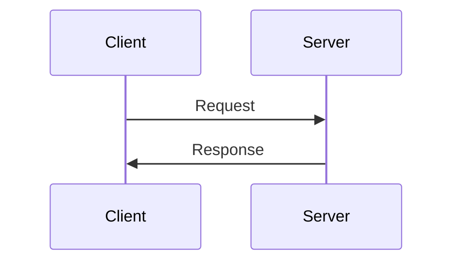
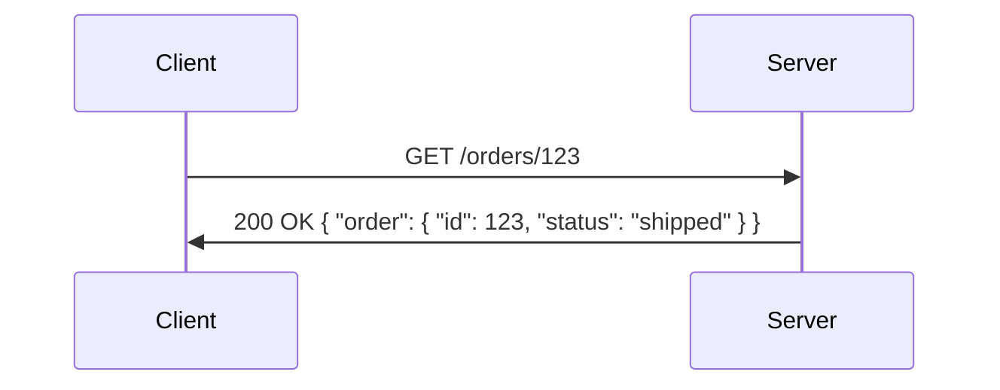
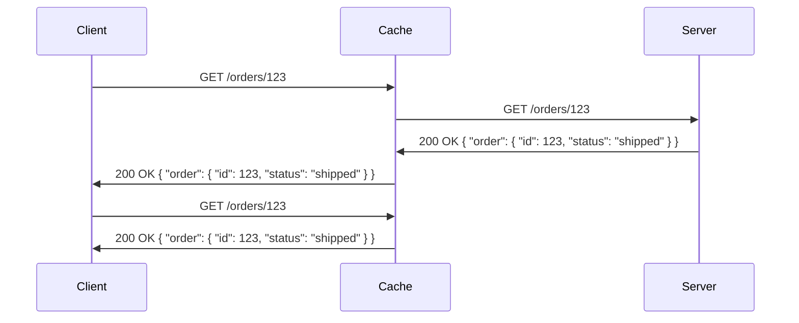
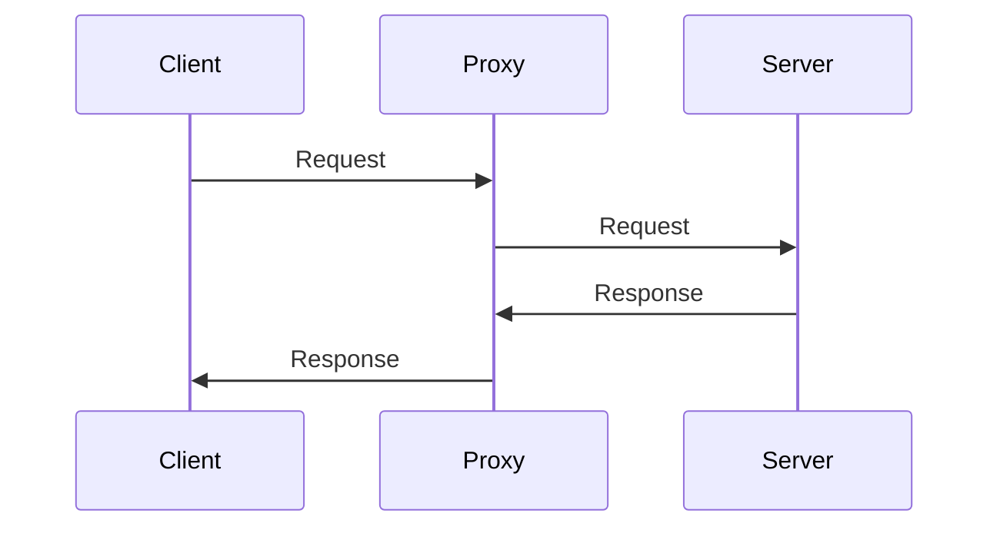

{/* import { Callout } from "~/components"; */}

<div className="Callout" data-title="API Design Guide" data-variant="success">
  <span className="p">If you're looking for a more comprehensive guide to API design, you can read our <a href="/api-design">REST API Design Guide</a>.</span>
</div>

What we call RESTful APIs today often refer to JSON over HTTP, which is an offspring of the RESTful APIs Roy Fielding defined in his [dissertation](https://ics.uci.edu/~fielding/pubs/dissertation/fielding_dissertation_2up.pdf) in 2000. Back then, JSON was still just an idea, and the web was still in its infancy. The constraints Fielding defined in his dissertation were a reaction to the state of the web at the time, but they remain relevant to the web today. Rather than co-opting the term RESTful, JSON-over-HTTP APIs could have benefited from a new term that acknowledges their differences from Fielding's REST. 

Alas, the term RESTful stuck, and here we are. This article will explore what it means to be RESTful in 2025, why it matters, and how to find the sweet spot between adhering to RESTful principles and following established practices.

First, let's clarify the difference between RESTful APIs and REST-like APIs.

# Designing your API: Find the RESTful sweet spot

Fielding's original REST model defines six architectural constraints, liberally summarized as follows:

1. **Client-server architecture**: This separation allows the client and server to evolve independently as long as the interface doesn't change.
2. **Statelessness**: Each request from the client contains all the information the server needs to fulfill that request, easing server workload and improving scalability.
3. **Cacheability**: Responses are explicitly labeled as cacheable or non-cacheable, which helps reduce client-server interactions and improves performance.
4. **Uniform interface**: This constraint is broken into four subconstraints.
   - **Resource identification**: Resources are identified in requests, typically using URIs.
   - **Resource manipulation through representations**: Resources are manipulated through representations, such as JSON or XML.
   - **Self-descriptive messages**: Messages include all the information needed to understand them.
   - **Hypermedia as the engine of application state (HATEOAS)**: Responses include links to related resources, allowing clients to navigate the API dynamically.
5. **Layered system**: A client should be unable to tell whether it is connected directly to the end server or to an intermediary along the way.
6. **Code on demand (optional)**: Servers can extend client functionality by transferring executable code, like Java applets or client-side scripts.

Adherence to these constraints distinguishes a truly RESTful API from one that is REST-like.

## How most REST-like APIs adhere to REST constraints

If you're building a modern API, you're likely adhering to some of the REST model's constraints, even if you're not following them all to the letter. The key is to understand the principles behind REST and apply them in a way that makes sense for your use case.

### ✅ Client-server architecture: Followed by most REST-like APIs

In the context of APIs, this means that the client and server communicate over a network, with the server providing resources and the client consuming them. This separation is central to RESTful design and may be why the term "RESTful" was adopted for APIs that follow this pattern.



### ✅ Statelessness: Followed by most REST-like APIs

Statelessness means that each request from the client to the server must contain all the information needed to fulfill that request. This constraint simplifies server logic and improves scalability by allowing servers to handle requests independently.

Most APIs follow this constraint by requiring clients to include all necessary information in each request.



### ✅ Cacheability: Followed by most REST-like APIs

Cacheability allows responses to be explicitly labeled as cacheable or non-cacheable, reducing the need for repeated requests to the server. By specifying cacheability, APIs can improve performance and reduce server load.

Most APIs follow this constraint by including cache-control headers in their responses.



The first request retrieves the order from the server and caches it. The subsequent request is served from the cache, reducing the load on the server.

### ⚠️ Uniform interface: Partially followed by most REST-like APIs

The uniform interface constraint is seen by many as the heart of REST. It defines a standard way to interact with resources, making APIs more discoverable and easier to use. This constraint is often broken down into four sub-constraints:

✅ **Resource identification**: Resources are identified in requests, typically using URIs. Followed by most APIs.

✅ **Resource manipulation through representations**: Resources are manipulated through representations, such as JSON or XML. Followed by most APIs.

⚠️ **Self-descriptive messages**: Messages include all the information needed to understand them. Through the use of media types, APIs can achieve this sub-constraint. Partially followed by most APIs.

❌ **Hypermedia as the engine of application state (HATEOAS)**: Responses include links to related resources, allowing clients to navigate the API dynamically. Rarely followed by APIs.

The last two sub-constraints of uniform interfaces are often the most challenging to implement and are frequently omitted in practice.

HATEOAS, in particular, is a powerful concept that applies extremely well to web APIs that serve human users. For example, HTML returned by a web server contains links that users can click to navigate the web.

Take this HTML response as an example:

```bash
curl --header "Accept: text/html" https://api.example.com/orders/123
```

```html
<!doctype html>
<html>
  <head>
    <span className="title">Order 123</span>
  </head>
  <body>
    <span className="h1">Order 123</span>
    <span className="p">Status: Shipped</span>
    <a href="/orders/123">View Order</a>
    <a href="/customers/456">View Customer</a>
  </body>
</html>
```

In this case, the links are clickable, allowing users to navigate the API by following them. This is the essence of HATEOAS.

Contrast this with a JSON response:

```bash
curl --header "Accept: application/json" https://api.example.com/orders/123
```

```json
{
  "id": 123,
  "status": "shipped",
  "links": [
    { "rel": "self", "href": "/orders/123" },
    { "rel": "customer", "href": "/customers/456" }
  ]
}
```

In this example, the response includes links to the order itself and the customer who placed the order. By following these links, a client can navigate the API without prior knowledge of its structure. In practice, an SDK or client library would need to be aware of these links to provide a similar experience. From a developer experience perspective, this can be challenging to implement and maintain.

Instead of implementing HATEOAS, many APIs rely on documentation to inform developers how to interact with the API. While this approach is more common, it lacks the dynamic nature of HATEOAS.

### ✅ Layered system: Followed by most REST-like APIs

The layered system constraint allows for intermediaries between the client and server, such as proxies or gateways. This separation enhances scalability and security by isolating components and simplifying communication.

Most APIs follow this constraint by permitting intermediaries between the client and server.



Since API requests are stateless and contain all the information needed to fulfill them, intermediaries can forward requests without needing to maintain session state. This is especially useful for load balancing and security purposes.

### ⚠️ Resource-oriented architecture: Followed by some REST-like APIs

Each of the constraints above contributes to a resource-oriented architecture, where resources are identified by URIs and manipulated through representations. This architecture makes APIs more predictable and easier to use by following standard resource interaction patterns.

Most APIs follow this constraint by organizing their resources into collections and items, with standard methods for interacting with them.

This pattern is often reflected in an API's URL structure, where resources are presented as nouns, and instead of using verbs in the URL, API actions are represented by HTTP methods. For example:

- `GET /orders`: Retrieve a list of orders.
- `POST /orders`: Create a new order.
- `GET /orders/123`: Retrieve order 123.
- `PUT /orders/123`: Update order 123.
- `DELETE /orders/123`: Delete order 123.

Many API design guidelines recommend using resource-oriented URLs to make APIs more intuitive and easier to use. We'll explore this in more detail later in the article.

### ❌ Code on demand: Rarely used in the context of APIs

We'll skip this constraint for now, as it's optional and rarely implemented in practice outside hypermedia-driven APIs.

## Why adherence matters

Is this a cargo cult, or do these constraints actually matter? They do, and here's why:

### The principle of least astonishment

There is a big difference between delighting users and surprising them. The principle of least astonishment states that the behavior of a system should be predictable and consistent.

When your API behaves in a predictable way, like sticking to the standard ways of using HTTP methods and formats, you're making it easy for developers to use. They shouldn’t have to spend hours figuring out quirky behaviors or unexpected responses - that just leads to headaches and wasted time.

### Scalability

Scalability is essential when designing APIs that need to handle varying loads and growth over time. Adhering to REST principles inherently supports scalability in several ways:

- **Statelessness**: Without the need to maintain session state, servers can handle requests independently, making it easier to scale horizontally.
- **Cacheability**: REST APIs explicitly label responses as cacheable. This reduces the server load, as cached responses can be reused from previous requests.
- **Layered system**: REST architecture allows the deployment of intermediary servers, such as load balancers and cache servers, which isolate client requests from direct backend processing.

### Maintainability

The constraints of the REST model naturally lead to a design that is easier to update and manage:

- **Resource-oriented design**: By focusing on resources rather than actions, APIs become more modular and logically structured.
- **Independent client and server evolution**: The client-server separation supported by REST allows both sides to evolve independently.

## Quantifying REST adherence

[The Richardson Maturity Model](https://martinfowler.com/articles/richardsonMaturityModel.html) provides a framework for evaluating an API's compliance with RESTful principles. This model outlines four levels of RESTfulness, each building on the previous one, allowing you to assess and improve your API's design objectively:

### Level 0: The swamp of POX (Plain Old XML)

At this base level, APIs typically rely on a single URI and use HTTP merely as a transport protocol. There is little to no differentiation in the use of HTTP methods, and operations tend to be defined solely by the payload. This resembles the remote procedure call over HTTP (RPC over HTTP) protocol, where the rich set of HTTP features, like methods and status codes, are underutilized.

An example of a Level 0 API might be:

```bash
curl -X POST https://api.example.com/api.aspx?method=createOrder -d "..."
```

### Level 1: Resources

The first step towards RESTfulness is exposing resources via distinct URIs. At Level 1, APIs start organizing data into resources, often with a collection-item structure, making the API more resource-oriented. Each resource, such as `/orders` or `/customers`, typically represents a collection of items, with individual resources accessible by identifiers like `/orders/{orderId}`.

An example of a Level 1 API might be:

```bash
# Retrieve a list of orders
curl -X POST https://api.example.com/orders

# Retrieve order 123
curl -X POST https://api.example.com/orders/123
```

Note how the API is starting to use URIs to represent resources, but the use of POST for retrieval is not ideal.

### Level 2: HTTP verbs

At this level, RESTful APIs progress by using HTTP methods (like GET, POST, PUT, and DELETE) to perform operations on resources. Level 2 APIs respect the semantics of these verbs, leveraging the full power of HTTP to perform operations that are predictable and standardized. For example, GET retrieves data, POST creates new resources, PUT updates existing resources, and DELETE removes them.

An example of a Level 2 API might be:

```bash
# Retrieve a list of orders
curl -X GET https://api.example.com/orders

# Retrieve order 123
curl -X GET https://api.example.com/orders/123

# Create a new order
curl -X POST https://api.example.com/orders -d "..."

# Update order 123
curl -X PUT https://api.example.com/orders/123 -d "..."

# Delete order 123
curl -X DELETE https://api.example.com/orders/123
```

### Level 3: Hypermedia controls (HATEOAS)

HATEOAS distinguishes Level 3 APIs from the rest. At Level 3, responses include hypermedia links that offer clients dynamic navigation paths within the API. This allows for discoverability directly embedded in API responses, fostering a dynamic interaction model in which clients can follow links to escalate through states or access related resources.

## Evaluating your API's RESTfulness

To evaluate the RESTfulness of your API, consider the following questions:

1. Level 1: Are resources uniquely identified by URIs?

   For example, `/orders/123` uniquely identifies an order resource.

2. Level 2: Are all URLs resource-oriented, and do they use standard HTTP methods?

   For example, URLs should use GET to retrieve resources, POST to create new resources, PUT to update existing resources, and DELETE to remove resources.

   None of your endpoint URLs should contain verbs or actions. For example, neither `/cancelOrder` nor `/orders/123/cancel` is resource-oriented,.

3. Level 3: Do responses include hypermedia links for dynamic navigation?

   For example, a response might include links to related resources, allowing clients to navigate the API without prior knowledge of its structure.

## The RESTful sweet spot

We believe the RESTful sweet spot lies somewhere between Level 1 and Level 2 of the Richardson Maturity Model. This is where most APIs can find a balance between adhering to RESTful principles and practicality. 

In case it wasn't crystal clear from the previous sections, we think HATEOAS isn't practical or relevant for most APIs. It was a powerful concept when the web was young, and APIs were meant to be consumed by humans.

Here's what we recommend:

1. **Embrace resource-oriented design**: Think in terms of resources rather than actions. Identify the key resources in your API domain and structure your endpoints around them.

   This ensures your API is predictable and intuitive, making it easier for developers to understand and use.

   ✅ Good: Use resource-oriented URLs like `/orders` and `/customers`.

   ```yaml openapi.yaml
   paths:
     /orders: # Resource-oriented
       get:
         summary: Retrieve a list of orders
       post:
         summary: Create a new order
     /orders/{orderId}: # Resource-oriented
       get:
         summary: Retrieve order details
       patch:
         summary: Update an order
       put:
         summary: Replace an order
       delete:
         summary: Delete an order
   ```

   ❌ Bad: Don't use action-based URLs like `/cancelOrder`.

   ```yaml openapi.yaml
   paths:
     /cancelOrder: # Not resource-oriented
       post:
         summary: Cancel an order
   ```

   ✅ Compromise: Use sub-resources like `/orders/{orderId}/cancellations`.

   If you must include actions in your URLs, consider using sub-resources to represent them as resources in their own right.

   ```yaml openapi.yaml
   paths:
     /orders/{orderId}/cancellations: # Resource-oriented
       post:
         summary: Create a cancellation for an order
   ```

   ✅ Less ideal compromise: Use top-level actions like `/orders/{orderId}/cancel`.

   ```yaml openapi.yaml
   paths:
     /orders/{orderId}/cancel: # Resource-oriented with action
       post:
         summary: Cancel an order
   ```

2. **Use standard HTTP methods wisely**: Choose the appropriate method for each operation - GET for retrieval, POST for creation, PATCH for partial updates, PUT for complete updates or replacement, and DELETE for removal. Ensure your API follows the semantics of these methods.

   This allows developers to predict how operations will behave based on the HTTP method. It also implies idempotency, safety, and cacheability where applicable.

   An operation is considered **safe** if it doesn't modify resources. It is **idempotent** if the result of performing it multiple times is the same as performing it once. It is **cacheable** if the response can be stored and reused.

   ```yaml openapi.yaml
   paths:
     /orders:
       get: # Safe, idempotent, cacheable
         summary: Retrieve a list of orders
       post: # Unsafe, potentially idempotent, not cacheable
         summary: Create a new order
     /orders/{orderId}:
       get: # safe, idempotent, cacheable
         summary: Retrieve order details
       patch: # unsafe, potentially idempotent, not cacheable
         summary: Update an order
       put: # unsafe, idempotent, not cacheable
         summary: Replace an order
       delete: # unsafe, idempotent, not cacheable
         summary: Delete an order
   ```

3. **Document thoroughly with OpenAPI**: Instead of relying on HATEOAS for dynamic navigation, use OpenAPI to provide comprehensive documentation for your API. OpenAPI allows you to define your API's structure, endpoints, methods, parameters, and responses in a machine-readable format. This ensures clarity and type safety for developers using your API.

### How targeting SDK generation enables better API design

While you're designing your API, consider how it will be consumed by developers. If you're providing an SDK or client library, you can optimize your API design to make SDK generation easier and more effective, and you may find the optimized design also leads to a more RESTful API.

We often see APIs with action-based URLs like `/orders/{orderId}/cancel` or `/orders/{orderId}/refund`. While partially resource-oriented, these URLs include actions as part of the URL.

Firstly, these URLs are not as maintainable as resource-oriented URLs. If you decide to allow multiple cancellations for an order - for example, when an order is restored after being canceled and then canceled again - you may wish to represent cancellations as resources in their own right. This would lead to URLs like `/orders/{orderId}/cancellations/{cancellationId}`. Alternatively, you may wish to allow partial refunds, leading to URLs like `/orders/{orderId}/refunds/{refundId}`.

Secondly, these URLs are not as predictable as resource-oriented URLs. Developers may not know which actions are available for a given resource, leading to a reliance on documentation or trial and error.

From a design perspective, this could look like the following:

```yaml openapi.yaml
paths:
  /orders/{orderId}/cancellations:
    post:
      summary: Set the order status to cancelled
  /orders/{orderId}/refunds:
    post:
      summary: Create a refund for the order
      requestBody:
        content:
          application/json:
            schema:
              type: object
              properties:
                amount:
                  type: number
                  minimum: 0
                  maximum: 100
```

Then, in a future version of your API, you could introduce cancellations and refunds as resources in their own right:

```yaml openapi.yaml
paths:
  /orders/{orderId}/cancellations:
    get:
      summary: Retrieve a list of cancellations for the order
    post:
      summary: Create a new cancellation for the order
  /orders/{orderId}/cancellations/{cancellationId}:
    get:
      summary: Retrieve a specific cancellation for the order
  /orders/{orderId}/refunds:
    get:
      summary: Retrieve a list of refunds for the order
    post:
      summary: Create a new refund for the order
  /orders/{orderId}/refunds/{refundId}:
    get:
      summary: Retrieve a specific refund for the order
```

This approach allows you to evolve your API over time without breaking existing clients.

## Going beyond RESTful principles

While adhering to RESTful principles is essential, it's also important to consider the practicalities of API design. Here are some detailed topics we'll explore in future articles:

1. [**Pagination**](/api-design/pagination): How to handle large collections of resources. Should you use offset-based pagination, cursor-based pagination, or something else?
2. [**Filtering and searching**](/api-design/filtering-responses): How to allow clients to filter and search resources efficiently.
3. [**Error handling**](/api-design/errors): How to communicate errors effectively and consistently.
4. **Versioning**: How to version your API while maintaining backward compatibility.
5. **Security**: How to secure your API using authentication and authorization mechanisms.
6. **Rate limiting**: How to protect your API from abuse by limiting the number of requests clients can make.
7. **Webhooks**: How to implement webhooks for real-time notifications.

Be sure to check back for more insights on API design.
