HashiCorp (creators of Terraform) recently released a tool for automatically creating Terraform provider data types from your OpenAPI documents. In this post we'll do a full walkthrough of how to use both of these tools, but before getting into the details, here's a high level summary of the differences between the two:

- Requires a separate, custom generation configuration. Speakeasy uses the built-in OpenAPI Specification extensions mechanism to define Terraform Provider resources and data modeling. (Both must be handwritten today, but we could make a product decision to enable better UX.)
- Only creates Terraform schema and data handling types. There is no code generation for the underlying code to handle API requests/responses, implement API security, nor Terraform Provider resource logic. Speakeasy does everything (works out of the box).
- Does not support the full OpenAPI Specification data handling system. Speakeasy supports OAS schemas including advanced features, such as `oneOf` and `allOf`.
- Has only received dependency maintenance updates since January 2024. Speakeasy is actively maintained and enhanced.
- Because the Speakeasy workflow is end to end, it is easy to fully automate the generation. Speakeasy has a Github Action that can easily be added to your CI/CD. Hashicorp would require a custom script to pull together a couple of tools in order to fully automate the generation.
- In contrast to Speakeasy's "OpenAPI-first" philosophy, HashiCorp uses an intermediate format between the OpenAPI schema and the provider. This format is theoretically useful if you want to create a provider with something other than OpenAPI, such as directly from your API codebase. But in that case, you probably would need to write a custom script, as there is no tool for this yet.

For those who need it, let's start with a brief overview of Terraform providers and how they work. Otherwise, you can skip ahead to [Generating a Terraform Provider](#generating-a-terraform-provider)

## What Is a Terraform Provider?

Terraform is a free tool to manage infrastructure with configuration files. For instance, you can call Terraform to create identical AWS servers ready to run an application in development, test, and production environments by giving it the same configuration file for each environment. A Terraform provider is a plugin to the Terraform core software that allows Terraform to access resources that live in a 3rd party system (for example, the AWS provider allows access to AWS, the system that manages cloud infrastructure resources). 

## Why Build a Terraform Provider for an API?

If your API calls a stateless service (to get a share price, for instance, or charge a credit card), there is nothing for configuration files to manage. However, if your API manages any resource that persists (like user permissions or an accounting system), you could offer your users a custom Terraform provider as an interface to your API, allowing them to call your service through a standard set of configuration files.

For a more thorough conversation of Terraform providers and examples, see our article on the [benefits of Terraform providers](/post/build-terraform-providers).

## About Terraform Providers

Terraform providers are modules written in Go as plugins for Terraform.

When you install a Terraform provider with `go install`, it is saved to the `go` path, for example, `root/go/bin`.

The Terraform provider filename will match the first line in the module's `go.mod` file. For example, the following:

```go
module github.com/speakeasy/terraform-provider-terraform
```

Will match the file `root/go/bin/terraform-provider-terraform`.

However, the name you use for the provider in the `source` field of the Terraform resource configuration file comes from your module's `main.go` file. In this excerpt:

```hcl
terraform {
  required_providers {
    terraform = {
      source  = "speakeasy/terraform"
      version = "0.0.3"
    }
  }
}
```

The name used in the `source` field comes from the module's `main.go` file:

```go
	opts := providerserver.ServeOpts{
		Address: "registry.terraform.io/speakeasy/terraform",
```

When building and testing Speakeasy and HashiCorp providers locally, you need to match your Terraform repository overrides to the `main.go` field in `.terraformrc`:

```hcl
provider_installation {
  dev_overrides {
    "speakeasy/terraform" = "/root/go/bin"
    "terraform-provider-petstore" = "/root/go/bin"
  }
  direct {}
}
```

## Generating a Terraform Provider


### Prerequisites

If you would like to create a Terraform provider by following this tutorial, you'll need [Docker](https://docs.docker.com/get-docker) installed. Alternatively, you can install Go, Node.js, Speakeasy, Terraform, and the Terraform provider creation modules on your local machine.

Below is a Dockerfile that creates an image prepared with Go, Terraform, Speakeasy, and the new HashiCorp codegen framework that you can use to run all the code in this article. Replace the Speakeasy key with your own on line nine and save the file as `Dockerfile`.

```bash
FROM --platform=linux/amd64 alpine:3.19

WORKDIR /workspace

RUN apk add go curl unzip bash sudo nodejs npm vim

ENV GOPATH=/root/go
ENV PATH=$PATH:$GOPATH/bin
ENV SPEAKEASY_API_KEY=SET_YOUR_API_KEY_HERE

# install terraform:
RUN curl -O https://releases.hashicorp.com/terraform/1.7.0/terraform_1.7.0_linux_amd64.zip && \
    unzip terraform_1.7.0_linux_amd64.zip && \
    mv terraform /usr/local/bin/ && \
    rm terraform_1.7.0_linux_amd64.zip

# install openapi terraform provider framework:
RUN go install github.com/hashicorp/terraform-plugin-codegen-framework/cmd/tfplugingen-framework@latest
RUN go install github.com/hashicorp/terraform-plugin-codegen-openapi/cmd/tfplugingen-openapi@latest

# install speakeasy
RUN curl -fsSL https://go.speakeasy.com/cli-install.sh | sh
```

Run the following commands in a terminal to start using the Dockerfile:

```sh
mkdir code
docker build -t seimage .  # build the image
docker run -it --volume ./code:/workspace --name sebox seimage   # run the container using the code folder to work in

# Run this command if you need to start the container again later:
# docker start -ai sebox
```

In another terminal on your host machine (not inside Docker), run the code below to create folders to work in for the Speakeasy and HashiCorp examples:

```sh
cd code
mkdir hashi # hashicorp
mkdir se # speakeasy
cd se
touch openapi.yaml
```

You need to give your host user write permissions to files created in the container to edit them. On Unix-like systems, use the following command on your host machine, replacing `myusername` with your user name:

```
sudo chown -R myusername:myusername code
```

Now insert the Swagger Petstore example schema (available [here](https://github.com/speakeasy-api/examples-repo/blob/main/how-to-build-terraform-providers/original-openapi.yaml)) into the `openapi.yaml` file. The Swagger Petstore example schema is the API description of a service that manages pets and orders for pets at a store.


## Create a Terraform Provider With the HashiCorp Provider Spec Generator

The [HashiCorp automated Terraform provider creator](https://developer.hashicorp.com/terraform/plugin/code-generation/design) works differently from Speakeasy. HashiCorp provides an API SDK to convert your OpenAPI schema into an intermediate format, called the provider code specification (JSON). This document is then transformed into a provider by Terraform SDK. These transforming SDKs are both CLI tools.

```mermaid
flowchart TD
  subgraph 0[" "]
    1(📜 OpenAPI schema)
    1b(📜 Generator configuration)
  end
  0 --⚙️ API SDK--> 2(📃 Provider code specification)
  2 --⚙️ Terraform SDK --> 3(🗝️ Go provider)
```



An OpenAPI schema does not describe which Terraform resource each operation maps to. So, like Speakeasy extension attributes, you need to include mapping information in a generator configuration file along with your schema.

You can create a provider by starting at any one of the three steps:
- [Start with an OpenAPI schema](https://developer.hashicorp.com/terraform/plugin/code-generation/openapi-generator), as with Speakeasy.
- [Write a provider code specification manually](https://developer.hashicorp.com/terraform/plugin/code-generation/framework-generator), or with some tool the Terraform community may develop in the future, without using OpenAPI at all. Writing a provider code specification is closely coupled to the Terraform system and allows you to precisely create a compatible provider. You can even include custom Go functions to map objects between your API and Terraform. The full list of features with examples is [here](https://developer.hashicorp.com/terraform/plugin/code-generation/specification).
- Create a provider manually by coding it in Go (the traditional way).

As noted in the [HashiCorp code generation design principles](https://developer.hashicorp.com/terraform/plugin/code-generation/design#apis-support-more-than-just-terraform-providers), there is a mismatch between an OpenAPI schema and a Terraform provider. Providers expect resources, transfers, and errors to relate in a way that an API doesn't. For this reason, it's unlikely that there will ever be a general solution to creating a provider from a schema that does not require annotations like Speakeasy extension attributes or a HashiCorp generator configuration.

### The HashiCorp Workflow Example

HashiCorp provides a [full walkthrough for creating a Terraform provider from a schema](https://developer.hashicorp.com/terraform/plugin/code-generation/workflow-example). The Docker container you have been working in has everything you need to follow the Hashicorp walkthrough if you'd like to. Change to the `hashi` folder and continue working.

We don't repeat HashiCorp's tutorial here, but let's take a look at the steps and how the process differs from Speakeasy.

- HashiCorp doesn't create a full Go project for you. You need to create one with `go mod init terraform-provider-petstore`.
- You need to use the framework code generator `scaffold` command to create a template for the Go provider code, and write your own `main.go` file.
- Instead of adding attributes to your schema, you create a `generator_config.yml` file to hold the mapping between the schema and the provider. It looks like this:
  ```yaml
  provider:
  name: petstore
  resources:
    pet:
      create:
        path: /pet
        method: POST
      read:
        path: /pet/{petId}
        method: GET
      schema:
        attributes:
          aliases:
            petId: id
  ```
- The `tfplugingen-openapi generate` command creates a provider code specification in JSON from your schema, and then `tfplugingen-framework generate` creates the provider from the provider code specification, like so:
  ```sh
  tfplugingen-openapi generate \
    --config ./generator_config.yaml \
    --output ./specification.json \
    ./openapi.yaml &&

  tfplugingen-framework generate all \
      --input specification.json \
      --output internal/provider
  ```
- This creates the Go files `internal/provider/provider_petstore/petstore_provider_gen.go` and `internal/provider/resource_pet/pet_resource_gen.go`. The `_gen` in the filename is a hint that a tool created the file, and it should not be edited manually.
- The HashiCorp Terraform provider generator does not create all the code you need. It creates only the Go data types for the pet resource, not the code that manages the data. In the middle of the HashiCorp Terraform provider generation walkthrough, you can see that a long page of code needs to be copied and pasted into `/internal/provider/pet_resource.go`.

## Create a Terraform Provider With Speakeasy

In the Docker container terminal, navigate to the `se` directory using the command `cd /workspace/se` and run the following command to check that your OpenAPI schema is acceptable to Speakeasy:

```sh
speakeasy validate openapi -s openapi.yaml;
```

The Petstore schema has three object types: pet, order, and user. To test Terraform providers, we'll implement the `addPet` and `getPetById` operations. Terraform will use these two operations to create a single pet, and then check if the pet exists when verifying the Terraform state against the API. These operations correspond to Create and Read in CRUD.

### Add Speakeasy Terraform Annotations

We use Speakeasy extension attributes in a schema to have Speakeasy create a Terraform provider. The Speakeasy extensions tell Terraform which OpenAPI schema operations map to which CRUD operations for each resource, and which field is the ID.

Read our [overview of how the Terraform provider creation process works](/docs/create-terraform) or view the [full list of Speakeasy Terraform extensions](/docs/terraform/extensions) for more information about creating Terraform providers with Speakeasy.

Insert the following commented lines into `openapi.yaml`:

```yaml
...
    post:
      tags:
        - pet
      summary: Add a new pet to the store
      description: Add a new pet to the store
      x-speakeasy-entity-operation: Pet#create  # <-----
      operationId: addPet
...
  /pet/{petId}:
    get:
      tags:
        - pet
      summary: Find pet by ID
      description: Returns a single pet
      operationId: getPetById
      x-speakeasy-entity-operation: Pet#read  # <-----
      parameters:
        - name: petId
          x-speakeasy-match: id  # <-----
...
components:
  schemas:
    ...
    Pet:
      x-speakeasy-entity: Pet  # <-----
      required:
        - name
        - photoUrls
      type: object
...
```

Validate the schema and create the provider in the Docker container:

```sh
speakeasy validate openapi -s openapi.yaml &&
speakeasy generate sdk --schema openapi.yaml --out sdk --lang terraform
```

Speakeasy creates a Terraform provider (Go module) in the `sdk` folder.

#### Speakeasy Security Support

In most cases, Speakeasy should support [security in providers](/docs/create-terraform):
> Every authentication mechanism that relies on static authorization is supported with its values automatically available to be configured in the provider configuration.

But you may encounter instances where this will not be true in practice. If you create a provider for the Petstore schema without removing the security elements, when you run `go run main.go --debug`, you'll get the error:

```sh
internal/provider/pet_data_source.go:135:43: not enough arguments in call to r.client.Pet.GetPetByID
 	have (context.Context, operations.GetPetByIDRequest)
 	want (context.Context, operations.GetPetByIDRequest, operations.GetPetByIDSecurity)
```

In this instance, Speakeasy will not create a provider, as the API method is defined to have differing *resource* security configuration to the global *provider* security configuration in the OpenAPI specification. 

Similarly, for oAuth2 authenticated APIs, the authentication mechanism between a Client and a Token endpoint is ambiguous, even in the (latest) OpenAPI 3.1 Specification. Speakeasy currently natively supports the `client_secret_post` oAuth2 authentication schema as described in Section 9 of [OpenID Connect Core 1.0](https://openid.net/specs/openid-connect-discovery-1_0.html#OpenID.Core), under the client credentials flow, but does require that some code is written to help authenticate your provider with your service for your flavour of authentication.

### Install the Terraform Provider

Run the commands below in the Docker terminal to install the Terraform provider as `root/go/bin/terraform-provider-terraform`:

```sh
cd sdk
go install
```

You need to edit the Terraform settings file to redirect provider requests from the online Terraform repository to the custom local provider we created, or Terraform will try to find a provider online for your service and fail. The file is not in the shared `code` folder, so you need to edit it in the Docker terminal. Below we use Vim.

```sh
vim /root/.terraformrc

# inside vim:
# i to enter into edit mode
# ctrl-shift-v to paste the text below:

provider_installation {
  dev_overrides {
    "speakeasy/terraform" = "/root/go/bin",
    "terraform-provider-petstore" = "/root/go/bin"
  }
  direct {}
}

# escape to exit edit mode
# :wq to write and quit vim
```

Here we add `terraform-provider-petstore` in addition to the Speakeasy line so that your container is ready to run the HashiCorp tutorial later.

### Call the Provider From Terraform

Now that the provider is installed and ready, we need a Terraform resource configuration file as input.

Insert the code from `sdk/examples/provider/provider.tf` (which defines the provider to use) into `sdk/examples/resources/terraform_pet/resource.tf` (which defines the resource to change). The final `sdk/examples/resources/terraform_pet/resource.tf` file should look like this:

```hcl
terraform {
  required_providers {
    terraform = {
      source  = "speakeasy/terraform"
      version = "0.0.1"
    }
  }
}

provider "terraform" {
  # Configuration options
}

resource "terraform_pet" "my_pet" {
  id   = 10
  name = "doggie"
  photo_urls = [
    "...",
  ]
  status = "available"
}
```

Now we can call the Petstore service through the API using Terraform and the resource configuration file. In Docker:

```sh
cd /workspace/se/sdk/examples/resources/terraform_pet
terraform plan
terraform apply
```

The result is an expected Terraform execution:

```sh
/workspace/se/sdk/examples/resources/terraform_pet # terraform apply
╷
│ Warning: Provider development overrides are in effect
│
│ The following provider development overrides are set in the CLI configuration:
│  - speakeasy/terraform in /root/go/bin
│  - speakeasy/hashicups in /root/go/bin
│
│ The behavior may therefore not match any released version of the provider and applying changes may cause the state to become incompatible with published releases.
╵

Terraform used the selected providers to generate the following execution plan. Resource actions are indicated with the following symbols:
  + create

Terraform will perform the following actions:

  # terraform_pet.my_pet will be created
  + resource "terraform_pet" "my_pet" {
      + category   = (known after apply)
      + id         = 10
      + name       = "doggie"
      + photo_urls = [
          + "...",
        ]
      + status     = "available"
      + tags       = (known after apply)
    }

Plan: 1 to add, 0 to change, 0 to destroy.

Do you want to perform these actions?
  Terraform will perform the actions described above.
  Only 'yes' will be accepted to approve.

  Enter a value: yes

terraform_pet.my_pet: Creating...
terraform_pet.my_pet: Creation complete after 2s [name=doggie]

Apply complete! Resources: 1 added, 0 changed, 0 destroyed.
```

You'll notice we do not have a local implementation of the API service running somewhere for the provider to call. The Petstore example is a real service provided online by Swagger. You can see the URL in the `server` field of the schema. For example, you can browse to an operation at https://petstore3.swagger.io/.

If you are building your own API, you'll need to make a service the provider can call.

### Summary of the Speakeasy Terraform Provider Creation Process

Let's review what we did:

- Annotate an OpenAPI schema file with Speakeasy extension attributes to indicate which operations are for which Terraform CRUD functions.
- Remove security elements and non-JSON request and response elements.
- Create the Terraform provider Go code with Speakeasy.
- Compile and install the provider.
- Redirect Terraform settings to use the local provider.
- Make a Terraform resource configuration file.
- Run Terraform against the file.

As your API changes over time and you release new Terraform provider versions to clients, you will need to add extension attributes. Apart from that, the Terraform provider creation process should be an automated set of terminal commands.


## Comparison and Conclusion

In conclusion, Speakeasy provides a complete solution for creating a Terraform provider from a schema with only one manual step. The HashiCorp automated Terraform provider generator is not ready for production use yet, but is something to keep an eye on during 2024 to see how it catches up. The HashiCorp provider code specification intermediate language will also benefit from the massive Terraform community building plugins.

Read [our case study on how leading data integration platform Airbyte uses Speakeasy](/customers/airbyte) to create and maintain Terraform providers alongside SDKs and minimize engineer burden.

## Further Reading

- [Benefits of providers for an API](/post/build-terraform-providers)
- [Original Petstore example](https://github.com/speakeasy-api/examples-repo/blob/main/how-to-build-terraform-providers/original-openapi.yaml)
- [Annotated Petstore example](https://github.com/speakeasy-api/examples-repo/blob/main/how-to-build-terraform-providers/annotated-openapi.yaml)
- [HashiCorp provider example](https://github.com/hashicorp/terraform-provider-hashicups)
- [Speakeasy provider example](https://github.com/speakeasy-sdks/terraform-provider-hashicups)
- [OpenTofu — the open-source Terraform substitute](https://opentofu.org)

### HashiCorp Automated Terraform Provider Creation
- [Documentation overview](https://developer.hashicorp.com/terraform/plugin/code-generation/design)
- [Provider code specification documentation](https://developer.hashicorp.com/terraform/plugin/code-generation/specification)
- [OpenAPI schema SDK](https://github.com/hashicorp/terraform-plugin-codegen-openapi)
- [Terraform SDK](https://github.com/hashicorp/terraform-plugin-codegen-framework)

### Speakeasy Automated Terraform Provider Creation
- [Documentation overview](/docs/create-terraform)
- [Annotation documentation](/docs/terraform/extensions)
