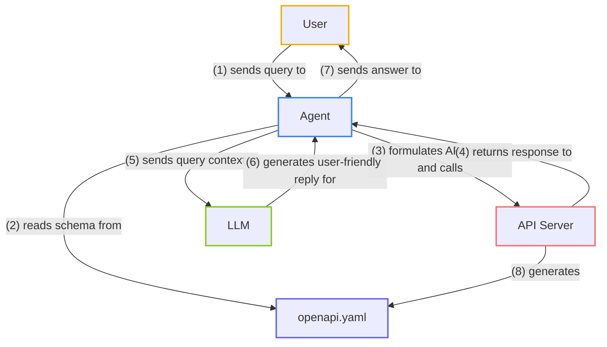

 

If you're developing an AI application, you're probably considering using APIs to extend its capabilities and integrate it with various services (internal or external).

Fortunately, popular AI agent frameworks like [LangChain](https://python.langchain.com/docs/introduction/) and [Haystack](https://haystack.deepset.ai/), make this easy. You can use them to build an AI agent that can process user queries, interact with APIs, and generate responses based on the data retrieved. All you need to start connecting the agent with outside systems is an [OpenAPI document](/openapi). 

OpenAPI is a standardized way to describe a RESTful API (in JSON/YAML). The AI agents can use this document to understand and interact with the API.

In this guide, we'll build an agent with each of these frameworks. The agents will connect with a mock **F1 API** to answer queries about Formula One (F1) race winners, using the API's OpenAPI document to automatically understand which API endpoints to call, what data to send, and how to interpret the responses.

When we're done, we'll compare LangChain and Haystack in terms of their features, workflows, and documentation to help you decide which is better suited to your needs.

## What is an agent?

An AI agent is an intelligent system that can autonomously perform tasks like decision-making, data retrieval, and interacting with external systems. Think of it as a digital assistant that helps automate complex workflows without needing constant human supervision.

## How do agents and APIs interact, and where does OpenAPI fit in?

The [OpenAPI Specification](/openapi) provides a standardized format for describing RESTful APIs that agents can use to understand what endpoints are available, how to authenticate, what data is needed, and what responses to expect.

By [generating an OpenAPI document from code](/openapi/frameworks), you can guarantee a correct interface between agents and APIs. This means agents can autonomously work with APIs, reducing the manual work involved in crafting queries and parsing responses.

## Agents vs. LLMs?

Just as web frameworks like Flask or FastAPI simplify full-stack development by handling much of the boilerplate for routing, input validation, and middleware, AI agent frameworks do the heavy lifting when working with large language models. Instead of manually writing HTTP requests and parsing JSON responses line by line, you can use an AI framework to quickly get started using structured components.

For example, when building the F1 agent in this guide, using a framework like LangChain or Haystack spares you from writing custom code to fetch the winner from an endpoint like `/winners/2024/monaco`. Instead, you can plug in your OpenAPI document, and the framework's existing tools handle the low-level details. This means less time spent wrestling with request formatting and more time focusing on your agent's logic.

For a quick, one-off prompt, directly calling OpenAI or Claude might be simpler. But if you're aiming for a production-level system that is reliable and can handle edge cases like LLM refusal (for example, "I can't answer that"), using a framework saves on development time and headaches, much like web frameworks simplify traditional app development.

## What we're building

We'll build an F1 race agent that answers users' questions about F1 races to demonstrate how AI can integrate with an API to retrieve real-time or historical data. When prompted with a question, the agent will autonomously call the relevant endpoints, parse results, and deliver meaningful answers.

For example, if a user asks, _"Who won the Monaco Grand Prix in 2024?"_, the agent will:

1. Recognize the query and identify the relevant API endpoint, like `/winners/{year}/{race}`, based on the OpenAPI spec.
2. Call the endpoint with the necessary parameters.
3. Return a clear, user-friendly reply based on the API response, for example, _"Charles Leclerc won the Monaco Grand Prix in 2024."_

Here's a diagram of our agent's workflow:



## AI frameworks: LangChain and Haystack

**LangChain** and **Haystack** are two popular frameworks for API integration, each offering a different design philosophy and user experience.

### LangChain

One of the most widely-used frameworks for building AI applications, [LangChain](https://python.langchain.com/docs/introduction/) is known for its ability to integrate with OpenAPI documents, enabling agents to understand and interact with APIs naturally. In theory, this makes LangChain a solid candidate for building our F1 agent, where the goal is to fetch race winners from a FastAPI backend based on user queries.

Our expectation was that LangChain would deliver a smooth transition from a static spec file to a working prototype in no time: Feed in an OpenAPI document, and the agent should automatically figure out which endpoint (such as `/winners/{year}/{race}`) to call for queries like "Who won the Monaco Grand Prix in 2024?"

In reality, we spent a lot of time struggling with LangChain's documentation. Much of the OpenAPI integration guidance was outdated, referencing methods and classes that had been deprecated or moved elsewhere. Trying to use the code within the Langchain OpenAPI guide often resulted in deprecation errors like this one:

```text
LangChainDeprecationWarning: The class `ChatOpenAI` was deprecated in LangChain 0.0.10 and will be removed in 1.0. An updated version of the class exists in the :class:`~langchain-openai package and should be used instead. To use it run `pip install -U :class:`~langchain-openai` and import as `from :class:`~langchain_openai import ChatOpenAI``
```

This forced us into a trial-and-error approach, where we had to rely on `langchain-community` modules rather than the official `langchain` package.

#### Hallucination and debugging the agent

Once we had a working prototype, our LangChain-based agent occasionally hallucinated non-existent endpoints (like `/winners/latest`), and required extra prompt tuning and spec details to keep it on track.

The silver lining was that the `AgentExecutor` tool allowed us to see the agent's internal reasoning steps so we could trace the logic that led to a faulty endpoint choice. This transparency helped us debug the agent's behavior.

#### Strengths

- Highly flexible and extensible ecosystem.
- Large community offering workarounds and additional tools.
- Useful view of the agent's "chain of thought" for debugging and prompt engineering.

#### Challenges

- Outdated and incomplete official documentation.
- Reliance on community-driven modules.

### Haystack

[Haystack](https://haystack.deepset.ai/) was initially designed for search, retrieval-augmented generation (RAG), and question-answering (QA), but it's evolved into a general-purpose AI agent framework that also integrates with OpenAPI documents. While this means that Haystack can enable an agent to understand and call specific API endpoints much like LangChain does, it handles such tasks with a more standardized pipeline structure.

Haystack's modular pipeline structure uses standardized components to handle different parts of an agent's workflow, making it easier to understand how tasks are processed step by step. Compared to LangChain's "black box" approach, this modularity made the experience of implementing our F1 agent with Haystack more straightforward.

Without having to hunt down unofficial modules or rummage through outdated examples, we got the agent calling the correct `/winners/{year}/{race}` endpoint and retrieving data with comparatively little friction. Queries like "Who won the Monaco Grand Prix in 2024?" worked reliably within a much shorter setup time.

A standout feature of Haystack is its accurate and up-to-date documentation. Instead of encountering deprecated functions or incomplete references, we found guides that matched the latest version of the framework and provided clear, step-by-step instructions.

Unlike LangChain, where we found that most new features required some community-driven workaround, Haystack's official docs led us directly to solutions that work out of the box.

#### Hallucination and debugging the agent

As with our LangChain-based agent, our Haystack-based agent occasionally tried to call non-existent endpoints. We addressed this by providing more detailed descriptions in the OpenAPI document, as we did previously. 

Unlike LangChain, Haystack didn't readily expose the agent's reasoning steps. Although this made certain debugging tasks less transparent, the overall reliability of the agent and reduced need for guesswork in its implementation meant we didn't feel as dependent on seeing those internal processes. Haystack's consistent documentation and structured design approach helped us avoid many of the pitfalls that required extensive investigation in LangChain.

For example, we asked the question "Who is the latest winner of the Monaco Grand Prix?" The Haystack agent hallucinated an endpoint:

```text
HTTP error occurred: 500 Server Error: Internal Server Error for url: http://127.0.0.1:8000//winners/2023/monaco_gp while sending request to http://127.0.0.1:8000//winners/latest/monaco_gp

Error invoking OpenAPI endpoint. Error: HTTP error occurred: 500 Server Error: Internal Server Error for url: http://127.0.0.1:8000//winners/2023/monaco_gp

LLM Response: It seems that there was a server error when trying to retrieve the information for the latest Monaco Grand Prix. Unfortunately, I cannot access the data at the moment. If you're looking for information about the winners or another specific query regarding F1, please let me know, and I'll do my best to assist you!
```

#### Strengths

- Clear, up-to-date documentation.
- More stable and consistent components, resulting in fewer breaking changes.
- No reliance on community modules.

#### Challenges

- Smaller ecosystem means fewer experimental or cutting-edge integrations.
- No visibility into the agent's internal reasoning steps.

## Building an OpenAPI agent

Now we'll walk you through creating two AI agents that interact with an F1 API using OpenAPI documents: One built with LangChain and the other with Haystack. We'll cover setting up the F1 API server, loading the OpenAPI document, and implementing each agent.

### Example API Server

The agents use an F1 API built with FastAPI, featuring endpoints for race standings, to demonstrate how agents interact with real-world data.

The F1 API includes the endpoints `/winners/{year}/{race}`, which returns the winner of a specific race in a given year, and `/winners/{year}`, which returns all race winners for that year.

<div className="Callout" data-title="Example Repository" data-variant="info">
Take a look at the [F1 API repository](https://github.com/speakeasy-api/openapi-agent-examples/tree/main/f1-fastapi-server) for more details on the API implementation.
</div>


#### Running the F1 API server

To run the F1 API server, follow these steps:

1. Clone the [repository](https://github.com/speakeasy-api/openapi-agent-examples/tree/main/f1-fastapi-server) and navigate to the `f1-fastapi-server` directory.

```bash
git clone https://github.com/speakeasy-api/openapi-agent-examples.git

cd openapi-agent-examples/f1-fastapi-server
```

2. Install the required dependencies using `pip install -r requirements.txt`.

3. Run the FastAPI server using `uvicorn main:app --reload`.

The API server will start on `http://127.0.0.1:8000/` by default.

### Generating the OpenAPI document

We'll use FastAPI's built-in support for OpenAPI to generate the OpenAPI document that describes the F1 API's endpoints, request parameters, and response formats. This spec serves as a blueprint for the AI agent to understand the API's capabilities and interact with it effectively.

Find the generated OpenAPI document by spinning up the FastAPI server and navigating to `http://127.0.0.1:8000/openapi.json`.

Convert the OpenAPI document to YAML format using an online tool like [JSON to YAML](https://www.json2yaml.com/).

### Building an agent with LangChain

You can follow along with the code in our [example repository](https://github.com/speakeasy-api/openapi-agent-examples).

#### Prerequisites

You'll need the following to build the agent with LangChain:

- An Anthropic API key to use with the ChatAnthropic model. Sign up for an account and get an API key from the [Anthropic website](https://www.anthropic.com/).
- The OpenAPI document (`openapi.json`) that describes the F1 API's endpoints and data structure. Read the [running the F1 API server](#running-the-f1-api-server) section to generate the OpenAPI document.

#### 1. Importing libraries

First install and import the necessary libraries for building the agent:

```txt requirements.txt
langchain_anthropic
langchain_community
```

```bash
pip install -r requirements.txt
```

Now import the required modules in the agent script:

```python langchain_agent.py
import os
import json
import argparse

from langchain_community.utilities.requests import RequestsWrapper
from langchain_community.agent_toolkits.openapi import planner
from langchain_community.agent_toolkits.openapi.spec import reduce_openapi_spec
from langchain_anthropic import ChatAnthropic
```

#### 2. Checking the API key

Let's add a check to ensure the API key is set before proceeding:

```python langchain_agent.py
if "ANTHROPIC_API_KEY" not in os.environ:
    raise ValueError("ANTHROPIC_API_KEY environment variable not set")
```

#### 3. Parsing command-line arguments

We'll use argparse to parse command-line arguments for using the agent:

```python langchain_agent.py
argparser = argparse.ArgumentParser()
argparser.add_argument("query", type=str, help="User query. E.g: 'Who won in Monaco in 2024?'")
argparser.add_argument("--model", type=str, default="claude-3-sonnet-20240229", help="Model name")
argparser.add_argument("--timeout", type=int, default=10, help="Timeout in seconds")
argparser.add_argument("--stop", type=str, default="</s>", help="Stop token")
args = argparser.parse_args()
```

This code snippet provides a CLI interface to input user queries and set optional parameters like model name, timeout, and stop token.

#### 4. Initializing the Anthropic model

Next, we'll initialize the Anthropic model for generating responses:

```python langchain_agent.py
model = ChatAnthropic(
    model_name=args.model,
    timeout=args.timeout,
    stop=[args.stop],
)
```

#### 5. Loading the OpenAPI document

Now load the OpenAPI document (`openapi.json`):

```python langchain_agent.py
with open("openapi.json") as f:
    openapi = json.load(f)
```

#### 6. Reducing the OpenAPI document

We'll reduce the OpenAPI document to optimize it for the agent:

```python langchain_agent.py
f1_spec = reduce_openapi_spec(openapi)
```

#### 7. Initializing the requests wrapper

Now initialize `RequestsWrapper` to handle HTTP requests:

```python langchain_agent.py
requests_wrapper = RequestsWrapper()
```

#### 8. Creating the OpenAPI agent

Create the OpenAPI agent by combining the optimized OpenAPI document, request handling, and Anthropic model:

```python langchain_agent.py
f1_agent = planner.create_openapi_agent(
    f1_spec, requests_wrapper, model, allow_dangerous_requests=True
)
```

Here we set `allow_dangerous_requests` to `True` to enable the agent to make potentially unsafe requests to the F1 API.

#### 9. Invoking the agent

Finally, invoke the agent with the user query:

```python langchain_agent.py
f1_agent.invoke(args.query)
```

#### Running the script

Before running the script, make sure the [F1 API server is running](#running-the-f1-api-server).

1. Place the OpenAPI document (`openapi.json`) in the working directory.

2. Set your Anthropic API key in the environment variables:

   ```bash
   export ANTHROPIC_API_KEY="your_anthropic_api_key"
   ```

3. Run with a query:

   ```bash
   python langchain_agent.py "Who won the Monaco Grand Prix in 2024?"
   ```

You should receive a response similar to the following:

   ```text
   Based on the data from the F1 API, Charles Leclerc won the 2024 Monaco Grand Prix.
   ```

### Building an agent with Haystack

You can follow along with the code in our [example repository](https://github.com/speakeasy-api/openapi-agent-examples).

#### Prerequisites

You'll need the following to build an agent with Haystack:

- An OpenAI API key. You can sign up for an account and get an API key from the [OpenAI website](https://platform.openai.com/).
- The OpenAPI document (`openapi.yaml`) that describes the F1 API's endpoints and data structure. Read the [running the F1 API server](#running-the-f1-api-server) section to generate the OpenAPI document.

#### 1. Importing libraries

First, install and import the necessary libraries for building the pipeline:

```txt requirements.txt
haystack-ai
openapi3
jsonref
haystack-experimental==0.3.0
```

Run the following command to install the required libraries:

```bash
pip install -r requirements.txt
```

Now import the required modules in the agent script:

```python haystack_agent.py
import os
import argparse
from haystack import Pipeline
from haystack.dataclasses import ChatMessage
from haystack.components.builders import ChatPromptBuilder
from haystack.components.generators.chat import OpenAIChatGenerator
from haystack_experimental.components.tools.openapi import OpenAPITool, LLMProvider
```

#### 2. Checking the API key

Let's add a check to make sure that the API key is set:

```python haystack_agent.py
if "OPENAI_API_KEY" not in os.environ:
    raise ValueError("OPENAI_API_KEY environment variable not set")
```

#### 3. Initializing the OpenAPI tool

Next, initialize the OpenAPI tool with the F1 API schema:

```python haystack_agent.py
f1_tool = OpenAPITool(
    generator_api=LLMProvider.OPENAI,
    spec="openapi.yaml",
)
```

#### 4. Building the prompt template

Let's define a conversation template to guide the LLM in generating responses:

```python haystack_agent.py
messages = [
    ChatMessage.from_system(
        "Answer the F1 query using the API. Race names with two words should be separated by an underscore and be in lowercase. The API stores data from 2021 to 2024."
    ),
    ChatMessage.from_user("User asked: {{user_message}}"),
    ChatMessage.from_system("API responded: {{service_response}}"),
]

builder = ChatPromptBuilder(template=messages)
```

#### 5. Initializing the LLM

Set up the LLM to generate API-based replies:

```python haystack_agent.py
llm = OpenAIChatGenerator(generation_kwargs={"max_tokens": 1024})
```

#### 6. Building the pipeline

Now we'll create a pipeline that connects the OpenAPI tool, prompt builder, and LLM. Haystack's modular design allows us to chain components together easily:

```python haystack_agent.py
pipe = Pipeline()
pipe.add_component("f1_tool", f1_tool)
pipe.add_component("builder", builder)
pipe.add_component("llm", llm)

pipe.connect("f1_tool.service_response", "builder.service_response")
pipe.connect("builder.prompt", "llm.messages")
```

#### 7. Querying the pipeline

Define a function to process user queries through the pipeline and return the LLM's response:

```python haystack_agent.py
def query_f1_pipeline(user_query: str):
    """
    Run the F1 bot pipeline with the user's query.
    :param user_query: The user's query as a string.
    :return: The response generated by the LLM.
    """
    result = pipe.run(data={
        "f1_tool": {
            "messages": [ChatMessage.from_user(user_query)]
        },
        "builder": {
            "user_message": ChatMessage.from_user("Answer the F1 query in a user-friendly way")
        }
    })
    return result["llm"]["replies"][0].content
```


#### 8. Creating a CLI tool

Finally, let's set up the main function to allow the script to accept user input via command-line arguments:

```python haystack_agent.py
def main():
    parser = argparse.ArgumentParser(description="Query the F1 pipeline CLI tool.")
    parser.add_argument("query", type=str, help="User query. E.g., 'Who won in Monaco in 2024?'")
    parser.add_argument("--model", type=str, default="gpt-4", help="Model name")
    parser.add_argument("--timeout", type=int, default=10, help="Timeout in seconds")
    parser.add_argument("--max_tokens", type=int, default=1024, help="Maximum tokens for response")

    args = parser.parse_args()

    llm.generation_kwargs["max_tokens"] = args.max_tokens

    response = query_f1_pipeline(args.query)
    print("LLM Response:", response)

if __name__ == "__main__":
    main()
```

#### Running the script

Before running the script, make sure the [F1 API server is running](#running-the-f1-api-server).

1. Place the F1 API document (`openapi.yaml`) in the working directory.

2. Set your OpenAI API key as an environment variable:

   ```bash
   export OPENAI_API_KEY="your_openai_api_key"
   ```

3. Run the script with a query:

   ```bash
   python haystack_agent.py "Who won in Monaco in 2024?"
   ```

You should receive a response similar to the following:

   ```text
   LLM Response: Based on the data from the F1 API, Charles Leclerc won the 2024 Monaco Grand Prix.
   ```

## The production gap

Turning a proof-of-concept into a production-ready system involves more than just getting basic queries right. Even if your agent works perfectly in testing, production brings new challenges, like how to handle errors, manage resources, and keep the agent secure. 

### Error handling

In production, your agent must gracefully handle unexpected inputs, outdated OpenAPI documents, and API timeouts. If a user asks about a non-existent race, your agent should respond with a helpful message rather than crash.

Input validation, API timeout handling, and clear error messages ensure the system stays stable. Logging errors makes it easier to troubleshoot issues later.

### Resource management

As usage grows, so do costs and performance demands. Without limits, frequent LLM and API calls can lead to significant bills.

Caching popular results reduces unnecessary calls. Monitoring request rates and scaling resources as needed helps maintain responsiveness without overspending.

### Security

With increased traffic comes higher security risks. Always sanitize user inputs to prevent malicious payloads.

Secure API keys, add authentication if needed, and ensure only authorized users can access sensitive endpoints.

### Making your agent production-ready

Implement rate limiting to handle traffic spikes, and add retries for flaky network calls. A good monitoring system should warn you if something goes wrong, while a thorough testing suite (including integration tests) ensures that updates don't break critical features.


## Final thoughts

LangChain is more of a collection of tools than a fully integrated framework. The LangChain toolset offers good flexibility, allowing you to pick and choose components, integrate various LLMs, and adapt the setup to unusual requirements. However, LangChain's official documentation is lacking, and you'll rely on community modules to piece together solutions. Developing a good agent involves experimenting with `langchain-community` modules to replace outdated instructions.

Haystack, on the other hand, focuses on reliability and production-readiness. The Haystack documentation is clear and up-to-date, and the structured pipeline design makes it easier to understand how components interact. Haystack also offers a lower risk of breaking changes and deprecated functions, and eliminates the need to rely on community modules to fill gaps.

Keep in mind that even with the right framework, AI agents can hallucinate endpoints and produce unexpected errors.

Overall, Haystack is the better choice for production-level systems and quick POCs, while LangChain is more suited for projects that require greater flexibility and allow for time to experiment.
