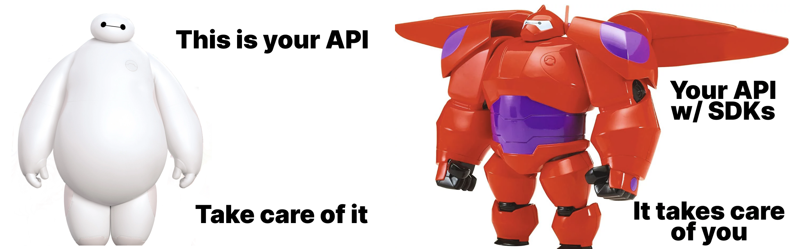
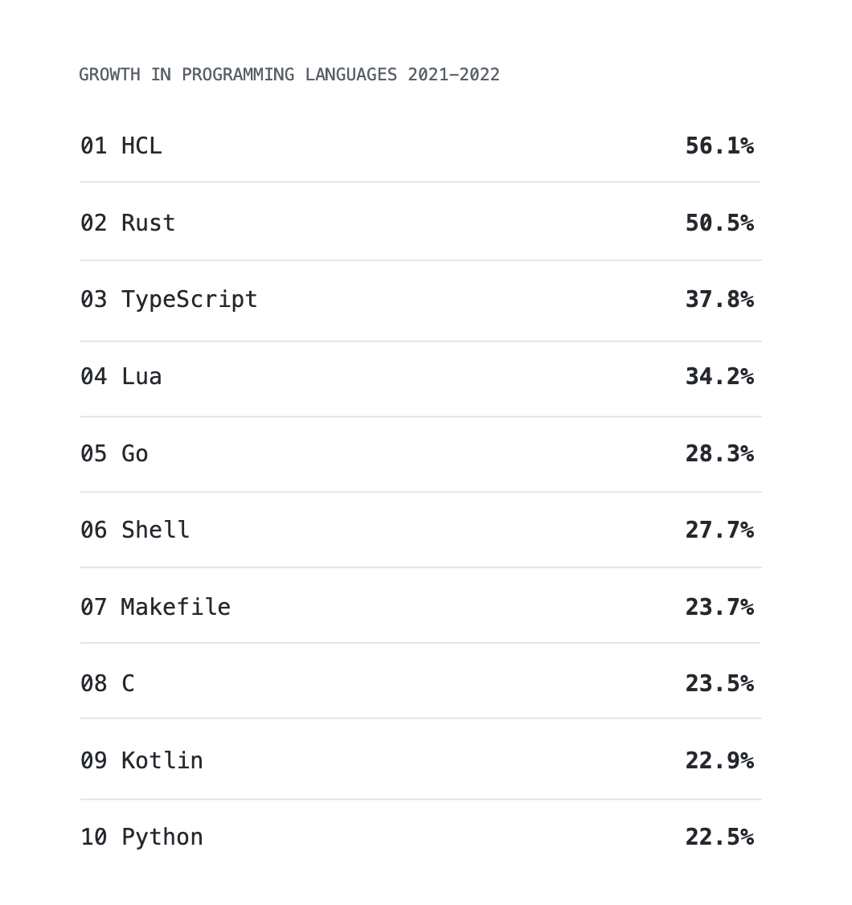

{/*import { Callout } from '~/components'*/}

## From API-First to SDK-First

One of the most significant trends in tech over the past ten years has been the proliferation and success of API-as-a-product companies (e.g. Twilio, Algolia, etc).

But the term API-as-a-product, obscures one of the most critical ingredients in these companies’ success. The secret that the most successful API companies have been hiding in plain sight, is that their APIs are not the actual interface beloved by users. It is their SDKs which are at the heart of the best-in-class developer experience these companies offer.  If you want to delight developers, don’t try to just be API-first, focus on becoming SDK-first.

So why doesn’t every API company offer SDKs to their users? Up until now, it’s been really hard to sustainably build great SDKs. If you look at a list of [the most popular APIs](https://www.postman.com/explore/most-popular-apis-this-year), you’ll find that even some of the biggest API companies have failed to build out robust SDK programs. Many offer patchy or incomplete support.

Change is coming though. Speakeasy is committed to giving every company access to an API experience platform on par with what the best API companies provide. A major component of that platform is a workflow to easily and sustainably build SDKs for all your REST APIs.

In this piece, we’ll discuss why SDKs are important, what qualities make a great SDK, and how to overcome the common problems that typically plague SDK development and maintenance.

## Why Are SDKs Important?

SDKs provide numerous unique benefits to your end-users’ developer experience, and to your team too:

- **Reduce your team’s support burden**: By enabling type definitions in the IDE, SDKs reduce the likelihood of user error during user integration. That in turn means less support tickets for your team to manage.
- **Improve product discoverability**: SDKs put your product in the place where developers are most likely to look for solutions. Client libraries on Github and in popular package managers will help your product develop social proof as users encounter you in familiar environments.
- **Increase revenue with a larger addressable market**: Every SDK you offer makes it easier to appeal to a new community of developers. That means an increase in users, and ultimately, more revenue.

Of course, releasing a badly-written SDK could do more harm than good. Let’s dive into what it means to build a great SDK.
<br />


<br />

## Best Practices for a Great SDK

We’ve talked to hundreds of developers on this topic. While there is always a bit of personal preference, these are the things that every developer wants to see in an SDK:

### 1. Type Safe

Type safety might be the most important aspect of SDK creation. By making your API’s inputs and outputs explicit, the developers integrating the API into their application can better understand how the API is intended to be used — and massively reduce the amount of incorrect requests being made to your API. Type safety will help developers debug in their IDE as they write the application code, and spare them the frustration of having to comb through the constructed data object to see where/ mistakes occurred.

The more that you can include in your type definition, the more feedback developers will have when they are building with your SDK. The below example shows how Speakeasy uses Zod Schemas to define the input and output types for a product object in TypeScript. This allows developers to validate the input and output of the API at runtime, and provides a clear contract for how the API should be used:

```ts title="product.ts"
export namespace ProductInput$ {
    export type Inbound = {
        name: string;
        price: number;
    };

    export const inboundSchema: z.ZodType<ProductInput, z.ZodTypeDef, Inbound> = z
        .object({
            name: z.string(),
            price: z.number().int(),
        })
        .transform((v) => {
            return {
                name: v.name,
                price: v.price,
            };
        });

    export type Outbound = {
        name: string;
        price: number;
    };

    export const outboundSchema: z.ZodType<Outbound, z.ZodTypeDef, ProductInput> = z
        .object({
            name: z.string(),
            price: z.number().int(),
        })
        .transform((v) => {
            return {
                name: v.name,
                price: v.price,
            };
        });
}
```

### 2. Abstracted

SDKs spare your users from having to worry about the minutiae of how your API works. You can abstract away details like:

- **Networking code**: SDKs can handle the details of making network requests to an API. This allows developers to focus on the functionality they want to implement, rather than the details of how to communicate with the API.
- **Request and response formatting**: SDKs can handle the details of formatting requests and parsing responses in a format that is specific to the API
- **Error handling**: SDKs can interpret the details of errors that occur when using an API, allowing developers to focus on their application logic rather than error handling.

### 3. Human Readable

This one is pretty self-explanatory. AI hasn’t made developers obsolete yet, so there is going to be another person on the other side of your SDK code. When code is well-organized, well-commented and easy to read, developers are more likely to be able to understand how the SDK works and how to use it correctly.

### 4. Limited Dependencies

Codebases are jungles, and SDKs are another component of this complex ecosystem. When an SDK has a large number of dependencies, it can be more difficult to use the SDK with other libraries and frameworks. If a developer has to try and resolve incompatible dependencies before they can use your SDK, there is a high risk they will abandon the API integration altogether.

Limiting the number of external dependencies in your SDK is therefore critical to ensure compatibility.

### 5. Enterprise Features

We think that features like retries, pagination, and security helpers should come in every SDK. These aren’t things that are strictly required at the earliest stages of an integration, but as soon as users want to use your API for production use cases, this matters — and their absence can slow down integrations significantly. It’s just another case where a user doesn’t want to have to think about how to do this well — and may not have enough product context do to so optimally.

The API creator is in a much better position to set sensible defaults here. 

```tsx
x-speakeasy-retries:
  strategy: backoff
  backoff:
    initialInterval: 500        # 500 milliseconds
    maxInterval: 60000          # 60 seconds
    maxElapsedTime: 3600000     # 5 minutes
    exponent: 1.5
  statusCodes:
    - 5XX
```

### Language Idiomatic

This is a meaty topic, and it’s hard to discuss in generalities (it’s different for every language), so let’s walk through an example of the type of design choices that a developer might expect of a Go SDK:

- **Minimal dependencies** and relying on the Go standard library as much as possible.
- **Struct tags and reflection based (de)serializers** to define how the types we generate are correctly serialized based on the OpenAPI document.
- **Pointers for optional objects** including fields/parameters/response and request bodies to ensure that the user can differentiate between a field not being set and a field being set to a zero value.
- **A Utils package** that improves readability by bundling the methods for configuring the SDK and serializing/deserializing the types we generate into a shared package, avoiding the need to duplicate in each method.

```go
package shared

type PetStatusEnum string

const (
    PetStatusEnumAvailable PetStatusEnum = "available"
    PetStatusEnumPending   PetStatusEnum = "pending"
    PetStatusEnumSold      PetStatusEnum = "sold"
)

type Pet struct {
    Category  *Category      `json:"category,omitempty"`
    ID        *int64         `json:"id,omitempty"`
    Name      string         `json:"name"`
    PhotoUrls []string       `json:"photoUrls"`
    Status    *PetStatusEnum `json:"status,omitempty"`
    Tags      []Tag          `json:"tags,omitempty"`
}
```

If you make sure your SDK is type safe, idiomatic, and compatible with their existing environment you’re going to attract developers and inspire loyalty. At this point the last thing that needs to be solved is building a sustainable program for your SDK development.

## How to Sustainably Build SDKs

When you start building SDKs you will quickly run into two major issues:

1. There are a lot of languages that you’ll need to build support for
2. You need a way to update SDKs as your API changes.

Let’s walkthrough how you can overcome these two blockers.

### The Long-tail of languages and runtimes

In 2022, [the proliferation of programming languages accelerated](https://octoverse.github.com/2022/top-programming-languages) — and there’s no sign of that trend abating anytime soon.

That’s great for nerding out over language design, but it’s a pain if you’re on the hook for building your API’s SDKs. Whereas 15 years ago you could have covered most programmers with 3-4 libraries, it’s now probably closer to 8-10. Languages can also have multiple popular frameworks, each of which require idiosyncratic tweaks to get the developer experience correct.

This fragmentation of languages & runtimes makes it harder to provide the same level of service to your users and makes it hard to keep track of how users are interfacing with your product.



It’s not reasonable to expect that every company will have the language expertise internally to be able to support every language & runtime. That’s why we’ve built the Speakeasy generator. We are committed to building out support for every popular language & runtime so that you don’t have to. And in cases where people need something very specific, we offer the ability to right a custom template for the generator to use.

### Preventing SDK Drift

Too many companies think of building SDKs as a one-time project. They assign developers or contractors to handroll SDKs in the languages they know best, and punt on a long-term support system. This works for a while, but inevitably an expanding API definition, and an increasing number of libraries saddles the engineering team with a constant stream of tedious refactoring work. This refactoring may or may not be prioritized leading to SDKs with divergent behavior.

The best API companies have built SDK generators and workflows that update the SDK automatically as part of their CI/CD pipeline. Whenever a new version of the API is published, a new version of their SDKs is released.

This is a huge lift for any company to undertake — which is where Speakeasy comes in. With Speakeasy, any development team can have the same API infrastructure as the world’s best API companies. Producing idiomatic SDKs as part of your CI/CD is now available with our generator and a simple Github action:

import workflow_url from './assets/github-workflow.mp4'

  <video controls={false} loop={true} autoPlay={true} width="100%" >
    <source src={workflow_url} type="video/mp4" />
  </video>

## Final Thoughts

What’s considered table stakes for developer experience has never been higher. And as the primary interface for APIs, your SDKs are perhaps the single most important component of your developer experience. At the same time, the proliferation in languages & runtimes being used in production applications, means it’s never been harder to support the developer community.

When you are building SDKs, make sure you build something that developers will actually want to use. That means making sure your SDKs are type-safe and idiomatic. Finally, make sure that your SDK development is sustainable. Make sure you have a plan to provide ongoing support to the SDKs you build, otherwise you risk developers losing trust in the product when SDKs are not at parity with the API.

If you want your to make your SDK creation and ongoing support easy to manage, consider trying out the Speakeasy pipeline.