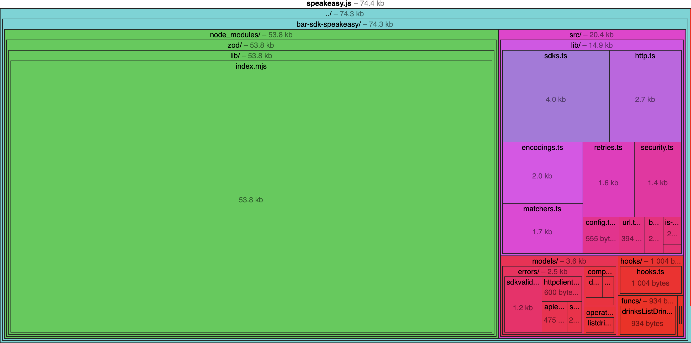
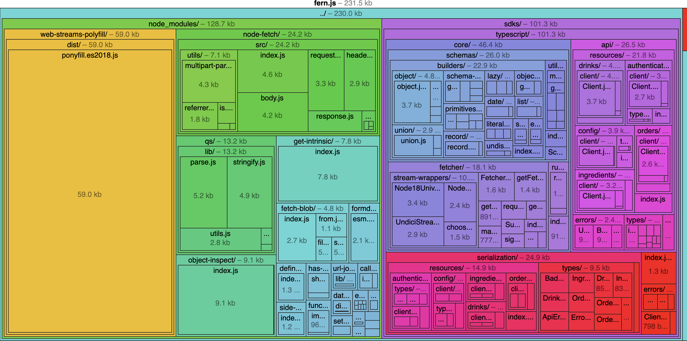

{/* import { Callout } from "~/components"; */}

<div className="Callout" data-title="NOTE" data-variant="info">
  This comparison of Speakeasy and Fern is based on a snapshot of two developing companies as of January 2025. If you think we need to update this post, please let us know!
</div>

[Speakeasy](https://www.speakeasy.com/) and [Fern](https://buildwithfern.com/) both offer free and paid services that API developers use to create SDKs (client libraries) and automate SDKs' publication to package managers, but how do they differ? Here's the short answer:

1. **Fern** is an SDK generation tool designed for the Fern domain-specific language (DSL). It creates SDKs in seven languages and API reference documentation.
2. **Speakeasy** is a complete platform for building and exposing enterprise APIs. It is OpenAPI-native and supports SDK generation in ten languages, as well as Terraform providers and documentation.

## How is Speakeasy different?

### Speakeasy is everything you need in one

We've built a platform that does more than merely generate SDKs. You could use Fern for SDKs, Stoplight for documentation, Spectral for linting, and handroll your Terraform provider, or you could use Speakeasy to do it all. One platform, one team, all your API needs handled.

### OpenAPI-native vs OpenAPI-compatible

Speakeasy is designed to be **OpenAPI-native**. We don't believe the world needs another standard for describing APIs. OpenAPI has its flaws, but it's the established standard, and we're committed to making it better. That means that Speakeasy is interoperable with the rest of the API tooling ecosystem. Mix and match us with your other favorite tools, and we'll play nice.

Fern is built on top of a [DSL (domain-specific language)](https://buildwithfern.com/learn/api-definition/fern/overview), with **optional** support for OpenAPI. This makes Fern **OpenAPI-compatible**, meaning your OpenAPI document is no longer the single source of truth for your API.

### Engineering velocity and maturity

Fern's initial GitHub commit was in [April 2022](https://github.com/fern-api/fern/commit/322908f557ee94882ed64f265993ed53ae002198), and the tool has expanded its language support to seven languages since then. By comparison, [Speakeasy's first commit was in September 2022](https://github.com/speakeasy-api/speakeasy/commit/cb126d57ba7ad2ed9c1445a396beb5b48714da80), and the platform has released support for ten languages in a shorter period. 


The Speakeasy platform is also broader, with support for additional generation features not supported by Fern, like [React Hooks](/post/release-react-hooks) and [Terraform providers](/post/release-terraform-v2).


### Speakeasy SDKs work where you need them

Speakeasy SDKs are designed to work in any environment. Speakeasy supports the latest versions of the languages it targets, and we're committed to staying up to date with new releases. Our TypeScript SDKs can be bundled for the browser and many other JavaScript environments, while Fern's are Node.js-only.

Speakeasy gets high-quality products in the hands of our users fast.

## Comparing Speakeasy and Fern

### SDK generation

Everyone has that one odd language that is critically important to their business and seemingly to nobody else's. That's why we're committed to supporting the long tail. We've made a dent, but we've got further to go. Is there a language you need that we don't support? [Let us know](https://github.com/orgs/speakeasy-api/projects/6/views/1)!

| Language           | Speakeasy | Fern |
| ------------------ | --------- | ---- |
| Go                 | ✅        | ✅   |
| Python             | ✅        | ✅   |
| TypeScript         | ✅        | ✅   |
| Java               | ✅        | ✅   |
| C#                 | ✅        | ✅   |
| PHP                | ✅        | ✅   |
| Ruby               | ✅        | ✅   |
| Terraform          | ✅        | ❌   |
| Swift              | ✅        | ❌   |
| Unity              | ✅        | ❌   |

### SDK features

Fern and Speakeasy SDKs differ in two key areas of feature support:

1. Fern lacks native support for some of the more advanced enterprise features supported by Speakeasy. Features like pagination and OAuth are left up to the customer to implement with custom code.
2. Fern offers customizations to the names used in the SDK but not to the fundamental structure of the SDK. In addition to names, Speakeasy allows you to customize details like the directory structure and how parameters are passed into functions.

| Feature                      | Speakeasy | Fern |
|------------------------------|-----------|------|
| Union types                  | ✅         | ✅    |
| Server-side events           | ✅         | ✅    |
| Retries                      | ✅         | ✅    |
| Webhooks                     | ✅         | ✅    |
| Async support                | ✅         | ✅    |
| Custom SDK naming            | ✅         | ✅    |
| Pagination                   | ✅         | ✅    |
| API documentation            | ✅         | ✅    |
| Streaming uploads            | ✅         | ❌    |
| OAuth 2.0                    | ✅         | ❌    |
| React Hooks support          | ✅         | ❌    |
| Caching and state management | ✅         | ❌    |
| Customized SDK structure     | ✅         | ❌    |

### Platform features

The primary differences between the platforms are:

1. Fern is solely focused on the generation of artifacts. Speakeasy has a deeper platform that supports the management of API creation through CLI validation.
2. Speakeasy offers a web interface for managing and monitoring the creation of your SDKs.

| Feature               | Speakeasy | Fern |
| --------------------- | --------- | ---- |
| GitHub CI/CD          | ✅        | ⚠️   |
| CLI                   | ✅        | ✅   |
| Web interface         | ✅        | ❌   |
| Package publishing    | ✅        | ✅   |
| Product documentation | ✅        | ✅   |
| Server stubs          | ❌        | ✅   |
| OpenAPI validation    | ✅        | ❌   |
| OpenAPI Overlays      | ✅        | ❌   |
| AI-powered spec edits | ✅        | ❌   |

⚠️ Fern claims CI/CD support for SDKs on its paid plan, but this feature is not mentioned in the documentation.

### Enterprise support

Speakeasy sets up tracking on all customer repositories and will proactively triage any issues that arise.

| Feature               | Speakeasy | Fern |
| --------------------- | --------- | ---- |
| Concierge onboarding  | ✅        | ✅   |
| Private Slack channel | ✅        | ✅   |
| Enterprise SLAs       | ✅        | ✅   |
| User-issues triage    | ✅        | ❌   |

### Pricing

The biggest difference between the two pricing models is the starter plan. Speakeasy offers one free SDK with unlimited endpoints, while Fern's starter plan is paid.

| Plan       | Speakeasy             | Fern                           |
|------------|-----------------------|--------------------------------|
| Starter    | 1 free published SDK  | $250/mo/SDK; max 50 endpoints  |
| Scaleup    | 1 free + $250/mo/SDK  | ❌                              |
| Business   | 1 free + $600/mo/SDK  | $600/mo/SDK; max 150 endpoints |
| Enterprise | Custom                | Custom                         |


## Fern and Speakeasy walkthrough

Let's walk through generating an SDK with both Fern and Speakeasy. This is well explained in the documentation, so we'll keep it brief.

Both services support Linux, macOS, and Windows, and run in Docker.

Some of the examples below are from the [Speakeasy Bar Starter SDK](https://github.com/speakeasy-sdks/template-speakeasy-bar/).

## Creating SDKs

### Fern quickstart

Follow the [Fern quickstart](https://buildwithfern.com/learn/sdks/getting-started/generate-your-first-sdk).

In the folder containing the `openapi.yaml` file, open a terminal and use Node.js with npm:

```bash
npm install -g fern-api
fern init --openapi ./openapi.yaml;
# will require GitHub login in browser
fern generate
```

- `init` creates a `fern` folder containing a copy of the OpenAPI document and some configuration files.
- `generate` creates SDKs in the folder `../generated`. You can change the output folder by editing `generators.yaml`. We used the following file to create all four languages:

```yaml
default-group: local
groups:
local:
 generators:
 - name: fernapi/fern-typescript-node-sdk
 version: 0.7.2
 output:
 location: local-file-system
 path: ./generated/typescript
 config:
 outputSourceFiles: true # output .ts instead of .js with definitions files
 - name: fernapi/fern-python-sdk
 version: 0.7.2
 output:
 location: local-file-system
 path: ./generated/python
 - name: fernapi/fern-java-sdk
 version: 0.5.15
 output:
 location: local-file-system
 path: ../generated/java
 - name: fernapi/fern-go-sdk
 version: 0.9.2
 output:
 location: local-file-system
 path: ../generated/go
 - name: fernapi/fern-postman
 version: 0.0.45
 output:
 location: local-file-system
 path: ./generated/postman
```

Fern can also generate documentation:

- `init --docs` creates a `docs.yml` configuration file.
- `generate --docs;` creates documentation at the URL specified in the configuration file.

### Speakeasy quickstart

Follow the [Speakeasy quickstart](https://speakeasyapi.dev/docs/speakeasy-cli/getting-started).

The Speakeasy CLI is a single executable file [built with Go](https://github.com/speakeasy-api/speakeasy).

```bash
brew install speakeasy-api/homebrew-tap/speakeasy

speakeasy quickstart
```

- Speakeasy handles authentication with a secret key in an environment variable. You can get the secret key on the Speakeasy website.
- Running the Speakeasy quickstart launches an interactive mode that will guide you through generating an SDK.

## Comparing TypeScript SDK generation with Fern and Speakeasy

Comparing the output of Fern and Speakeasy for all four SDK languages Fern supports would be too long for this article. We'll focus on TypeScript (JavaScript).

### SDK structure

Below is the Fern folder structure.

```bash
├── Client.d.ts
├── Client.js
├── api
│   ├── errors
│   │   ├── BadRequestError.d.ts
│   │   ├── BadRequestError.js
│   │   ├── UnauthorizedError.d.ts
│   │   ├── UnauthorizedError.js
│   │   ├── index.d.ts
│   │   └── index.js
│   ├── index.d.ts
│   ├── index.js
│   ├── resources
│   │   ├── authentication
│   │   │   ├── client
│   │   │   │   ├── Client.d.ts
│   │   │   │   ├── Client.js
│   │   │   │   ├── index.d.ts
│   │   │   │   ├── index.js
│   │   │   │   └── requests
│   │   │   │       ├── LoginRequest.d.ts
│   │   │   │       ├── LoginRequest.js
│   │   │   │       ├── index.d.ts
│   │   │   │       └── index.js
│   │   │   ├── index.d.ts
│   │   │   ├── index.js
│   │   │   └── types
│   │   │       ├── LoginRequestType.d.ts
│   │   │       ├── LoginRequestType.js
│   │   │       ├── LoginResponse.d.ts
│   │   │       ├── LoginResponse.js
│   │   │       ├── index.d.ts
│   │   │       └── index.js
│   │   ├── config
│   │   │   ├── client
│   │   │   │   ├── Client.d.ts
│   │   │   │   ├── Client.js
│   │   │   │   ├── index.d.ts
│   │   │   │   └── index.js
│   │   │   ├── index.d.ts
│   │   │   ├── index.js
│   │   │   └── types
│   │   │       ├── SubscribeToWebhooksRequestItem.d.ts
│   │   │       ├── SubscribeToWebhooksRequestItem.js
│   │   │       ├── index.d.ts
│   │   │       └── index.js
│   │   ├── drinks
│   │   │   ├── client
│   │   │   │   ├── Client.d.ts
│   │   │   │   ├── Client.js
│   │   │   │   ├── index.d.ts
│   │   │   │   ├── index.js
│   │   │   │   └── requests
│   │   │   │       ├── ListDrinksRequest.d.ts
│   │   │   │       ├── ListDrinksRequest.js
│   │   │   │       ├── index.d.ts
│   │   │   │       └── index.js
│   │   │   ├── index.d.ts
│   │   │   └── index.js
│   │   ├── index.d.ts
│   │   ├── index.js
│   │   ├── ingredients
│   │   │   ├── client
│   │   │   │   ├── Client.d.ts
│   │   │   │   ├── Client.js
│   │   │   │   ├── index.d.ts
│   │   │   │   ├── index.js
│   │   │   │   └── requests
│   │   │   │       ├── ListIngredientsRequest.d.ts
│   │   │   │       ├── ListIngredientsRequest.js
│   │   │   │       ├── index.d.ts
│   │   │   │       └── index.js
│   │   │   ├── index.d.ts
│   │   │   └── index.js
│   │   └── orders
│   │       ├── client
│   │       │   ├── Client.d.ts
│   │       │   ├── Client.js
│   │       │   ├── index.d.ts
│   │       │   ├── index.js
│   │       │   └── requests
│   │       │       ├── CreateOrderRequest.d.ts
│   │       │       ├── CreateOrderRequest.js
│   │       │       ├── index.d.ts
│   │       │       └── index.js
│   │       ├── index.d.ts
│   │       └── index.js
│   └── types
│       ├── ApiError.d.ts
│       ├── ApiError.js
│       ├── BadRequest.d.ts
│       ├── BadRequest.js
│       ├── Drink.d.ts
│       ├── Drink.js
│       ├── DrinkType.d.ts
│       ├── DrinkType.js
│       ├── Error_.d.ts
│       ├── Error_.js
│       ├── Ingredient.d.ts
│       ├── Ingredient.js
│       ├── IngredientType.d.ts
│       ├── IngredientType.js
│       ├── Order.d.ts
│       ├── Order.js
│       ├── OrderStatus.d.ts
│       ├── OrderStatus.js
│       ├── OrderType.d.ts
│       ├── OrderType.js
│       ├── index.d.ts
│       └── index.js
├── core
│   ├── fetcher
│   │   ├── APIResponse.d.ts
│   │   ├── APIResponse.js
│   │   ├── Fetcher.d.ts
│   │   ├── Fetcher.js
│   │   ├── Supplier.d.ts
│   │   ├── Supplier.js
│   │   ├── createRequestUrl.d.ts
│   │   ├── createRequestUrl.js
│   │   ├── getFetchFn.d.ts
│   │   ├── getFetchFn.js
│   │   ├── getHeader.d.ts
│   │   ├── getHeader.js
│   │   ├── getRequestBody.d.ts
│   │   ├── getRequestBody.js
│   │   ├── getResponseBody.d.ts
│   │   ├── getResponseBody.js
│   │   ├── index.d.ts
│   │   ├── index.js
│   │   ├── makeRequest.d.ts
│   │   ├── makeRequest.js
│   │   ├── requestWithRetries.d.ts
│   │   ├── requestWithRetries.js
│   │   ├── signals.d.ts
│   │   ├── signals.js
│   │   └── stream-wrappers
│   │       ├── Node18UniversalStreamWrapper.d.ts
│   │       ├── Node18UniversalStreamWrapper.js
│   │       ├── NodePre18StreamWrapper.d.ts
│   │       ├── NodePre18StreamWrapper.js
│   │       ├── UndiciStreamWrapper.d.ts
│   │       ├── UndiciStreamWrapper.js
│   │       ├── chooseStreamWrapper.d.ts
│   │       └── chooseStreamWrapper.js
│   ├── index.d.ts
│   ├── index.js
│   ├── runtime
│   │   ├── index.d.ts
│   │   ├── index.js
│   │   ├── runtime.d.ts
│   │   └── runtime.js
│   └── schemas
│       ├── Schema.d.ts
│       ├── Schema.js
│       ├── builders
│       │   ├── date
│       │   │   ├── date.d.ts
│       │   │   ├── date.js
│       │   │   ├── index.d.ts
│       │   │   └── index.js
│       │   ├── enum
│       │   │   ├── enum.d.ts
│       │   │   ├── enum.js
│       │   │   ├── index.d.ts
│       │   │   └── index.js
│       │   ├── index.d.ts
│       │   ├── index.js
│       │   ├── lazy
│       │   │   ├── index.d.ts
│       │   │   ├── index.js
│       │   │   ├── lazy.d.ts
│       │   │   ├── lazy.js
│       │   │   ├── lazyObject.d.ts
│       │   │   └── lazyObject.js
│       │   ├── list
│       │   │   ├── index.d.ts
│       │   │   ├── index.js
│       │   │   ├── list.d.ts
│       │   │   └── list.js
│       │   ├── literals
│       │   │   ├── booleanLiteral.d.ts
│       │   │   ├── booleanLiteral.js
│       │   │   ├── index.d.ts
│       │   │   ├── index.js
│       │   │   ├── stringLiteral.d.ts
│       │   │   └── stringLiteral.js
│       │   ├── object
│       │   │   ├── index.d.ts
│       │   │   ├── index.js
│       │   │   ├── object.d.ts
│       │   │   ├── object.js
│       │   │   ├── objectWithoutOptionalProperties.d.ts
│       │   │   ├── objectWithoutOptionalProperties.js
│       │   │   ├── property.d.ts
│       │   │   ├── property.js
│       │   │   ├── types.d.ts
│       │   │   └── types.js
│       │   ├── object-like
│       │   │   ├── getObjectLikeUtils.d.ts
│       │   │   ├── getObjectLikeUtils.js
│       │   │   ├── index.d.ts
│       │   │   ├── index.js
│       │   │   ├── types.d.ts
│       │   │   └── types.js
│       │   ├── primitives
│       │   │   ├── any.d.ts
│       │   │   ├── any.js
│       │   │   ├── boolean.d.ts
│       │   │   ├── boolean.js
│       │   │   ├── index.d.ts
│       │   │   ├── index.js
│       │   │   ├── number.d.ts
│       │   │   ├── number.js
│       │   │   ├── string.d.ts
│       │   │   ├── string.js
│       │   │   ├── unknown.d.ts
│       │   │   └── unknown.js
│       │   ├── record
│       │   │   ├── index.d.ts
│       │   │   ├── index.js
│       │   │   ├── record.d.ts
│       │   │   ├── record.js
│       │   │   ├── types.d.ts
│       │   │   └── types.js
│       │   ├── schema-utils
│       │   │   ├── JsonError.d.ts
│       │   │   ├── JsonError.js
│       │   │   ├── ParseError.d.ts
│       │   │   ├── ParseError.js
│       │   │   ├── getSchemaUtils.d.ts
│       │   │   ├── getSchemaUtils.js
│       │   │   ├── index.d.ts
│       │   │   ├── index.js
│       │   │   ├── stringifyValidationErrors.d.ts
│       │   │   └── stringifyValidationErrors.js
│       │   ├── set
│       │   │   ├── index.d.ts
│       │   │   ├── index.js
│       │   │   ├── set.d.ts
│       │   │   └── set.js
│       │   ├── undiscriminated-union
│       │   │   ├── index.d.ts
│       │   │   ├── index.js
│       │   │   ├── types.d.ts
│       │   │   ├── types.js
│       │   │   ├── undiscriminatedUnion.d.ts
│       │   │   └── undiscriminatedUnion.js
│       │   └── union
│       │       ├── discriminant.d.ts
│       │       ├── discriminant.js
│       │       ├── index.d.ts
│       │       ├── index.js
│       │       ├── types.d.ts
│       │       ├── types.js
│       │       ├── union.d.ts
│       │       └── union.js
│       ├── index.d.ts
│       ├── index.js
│       └── utils
│           ├── MaybePromise.d.ts
│           ├── MaybePromise.js
│           ├── addQuestionMarksToNullableProperties.d.ts
│           ├── addQuestionMarksToNullableProperties.js
│           ├── createIdentitySchemaCreator.d.ts
│           ├── createIdentitySchemaCreator.js
│           ├── entries.d.ts
│           ├── entries.js
│           ├── filterObject.d.ts
│           ├── filterObject.js
│           ├── getErrorMessageForIncorrectType.d.ts
│           ├── getErrorMessageForIncorrectType.js
│           ├── isPlainObject.d.ts
│           ├── isPlainObject.js
│           ├── keys.d.ts
│           ├── keys.js
│           ├── maybeSkipValidation.d.ts
│           ├── maybeSkipValidation.js
│           ├── partition.d.ts
│           └── partition.js
├── environments.d.ts
├── environments.js
├── errors
│   ├── NdimaresApiError.d.ts
│   ├── NdimaresApiError.js
│   ├── NdimaresApiTimeoutError.d.ts
│   ├── NdimaresApiTimeoutError.js
│   ├── index.d.ts
│   └── index.js
├── index.d.ts
├── index.js
└── serialization
    ├── index.d.ts
    ├── index.js
    ├── resources
    │   ├── authentication
    │   │   ├── client
    │   │   │   ├── index.d.ts
    │   │   │   ├── index.js
    │   │   │   └── requests
    │   │   │       ├── LoginRequest.d.ts
    │   │   │       ├── LoginRequest.js
    │   │   │       ├── index.d.ts
    │   │   │       └── index.js
    │   │   ├── index.d.ts
    │   │   ├── index.js
    │   │   └── types
    │   │       ├── LoginRequestType.d.ts
    │   │       ├── LoginRequestType.js
    │   │       ├── LoginResponse.d.ts
    │   │       ├── LoginResponse.js
    │   │       ├── index.d.ts
    │   │       └── index.js
    │   ├── config
    │   │   ├── client
    │   │   │   ├── index.d.ts
    │   │   │   ├── index.js
    │   │   │   ├── subscribeToWebhooks.d.ts
    │   │   │   └── subscribeToWebhooks.js
    │   │   ├── index.d.ts
    │   │   ├── index.js
    │   │   └── types
    │   │       ├── SubscribeToWebhooksRequestItem.d.ts
    │   │       ├── SubscribeToWebhooksRequestItem.js
    │   │       ├── index.d.ts
    │   │       └── index.js
    │   ├── drinks
    │   │   ├── client
    │   │   │   ├── index.d.ts
    │   │   │   ├── index.js
    │   │   │   ├── listDrinks.d.ts
    │   │   │   └── listDrinks.js
    │   │   ├── index.d.ts
    │   │   └── index.js
    │   ├── index.d.ts
    │   ├── index.js
    │   ├── ingredients
    │   │   ├── client
    │   │   │   ├── index.d.ts
    │   │   │   ├── index.js
    │   │   │   ├── listIngredients.d.ts
    │   │   │   └── listIngredients.js
    │   │   ├── index.d.ts
    │   │   └── index.js
    │   └── orders
    │       ├── client
    │       │   ├── createOrder.d.ts
    │       │   ├── createOrder.js
    │       │   ├── index.d.ts
    │       │   └── index.js
    │       ├── index.d.ts
    │       └── index.js
    └── types
        ├── ApiError.d.ts
        ├── ApiError.js
        ├── BadRequest.d.ts
        ├── BadRequest.js
        ├── Drink.d.ts
        ├── Drink.js
        ├── DrinkType.d.ts
        ├── DrinkType.js
        ├── Error_.d.ts
        ├── Error_.js
        ├── Ingredient.d.ts
        ├── Ingredient.js
        ├── IngredientType.d.ts
        ├── IngredientType.js
        ├── Order.d.ts
        ├── Order.js
        ├── OrderStatus.d.ts
        ├── OrderStatus.js
        ├── OrderType.d.ts
        ├── OrderType.js
        ├── index.d.ts
        └── index.js
```

Below is the Speakeasy folder structure.

```bash
├── CONTRIBUTING.md
├── FUNCTIONS.md
├── README.md
├── RUNTIMES.md
├── USAGE.md
├── docs
│   ├── lib
│   │   └── utils
│   │       └── retryconfig.md
│   ├── models
│   │   ├── callbacks
│   │   │   └── createorderorderupdaterequestbody.md
│   │   ├── components
│   │   │   ├── drink.md
│   │   │   ├── drinktype.md
│   │   │   ├── errort.md
│   │   │   ├── ingredient.md
│   │   │   ├── ingredienttype.md
│   │   │   ├── order.md
│   │   │   ├── ordertype.md
│   │   │   ├── security.md
│   │   │   └── status.md
│   │   ├── errors
│   │   │   ├── apierror.md
│   │   │   └── badrequest.md
│   │   ├── operations
│   │   │   ├── createorderrequest.md
│   │   │   ├── createorderresponse.md
│   │   │   ├── getdrinkrequest.md
│   │   │   ├── getdrinkresponse.md
│   │   │   ├── listdrinksrequest.md
│   │   │   ├── listdrinksresponse.md
│   │   │   ├── listdrinkssecurity.md
│   │   │   ├── listingredientsrequest.md
│   │   │   ├── listingredientsresponse.md
│   │   │   ├── loginrequestbody.md
│   │   │   ├── loginresponse.md
│   │   │   ├── loginresponsebody.md
│   │   │   ├── loginsecurity.md
│   │   │   ├── requestbody.md
│   │   │   ├── type.md
│   │   │   └── webhook.md
│   │   └── webhooks
│   │       └── stockupdaterequestbody.md
│   └── sdks
│       ├── authentication
│       │   └── README.md
│       ├── config
│       │   └── README.md
│       ├── drinks
│       │   └── README.md
│       ├── ingredients
│       │   └── README.md
│       ├── orders
│       │   └── README.md
│       └── sdk
│           └── README.md
├── jsr.json
├── package.json
├── src
│   ├── core.ts
│   ├── funcs
│   │   ├── authenticationLogin.ts
│   │   ├── configSubscribeToWebhooks.ts
│   │   ├── drinksGetDrink.ts
│   │   ├── drinksListDrinks.ts
│   │   ├── ingredientsListIngredients.ts
│   │   └── ordersCreateOrder.ts
│   ├── hooks
│   │   ├── hooks.ts
│   │   ├── index.ts
│   │   ├── registration.ts
│   │   └── types.ts
│   ├── index.ts
│   ├── lib
│   │   ├── base64.ts
│   │   ├── config.ts
│   │   ├── dlv.ts
│   │   ├── encodings.ts
│   │   ├── files.ts
│   │   ├── http.ts
│   │   ├── is-plain-object.ts
│   │   ├── logger.ts
│   │   ├── matchers.ts
│   │   ├── primitives.ts
│   │   ├── retries.ts
│   │   ├── schemas.ts
│   │   ├── sdks.ts
│   │   ├── security.ts
│   │   └── url.ts
│   ├── models
│   │   ├── callbacks
│   │   │   ├── createorder.ts
│   │   │   └── index.ts
│   │   ├── components
│   │   │   ├── drink.ts
│   │   │   ├── drinkinput.ts
│   │   │   ├── drinktype.ts
│   │   │   ├── error.ts
│   │   │   ├── index.ts
│   │   │   ├── ingredient.ts
│   │   │   ├── ingredientinput.ts
│   │   │   ├── ingredienttype.ts
│   │   │   ├── order.ts
│   │   │   ├── orderinput.ts
│   │   │   ├── ordertype.ts
│   │   │   └── security.ts
│   │   ├── errors
│   │   │   ├── apierror.ts
│   │   │   ├── badrequest.ts
│   │   │   ├── httpclienterrors.ts
│   │   │   ├── index.ts
│   │   │   ├── sdkerror.ts
│   │   │   └── sdkvalidationerror.ts
│   │   ├── operations
│   │   │   ├── createorder.ts
│   │   │   ├── getdrink.ts
│   │   │   ├── index.ts
│   │   │   ├── listdrinks.ts
│   │   │   ├── listingredients.ts
│   │   │   ├── login.ts
│   │   │   └── subscribetowebhooks.ts
│   │   └── webhooks
│   │       ├── index.ts
│   │       └── stockupdate.ts
│   ├── sdk
│   │   ├── authentication.ts
│   │   ├── config.ts
│   │   ├── drinks.ts
│   │   ├── index.ts
│   │   ├── ingredients.ts
│   │   ├── orders.ts
│   │   └── sdk.ts
│   └── types
│       ├── blobs.ts
│       ├── constdatetime.ts
│       ├── enums.ts
│       ├── fp.ts
│       ├── index.ts
│       ├── operations.ts
│       ├── rfcdate.ts
│       └── streams.ts
└── tsconfig.json
```

Speakeasy includes a documentation folder next to the SDK folder.

Speakeasy creates a complete npm package, with a `package.json` file, that is ready to be published to the npm registry. With Fern, you have to do extra work to prepare for publishing.

The structure of the SDK also has some bearing on the DevEx. To call order functions in the SDKs, you would use `api/resources/orders/Client.js` in Fern and `src/sdk/orders.ts` in Speakeasy.

### Example SDK method

Let's take a look at the code for a single call, `createOrder`, in Fern and Speakeasy.

<div className="md:flex gap-10">
  <div className="md:w-1/2">
```ts fern-example/createOrder.ts

/**
 * Create an order for a drink.
 */
createOrder(request, requestOptions) {
    var _a;
    return __awaiter(this, void 0, void 0, function* () {
        const { callbackUrl, body: _body } = request;
        const _queryParams = new url_search_params_1.default();
        if (callbackUrl != null) {
            _queryParams.append("callback_url", callbackUrl);
        }
        const _response = yield core.fetcher({
            url: (0, url_join_1.default)((_a = (yield core.Supplier.get(this._options.environment))) !== null && _a !== void 0 ? _a : environments.NdimaresApiEnvironment.Default, "order"),
            method: "POST",
            headers: {
                Authorization: yield this._getAuthorizationHeader(),
                "X-Fern-Language": "JavaScript",
            },
            contentType: "application/json",
            queryParameters: _queryParams,
            body: yield serializers.orders.createOrder.Request.jsonOrThrow(_body, { unrecognizedObjectKeys: "strip" }),
            timeoutMs: (requestOptions === null || requestOptions === void 0 ? void 0 : requestOptions.timeoutInSeconds) != null ? requestOptions.timeoutInSeconds * 1000 : 60000,
        });
        if (_response.ok) {
            return yield serializers.Order.parseOrThrow(_response.body, {
                unrecognizedObjectKeys: "passthrough",
                allowUnrecognizedUnionMembers: true,
                allowUnrecognizedEnumValues: true,
                breadcrumbsPrefix: ["response"],
            });
        }
        if (_response.error.reason === "status-code") {
            throw new errors.NdimaresApiError({
                statusCode: _response.error.statusCode,
                body: _response.error.body,
            });
        }
        switch (_response.error.reason) {
            case "non-json":
                throw new errors.NdimaresApiError({
                    statusCode: _response.error.statusCode,
                    body: _response.error.rawBody,
                });
            case "timeout":
                throw new errors.NdimaresApiTimeoutError();
            case "unknown":
                throw new errors.NdimaresApiError({
                    message: _response.error.errorMessage,
                });
        }
    });
}
```

    </div>


  <div className="md:w-1/2">
```ts speakeasy-example/createOrder.ts
/**
 * Create an order.
 *
 * @remarks
 * Create an order for a drink.
 */
export async function ordersCreateOrder(
    client$: SDKCore,
    request: operations.CreateOrderRequest,
    options?: RequestOptions
): Promise<
    Result<
        operations.CreateOrderResponse,
        | errors.APIError
        | SDKError
        | SDKValidationError
        | UnexpectedClientError
        | InvalidRequestError
        | RequestAbortedError
        | RequestTimeoutError
        | ConnectionError
    >
> {
    const input$ = request;

    const parsed$ = schemas$.safeParse(
        input$,
        (value$) => operations.CreateOrderRequest$outboundSchema.parse(value$),
        "Input validation failed"
    );
    if (!parsed$.ok) {
        return parsed$;
    }
    const payload$ = parsed$.value;
    const body$ = encodeJSON$("body", payload$.RequestBody, { explode: true });

    const path$ = pathToFunc("/order")();

    const query$ = encodeFormQuery$({
        callback_url: payload$.callback_url,
    });

    const headers$ = new Headers({
        "Content-Type": "application/json",
        Accept: "application/json",
    });

    const security$ = await extractSecurity(client$.options$.security);
    const context = {
        operationID: "createOrder",
        oAuth2Scopes: [],
        securitySource: client$.options$.security,
    };
    const securitySettings$ = resolveGlobalSecurity(security$);

    const requestRes = client$.createRequest$(
        context,
        {
            security: securitySettings$,
            method: "POST",
            path: path$,
            headers: headers$,
            query: query$,
            body: body$,
            timeoutMs: options?.timeoutMs || client$.options$.timeoutMs || -1,
        },
        options
    );
    if (!requestRes.ok) {
        return requestRes;
    }
    const request$ = requestRes.value;

    const doResult = await client$.do$(request$, {
        context,
        errorCodes: ["4XX", "5XX"],
        retryConfig: options?.retries || client$.options$.retryConfig,
        retryCodes: options?.retryCodes || ["429", "500", "502", "503", "504"],
    });
    if (!doResult.ok) {
        return doResult;
    }
    const response = doResult.value;

    const responseFields$ = {
        HttpMeta: { Response: response, Request: request$ },
    };

    const [result$] = await m$.match<
        operations.CreateOrderResponse,
        | errors.APIError
        | SDKError
        | SDKValidationError
        | UnexpectedClientError
        | InvalidRequestError
        | RequestAbortedError
        | RequestTimeoutError
        | ConnectionError
    >(
        m$.json(200, operations.CreateOrderResponse$inboundSchema),
        m$.fail("4XX"),
        m$.jsonErr("5XX", errors.APIError$inboundSchema),
        m$.json("default", operations.CreateOrderResponse$inboundSchema)
    )(response, { extraFields: responseFields$ });
    if (!result$.ok) {
        return result$;
    }

    return result$;
}
```

    </div>
</div>

### Type safety

Both Fern and Speakeasy ensure that, if the input is incorrect, the SDK will throw an error instead of silently giving you incorrect data.

Fern uses a custom data serialization validator to validate every object received by your SDK from the server. See an example of this in `api/resources/pet/client/Client.ts`, where the line `return await serializers.Pet.parseOrThrow(_response.body, {` calls into the `core/schemas/builders` code.

Speakeasy uses [Zod](https://github.com/colinhacks/zod), an open-source validator, eliminating the need for custom serialization code.

### File streaming

Streaming file transmission allows servers and clients to do gradual processing, which is useful for playing videos or transforming long text files.

Fern [supports file streaming](https://buildwithfern.com/learn/api-definition/openapi/streaming-and-sse) but with the use of a proprietary endpoint extension, `x-fern-streaming: true`.

Speakeasy supports the [Streams API](https://developer.mozilla.org/en-US/docs/Web/API/Streams_API) web standard automatically. You can use code like the following to upload and download large files:

```js
const fileHandle = await openAsBlob("./src/sample.txt");
const result = await sdk.upload({ file: fileHandle });
```


### React Hooks

React Hooks simplify state and data management in React apps, enabling developers to consume APIs more efficiently.

Fern does not support React Hooks natively. Developers must manually integrate SDK methods into state management tools like React Context, Redux, or TanStack Query.

Speakeasy generates built-in React Hooks using [TanStack Query](https://tanstack.com/query/latest). These hooks provide features like intelligent caching, type safety, pagination, and seamless integration with modern React patterns such as SSR and Suspense.

Here's an example:

```typescript example/loadPosts.tsx
import { useQuery } from "@tanstack/react-query";

function Posts() {
  const { data, status, error } = useQuery([
    "posts" // Cache key for the query
  ], async () => {
    const response = await fetch("https://jsonplaceholder.typicode.com/posts");
    return response.json();
  });

  if (status === "loading") return <span className="p">Loading posts...</span>;
  if (status === "error") return <span className="p">Error: {error?.message}</span>;

  return (
    <ul>
      {data.map((post) => (
        <li key={post.id}>{post.title}</li>
      ))}
    </ul>
  );
}
```

In this example, the `useQuery` hook fetches data from an API endpoint. The cache key ensures unique identification of the query. The `status` variable provides the current state of the query: `loading`, `error`, or `success`. Depending on the query status, the component renders `loading`, `error`, or the fetched data as a list.

#### Auto-pagination

Speakeasy's React Hooks also enable auto-pagination, which automatically fetches more data when the user scrolls to the bottom of the page. This feature is useful for infinite scrolling in social media feeds or search results.

```typescript example/PostsView.tsx
import { useInView } from "react-intersection-observer";

import { useActorAuthorFeedInfinite } from "@speakeasy-api/bluesky/react-query/actorAuthorFeed.js";

export function PostsView(props: { did: string }) {
  const { data, fetchNextPage, hasNextPage } = useActorAuthorFeedInfinite({
    actor: props.did,
  });

  const { ref } = useInView({
    rootMargin: "50px",
    onChange(inView) {
      if (inView) { fetchNextPage(); }
    },
  });

  return (
    <div>
      <ul className="space-y-4">
        {data?.pages.flatMap((page) => {
          return page.result.feed.map((entry) => (
            <li key={entry.post.cid}>
              <FeedEntry entry={entry.post} />
            </li>
          ));
        })}
      </ul>
      {hasNextPage ? <div ref={ref} /> : null}
    </div>
  );
```

Fern also supports pagination, but only offset- and cursor-based pagination, and these require additional configuration.

For an in-depth look at how Speakeasy uses React Hooks, see our [official release article](https://www.speakeasy.com/post/release-react-hooks).

### Webhooks support

Webhooks enable users to receive real-time updates from your API through HTTP callbacks in your SDK. Both Speakeasy and Fern generate SDKs that support webhooks and provide built-in support for webhook validation, payload parsing, and delivery.

However, the way the platforms handle webhooks differs slightly. Speakeasy provides a higher-level abstraction that includes validation and event type inference, whereas Fern requires manual event handling after signature verification.

We'll use an example bookstore API to demonstrate how both SDKs handle webhooks.

First we'll look at the OpenAPI definition for the webhook:

```yaml
openapi: 3.1.1
paths:
  ...
x-speakeasy-webhooks:
  security:
    type: signature # a preset which signs the request body with HMAC
    name: x-signature # the name of the header
    encoding: base64 # encoding of the signature in the header
    algorithm: hmac-sha256
webhooks:
  book.created:
    post:
      requestBody:
        required: true
        content:
          application/json:
            schema:
              type: object
              properties:
                id:
                  type: string
                title:
                  type: string
              required:
                - id
                - title
    responses:
      '200':
        description: Book creation event received
  book.deleted:
    ...
```

Here's how you would handle the webhook using the SDKs:

<div className="md:flex gap-10">
  <div className="md:w-1/2">
    ```typescript speakeasy-example/webhook.ts
    // techbooks-speakeasy SDK created by Speakeasy
    import { TechBooks } from "techbooks-speakeasy";

    const bookStore = new TechBooks();

    async function handleWebhook(request: Request) {
      const secret = "my-webhook-secret";

      const res = await bookStore.webhooks.validateWebhook({ request, secret }); 

      if (res.error) {
        console.error("Webhook validation failed:", res.error);
        throw new Error("Invalid webhook signature");
      }

      // Speakeasy provides type inference and payload parsing
      const { data, inferredType } = res;

      switch (data.type) {
        case "book.created":
          console.log("New Book Created:", data.title);
          break;
        case "book.deleted":
          console.log("Book Deleted:", data.title);
          break;
        default:
          console.warn(`Unhandled event type: ${inferredType}`);
      }
    }
    ```
  </div>
  <div className="md:w-1/2">
    ```typescript fern-example/webhook.ts
    // techbooks-fern SDK created by Fern
    import FernClient from 'fern-sdk';

    const client = new FernClient();

    async function handleWebhook(req) {
      try {
        const payload = client.webhooks.constructEvent({
          body: req.body,
          signature: req.headers['x-imdb-signature'],
          secret: process.env.WEBHOOK_SECRET
        });

        if (payload.type === "book.created") {
          console.log("New Book Created:", payload.title);
        } else if (payload.type === "book.deleted") {
          console.log("Book Deleted:", payload.title);
        } else {
          console.warn(`Unhandled event type: ${payload.type}`);
        }
      } catch (error) {
        console.error("Webhook validation failed:", error);
        throw new Error("Invalid webhook signature");
      }
    }
    ```
  </div>
</div>


You can read more about how Speakeasy handles webhooks in our [webhooks release post](/post/release-webhooks-support).


### OAuth client credentials handling 

<div className="Callout" data-title="NOTE" data-variant="info">
  OAuth 2.0 client handling is only available on Fern's paid plans. Speakeasy supports OAuth 2.0 client credentials on all plans.
</div>

Both Speakeasy and Fern generate SDKs that handle OAuth 2.0 with client credentials, offering similar functionality in managing the token lifecycle and authentication processes.

Our bookstore API requires an OAuth 2.0 token with client credentials to access the API. Let's see how the SDKs handle this.

Consider the following OAuth 2.0 configuration from the OpenAPI document:

```yaml
components:
  securitySchemes:
    OAuth2:
      type: oauth2
      flows:
        clientCredentials:
          tokenUrl: https://api.bookstore.com/oauth/token
          scopes:
            write: Grants write access
            read: Grants read access
```

Let's look at how you can use the SDKs to create a new book in the bookstore API and how to handle OAuth 2.0 authentication.

<div className="md:flex gap-10">
  <div className="md:w-1/2">
    ```typescript example/techbooks-speakeasy.ts
    import { TechBooks } from "techbooks-speakeasy";

    const bookStore = new TechBooks({
      security: {
        // OAuth 2.0 client credentials
        clientID: "<YOUR_CLIENT_ID_HERE>",
        clientSecret: "<YOUR_CLIENT_SECRET_HERE>",
      },
    });
    
    async function run() {
      // The SDK handles the token lifecycle, retries, and error handling for you
      await bookStore.books.addBook({
        // Book object
      });
    }

    run();
    ```
  </div>

  <div className="md:w-1/2">
    ```typescript example/techbooks-fern.ts
    import FernClient from 'fern-sdk';

    const client = new FernClient({
      clientId: '<YOUR_CLIENT_ID_HERE>',
      clientSecret: '<YOUR_CLIENT_SECRET_HERE>',
    });

    async function run() {
      await client.books.addBook({
        // Book object
      });
    }

    run();
    ```
  </div>
</div>

Both Speakeasy and Fern SDKs handle OAuth 2.0 automatically – you provide credentials when creating the client, and the SDK manages token lifecycle, refreshes, and errors for you without additional manual handling.


## Fern-generated SDK case study: Cohere TypeScript

Let's take a closer look at a real-world SDK generated by Fern for a more complete view of Fern's SDK generation. We inspected the [Cohere TypeScript SDK](https://github.com/cohere-ai/cohere-typescript) and here's what we found.

### SDK structure

The Cohere SDK's repository is deeply nested, reminiscent of older Java codebases. This may reflect the generator's codebase, or it may be due to the generator's templates being designed by developers who aren't TypeScript specialists.

There is a separation between core SDK code and API-specific code such as models and request methods, but internal SDK tools that hide behind layers of abstraction are not marked clearly as internal. This can lead to breaking changes in users' applications in the future.

Speakeasy addresses these problems by clearly separating core internal code into separate files, or marking individual code blocks as clearly as possible for internal use. Repository structure and comments follow the best practices for each SDK's target platform, as designed by specialists in each platform.

### Data validation libraries

Both Speakeasy and Fern generate SDKs that feature runtime data validation. We've observed that Speakeasy uses Zod, a popular and thoroughly tested data validation and schema declaration library.

The Cohere TypeScript SDK, on the other hand, uses a custom Zod-like type-checking library, which ships as part of the SDK. Using a hand-rolled type library is a questionable practice for various reasons.

Firstly, it ships type inference code as part of the SDK, which adds significant complexity.

Here's an example of [date type inference](https://github.com/cohere-ai/cohere-typescript/blob/30ac11173e374e66310184834831cc5fca2256fc/src/core/schemas/builders/date/date.ts#L6-L8) using complex regular expression copied from Stack Overflow.

```typescript src/core/schemas/builders/date/date.ts
// !focus(6:8)
import { BaseSchema, Schema, SchemaType } from "../../Schema";
import { getErrorMessageForIncorrectType } from "../../utils/getErrorMessageForIncorrectType";
import { maybeSkipValidation } from "../../utils/maybeSkipValidation";
import { getSchemaUtils } from "../schema-utils";

// https://stackoverflow.com/questions/12756159/regex-and-iso8601-formatted-datetime
const ISO_8601_REGEX =
    /^([+-]?\d{4}(?!\d{2}\b))((-?)((0[1-9]|1[0-2])(\3([12]\d|0[1-9]|3[01]))?|W([0-4]\d|5[0-2])(-?[1-7])?|(00[1-9]|0[1-9]\d|[12]\d{2}|3([0-5]\d|6[1-6])))([T\s]((([01]\d|2[0-3])((:?)[0-5]\d)?|24:?00)([.,]\d+(?!:))?)?(\17[0-5]\d([.,]\d+)?)?([zZ]|([+-])([01]\d|2[0-3]):?([0-5]\d)?)?)?)?$/;
```

While Zod uses a similar regex-based approach to dates under the hood, we know that Zod's types and methods are widely used, tested by thousands of brilliant teams each day, and are supported by stellar [documentation](https://zod.dev/?id=dates).

Furthermore, using Zod in SDKs created by Speakeasy allows users to include Zod as an external library when bundling their applications. This is what Speakeasy encourages, by including Zod as a peer dependency to the SDK.

A hand-rolled type library will almost certainly lead to safety issues that are challenging to debug and impossible to find answers for from other developers, as there is no community support.

### Documentation

Apart from a short README, the Cohere TypeScript SDK does not include any documentation. This is in stark contrast to SDKs created by Speakeasy, which contain copy-paste usage examples for all methods and documentation for each model. Speakeasy SDKs are also supported by Zod's detailed and clear documentation regarding types and validation.

### Readability

SDK method bodies in the Cohere SDK are extremely long, unclear, and contain repeated verbose response-matching code. As a result, methods are difficult to read and understand at a glance.

Response matching in SDK methods involves long switch statements that are repeated in each method. The snippet below from the Cohere SDK is repeated multiple times.

```typescript src/Client.ts
        // ...
        if (_response.error.reason === "status-code") {
            switch (_response.error.statusCode) {
                case 400:
                    throw new Cohere.BadRequestError(_response.error.body);
                case 401:
                    throw new Cohere.UnauthorizedError(_response.error.body);
                case 403:
                    throw new Cohere.ForbiddenError(_response.error.body);
                case 404:
                    throw new Cohere.NotFoundError(_response.error.body);
                case 422:
                    throw new Cohere.UnprocessableEntityError(
                        await serializers.UnprocessableEntityErrorBody.parseOrThrow(_response.error.body, {
                            unrecognizedObjectKeys: "passthrough",
                            allowUnrecognizedUnionMembers: true,
                            allowUnrecognizedEnumValues: true,
                            skipValidation: true,
                            breadcrumbsPrefix: ["response"],
                        })
                    );
                case 429:
                    throw new Cohere.TooManyRequestsError(
                        await serializers.TooManyRequestsErrorBody.parseOrThrow(_response.error.body, {
                            unrecognizedObjectKeys: "passthrough",
                            allowUnrecognizedUnionMembers: true,
                            allowUnrecognizedEnumValues: true,
                            skipValidation: true,
                            breadcrumbsPrefix: ["response"],
                        })
                    );
                case 499:
                    throw new Cohere.ClientClosedRequestError(
                        await serializers.ClientClosedRequestErrorBody.parseOrThrow(_response.error.body, {
                            unrecognizedObjectKeys: "passthrough",
                            allowUnrecognizedUnionMembers: true,
                            allowUnrecognizedEnumValues: true,
                            skipValidation: true,
                            breadcrumbsPrefix: ["response"],
                        })
                    );
                case 500:
                    throw new Cohere.InternalServerError(_response.error.body);
                case 501:
                    throw new Cohere.NotImplementedError(
                        await serializers.NotImplementedErrorBody.parseOrThrow(_response.error.body, {
                            unrecognizedObjectKeys: "passthrough",
                            allowUnrecognizedUnionMembers: true,
                            allowUnrecognizedEnumValues: true,
                            skipValidation: true,
                            breadcrumbsPrefix: ["response"],
                        })
                    );
                case 503:
                    throw new Cohere.ServiceUnavailableError(_response.error.body);
                case 504:
                    throw new Cohere.GatewayTimeoutError(
                        await serializers.GatewayTimeoutErrorBody.parseOrThrow(_response.error.body, {
                            unrecognizedObjectKeys: "passthrough",
                            allowUnrecognizedUnionMembers: true,
                            allowUnrecognizedEnumValues: true,
                            skipValidation: true,
                            breadcrumbsPrefix: ["response"],
                        })
                    );
                default:
                    throw new errors.CohereError({
                        statusCode: _response.error.statusCode,
                        body: _response.error.body,
                    });
            }
        }

        switch (_response.error.reason) {
            case "non-json":
                throw new errors.CohereError({
                    statusCode: _response.error.statusCode,
                    body: _response.error.rawBody,
                });
            case "timeout":
                throw new errors.CohereTimeoutError();
            case "unknown":
                throw new errors.CohereError({
                    message: _response.error.errorMessage,
                });
        }
        // ...
```

By contrast, Speakeasy creates SDKs with improved readability by breaking SDK functionality into smaller, more focused methods, without hiding important steps behind multiple layers of abstraction.

### Open enums

Both Speakeasy and Fern generate SDKs that allow users to pass unknown values in fields that are defined as enums if the SDK is configured to do so. This is useful to keep legacy SDKs working when an API changes.

However, where Speakeasy SDKs clearly mark unknown enum values by wrapping them in an `Unrecognized` type, SDKs generated by Fern use a type assertion. By not marking unrecognized enum values as such, Fern undermines the type safety TypeScript users rely on.

Consider the following OpenAPI component:

```yaml openapi.yaml
components:
  schemas:
    BackgroundColor:
      type: string
      x-speakeasy-unknown-values: allow
      enum:
        - red
        - green
        - blue
```

Based on this definition, Speakeasy will allow users to set the value of the `BackgroundColor` string to `yellow`, but will mark it as unrecognized. Here's an example of what this looks like in TypeScript:

```typescript speakeasy/BackgroundColor.ts
type BackgroundColor = 'red' | 'green' | 'blue' | Unrecognized<string>;
```

In the Cohere SDK generated by Fern, we found this enum:

```typescript src/serialization/resources/finetuning/resources/finetuning/types/Status.ts
/**
 * This file was auto-generated by Fern from our API Definition.
 */

import * as serializers from "../../../../../index";
import * as Cohere from "../../../../../../api/index";
import * as core from "../../../../../../core";

export const Status: core.serialization.Schema<serializers.finetuning.Status.Raw, Cohere.finetuning.Status> =
    core.serialization.enum_([
        "STATUS_UNSPECIFIED",
        "STATUS_FINETUNING",
        "STATUS_DEPLOYING_API",
        "STATUS_READY",
        "STATUS_FAILED",
        "STATUS_DELETED",
        "STATUS_TEMPORARILY_OFFLINE",
        "STATUS_PAUSED",
        "STATUS_QUEUED",
    ]);

export declare namespace Status {
    type Raw =
        | "STATUS_UNSPECIFIED"
        | "STATUS_FINETUNING"
        | "STATUS_DEPLOYING_API"
        | "STATUS_READY"
        | "STATUS_FAILED"
        | "STATUS_DELETED"
        | "STATUS_TEMPORARILY_OFFLINE"
        | "STATUS_PAUSED"
        | "STATUS_QUEUED";
}
```

When we looked at the definition of `core.serialization.enum_`, we found that any string value can be passed as a status, and would be represented as type `Status`.

## SDK and bundle size

Both Speakeasy and Fern SDKs include runtime data validation, which can increase the bundle size. However, Speakeasy SDKs are designed to be tree-shakable, so you can remove any unused code from the SDK before bundling it.

Speakeasy also exposes a standalone function for each API call, which allows you to import only the functions you need, further reducing the bundle size.

### Creating bundles

Let's compare the bundle sizes of the SDKs generated by Speakeasy and Fern.

Start by adding a `speakeasy.ts` file that imports the Speakeasy SDK:

```typescript speakeasy.ts
import { SDKCore } from "./bar-sdk-speakeasy/src/core";
import { drinksListDrinks } from "./bar-sdk-speakeasy/src/funcs/drinksListDrinks";

// Use `SDKCore` for best tree-shaking performance.
// You can create one instance of it to use across an application.
const sdk = new SDKCore();

async function run() {
  const res = await drinksListDrinks(sdk, {});

  if (!res.ok) {
    throw res.error;
  }

  const { value: result } = res;

  // Handle the result
  console.log(result)
}

run();
```

Next, add a `fern.ts` file that imports the Fern SDK:

```typescript fern.ts
import { NdimaresApiClient } from "./generated/typescript";

// Create an instance of the Fern SDK client
const client = new NdimaresApiClient({
    apiKey: "YOUR_API_KEY",
});

async function run() {
  try {
    // Use the drinks.listDrinks() method to get the list of drinks
    const result = await client.drinks.listDrinks();

    // Handle the result
    console.log(result);
  } catch (error) {
    console.error("An error occurred:", error);
  }
}

run();
```

We'll use esbuild to bundle the SDKs. First, install esbuild:

```bash
npm install esbuild
```

Next, add a `build.js` script that uses esbuild to bundle the SDKs:

```typescript build.js
import * as esbuild from "esbuild";
import * as fs from "fs";

const speakeasyBuild = await esbuild.build({
  entryPoints: ["speakeasy.ts"],
  outfile: "dist/speakeasy.js",
  bundle: true,
  minify: true,
  treeShaking: true,
  metafile: true,
  target: "node18",
  platform: "node",
});

fs.writeFileSync(
  "dist/speakeasy.json",
  JSON.stringify(speakeasyBuild.metafile, null, 2)
);

const fernBuild = await esbuild.build({
  entryPoints: ["fern.ts"],
  outfile: "dist/fern.js",
  bundle: true,
  minify: true,
  treeShaking: true,
  metafile: true,
  target: "node18",
  platform: "node",
});

fs.writeFileSync("dist/fern.json", JSON.stringify(fernBuild.metafile, null, 2));
```

Run the `build.js` script:

```bash
node build.js
```

This generates two bundles, `dist/speakeasy.js` and `dist/fern.js`, along with their respective metafiles.

### Bundle size comparison

Now that we have two bundles, let's compare their sizes.

First, let's look at the size of the `dist/speakeasy.js` bundle:

```bash
du -sh dist/speakeasy.js
# Output
# 76K    dist/speakeasy.js
```

Next, let's look at the size of the `dist/fern.js` bundle:

```bash
du -sh dist/fern.js
# Output
# 232K    dist/fern.js
```

The SDK generated by Fern is significantly larger than that built with the SDK generated by Speakeasy.

We can use the metafiles generated by esbuild to analyze the bundle sizes in more detail.

### Analyzing bundle sizes

The metafiles generated by esbuild contain detailed information about which source files contribute to each bundle's size, presented as a tree structure.

We used esbuild's online [bundle visualizer](https://esbuild.github.io/analyze/) to analyze the bundle sizes.

Here's a summary of the bundle sizes:

The `dist/speakeasy.js` bundle's largest contributor, at 72.3%, is the Zod library used for runtime data validation. The Zod library's tree-shaking capabilities are a work in progress, and future versions of SDKs are expected to have smaller bundle sizes.



The `dist/fern.js` bundle includes bundled versions of `node-fetch`, polyfills, and other dependencies, which contribute to the larger bundle size. Fern's SDKs also include custom serialization code and a validation library, which can increase the bundle size.



### Bundling for the browser

Speakeasy SDKs are designed to work in a range of environments, including the browser. To bundle an SDK for the browser, you can use a tool like esbuild or webpack.

Here's an example of how to bundle the Speakeasy SDK for the browser using esbuild:

```bash
npx esbuild src/speakeasy.ts --bundle --minify --target=es2020 --platform=browser --outfile=dist/speakeasy-web.js
```

Doing the same for the Fern SDK generates an error, as the SDK is not designed to work in the browser out of the box.

## Summary

Speakeasy's additional language support and SDK documentation make it a better choice than Fern for most users.

If you are interested in seeing how Speakeasy stacks up against other SDK generation tools, check out our [post](https://www.speakeasy.com/post/compare-speakeasy-open-source).
