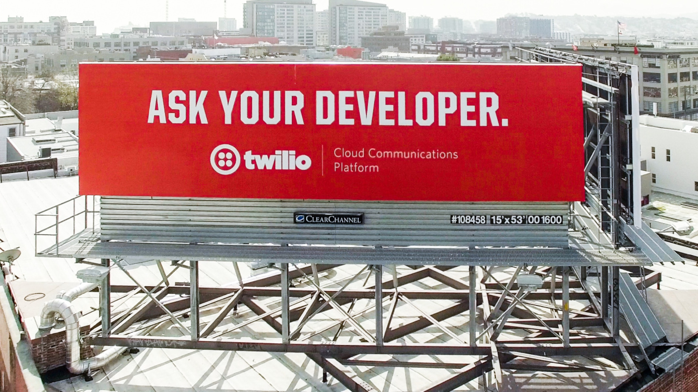

As the end of 2023 quickly approaches my internal calendar is reminding me of the natural slow down that happens. 
However on the ground reality at Speakeasy has not matched that expectation at all. December is shaping up to be our 
busiest month of the year! The holidays though have given me a moment to reflect on what we do and why we do it. 

There is a lot happening in the tech world right now. The Generative AI boom is in full swing. It feels like it's never been a more exciting
time to be a builder. Large language models are making new business and service creation less capital intensive. Natural language 
everything means an explosion of new products and a compression of the time to market. 

This also means it's an incredibly challenging time to be a builder. The number of frameworks and tools is exploding.
The number of apis is exploding. The burden of integration is exploding. Whether you're bootstrapping a startup, building at a scaleup, 
or innovating at a large enterprise, the number of choices you have to make is exploding. If you haven't caught my vibe yet it's really
:exploding_head: out there!

In the middle of all that noise the best companies have been able to clarify against competition by investing in community. They've built loyal developer
user groups by getting the details right. This is the fine points of day to day integration work that most don't obsess over. This is
developer experience. Specifically API developer experience. For me this is best captured by Twillio's sign off of the 101 freeway in San Francisco. 
"Ask your Developer". Not a question, not an answer. Just a statement with immense gravity and implication. Developer communities are loyal to great experiences. 
They're loyal to great products. Most companies fall short on this vision. To get it right you have to burn several percentage points of company time purely on conviction.

Working at Speakeasy means working on the brass tacks. We're in the weeds of the experiences that best in class products truly standout.
We sweat the details so our customers don't have to. At its core today we're a unique code generation platform that takes massive burden
off API devs, teams and companies from worrying about staying up to date with every developer ecosystem. As an API company having a great SDK may 
seem like a narrow start. But it's the gateway drug to a suite of tooling that gives your customers the fabled "aha" moment and keeps them coming back for more. API first is out. SDK first is in. 

This isn't always flashy work. Through APIs of our customers we get to look at the guts of many different businesses across many verticals and then wrap those into easy to understand
experiences for millions of end users. Whether its Generative AI, Fintech, Infrastructure or something else we're giving a set of high leverage tools for 
builders to reach their customers in the best way possible.

Our mission and story doesn't end with developers. For the GTM half of businesses we ensure you never have to turn down a deal or risk customer success 
because of a lack or resources or prioritisation. The modern business is a balancing act between great product build and great distribution. We reduce that tension by taking the burden 
of distribution to your developer base.

Speakeasy is a very ambitious project. We're building a company/product/team that will power the next generation of APIs and developer adoption at the
fastest growing growing companies. REST API best practices may already have broad consensus but they definitely don't have broad practice. We have to meet our customers where they are. Sometimes
this means APIs being designed from the ground up and sometimes it means ones that support many 0's of RPS. This means we have to build extensibly, reliably and at scale. We have the privilege of sitting between producers and 
consumers and shepherding usage in a way that dictates the exact lines of code used. So very design decision we make can future proof our customers or cut their growth short. 
It's high stakes which also means it's a lot of fun :).

We're working on Speakeasy because the best businesses are increasingly being built on a community of developers. We ship fast so our customers
can ship fast and keep their customers happy. We have a lot of work to do to bring this reality to every business, it's going to a be an exciting 2024. 
If you're excited by our mandate check out our [open roles](https://jobs.ashbyhq.com/Speakeasy) - we'd love to hear from you!
