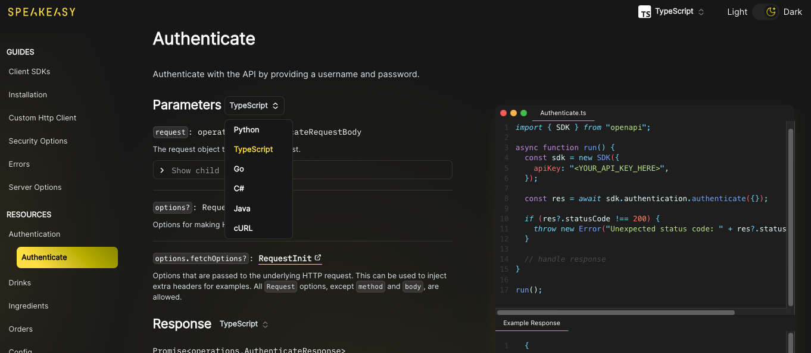

Welcome to the first Speakeasy changelog of 2024! 🎉 We're excited to share the updates we snuck in at the end of 2023 and also give you a sneak peek of what's coming up in 2024.

Sound good?

Ok, let’s go! 🚀

## SDK Documentation in Beta

Your users are code-native. Your docs should be too. Today, we're releasing our SDK docs product into Beta!

What does code-native mean? It means fully integrating your SDKs into your documentation so that your documentation reflects how users will actually interact with your API. Let's face it: the best way to code is to copy and paste.

Some of the highlights from the beta launch include:

* Code snippets that are compilable and feature the latest version of your SDKs;
* Request & response objects presented in terms of your SDK's type system;
* Generated sections for authentication, pagination, error handling, and more;
* Easily customizable theming;
* Deep linking & single page scroll so that you can navigate and share any level of your API reference;
* Built on best-in-class open-source tools like MDX, Next.js, and CodeHike.

Read more about it [in our release post](../post/release-sdk-docs).

## What's Coming Up in 2024

When we set out to build Speakeasy, we saw that dev teams everywhere were spending more time on API tooling than building the API itself. Let's face it: REST APIs are unruly. They neither have the flexibility of GraphQL nor the standardization of gRPC. However,
they're still the simplest way for companies to expose their data and services to the world. We started our journey addressing the needs of API producers by taking on the burden of building the various interfaces needed to consume APIs. This experience has solidified our mission of 
making APIs everywhere easy to create and consume.

This year, we're continuing our journey by moving upstream and providing API producers with all the tooling they need to build great APIs. Great external DevEx starts with great internal DevEx. New features to look out for: 

* More great SDK generation targets, including v2 Java generator, v2 of our Terraform generation to support multiple API calls per resource, and GA versions of Ruby, PHP, C#, Swift, and Kotlin; 
* "Level 2 SDKs" - chain calls in your client libraries; 
* A central registry to track and manage your API definitions and SDK packages;
* Visibility of API changes across your organization;  
* Ability to define your own governance policies and enforce them on various artifacts.

Onward and upwards! 🚀

## New Posts: 

As you know, we love writing about all things API design, DevEx, and OpenAPI. Here are our latest blog posts.

* [Working with Webhooks and Callbacks](../post/openapi-tips-webhooks-callbacks): Since OpenAPI3.1, the new `webhooks` keyword is a top-level element alongside paths. Webhooks are a mechanism that allows an API to send real-time data to a user as soon as an event occurs (without requiring the user to take any action). The user simply needs to subscribe to the event stream and provide a URL to start receiving data.
These can now be described in your OpenAPI document alongside your regular APIs, enabling all API models to be described in a single place.

* [Speakeasy SDKs vs OpenApi-Generator OSS](../post/compare-speakeasy-open-source): The pre-existing OpenAPI generator ecosystem has been a great inspiration for us, but we've felt the quality and flexibility of code gen is short of what's needed for production APIs. We've recently redone our Speakeasy vs OSS comparison to highlight where we've gone the extra mile in bringing you best-in-class SDKs.

## 🚢 Improvements and Bug Fixes 🐛

#### [Speakeasy v1.136.3](https://github.com/speakeasy-api/speakeasy/releases/tag/v1.136.3)

🚢 Support for OpenAPI-based ordering in generated SDKs\
🐛 Improved server selection and retry usage snippets\
🐛 Comparison of extensions when merging schemas

### Typescript

🚢 Support for extensionless import\
🐛 Missing imports for form-encoded requests\
🐛 Support for async iterators\
🐛 Support for default and const values

### Go

🐛 consts and defaults with an optional attribute

### Terraform

🐛 consts and defaults with an optional attribute

### Python

🚢 Nullable support\
🚢 Support for configurable license file\
🐛 More robust retry connection logic

### Java

🚢 Oauth support through security callbacks\
🚢 Javav2 released into preview in CLI. Try `--lang javav2` when generating SDKs\
🐛 Fixed gradlew file permissions

### SDK Docs

🚢 Improved page performance for large OpenAPI specs\
🚢 Support for language-specific sections and links\
🚢 Support for rate limit tables\
🚢 Support for Speakeasy error extensions

