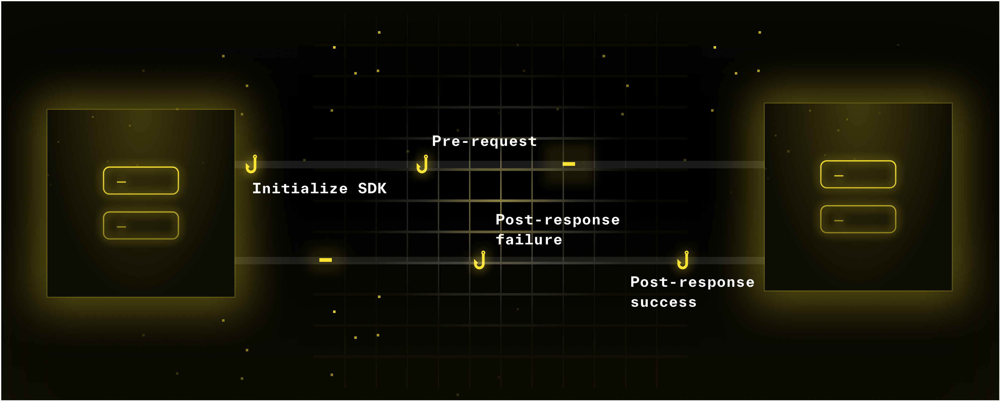

{/*import { Callout } from '~/components'*/}
import openapi_ref from './assets/openapi-ref.mp4';

We've got a jam packed changelog that includes the introduction of new extensibility into our code gen platform and a comprehensive OpenAPI reference guide.

Let's get into it 👇

## SDK Hooks

Since Speakeasy started, we've carefully balanced the extensibility and dependability of our code generator. We want users to customize their SDKs without creating a maintenance burden. It can be a difficult balance to strike. Which is why we're excited to announce the biggest addition of extensibility to our platform yet – SDK Hooks! 

With SDK Hooks, you are no longer constrained to what is defined in your OpenAPI document. You can now safely inject custom logic into your SDKs where you need it. 

[Read more here](/post/release-sdk-hooks)

## OpenAPI Reference

OpenAPI was designed to be capable of describing any HTTP API, whether that be REST or something more akin to RPC-based calls. By design, it has **a lot** of flexibility baked-in. That is great, but it makes it really hard to grok if you're new to the format (and often even when you're experienced).

That’s why we built the reference documentation that we wished we had when we were starting out. It's a comprehensive guide to the OpenAPI format, with examples, explanations, and links to the relevant sections of the OpenAPI specification.

And even better, it's AI-enabled! Ask any OpenAPI question, and the reference guide will get you sorted out.

  <video controls={false} loop={true} autoPlay={true} width="100%" >
    <source src={ openapi_ref } type="video/mp4" />
  </video>

[Check out the full reference here](/openapi)

## 🚢 Improvements and Bug Fixes 🐛

Based on most recent CLI version: [**Speakeasy v1.231.0**](https://github.com/speakeasy-api/speakeasy/releases/tag/v1.231.0)

🚢  Offer sample OpenAPI Document during quickstart \
🚢  Make example generation much, much faster  \
🚢  Generate code samples in speakeasy run \
🚢  New CLI command: `speakeasy openapi diff`\
🚢  Validate `gen.yaml` during speakeasy run

### TypeScript

🐛 Fix hoisting operation security and TypeScript basic auth support

### Java

🚢 Add `wait`, `notify`, `notifyAll`, `clone` as reserved words

### Python

🚢 Add support for additional metadata url

### Terraform

🚢 Capability to wrap classes and unions \
🚢 Mix wrapped with non-wrapped resources in a multi-operation terraform resource \
🐛 Read data sources during multiple read requests dropping unnecessary attributes 

### C#

🚢  Introduce conventional namespaces into  C# & Unity
