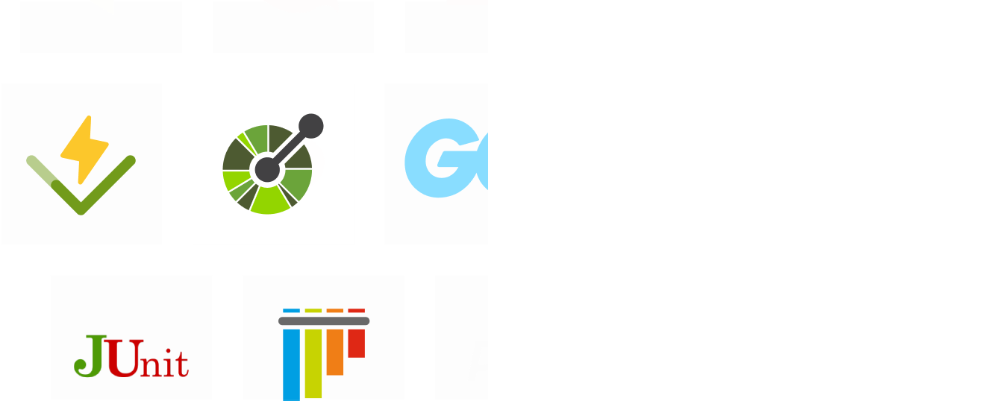

 

Last week we took a break from our normal changelog schedule. We instead joined Supabase and other outstanding dev tool companies for [​Mega Launch Week​](https://launchweek.dev/lw/2024/MEGA) ⚡ Over the course of 5 days, we launched ​5​ ​new products ​/features for you to get your hands on.

The launch week page can be found [here](/launch-week). Below is the summary for those of you who weren't following along live. If you're interested in any of the features, send us a slack message and we can help you get set up!

## Day 1 ​- API contract testing

We’re fully automating API testing. Use the Speakeasy platform to generate comprehensive test suites using your favorite testing framework (Vitest, pytest, etc.) with AI-generated test data to cover every test case.

[Read the release →](/post/release-contract-testing)

## Day 2 - SDK generation with webhooks support

We've added webhook support to our SDK generation platform. The new feature provides type-safe webhook handlers and built-in security verification, all powered by native OpenAPI support.

[Read the release →](/post/release-webhooks-support)

## Day 3 - Speakeasy API docs

Scalar's best-in-class documentation platform is now seamlessly integrated into the Speakeasy platform. Generate beautiful, branded documentation that stay in-sync with your SDKs.

[Read the release →](/post/release-speakeasy-docs)

## Day 4 - Enhanced PHP generation

We're delivering a whole batch of new features for PHP generation. In addition to Laravel service provider creation, we've added support for pagination, Oauth 2.0 and hooks for custom code.

[Read the release →](/post/release-php)

## Day 5 - React query hook generation

We've added React hooks to our TypeScript SDK generation platform. The new feature provides type-safe hooks for all your API operations, powered by Tanstack Query.

[Read the release →](/post/release-react-hooks)

---

You'll be hearing more about these new features in coming changelogs, so stay tuned!
