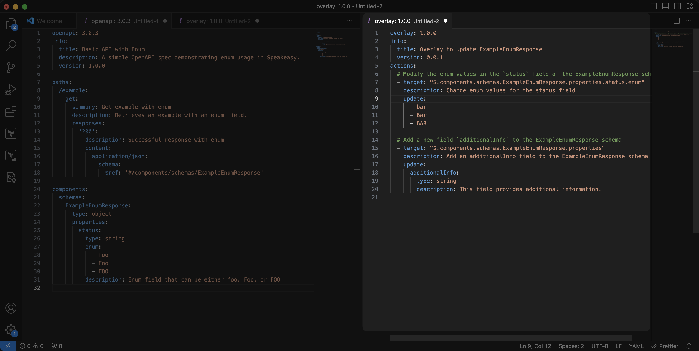
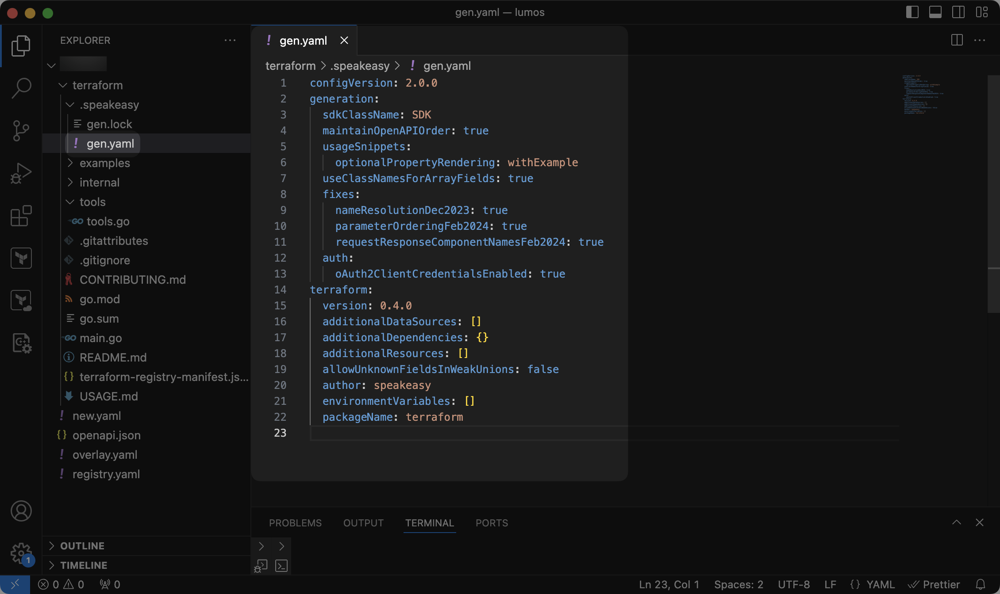

# Customization Basics

The Speakeasy SDK pipeline uses sensible defaults to generate SDKs, but various customizations can improve the user experience. Customizations can be applied using the following methods:

1. Modifying the OpenAPI spec.
2. Adding `x-speakeasy` extensions to the OpenAPI spec.
3. Editing the `gen.yaml` file in the SDK repository.

---

## 1. Modifying the OpenAPI Spec

The OpenAPI spec is the foundation of SDK generation. Modifications to the OpenAPI spec influence the structure, naming conventions, and functionality of generated SDKs.

Learn more about OpenAPI in [the reference documentation](/openapi).

### Modifying the OpenAPI Spec With Overlays

Speakeasy supports OpenAPI overlays, which you can use to customize and extend existing OpenAPI specifications without directly modifying them. Overlays are especially useful for applying different configurations or updates to the spec for various environments or SDKs without altering the base spec.

Overlays work by referencing and extending parts of the base OpenAPI spec. They can add, override, or remove elements such as paths, schemas, parameters, or security configurations.

[Learn more about overlays](/docs/prep-openapi/overlays/create-overlays).

---

## 2. Using `x-speakeasy` Extensions

Proprietary Speakeasy extensions provide fine-tuned control over the SDK, enabling you to modify behaviors like retries, pagination, error handling, and other advanced SDK features.

Add Speakeasy extensions to the OpenAPI spec. 

For a complete list of available extensions, see the [Speakeasy extensions reference](/docs/speakeasy-extensions).

---

## 3. Editing the `gen.yaml` File

Further customize Speakeasy-generated SDKs by editing the `gen.yaml` file, typically located in the `.speakeasy` folder at the root of the SDK. This configuration file contains both language-agnostic and language-specific settings, offering more control over the structure and behavior of the SDK beyond what the OpenAPI spec provides.

Edit the `gen.yaml` file to modify elements like class names, method parameters, and response formatting.

For a complete list of available options, refer to the [`gen.yaml` reference](/docs/gen-reference).
