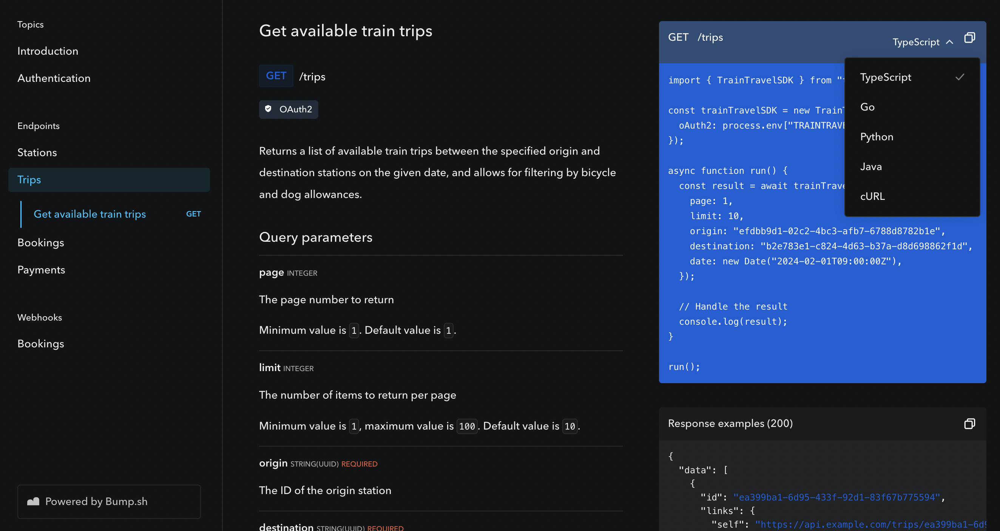

{/* import { Callout } from "~/components"; */}
{/*import GetPublicUrlSnippet from "./_get-public-url-snippet.mdx";*/}

# Integrate Speakeasy With Bump.sh

---

## Overview

Bump.sh is a hosted solution for simple API documentation, API catalogs, and API
explorers, which makes it a great tool to use in conjunction with [Speakeasy's
Automated Code Samples feature](/docs/code-samples/automated-code-sample-urls).
Embed your SDKs right into the API documentation, making it easier for
developers to get started with your API.

<div className="Screenshot" data-darkened data-url="docs.myapi.com" data-docs="true">
  
</div>

## Setting up the Integration

### Prerequisites

<div className="Callout" data-title="IMPORTANT" data-variant="warning">
  Before continuing with this guide, ensure that the following prerequisites
  have been met:
  <br />
  <ul className="list-disc pl-5">
    <li className="marker:content-['✓__']">
      {"An "}
      <a href="/docs/code-samples/automated-code-sample-urls">
        {"Automated Code Sample URL"}
      </a>
      {" has been configured for the desired Speakeasy SDK, and"}
    </li>
    <li className="marker:content-['✓__']">
      {"Created an account on "} <a href="https://bump.sh">Bump.sh</a>
      {"."}
    </li>
  </ul>
  Once those requirements have been met, proceed with the following steps.
</div>

### Locate & Copy the Combined Spec URL

{/* <GetPublicUrlSnippet /> */}

### Import the Combined Spec URL into Bump.sh

Next, head over to your Bump.sh dashboard and either create "New Documentation",
or open existing API documentation. Click "Settings" and open the "Automatic Deployment" tab.

<div className="Screenshot"data-darkened data-url="bump.sh/dashboard" data-docs>
  
</div>

Pick whether you want to deploy via GitHub Actions or CLI, and copy the
appropriate example which will include the Doc ID and the API token for you.

If you're just starting out, let's start with the CLI. Open your terminal and run the following command:

```bash
npm install -g bump-cli

bump deploy https://spec.speakeasy.com/walker/walker/book-club-oas-with-code-samples
  --token=<your-api-token>
  --doc=<your-doc-id>
```

After the import has completed, the API documentation will be rendered, and your
SDKs will be embedded as code samples in each OpenAPI operation.

<div className="Screenshot"data-darkened data-url="bump.sh/your-docs" data-docs>
  
</div>

## What Next?

This is a basic setup, so for more advanced configurations, you can refer to the
[Bump.sh and Speakeasy integration
guide](https://docs.bump.sh/guides/bump-sh-tutorials/generate-sdks-with-speakeasy/)
which will demonstrate using GitHub Actions to automate deployments.

Bump.sh is much more than just an OpenAPI spec renderer, it offers API catalogs,
discovering, and playgrounds. Learn more about Bump.sh on their [official
documentation](https://docs.bump.sh/).
