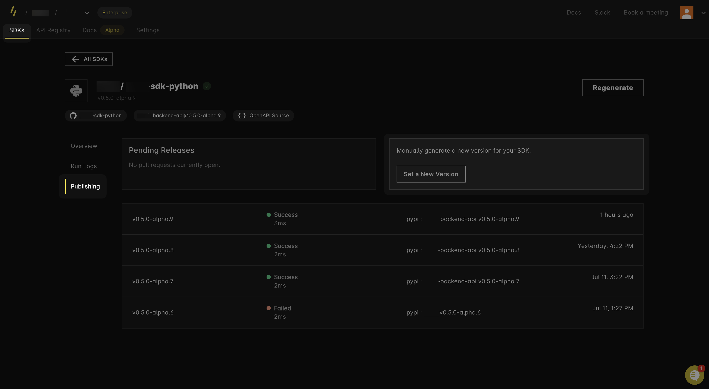

{/* import { Callout } from "~/components"; */}

# SDK versioning

Speakeasy-generated SDKs are automatically versioned using Semantic Versioning ([SemVer](https://semver.org/)). With each new generation, the SDK version is bumped up.

## Versioning logic

The SDK version will be automatically incremented in the following cases. 

### Generator version changes

When Speakeasy releases a new generator version, it compares the features changed in the new generator to those used in your SDK:

- If multiple used features in your SDK change, the biggest version bump (major, minor, patch) across all the used features determines how the SDK version is bumped.
- If the features used in your SDK are unaffected by the new generator version, the SDK version remains unchanged.

### Configuration changes

- Changes to the `gen.yaml` file will bump the patch version.
- Changes to the checksum will also bump the patch version.

### OpenAPI document changes

- If the `info.version` section of your OpenAPI document is SemVer compliant, major or minor changes to the OpenAPI document will bump the major or minor version of SDKs correspondingly.
- *Coming Soon*: Speakeasy will detect changes to the OpenAPI document (for example, adding a breaking change to the parameters of an operation) and bump versions accordingly.

## Pre-release version bumps

Speakeasy supports any SemVer-compatible string as a valid version, including pre-release versions such as `X.X.X-alpha` or `X.X.X-alpha.X`.

- If your SDK is on a pre-release version, the Speakeasy automated version bumps will remain on the pre-release versioning until it is manually removed.
- Automated bumps will increment pre-release versions. For example, `1.0.0-alpha`, `1.0.0-alpha.1`, `1.0.0-alpha.2`.
- To stop the pre-release versioning, manually set a new version or run `speakeasy bump graduate`.

## Major version bumps

New SDKs start versioning at `0.0.1` and will be bumped from there. Speakeasy doesn't automatically bump major versions of SDKs with version numbers below `1.0.0`. When an SDK version number has been manually bumped to `1.0.0`, Speakeasy will automatically bump the major version for breaking changes. 

Major version bumps to Golang SDKs impact the migration path for users.

### Golang major version bumps

When the major version of a Golang module is bumped past version `1`, the import path needs to change to include the major version. For example:

- Current version `1.2.3`: `github.com/speakeasy/speakeasy-go`
- Bumped to version `2.0.0`: `github.com/speakeasy/speakeasy-go/v2`

Carefully consider major version bumps for Golang SDKs because it significantly impacts the migration path for users. Major version bumping of Golang SDKs is left to the discretion of the SDK maintainer.

## Manual version bumps

Speakeasy supports manual control of SDK versioning via the CLI and the dashboard.

### Via the CLI

To override the automatic versioning logic for the next generation, set the `version` field in the `gen.yaml` file.

- The Speakeasy generator detects manual version settings when the `releaseVersion` field in the `gen.lock` file differs from the `version` field in the `gen.yaml` file.
- Automatic versioning will resume when the version values in both files match.
- Use the Speakeasy CLI `bump` command to set the SDK version without manually editing the `gen.yaml` file.

### Via GitHub UI

Speakeasy supports label-based versioning via GitHub pull request (PR) UI:

1. Automated version detection: By default, we’ll analyze your changes and suggest the appropriate semantic version bump. You’ll see our suggested version label on your generated PR: `major`, `minor`, or `patch`. We will also add `pre-release` if you are on a pre-release version.

2. Manual override option: You can override our suggestion by removing the current label and adding a `major`, `minor`, or `patch` label to your PR. Use the bump type `graduate` if you are on a pre-release version to move out of the pre-release stage. Your SDK version will automatically update on the next generation. The version bump will persist across regenerations until you change it.

3. Immediate generation: Label-based versioning is automatically active in all SDK generation workflows and does not require any modifications to your action file, which is often found as `.github/workflows/sdk_generation.yaml` in your Speakeasy SDK repository. However, if you want to automate generation immediately after a label is added, you need to add the following action trigger to your GitHub workflow file:

```yaml
# !focus(7,21:22)
name: Generate
permissions:
    checks: write
    contents: write
    pull-requests: write
    statuses: write
"on":
    workflow_dispatch:
        inputs:
            force:
                description: Force generation of SDKs
                type: boolean
                default: false
            push_code_samples_only:
                description: Force push only code samples from SDK generation
                type: boolean
                default: false
            set_version:
                description: optionally set a specific SDK version
                type: string
    pull_request:
        types: [labeled]
    schedule:
        - cron: 0 0 * * *
```

Here's a video of how to use label-based versioning on a Speakeasy-generated PR.

import label_versioning from "../../changelog/changelog-2024-11-13/assets/label-versioning.mp4";

<div className="mt-10">
  <video controls={false} loop={true} autoPlay={true} width="100%">
    <source src={label_versioning} type="video/mp4" />
  </video>
</div>

### Via the dashboard

To manually set a version for your SDK in the Speakeasy dashboard:

1. Navigate to the **Publishing** tab of your SDK and select **Set a New Version**.

<div className="Screenshot"data-darkened data-url="https://app.speakeasy.com/org/">

</div>

2. Enter your version following SemVer conventions. The dashboard validates the version and ensures it does not override a previously published version.

<div className="Screenshot"data-darkened data-url="https://app.speakeasy.com/org/">

</div>

3. When you are ready, click **Submit Version Change**.

