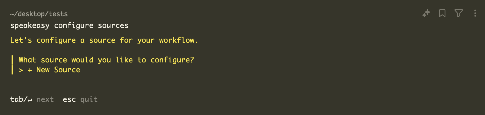
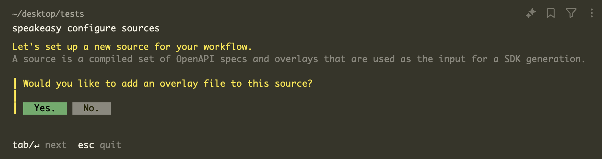
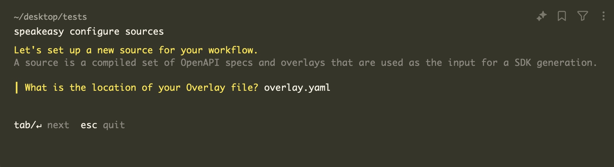

# Apply an Overlay

Speakeasy provides two options for applying overlays.
- Option One: add the overlay directly to the Speakeasy workflow file, ensuring it is automatically applied with every generation.
- Option Two: output a new OpenAPI document with the overlay applied, creating an updated source of truth for the OpenAPI specification.

## Option One: Add an Overlay to a Speakeasy Workflow

The Speakeasy workflow supports using an overlay file to modify a source OpenAPI document. For more information on how sources work, see [here](/docs/core-concepts#sources).

### 1. Install the Speakeasy CLI

```bash
brew install speakeasy-api/homebrew-tap/speakeasy
```

### 2. Choose source: 


To add an overlay to the Speakeasy workflow file, run `speakeasy configure sources` and choose or create a source.

<Screenshot variant="cli" docs={true}></Screenshot>

### 3. Add Overlay:


<Screenshot variant="cli" docs={true}></Screenshot>

### 4. Provide overlay file path:


<Screenshot variant="cli" docs={true}></Screenshot>


### 5. Provide location for the output build: 


<Screenshot variant="cli" docs={true}></Screenshot>


The overlay will now be applied to the OpenAPI document as part of the Speakeasy workflow. To execute the workflow, run `speakeasy run`.

## Option Two: Create a new OpenAPI document with an Overlay

This option is ideal for those looking to generate a new source of truth for the OpenAPI document.


### 1. Install the Speakeasy CLI

```bash
brew install speakeasy-api/homebrew-tap/speakeasy
```

### 2. Validate the Overlay

Validate the overlay before applying it to ensure it adheres to the OpenAPI Overlay specification. Use the following command:

```bash
speakeasy overlay validate -o overlays.yaml
```

This command checks the `overlays.yaml` file to confirm that it complies with the OpenAPI Overlay Specification.

### 3. Apply the Overlay

Apply the overlay to the OpenAPI document with the following command, replacing `input-openapi.yaml` with the path to the original OpenAPI spec file and `overlays.yaml` with the path to the overlay file:

```bash
speakeasy overlay apply -s input-openapi.yaml -o overlays.yaml > combined.yaml
```

This command merges the changes from the overlay file with the original OpenAPI specification and outputs the result to a new file named `combined.yaml`.

### 4. Review the Merged Results

The merged results can be viewed in the `combined.yaml` file, which contains the original OpenAPI specification updated with the modifications from the overlay. It is recommended to review this file to ensure the changes have been applied as expected.
