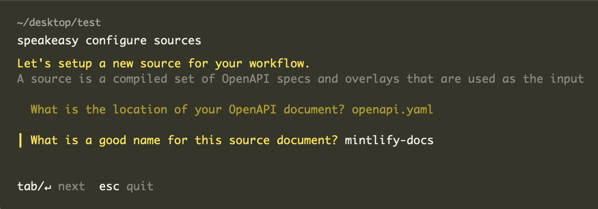

import { Tabs } from "@speakeasy/nextra-theme";

# What is the code samples extension?

Many API documentation providers provide code snippets in multiple languages to help developers understand how to use the API. However, these snippets
may not correspond to a usage snippet from an existing SDK provided by the API, which reduces the value of the API documentation and can lead to inconsistent integrations, depending on whether a user discovers the API docs or the SDK first.

The `x-codeSamples` (previously called `x-code-samples`) extension is a widely accepted spec extension that enables the addition of custom code samples in one or more languages to operation IDs in your OpenAPI specification.
When custom code samples are added using the code samples extension, documentation providers will render the usage snippet in the right-hand panel of the documentation page:


## Anatomy of the extension

| Field Name | Type     | Description                                                                                                                                      | Required |
| ---------- | -------- | ------------------------------------------------------------------------------------------------------------------------------------------------ | -------- |
| `lang`     | `string` | The language of the code snippet. Can be one from this [list](https://github.com/github-linguist/linguist/blob/master/lib/linguist/popular.yml). | Yes      |
| `label`    | `string` | Code sample label, for example, `Node` or `Python3`. The `lang` value is used by default.                                                        | No       |
| `source`   | `string` | The code sample source code. In this case, the SDK usage snippet.                                                                                | Yes      |

Documentation providers that support `x-codeSamples` include but are not limited to:

- Mintlify
- Readme
- Redocly
- Stoplight

## Example usage

Here is a basic example of using the `x-codeSamples` extension with a `curl` snippet.

```yaml
openapi: "3.0.3"
info: ...
tags: [...]
paths:
  /example:
    get:
      summary: Example summary
      description: Example description
      operationId: examplePath
      responses: [...]
      parameters: [...]
      x-codeSamples:
        - lang: "cURL"
          label: "CLI"
          source: |
            curl --request POST \
            --url 'https://data.apiexample.com/api/example/batch_query/json?format=json' \
            --header 'content-type: application/octet-stream: ' \
            --data '{}'
```

Now let's extend this to a more complex example: a TypeScript SDK for an LLM chat API.

```yaml
openapi: "3.0.3"
info: ...
tags: [...]
paths:
  /chat_sessions/chat_results:
    post:
      summary: Create Chat Session
      operationId: create
      tags: [chat_session]
      requestBody:
        content:
          application/json:
            schema:
              $ref: "#/components/schemas/CreateChatSession"
        required: true
      x-codeSamples:
        - lang: "typescript"
          label: "create_chat_session"
          source: |
            import { ChatSDK } from "@llm/chat-sdk";

            async function run() {
              const sdk = new ChatSDK({
                apiKey: "<API_KEY>",
              });

              const res = await sdk.chatSession.create({
                integrationId: "<interagtion_id>",
                chatSession: {
                  messages: [
                    {
                      role: "user",
                      content: "How do I get started?",
                    },
                  ],
                },
                stream: true,
              });

              /* Example of handling a streamed response */
              if (res.chatResultStream == null) {
                throw new Error("failed to create stream: received null value");
              }

              let chatSessionId: string | undefined | null = undefined;

              for await (const event of res.chatResultStream) {
                if (event.event == "message_chunk") {
                  console.log("Partial message: " + event.data.contentChunk);
                  chatSessionId = event.data.chatSessionId;
                }
                if (event.event == "records_cited") {
                  console.log("Citations: ", JSON.stringify(event.data.citations, null, 2));
                }
              }
            }

            run();
```

Multiple code samples can be added to a single `operationId` to support examples in any number of languages by adding multiple keys under the `x-codeSamples` extension.

```yaml
openapi: "3.0.3"
info: ...
tags: [...]
paths:
  /chat:
    get:
      summary: Example summary
      description: Example description
      operationId: examplePath
      responses: [...]
      parameters: [...]
      x-codeSamples:
        - lang: "typescript"
          label: "chat_ts"
          source: |
            .....
            .....
        - lang: "python"
          label: "chat_python"
          source: |
            .....
            .....
```

## Generating code samples

To generate SDK code samples for your OpenAPI document, run the following command:

```bash
speakeasy generate codeSamples -s {{your-spec.yaml}} --langs {{lang1}},{{lang2}} --out code-samples-overlay.yaml
```

This command creates an [overlay](/docs/prep-openapi/overlays/create-overlays) with code samples for every `operationId` in your OpenAPI document.

To apply the overlay to your specification, run:

```bash
speakeasy overlay apply -o code-samples-overlay.yaml -s {{your-spec.yaml}} -o {{output-spec.yaml}}
```

The final output spec will include `codeSamples` inline.

## Adding code sample generation to your workflow

To include `codeSamples` overlay generation in your Speakeasy workflow, add the following to your `.speakeasy/workflow.yaml` for any `target` you have configured:

```yaml .speakeasy/workflow.yaml
# !focus(5:6)
targets:
  my-target:
    target: typescript
    source: my-source
    codeSamples:
      output: codeSamples.yaml
```

If you want the overlay to be automatically applied on the source, create another workflow entry using `speakeasy configure` as follows:



Then add the overlay created by Speakeasy to inject code snippets into your spec:


Finally, provide the name and path for your output OpenAPI spec. This will be the final spec used by Mintlify.


